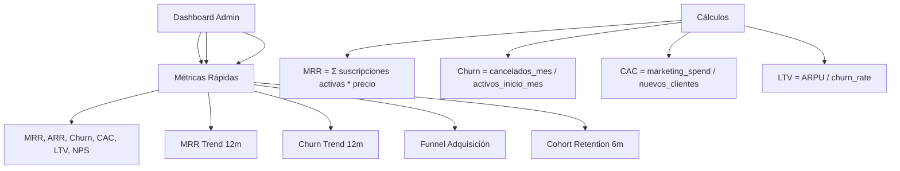

---
tags:
  - "kanban/done"
  - "type/task"
  - "domain/ADM"
  - "priority/P0"
parent: "[[desarrollo]]"
children: []
depends_on:
  - "[[FUN-001]]"
  - "[[FUN-005]]"
blocks:
  - "[[ADM-002]]"
  - "[[ADM-003]]"
  - "[[ADM-004]]"
  - "[[ADM-005]]"
  - "[[ADM-006]]"
  - "[[ADM-007]]"
  - "[[ADM-008]]"
  - "[[ADM-009]]"
status: "done"
assignee: "@dev"
created: "2026-08-04"
updated: "2026-08-05"
---

# [[ADM-001]] Dashboard Global: MRR, ARR, Churn, CAC, LTV, NPS, Funnel Adquisición

## Descripción
Implementar dashboard principal de administración con métricas clave de negocio: MRR, ARR, Churn rate, CAC, LTV, NPS, funnel de adquisición, cohort analysis.

## Código de Ejemplo
```php
// app/Domains/Staff/Http/Controllers/Admin/DashboardController.php
namespace App\Domains\Staff\Http\Controllers\Admin;

use App\Models\{User, Subscription, Payment, ChannelPago};
use App\Services\MetricsService;

class DashboardController extends Controller
{
    public function __construct(protected MetricsService $metrics) {}

    public function index()
    {
        $metrics = [
            'mrr' => $this->metrics->calculateMRR(),
            'arr' => $this->metrics->calculateARR(),
            'churn_rate' => $this->metrics->calculateChurnRate(),
            'cac' => $this->metrics->calculateCAC(),
            'ltv' => $this->metrics->calculateLTV(),
            'nps' => $this->metrics->calculateNPS(),
            'active_users' => $this->metrics->getActiveUsersCount(),
            'active_channels' => $this->metrics->getActiveChannelsCount(),
            'total_revenue' => $this->metrics->getTotalRevenue(),
        ];

        $charts = [
            'mrr_trend' => $this->metrics->getMRRTrend(12), // 12 meses
            'churn_trend' => $this->metrics->getChurnTrend(12),
            'new_users' => $this->metrics->getNewUsersTrend(30),
            'funnel' => $this->metrics->getAcquisitionFunnel(),
            'cohort_retention' => $this->metrics->getCohortRetention(6),
        ];

        return view('domains.staff.admin.dashboard.index', compact('metrics', 'charts'));
    }
}
```

```php
// app/Services/MetricsService.php
namespace App\Services;

use App\Models\{Subscription, Payment, User, ChannelPago};
use Carbon\Carbon;

class MetricsService
{
    public function calculateMRR(): float
    {
        return Subscription::where('status', 'active')
            ->sum('price');
    }

    public function calculateARR(): float
    {
        return $this->calculateMRR() * 12;
    }

    public function calculateChurnRate(): float
    {
        $startOfMonth = now()->startOfMonth();
        $endOfMonth = now()->endOfMonth();
        
        $activeAtStart = Subscription::where('status', 'active')
            ->where('created_at', '<', $startOfMonth)
            ->count();
        
        $cancelledThisMonth = Subscription::where('status', 'cancelled')
            ->whereBetween('cancelled_at', [now()->startOfMonth(), now()->endOfMonth()])
            ->count();
        
        return $activeAtStart > 0 ? ($cancelledThisMonth / $activeAtStart) * 100 : 0;
    }

    public function calculateCAC(): float
    {
        $marketingSpend = 50000; // TODO: traer de config
        $newCustomers = User::where('role', 'user')
            ->whereBetween('created_at', [now()->startOfMonth(), now()->endOfMonth()])
            ->count();
        
        return $newCustomers > 0 ? $marketingSpend / $newCustomers : 0;
    }

    public function calculateLTV(): float
    {
        $avgRevenuePerUser = $this->calculateMRR() / max(1, User::where('role', 'user')->count());
        $churnRate = $this->calculateChurnRate() / 100;
        
        return $churnRate > 0 ? $avgRevenuePerUser / $churnRate : 0;
    }

    public function getMRRTrend(int $months): array
    {
        $data = [];
        for ($i = $months - 1; $i >= 0; $i--) {
            $date = now()->subMonths($i)->startOfMonth();
            $mrr = Subscription::where('status', 'active')
                ->where('created_at', '<', $date->copy()->endOfMonth())
                ->where(function($q) use ($date) {
                    $q->whereNull('cancelled_at')
                      ->orWhere('cancelled_at', '>', $date);
                })
                ->sum('price');
            
            $data[] = [
                'month' => $date->format('M Y'),
                'mrr' => $mrr,
            ];
        }
        return $data;
    }

    public function getAcquisitionFunnel(): array
    {
        $visitors = 10000; // TODO: Google Analytics
        $signups = User::where('role', 'user')->whereBetween('created_at', [now()->subMonth(), now()])->count();
        $activated = Subscription::where('status', 'active')->where('created_at', '>=', now()->subMonth())->count();
        $paid = Payment::where('status', 'approved')->where('created_at', '>=', now()->subMonth())->count();
        
        return [
            ['stage' => 'Visitantes', 'count' => $visitors, 'rate' => 100],
            ['stage' => 'Registros', 'count' => $signups, 'rate' => $visitors > 0 ? round($signups / $visitors * 100, 1) : 0],
            ['stage' => 'Activaciones', 'count' => $activated, 'rate' => $signups > 0 ? round($activated / $signups * 100, 1) : 0],
            ['stage' => 'Pagos', 'count' => $paid, 'rate' => $activated > 0 ? round($paid / $activated * 100, 1) : 0],
        ];
    }

    public function getCohortRetention(int $months): array
    {
        $cohorts = [];
        for ($i = $months - 1; $i >= 0; $i--) {
            $monthStart = now()->subMonths($i)->startOfMonth();
            $monthEnd = $monthStart->copy()->endOfMonth();
            
            $cohortUsers = User::where('role', 'user')
                ->whereBetween('created_at', [$monthStart, $monthEnd])
                ->get();
            
            if ($cohortUsers->isEmpty()) continue;
            
            $retention = [];
            for ($m = 0; $m < $months; $m++) {
                $checkDate = $monthStart->copy()->addMonths($m);
                $retained = $cohortUsers->filter(function ($user) use ($checkDate) {
                    return $user->subscriptions()
                        ->where('status', 'active')
                        ->where('created_at', '<=', $checkDate)
                        ->exists();
                })->count();
                
                $retention[] = $cohortUsers->count() > 0 
                    ? round($retained / $cohortUsers->count() * 100, 1) 
                    : 0;
            }
            
            $cohorts[] = [
                'month' => $monthStart->format('M Y'),
                'size' => $cohortUsers->count(),
                'retention' => $retention,
            ];
        }
        return $cohorts;
    }
}
```

```blade
{{-- resources/views/domains/staff/admin/dashboard/index.blade.php --}}
@extends('layouts.admin')

@section('content')
<div class="container mx-auto px-4 py-8">
    <div class="mb-8">
        <h1 class="text-2xl font-bold text-text-primary">Dashboard Global</h1>
        <p class="text-text-secondary">Métricas clave del negocio en tiempo real</p>
    </div>

    {{-- KPIs Cards --}}
    <div class="grid grid-cols-1 sm:grid-cols-2 lg:grid-cols-4 gap-6 mb-8">
        @foreach([
            ['label' => 'MRR', 'value' => '$' . number_format($metrics['mrr'], 2), 'icon' => 'currency-dollar', 'color' => 'accent'],
            ['label' => 'ARR', 'value' => '$' . number_format($metrics['arr'], 2), 'icon' => 'calendar', 'color' => 'success'],
            ['label' => 'Churn Rate', 'value' => number_format($metrics['churn_rate'], 1) . '%', 'icon' => 'trending-down', 'color' => 'error'],
            ['label' => 'LTV', 'value' => '$' . number_format($metrics['ltv'], 2), 'icon' => 'users', 'color' => 'warning'],
        ] as $kpi)
        <div class="card card--elevated p-6">
            <div class="flex items-center justify-between">
                <div>
                    <p class="text-sm text-text-secondary">{{ $kpi['label'] }}</p>
                    <p class="text-3xl font-bold text-text-primary">{{ $kpi['value'] }}</p>
                </div>
                <div class="w-12 h-12 rounded-xl bg-{{ $kpi['color'] }}-100 dark:bg-{{ $kpi['color'] }}-900/30 flex items-center justify-center">
                    <x-icon :name="$kpi['icon']" class="w-6 h-6 text-{{ $kpi['color'] }}-600" />
                </div>
            </div>
        </div>
        @endforeach
    </div>

    {{-- Charts Row --}}
    <div class="grid lg:grid-cols-2 gap-6 mb-8">
        {{-- MRR Trend --}}
        <div class="card card--elevated p-6">
            <h2 class="text-xl font-semibold mb-4">Evolución MRR (12 meses)</h2>
            <div class="h-64" id="mrr-chart">
                {{-- Chart.js / ApexCharts --}}
            </div>
        </div>

        {{-- Acquisition Funnel --}}
        <div class="card card--elevated p-6">
            <h2 class="text-xl font-semibold mb-4">Funnel de Adquisición</h2>
            <div class="space-y-3">
                @foreach($charts['funnel'] as $stage)
                <div class="flex items-center justify-between">
                    <span class="text-text-secondary">{{ $stage['stage'] }}</span>
                    <div class="flex items-center gap-4">
                        <span class="font-semibold text-text-primary">{{ number_format($stage['count']) }}</span>
                        <div class="w-48 h-2 bg-bg-tertiary rounded-full overflow-hidden">
                            <div class="h-full bg-accent-primary" style="width: {{ $stage['rate'] }}%"></div>
                        </div>
                        <span class="text-sm text-text-muted w-12 text-right">{{ $stage['rate'] }}%</span>
                    </div>
                </div>
                @endforeach
            </div>
        </div>
    </div>

    {{-- Second Row --}}
    <div class="grid lg:grid-cols-2 gap-6 mb-8">
        {{-- Churn Trend --}}
        <div class="card card--elevated p-6">
            <h2 class="text-xl font-semibold mb-4">Tendencia Churn (12 meses)</h2>
            <div class="h-64" id="churn-chart"></div>
        </div>

        {{-- Cohort Retention --}}
        <div class="card card--elevated p-6">
            <h2 class="text-xl font-semibold mb-4">Retención por Cohortes (6 meses)</h2>
            <div class="overflow-x-auto">
                <table class="w-full text-sm">
                    <thead class="bg-bg-tertiary">
                        <tr>
                            <th class="p-3 text-left">Cohorte</th>
                            <th class="p-3 text-right">Tamaño</th>
                            @for($m = 0; $m < 6; $m++)
                            <th class="p-3 text-center">M{{ $m }}</th>
                            @endfor
                        </tr>
                    </thead>
                    <tbody class="divide-y divide-border-primary">
                        @foreach($charts['cohort_retention'] as $cohort)
                        <tr class="hover:bg-bg-tertiary">
                            <td class="p-3 font-medium text-text-primary">{{ $cohort['month'] }}</td>
                            <td class="p-3 text-right text-text-secondary">{{ $cohort['size'] }}</td>
                            @foreach($cohort['retention'] as $rate)
                            <td class="p-3 text-center {{ $rate >= 50 ? 'text-success' : ($rate >= 25 ? 'text-warning' : 'text-error') }}">
                                {{ $rate }}%
                            </td>
                            @endforeach
                        </tr>
                        @endforeach
                    </tbody>
                </table>
            </div>
        </div>
    </div>

    {{-- Quick Stats --}}
    <div class="grid grid-cols-2 md:grid-cols-4 gap-4">
        @foreach([
            ['label' => 'Usuarios Activos', 'value' => number_format($metrics['active_users']), 'icon' => 'users'],
            ['label' => 'Canales Activos', 'value' => number_format($metrics['active_channels']), 'icon' => 'tv'],
            ['label' => 'Ingresos Totales', 'value' => '$' . number_format($metrics['total_revenue'], 2), 'icon' => 'currency-dollar'],
            ['label' => 'NPS', 'value' => $metrics['nps'] ?? '—', 'icon' => 'star'],
        ] as $stat)
        <div class="card card--elevated p-6 text-center">
            <x-icon :name="$stat['icon']" class="w-8 h-8 text-accent-primary mx-auto mb-2" />
            <p class="text-2xl font-bold text-text-primary">{{ $stat['value'] }}</p>
            <p class="text-sm text-text-secondary">{{ $stat['label'] }}</p>
        </div>
        @endforeach
    </div>
</div>
@endsection
```

## Diagramas Mermaid


## Criterios de Aceptación
- [ ] KPIs principales: MRR, ARR, Churn Rate, CAC, LTV, NPS
- [ ] Gráfico MRR: 12 meses con línea de tendencia
- [ ] Gráfico Churn: 12 meses con línea de tendencia
- [ ] Funnel adquisición: Visitantes → Registros → Activaciones → Pagos
- [ ] Cohort Retention: tabla 6 meses, colores por tasa retención
- [ ] Métricas rápidas: usuarios activos, canales activos, ingresos totales, NPS
- [ ] Cálculos correctos: MRR, ARR, Churn, CAC, LTV
- [ ] Filtros de fecha funcionales
- [ ] Exportación CSV/PDF de métricas
- [ ] Actualización tiempo real (polling/WebSocket opcional v1.1)

## Notas Técnicas
- Métricas calculadas via Service class (MetricsService)
- Cache de métricas: 5 min para KPIs, 1 hora para gráficos
- Jobs programados para pre-calcular métricas pesadas
- Cohort analysis: usuarios agrupados por mes de registro
- Churn: cancelados en mes / activos al inicio del mes

## Enlaces
- [[ADM-002]] Configuración global
- [[ADM-004]] Gestión creadores
- [[ADM-006]] Transacciones
- [[CRE-002]] Dashboard creador (paralelo)
- [[PUB-001]] Landing (métricas públicas)