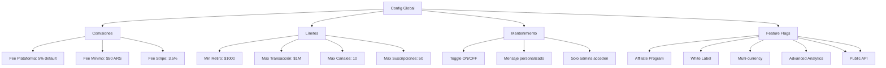

---
tags:
  - "kanban/done"
  - "type/task"
  - "domain/ADM"
  - "priority/P1"
parent: "[[desarrollo]]"
children: []
depends_on:
  - "[[FUN-001]]"
  - "[[FUN-005]]"
  - "[[FUN-008]]"
blocks:
  - "[[ADM-004]]"
  - "[[ADM-005]]"
  - "[[ADM-006]]"
status: "done"
assignee: "@dev"
created: "2026-08-04"
updated: "2026-08-05"
---

# [[ADM-002]] Configuración Global: Fees %, Límites, Maintenance Mode, Feature Flags

## Descripción
Implementar panel de configuración global en Admin: comisiones de plataforma, límites operativos, modo mantenimiento, feature flags para rollout gradual.

## Código de Ejemplo
```php
// app/Domains/Staff/Http/Controllers/Admin/ConfigController.php
namespace App\Domains\Staff\Http\Controllers\Admin;

use App\Models\PlatformConfig;

class ConfigController extends Controller
{
    public function index()
    {
        return view('domains.staff.admin.config.index', [
            'config' => PlatformConfig::getAll(),
        ]);
    }

    public function update(ConfigUpdateRequest $request)
    {
        foreach ($request->validated() as $key => $value) {
            PlatformConfig::set($key, $value);
        }
        
        // Limpiar cache
        \Cache::tags(['platform-config'])->flush();
        
        return back()->with('success', 'Configuración actualizada');
    }

    public function toggleMaintenance()
    {
        $enabled = !config('platform.maintenance_mode');
        PlatformConfig::set('maintenance_mode', $enabled);
        \Cache::tags(['platform-config'])->flush();
        
        return back()->with('success', $enabled ? 'Modo mantenimiento activado' : 'Modo mantenimiento desactivado');
    }

    public function toggleFeatureFlag(string $flag)
    {
        $flags = config('platform.feature_flags', []);
        $flags[$flag] = !$flags[$flag];
        PlatformConfig::set('feature_flags', $flags);
        \Cache::tags(['platform-config'])->flush();
        
        return back()->with('success', "Feature flag {$flag} " . ($flags[$flag] ? 'activado' : 'desactivado'));
    }
}
```

```blade
{{-- resources/views/domains/staff/admin/config/index.blade.php --}}
@extends('layouts.admin')

@section('content')
<div class="container mx-auto px-4 py-8">
    <div class="mb-8">
        <h1 class="text-2xl font-bold text-text-primary">Configuración Global</h1>
        <p class="text-text-secondary">Parámetros globales de la plataforma</p>
    </div>

    <form action="{{ route('admin.config.update') }}" method="POST" class="space-y-8">
        @csrf
        @method('PUT')

        {{-- Comisiones --}}
        <div class="card card--elevated p-6">
            <h2 class="text-xl font-semibold mb-4">Comisiones de Plataforma</h2>
            <div class="grid md:grid-cols-3 gap-4">
                <div>
                    <label class="label">Fee Plataforma (%)</label>
                    <input type="number" name="platform_fee_percentage" class="input" 
                           value="{{ config('platform.fees.platform_percentage', 5) }}" 
                           step="0.1" min="0" max="30" required>
                </div>
                <div>
                    <label class="label">Fee Mínimo por Transacción</label>
                    <div class="flex items-center gap-2">
                        <input type="number" name="min_transaction_fee" class="input w-32" 
                               value="{{ config('platform.fees.min_transaction_fee', 50) }}" 
                               min="0" step="10" required>
                        <span class="text-text-muted">ARS</span>
                    </div>
                </div>
                <div>
                    <label class="label">Fee Stripe (%)</label>
                    <input type="number" name="stripe_fee_percentage" class="input" 
                           value="{{ config('platform.fees.stripe_percentage', 3.5) }}" 
                           step="0.1" min="0" max="10" required>
                </div>
            </div>
        </div>

        {{-- Límites --}}
        <div class="card card--elevated p-6">
            <h2 class="text-xl font-semibold mb-4">Límites Operativos</h2>
            <div class="grid md:grid-cols-3 gap-4">
                <div>
                    <label class="label">Monto Mínimo Retiro</label>
                    <input type="number" name="min_withdrawal_amount" class="input" 
                           value="{{ config('platform.limits.min_withdrawal', 1000) }}" 
                           min="100" step="100" required>
                </div>
                <div>
                    <label class="label">Monto Máximo Transacción</label>
                    <input type="number" name="max_transaction_amount" class="input" 
                           value="{{ config('platform.limits.max_transaction', 1000000) }}" 
                           min="1000" step="1000" required>
                </div>
                <div>
                    <label class="label">Máx. Canales por Creador</label>
                    <input type="number" name="max_channels_per_creator" class="input" 
                           value="{{ config('platform.limits.max_channels_per_creator', 10) }}" 
                           min="1" max="100" required>
                </div>
                <div>
                    <label class="label">Máx. Suscripciones por Usuario</label>
                    <input type="number" name="max_subscriptions_per_user" class="input" 
                           value="{{ config('platform.limits.max_subscriptions_per_user', 50) }}" 
                           min="1" max="200" required>
                </div>
            </div>
        </div>

        {{-- Modo Mantenimiento --}}
        <div class="card card--elevated p-6">
            <h2 class="text-xl font-semibold mb-4">Modo Mantenimiento</h2>
            <div class="flex items-center justify-between">
                <div>
                    <p class="font-medium text-text-primary">Modo Mantenimiento</p>
                    <p class="text-sm text-text-secondary">Desactiva el acceso público (excepto admin)</p>
                </div>
                <form action="{{ route('admin.config.toggle-maintenance') }}" method="POST" class="ml-4">
                    @csrf
                    <button type="submit" class="btn btn--{{ config('platform.maintenance_mode') ? 'error' : 'primary' }} btn--lg">
                        @if(config('platform.maintenance_mode'))
                            Desactivar Mantenimiento
                        @else
                            Activar Mantenimiento
                        @endif
                    </button>
                </form>
            </div>
        </div>

        {{-- Feature Flags --}}
        <div class="card card--elevated p-6">
            <h2 class="text-xl font-semibold mb-4">Feature Flags</h2>
            <p class="text-text-secondary mb-4">Controla el rollout gradual de nuevas funcionalidades</p>
            
            <div class="space-y-3">
                @foreach([
                    'affiliate_program' => 'Programa de Afiliados',
                    'white_label' => 'White Label para Creadores',
                    'multi_currency' => 'Multi-moneda',
                    'advanced_analytics' => 'Analytics Avanzados',
                    'telegram_bot_commands' => 'Comandos Bot Telegram',
                    'api_public' => 'API Pública',
                ] as $key => $label)
                <div class="flex items-center justify-between p-4 bg-bg-tertiary rounded-lg">
                    <div>
                        <p class="font-medium text-text-primary">{{ $label }}</p>
                        <p class="text-sm text-text-secondary">Feature flag: <code>{{ $key }}</code></p>
                    </div>
                    <form action="{{ route('admin.config.toggle-feature', $key) }}" method="POST">
                        @csrf
                        <button type="submit" class="btn btn--{{ config('platform.feature_flags.'.$key) ? 'primary' : 'ghost' }} btn--sm">
                            {{ config('platform.feature_flags.'.$key) ? 'ON' : 'OFF' }}
                        </button>
                    </form>
                </div>
                @endforeach
            </div>
        </div>

        <div class="flex justify-end">
            <button type="submit" class="btn btn--primary">Guardar Configuración</button>
        </div>
    </form>
</div>
@endsection
```

## Diagramas Mermaid


## Criterios de Aceptación
- [ ] Comisiones: fee plataforma %, fee mínimo transacción, fee Stripe %
- [ ] Límites: monto mínimo retiro, monto máx transacción, max canales/creador, max subs/usuario
- [ ] Modo mantenimiento: toggle ON/OFF, mensaje personalizado, solo admins acceden
- [ ] Feature Flags: 6+ flags con toggle ON/OFF, rollout gradual
- [ ] Validaciones: porcentajes 0-100%, montos positivos
- [ ] Cache: invalidación automática al cambiar config
- [ ] Auditoría: log de cambios con usuario, campo, valor anterior/nuevo

## Notas Técnicas
- Guardar en tabla `platform_configs` (key, value, type, description)
- Cache con tags `platform-config` (TTL 1 hora)
- Middleware `CheckMaintenanceMode` en rutas públicas
- Helper `feature_enabled('flag_name')` para blade/controllers
- Feature flags con rollout % (ej: 10% usuarios) para v1.1

## Enlaces
- [[ADM-001]] Dashboard (usa config)
- [[ADM-003]] Gestión Staff
- [[ADM-004]] Gestión Creadores
- [[ADM-005]] Gestión Canales
- [[CRE-011]] Config pasarelas creador (hereda global)
- [[CRE-012]] Ciclos cobro (usa fees globales)