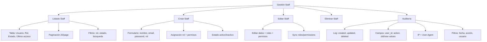

---
tags:
  - "kanban/done"
  - "type/task"
  - "domain/ADM"
  - "priority/P1"
parent: "[[desarrollo]]"
children: []
depends_on:
  - "[[ADM-002]]"
  - "[[FUN-005]]"
  - "[[FUN-006]]"
blocks:
  - "[[ADM-005]]"
  - "[[ADM-006]]"
  - "[[ADM-004]]"
  - "[[TST-F-008]]"
status: "done"
assignee: "@dev"
created: "2026-08-04"
updated: "2026-08-05"
---

# [[ADM-003]] Gestión Staff: CRUD Usuarios Staff, Roles, Permisos, Auditoría Acciones

## Descripción
Implementar gestión completa de usuarios staff en Admin: CRUD usuarios, asignación de roles/permisos, auditoría de acciones críticas.

## Código de Ejemplo
```php
// app/Domains/Staff/Http/Controllers/Admin/StaffController.php
namespace App\Domains\Staff\Http\Controllers\Admin;

use App\Models\User;
use Spatie\Permission\Models\Role;
use Spatie\Permission\Models\Permission;

class StaffController extends Controller
{
    public function index()
    {
        $staff = User::whereIn('role', ['staff', 'admin'])
            ->with(['roles', 'permissions'])
            ->latest()
            ->paginate(20);

        return view('domains.staff.admin.staff.index', compact('staff'));
    }

    public function create()
    {
        $roles = Role::where('guard_name', 'web')->get();
        return view('domains.staff.admin.staff.create', compact('roles'));
    }

    public function store(StaffStoreRequest $request)
    {
        $user = User::create([
            'name' => $request->name,
            'email' => $request->email,
            'password' => bcrypt($request->password),
            'role' => $request->role,
            'is_active' => $request->boolean('is_active'),
        ]);

        $user->assignRole($request->role);
        if ($request->filled('permissions')) {
            $user->givePermissionTo($request->permissions);
        }

        \App\Models\AuditLog::create([
            'user_id' => auth()->id(),
            'action' => 'staff_created',
            'auditable_type' => User::class,
            'auditable_id' => $user->id,
            'new_values' => $request->only(['name', 'email', 'role']),
        ]);

        return redirect()->route('admin.staff.index')
            ->with('success', 'Staff creado correctamente');
    }

    public function edit(User $staff)
    {
        $this->authorize('update', $staff);
        $roles = Role::where('guard_name', 'web')->get();
        $permissions = Permission::where('guard_name', 'web')->get();
        $staff->load('roles', 'permissions');
        return view('domains.staff.admin.staff.edit', compact('staff', 'roles', 'permissions'));
    }

    public function update(StaffUpdateRequest $request, User $staff)
    {
        $this->authorize('update', $staff);
        
        $oldValues = $staff->only(['name', 'email', 'role', 'is_active']);
        
        $staff->update($request->validated([
            'name', 'email', 'role', 'is_active',
        ]));

        if ($request->filled('role')) {
            $staff->syncRoles([$request->role]);
        }
        if ($request->filled('permissions')) {
            $staff->syncPermissions($request->permissions);
        }

        \App\Models\AuditLog::create([
            'user_id' => auth()->id(),
            'action' => 'staff_updated',
            'auditable_type' => User::class,
            'auditable_id' => $staff->id,
            'old_values' => $oldValues,
            'new_values' => $request->only(['name', 'email', 'role', 'is_active']),
        ]);

        return back()->with('success', 'Staff actualizado');
    }

    public function destroy(User $staff)
    {
        $this->authorize('delete', $staff);
        
        if ($staff->id === auth()->id()) {
            return back()->with('error', 'No puedes eliminarte a ti mismo');
        }

        \App\Models\AuditLog::create([
            'user_id' => auth()->id(),
            'action' => 'staff_deleted',
            'auditable_type' => User::class,
            'auditable_id' => $staff->id,
            'old_values' => $staff->toArray(),
        ]);

        $staff->delete();
        return back()->with('success', 'Staff eliminado');
    }
}
```

```blade
{{-- resources/views/domains/staff/admin/staff/index.blade.php --}}
@extends('layouts.admin')

@section('content')
<div class="container mx-auto px-4 py-8">
    <div class="mb-8 flex justify-between items-center">
        <div>
            <h1 class="text-2xl font-bold text-text-primary">Gestión de Staff</h1>
            <p class="text-text-secondary">Administra usuarios staff y administradores</p>
        </div>
        <a href="{{ route('admin.staff.create') }}" class="btn btn--primary">
            <x-icon name="plus" class="w-4 h-4 mr-2" />
            Nuevo Staff
        </a>
    </div>

    <div class="card card--elevated overflow-hidden">
        <table class="w-full">
            <thead class="bg-bg-tertiary">
                <tr>
                    <th class="p-4 text-left text-sm font-semibold text-text-secondary">Usuario</th>
                    <th class="p-4 text-center text-sm font-semibold text-text-secondary">Rol</th>
                    <th class="p-4 text-center text-sm font-semibold text-text-secondary">Estado</th>
                    <th class="p-4 text-center text-sm font-semibold text-text-secondary">Último Acceso</th>
                    <th class="p-4 text-center text-sm font-semibold text-text-secondary">Acciones</th>
                </tr>
            </thead>
            <tbody class="divide-y divide-border-primary">
                @foreach($staff as $user)
                <tr class="hover:bg-bg-tertiary">
                    <td class="p-4">
                        <div class="flex items-center gap-3">
                            avatar_url ?? asset('images/default-avatar.png') }}" 
                                 alt="" class="w-10 h-10 rounded-full">
                            <div>
                                <p class="font-medium text-text-primary">{{ $user->name }}</p>
                                <p class="text-sm text-text-secondary">{{ $user->email }}</p>
                            </div>
                        </div>
                    </td>
                    <td class="p-4 text-center">
                        <span class="badge badge--{{ $user->role === 'admin' ? 'error' : 'info' }}">
                            {{ ucfirst($user->role) }}
                        </span>
                    </td>
                    <td class="p-4 text-center">
                        <span class="badge badge--{{ $user->is_active ? 'success' : 'warning' }}">
                            {{ $user->is_active ? 'Activo' : 'Inactivo' }}
                        </span>
                    </td>
                    <td class="p-4 text-center text-sm text-text-secondary">
                        {{ $user->last_login_at?->diffForHumans() ?? 'Nunca' }}
                    </td>
                    <td class="p-4 text-center">
                        <div class="flex items-center justify-center gap-2">
                            <a href="{{ route('admin.staff.edit', $user) }}" class="btn btn--ghost btn--sm">
                                <x-icon name="edit" class="w-4 h-4" />
                            </a>
                            <form action="{{ route('admin.staff.destroy', $user) }}" method="POST" class="inline">
                                @csrf
                                @method('DELETE')
                                <button type="submit" onclick="return confirm('¿Eliminar este usuario?')" class="btn btn--ghost btn--sm text-error">
                                    <x-icon name="trash" class="w-4 h-4" />
                                </button>
                            </form>
                        </div>
                    </td>
                </tr>
                @endforeach
            </tbody>
        </table>
        <div class="p-4 border-t border-border-primary">
            {{ $staff->links() }}
        </div>
    </div>
</div>
@endsection
```

## Diagramas Mermaid


## Criterios de Aceptación
- [ ] Listado staff: tabla con usuario, rol, estado, último acceso, paginación 20
- [ ] Crear: nombre, email, password, rol (staff/admin), permisos opcionales
- [ ] Editar: datos básicos, rol, permisos, estado activo/inactivo
- [ ] Eliminar: confirmación, no auto-eliminación, auditoría
- [ ] Roles/Permisos: sync automático con spatie/laravel-permission
- [ ] Auditoría: log de creaciones, actualizaciones, eliminaciones con old/new values
- [ ] Filtros: por rol (staff/admin), estado (activo/inactivo), búsqueda por nombre/email
- [ ] Permisos: policy StaffPolicy para authorize

## Notas Técnicas
- Spatie Laravel Permission para roles/permisos
- AuditLog model para auditoría (user_id, action, auditable, old/new values)
- Policy StaffPolicy para autorización
- Password hashing con bcrypt
- Soft deletes opcional para staff

## Enlaces
- [[ADM-002]] Config global (roles/permisos base)
- [[ADM-004]] Gestión creadores
- [[ADM-005]] Gestión canales
- [[FUN-005]] Spatie Permission