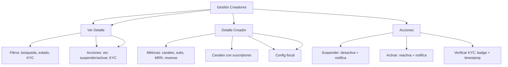

---
tags:
  - "kanban/done"
  - "type/task"
  - "domain/ADM"
  - "priority/P1"
parent: "[[desarrollo]]"
children: []
depends_on:
  - "[[ADM-003]]"
  - "[[FUN-005]]"
  - "[[FUN-006]]"
blocks:
  - "[[ADM-006]]"
status: "done"
assignee: "@dev"
created: "2026-08-04"
updated: "2026-08-05"
---

# [[ADM-004]] Gestión Creadores: Ver, Suspender, Métricas, Soporte, KYC Básico

## Descripción
Implementar panel de gestión de creadores en Admin: listado con filtros, ver detalles, suspender/activar, métricas por creador, KYC básico.

## Código de Ejemplo
```php
// app/Domains/Staff/Http/Controllers/Admin/CreatorController.php
namespace App\Domains\Staff\Http\Controllers\Admin;

use App\Models\{ChannelPago, User, Subscription, Payment};

class CreatorController extends Controller
{
    public function index()
    {
        $creators = User::where('role', 'creador')
            ->with(['channels', 'taxConfiguration'])
            ->withCount(['channels' => fn($q) => $q->where('status', 'active')])
            ->withSum('channels as total_mrr', 'price')
            ->latest()
            ->paginate(20);

        return view('domains.staff.admin.creators.index', compact('creators'));
    }

    public function show(User $creator)
    {
        $this->authorize('view', $creator);
        
        $creator->load([
            'channels' => fn($q) => $q->withCount('subscriptions'),
            'taxConfiguration',
            'payouts' => fn($q) => $q->latest()->take(10),
        ]);

        $metrics = [
            'total_channels' => $creator->channels->count(),
            'active_channels' => $creator->channels->where('status', 'active')->count(),
            'total_subscribers' => $creator->channels->sum('subscriptions_count'),
            'mrr' => $creator->channels->where('status', 'active')->sum('price'),
            'total_revenue' => Payment::whereHas('subscription.channel', fn($q) => $q->where('owner_id', $creator->id))
                ->where('status', 'approved')
                ->sum('amount'),
        ];

        return view('domains.staff.admin.creators.show', compact('creator', 'metrics'));
    }

    public function update(User $creator, CreatorUpdateRequest $request)
    {
        $this->authorize('update', $creator);
        
        $creator->update($request->validated([
            'is_active', 'is_verified', 'kyc_status', 'notes',
        ]));

        return back()->with('success', 'Creador actualizado');
    }

    public function suspend(User $creator)
    {
        $this->authorize('suspend', $creator);
        
        $creator->update(['is_active' => false]);
        
        // Desactivar canales
        $creator->channels()->update(['status' => 'suspended']);
        
        // Notificar creador
        \Mail::to($creator->email)->send(new \App\Mail\AccountSuspendedMail($creator));
        
        return back()->with('success', 'Creador suspendido');
    }

    public function activate(User $creator)
    {
        $this->authorize('activate', $creator);
        
        $creator->update(['is_active' => true]);
        
        // Reactivar canales (solo los que no estaban suspendidos manualmente)
        $creator->channels()->where('status', 'suspended')->update(['status' => 'active']);
        
        return back()->with('success', 'Creador activado');
    }

    public function verifyKyc(User $creator)
    {
        $this->authorize('verifyKyc', $creator);
        
        $creator->update([
            'kyc_status' => 'verified',
            'kyc_verified_at' => now(),
            'kyc_verified_by' => auth()->id(),
        ]);
        
        return back()->with('success', 'KYC verificado');
    }
}
```

```blade
{{-- resources/views/domains/staff/admin/creators/index.blade.php --}}
@extends('layouts.admin')

@section('content')
<div class="container mx-auto px-4 py-8">
    <div class="mb-8">
        <h1 class="text-2xl font-bold text-text-primary">Gestión de Creadores</h1>
        <p class="text-text-secondary">Administra creadores, sus canales y métricas</p>
    </div>

    {{-- Filtros --}}
    <div class="card card--elevated p-4 mb-6">
        <form method="GET" class="flex flex-wrap gap-4 items-end">
            <div>
                <label class="label">Buscar</label>
                <input type="text" name="search" class="input" placeholder="Nombre, email..." value="{{ request('search') }}">
            </div>
            <div>
                <label class="label">Estado</label>
                <select name="status" class="select">
                    <option value="">Todos</option>
                    <option value="active" {{ request('status') === 'active' ? 'selected' : '' }}>Activos</option>
                    <option value="inactive" {{ request('status') === 'inactive' ? 'selected' : '' }}>Inactivos</option>
                    <option value="suspended" {{ request('status') === 'suspended' ? 'selected' : '' }}>Suspendidos</option>
                </select>
            </div>
            <div>
                <label class="label">KYC</label>
                <select name="kyc_status" class="select">
                    <option value="">Todos</option>
                    <option value="verified" {{ request('kyc_status') === 'verified' ? 'selected' : '' }}>Verificados</option>
                    <option value="pending" {{ request('kyc_status') === 'pending' ? 'selected' : '' }}>Pendientes</option>
                    <option value="rejected" {{ request('kyc_status') === 'rejected' ? 'selected' : '' }}>Rechazados</option>
                </select>
            </div>
            <div class="flex gap-2">
                <button type="submit" class="btn btn--primary">Filtrar</button>
                <a href="{{ route('admin.creators.index') }}" class="btn btn--ghost">Limpiar</a>
            </div>
        </form>
    </div>

    {{-- Tabla Creadores --}}
    <div class="card card--elevated overflow-hidden">
        @if($creators->isEmpty())
        <div class="p-12 text-center">
            <x-empty-state illustration="empty-creators" title="No hay creadores" />
        </div>
        @else
        <table class="w-full">
            <thead class="bg-bg-tertiary">
                <tr>
                    <th class="p-4 text-left text-sm font-semibold text-text-secondary">Creador</th>
                    <th class="p-4 text-center text-sm font-semibold text-text-secondary">Canales</th>
                    <th class="p-4 text-center text-sm font-semibold text-text-secondary">Suscriptores</th>
                    <th class="p-4 text-right text-sm font-semibold text-text-secondary">MRR</th>
                    <th class="p-4 text-center text-sm font-semibold text-text-secondary">KYC</th>
                    <th class="p-4 text-center text-sm font-semibold text-text-secondary">Estado</th>
                    <th class="p-4 text-center text-sm font-semibold text-text-secondary">Acciones</th>
                </tr>
            </thead>
            <tbody class="divide-y divide-border-primary">
                @foreach($creators as $creator)
                <tr class="hover:bg-bg-tertiary">
                    <td class="p-4">
                        <div class="flex items-center gap-3">
                            avatar_url ?? asset('images/default-avatar.png') }}" 
                                 alt="" class="w-10 h-10 rounded-full">
                            <div>
                                <p class="font-medium text-text-primary">{{ $creator->name }}</p>
                                <p class="text-sm text-text-secondary">{{ $creator->email }}</p>
                            </div>
                        </div>
                    </td>
                    <td class="p-4 text-center text-sm text-text-primary">
                        {{ $creator->active_channels_count }} / {{ $creator->channels_count }}
                    </td>
                    <td class="p-4 text-center text-sm text-text-secondary">
                        {{ number_format($creator->channels->sum('subscriptions_count')) }}
                    </td>
                    <td class="p-4 text-right text-sm font-medium text-text-primary">
                        ${{ number_format($creator->channels->where('status', 'active')->sum('price'), 2) }}
                    </td>
                    <td class="p-4 text-center">
                        <span class="badge badge--{{ $creator->kyc_status === 'verified' ? 'success' : ($creator->kyc_status === 'pending' ? 'warning' : 'default') }}">
                            {{ ucfirst($creator->kyc_status ?? 'pending') }}
                        </span>
                    </td>
                    <td class="p-4 text-center">
                        <span class="badge badge--{{ $creator->is_active ? 'success' : 'warning' }}">
                            {{ $creator->is_active ? 'Activo' : 'Inactivo' }}
                        </span>
                    </td>
                    <td class="p-4 text-center">
                        <div class="flex items-center justify-center gap-1">
                            <a href="{{ route('admin.creators.show', $creator) }}" class="btn btn--ghost btn--sm" title="Ver">
                                <x-icon name="eye" class="w-4 h-4" />
                            </a>
                            @if($creator->is_active)
                            <form action="{{ route('admin.creators.suspend', $creator) }}" method="POST" class="inline">
                                @csrf
                                <button type="submit" onclick="return confirm('¿Suspender a este creador?')" class="btn btn--ghost btn--sm text-warning" title="Suspender">
                                    <x-icon name="pause-circle" class="w-4 h-4" />
                                </button>
                            </form>
                            @else
                            <form action="{{ route('admin.creators.activate', $creator) }}" method="POST" class="inline">
                                @csrf
                                <button type="submit" class="btn btn--ghost btn--sm text-success" title="Activar">
                                    <x-icon name="play-circle" class="w-4 h-4" />
                                </button>
                            </form>
                            @endif
                            @if($creator->kyc_status !== 'verified')
                            <form action="{{ route('admin.creators.verify-kyc', $creator) }}" method="POST" class="inline">
                                @csrf
                                <button type="submit" class="btn btn--ghost btn--sm text-info" title="Verificar KYC">
                                    <x-icon name="shield-check" class="w-4 h-4" />
                                </button>
                            </form>
                            @endif
                        </div>
                    </td>
                </tr>
                @endforeach
            </tbody>
        </table>
        <div class="p-4 border-t border-border-primary">
            {{ $creators->links() }}
        </div>
        @endif
    </div>
</div>
@endsection
```

## Diagramas Mermaid


## Criterios de Aceptación
- [ ] Listado con filtros: búsqueda, estado (activo/inactivo/suspendido), KYC (verified/pending/rejected)
- [ ] Tabla: avatar, nombre, email, canales activos/total, suscriptores, MRR, KYC badge, estado badge
- [ ] Acciones: ver detalle, suspender/activar, verificar KYC
- [ ] Detalle creador: métricas (canales, subs, MRR, revenue total), canales con subs, historial retiros, config fiscal
- [ ] Suspender: desactiva usuario, suspende canales, notifica email
- [ ] Activar: reactiva usuario, reactiva canales, notifica
- [ ] KYC: badge pending/verified/rejected, botón verificar (timestamp + user)
- [ ] Paginación 20/page, ordenamiento por fecha/MRR/nombre

## Notas Técnicas
- Scope `creador` en User model
- Suspender: `is_active=false` + canales `status=suspended`
- Activar: `is_active=true` + canales `status=active` (solo los suspended por admin)
- KYC: campos `kyc_status`, `kyc_verified_at`, `kyc_verified_by`
- Notificaciones: Email + Telegram (si configurado)
- Policy: `CreatorPolicy` con view/update/suspend/activate/verifyKyc

## Enlaces
- [[ADM-003]] Gestión Staff
- [[ADM-005]] Gestión Canales
- [[ADM-006]] Transacciones
- [[CRE-015]] Config fiscal creador
- [[CRE-013]] Facturación creador
- [[CRE-015]] Config fiscal creador