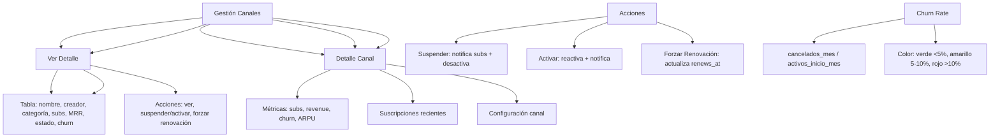

---
tags:
  - "kanban/done"
  - "type/task"
  - "domain/ADM"
  - "priority/P1"
parent: "[[desarrollo]]"
children: []
depends_on:
  - "[[ADM-004]]"
  - "[[FUN-005]]"
  - "[[FUN-006]]"
blocks:
  - "[[ADM-007]]"
status: "done"
assignee: "@dev"
created: "2026-08-04"
updated: "2026-08-05"
---

# [[ADM-005]] Gestión Canales: Auditar, Suspender, Forzar Renovación, Métricas Agregadas

## Descripción
Implementar panel de gestión de canales en Admin: listado con filtros, auditoría, suspender/activar, forzar renovación, métricas agregadas por canal.

## Código de Ejemplo
```php
// app/Domains/Staff/Http/Controllers/Admin/ChannelController.php
namespace App\Domains\Staff\Http\Controllers\Admin;

use App\Models\ChannelPago;

class ChannelController extends Controller
{
    public function index()
    {
        $channels = \App\Models\ChannelPago::with(['owner', 'category'])
            ->withCount(['subscriptions' => fn($q) => $q->where('status', 'active')])
            ->withSum('subscriptions as total_mrr', 'price')
            ->when(request('status'), fn($q) => $q->where('status', request('status')))
            ->when(request('search'), fn($q) => $q->where('name', 'like', "%".request('search')."%"))
            ->when(request('category_id'), fn($q) => $q->where('category_id', request('category_id')))
            ->latest()
            ->paginate(20);

        $categories = \App\Models\Category::where('is_active', true)->get();

        return view('domains.staff.admin.channels.index', compact('channels', 'categories'));
    }

    public function show(\App\Models\ChannelPago $channel)
    {
        $channel->load(['owner', 'category', 'subscriptions' => fn($q) => $q->with('user')->where('status', 'active')]);

        $metrics = [
            'total_subscribers' => $channel->subscriptions()->where('status', 'active')->count(),
            'total_revenue' => \App\Models\Payment::whereHas('subscription', fn($q) => $q->where('channel_pago_id', $channel->id))
                ->where('status', 'approved')
                ->sum('amount'),
            'churn_rate' => $this->calculateChurnRate($channel),
            'avg_revenue_per_user' => $channel->subscriptions()->where('status', 'active')->avg('price'),
        );

        $recentSubscriptions = \App\Models\Subscription::where('channel_pago_id', $channel->id)
            ->with('user')
            ->latest()
            ->take(20)
            ->get();

        return view('domains.staff.admin.channels.show', compact('channel', 'metrics', 'recentSubscriptions'));
    }

    public function suspend(\App\Models\ChannelPago $channel)
    {
        $this->authorize('suspend', $channel);
        $channel->update(['status' => 'suspended']);
        
        // Notificar suscriptores
        \App\Models\Subscription::where('channel_pago_id', $channel->id)
            ->where('status', 'active')
            ->get()
            ->each(function($sub) {
                \Mail::to($sub->user->email)->send(
                    new \App\Mail\ChannelSuspendedMail($sub->channel)
                );
            });

        $channel->update(['status' => 'suspended']);
        return back()->with('success', 'Canal suspendido');
    }

    public function activate(\App\Models\ChannelPago $channel)
    {
        $this->authorize('activate', $channel);
        $channel->update(['status' => 'active']);
        return back()->with('success', 'Canal activado');
    }

    public function forceRenewal(\App\Models\ChannelPago $channel)
    {
        $this->authorize('forceRenewal', $channel);
        
        \App\Models\Subscription::where('channel_pago_id', $channel->id)
            ->where('status', 'active')
            ->each(function($sub) {
                $sub->renews_at = now()->addMonth();
                $sub->save();
            });

        return back()->with('success', 'Renovación forzada para todos los suscriptores');
    }

    private function calculateChurnRate(\App\Models\ChannelPago $channel): float
    {
        $startOfMonth = now()->startOfMonth();
        $activeAtStart = \App\Models\Subscription::where('channel_pago_id', $channel->id)
            ->where('status', 'active')
            ->where('created_at', '<', now()->startOfMonth())
            ->count();
        
        $cancelledThisMonth = \App\Models\Subscription::where('channel_pago_id', $channel->id)
            ->where('status', 'cancelled')
            ->whereBetween('cancelled_at', [now()->startOfMonth(), now()->endOfMonth()])
            ->count();

        return $activeAtStart > 0 ? round(($cancelledThisMonth / $activeAtStart) * 100, 1) : 0;
    }
}
```

```blade
{{-- resources/views/domains/staff/admin/channels/index.blade.php --}}
@extends('layouts.admin')

@section('content')
<div class="container mx-auto px-4 py-8">
    <div class="mb-8">
        <h1 class="text-2xl font-bold text-text-primary">Gestión de Canales</h1>
        <p class="text-text-secondary">Administra todos los canales de la plataforma</p>
    </div>

    {{-- Filtros --}}
    <div class="card card--elevated p-4 mb-6">
        <form method="GET" class="flex flex-wrap gap-4 items-end">
            <div>
                <label class="label">Buscar</label>
                <input type="text" name="search" class="input" placeholder="Nombre del canal..." value="{{ request('search') }}">
            </div>
            <div>
                <label class="label">Estado</label>
                <select name="status" class="select">
                    <option value="">Todos</option>
                    <option value="active" {{ request('status') === 'active' ? 'selected' : '' }}>Activos</option>
                    <option value="suspended" {{ request('status') === 'suspended' ? 'selected' : '' }}>Suspendidos</option>
                    <option value="pending" {{ request('status') === 'pending' ? 'selected' : '' }}>Pendientes</option>
                </select>
            </div>
            <div>
                <label class="label">Categoría</label>
                <select name="category_id" class="select">
                    <option value="">Todas</option>
                    @foreach($categories as $cat)
                    <option value="{{ $cat->id }}" {{ request('category_id') == $cat->id ? 'selected' : '' }}>
                        {{ $cat->name }}
                    </option>
                    @endforeach
                </select>
            </div>
            <div class="flex gap-2">
                <button type="submit" class="btn btn--primary">Filtrar</button>
                <a href="{{ route('admin.channels.index') }}" class="btn btn--ghost">Limpiar</a>
            </div>
        </form>
    </div>

    {{-- Tabla Canales --}}
    <div class="card card--elevated overflow-hidden">
        @if($channels->isEmpty())
        <div class="p-12 text-center">
            <x-empty-state illustration="empty-channels" title="No hay canales" />
        </div>
        @else
        <table class="w-full">
            <thead class="bg-bg-tertiary">
                <tr>
                    <th class="p-4 text-left text-sm font-semibold text-text-secondary">Canal</th>
                    <th class="p-4 text-center text-sm font-semibold text-text-secondary">Creador</th>
                    <th class="p-4 text-center text-sm font-semibold text-text-secondary">Categoría</th>
                    <th class="p-4 text-center text-sm font-semibold text-text-secondary">Suscriptores</th>
                    <th class="p-4 text-right text-sm font-semibold text-text-secondary">MRR</th>
                    <th class="p-4 text-center text-sm font-semibold text-text-secondary">Estado</th>
                    <th class="p-4 text-center text-sm font-semibold text-text-secondary">Churn</th>
                    <th class="p-4 text-center text-sm font-semibold text-text-secondary">Acciones</th>
                </tr>
            </thead>
            <tbody class="divide-y divide-border-primary">
                @foreach($channels as $channel)
                <tr class="hover:bg-bg-tertiary">
                    <td class="p-4">
                        <div class="flex items-center gap-3">
                            cover_image ?? asset('images/channel-placeholder.svg') }}" 
                                 alt="" class="w-12 h-12 rounded-lg object-cover">
                            <div>
                                <p class="font-medium text-text-primary truncate max-w-xs">{{ $channel->name }}</p>
                                <p class="text-xs text-text-secondary">{{ $channel->category->name ?? 'Sin categoría' }}</p>
                            </div>
                        </div>
                    </td>
                    <td class="p-4 text-center">
                        <a href="{{ route('admin.creators.show', $channel->owner) }}" class="text-sm text-accent-primary hover:underline">
                            {{ $channel->owner->name }}
                        </a>
                    </td>
                    <td class="p-4 text-center text-sm text-text-secondary">
                        {{ $channel->category->name ?? '—' }}
                    </td>
                    <td class="p-4 text-center text-sm font-medium text-text-primary">
                        {{ $channel->subscriptions_count }}
                    </td>
                    <td class="p-4 text-right text-sm font-medium text-text-primary">
                        ${{ number_format($channel->total_mrr, 2) }}
                    </td>
                    <td class="p-4 text-center">
                        <span class="badge badge--{{ $channel->status === 'active' ? 'success' : 'warning' }}">
                            {{ ucfirst($channel->status) }}
                        </span>
                    </td>
                    <td class="p-4 text-center text-sm {{ $channel->churn_rate >= 10 ? 'text-error' : ($channel->churn_rate >= 5 ? 'text-warning' : 'text-success') }}">
                        {{ number_format($this->calculateChurnRate($channel), 1) }}%
                    </td>
                    <td class="p-4 text-center">
                        <div class="flex items-center justify-center gap-1">
                            <a href="{{ route('admin.channels.show', $channel) }}" class="btn btn--ghost btn--sm" title="Ver">
                                <x-icon name="eye" class="w-4 h-4" />
                            </a>
                            @if($channel->status === 'active')
                            <form action="{{ route('admin.channels.suspend', $channel) }}" method="POST" class="inline">
                                @csrf
                                <button type="submit" onclick="return confirm('¿Suspender este canal?')" class="btn btn--ghost btn--sm text-warning" title="Suspender">
                                    <x-icon name="pause-circle" class="w-4 h-4" />
                                </button>
                            </form>
                            <form action="{{ route('admin.channels.force-renewal', $channel) }}" method="POST" class="inline">
                                @csrf
                                <button type="submit" class="btn btn--ghost btn--sm text-info" title="Forzar renovación">
                                    <x-icon name="refresh-cw" class="w-4 h-4" />
                                </button>
                            </form>
                            @else
                            <form action="{{ route('admin.channels.activate', $channel) }}" method="POST" class="inline">
                                @csrf
                                <button type="submit" class="btn btn--ghost btn--sm text-success" title="Activar">
                                    <x-icon name="play-circle" class="w-4 h-4" />
                                </button>
                            </form>
                            @endif
                        </div>
                    </td>
                </tr>
                @endforeach
            </tbody>
        </table>
        <div class="p-4 border-t border-border-primary">
            {{ $channels->links() }}
        </div>
        @endif
    </div>
</div>
@endsection
```

## Diagramas Mermaid


## Criterios de Aceptación
- [ ] Listado con filtros: búsqueda, estado (active/suspended/pending), categoría
- [ ] Tabla: nombre, creador, categoría, suscriptores, MRR, estado badge, churn % (color)
- [ ] Acciones: ver detalle, suspender/activar, forzar renovación
- [ ] Detalle canal: métricas (subs, revenue, churn, ARPU), suscripciones recientes
- [ ] Suspender: notifica suscriptores por email, desactiva canal
- [ ] Activar: reactiva canal, notifica suscriptores
- [ ] Forzar renovación: actualiza renews_at de todas las subs activas a +1 mes
- [ ] Churn rate calculado: cancelados_mes / activos_inicio_mes * 100
- [ ] Churn badge: verde <5%, amarillo 5-10%, rojo >10%
- [ ] Paginación 20/page, ordenamiento por MRR/fecha/suscriptores

## Notas Técnicas
- Churn rate: cancelados en mes actual / activos al inicio del mes
- Suspender: envía email a todos los suscriptores activos del canal
- Forzar renovación: actualiza `renews_at` = now() + 1 mes para todas las subs activas
- Job diario para calcular churn rate y cachearlo
- Policy: ChannelPolicy con view/suspend/activate/forceRenewal

## Enlaces
- [[ADM-004]] Gestión Creadores
- [[ADM-006]] Transacciones
- [[ADM-007]] Logs Seguridad
- [[CRE-003]] Canales CRUD (creador)
- [[CRE-004]] Gestión suscripciones (creador)