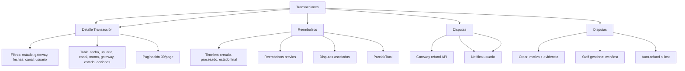

---
tags:
  - "kanban/done"
  - "type/task"
  - "domain/ADM"
  - "priority/P1"
parent: "[[desarrollo]]"
children: []
depends_on:
  - "[[ADM-005]]"
  - "[[FUN-005]]"
  - "[[FUN-006]]"
blocks:
  - "[[ADM-007]]"
status: "done"
assignee: "@dev"
created: "2026-08-04"
updated: "2026-08-05"
---

# [[ADM-006]] Transacciones: Lista, Filtros, Reembolsos, Disputas, Conciliación

## Descripción
Implementar panel de gestión de transacciones en Admin: listado con filtros avanzados, reembolsos parciales/totales, gestión de disputas, conciliación bancaria.

## Código de Ejemplo
```php
// app/Domains/Staff/Http/Controllers/Admin/TransactionController.php
namespace App\Domains\Staff\Http\Controllers\Admin;

use App\Models\{Payment, Payout, Refund, Dispute};

class TransactionController extends Controller
{
    public function index()
    {
        $transactions = \App\Models\Payment::with(['subscription.channel', 'user', 'subscription.channel.owner'])
            ->when(request('status'), fn($q) => $q->where('status', request('status')))
            ->when(request('gateway'), fn($q) => $q->where('gateway', request('gateway')))
            ->when(request('date_from'), fn($q) => $q->whereDate('created_at', '>=', request('date_from')))
            ->when(request('date_to'), fn($q) => $q->whereDate('created_at', '<=', request('date_to')))
            ->when(request('channel_id'), fn($q) => $q->whereHas('subscription', fn($q) => $q->where('channel_pago_id', request('channel_id'))))
            ->when(request('user_id'), fn($q) => $q->where('user_id', request('user_id')))
            ->latest()
            ->paginate(30);

        $gateways = \App\Models\Payment::distinct('gateway')->pluck('gateway');
        $statuses = ['approved', 'pending', 'rejected', 'refunded', 'failed'];

        return view('domains.staff.admin.transactions.index', compact('transactions', 'gateways', 'statuses'));
    }

    public function show(\App\Models\Payment $payment)
    {
        $payment->load(['subscription.channel', 'user', 'subscription.channel.owner', 'refunds', 'dispute']);
        
        $timeline = collect([
            ['event' => 'Creado', 'time' => $payment->created_at, 'icon' => 'clock'],
            ['event' => 'Procesando', 'time' => $payment->processed_at ?? null, 'icon' => 'loader'],
            ['event' => ucfirst($payment->status), 'time' => $payment->updated_at, 'icon' => $payment->status === 'approved' ? 'check-circle' : ($payment->status === 'rejected' ? 'x-circle' : 'alert-circle')],
        ])->filter(fn($e) => $e['time'])->values();

        if ($payment->refunds->isNotEmpty()) {
            $timeline = $timeline->merge($payment->refunds->map(fn($r) => [
                'event' => 'Reembolso ' . ($r->amount == $payment->amount ? 'Total' : 'Parcial'),
                'time' => $r->created_at,
                'icon' => 'rotate-ccw',
                'amount' => $r->amount,
            ]));
        }

        return view('domains.staff.admin.transactions.show', compact('payment', 'timeline'));
    }

    public function refund(\App\Models\Payment $payment, RefundRequest $request)
    {
        $this->authorize('refund', $payment);

        if (!in_array($payment->status, ['approved'])) {
            return back()->with('error', 'Solo pagos aprobados pueden reembolsarse');
        }

        $amount = $request->amount ?? $payment->amount;
        
        if ($amount > $payment->amount) {
            return back()->with('error', 'El monto no puede ser mayor al pago original');
        }

        // Procesar reembolso según gateway
        $gatewayService = app(\App\Services\PaymentGatewayFactory::class)
            ->create($payment->gateway, $payment->subscription->channel->getGatewayConfig());

        $refund = $gatewayService->refundPayment($payment->{$payment->gateway . '_payment_id'}, $amount);

        $refundRecord = \App\Models\Refund::create([
            'payment_id' => $payment->id,
            'amount' => $amount,
            'reason' => $request->reason,
            'gateway_refund_id' => $refund['refund_id'] ?? null,
            'status' => 'completed',
            'processed_by' => auth()->id(),
        ]);

        if ($amount >= $payment->amount) {
            $payment->update(['status' => 'refunded']);
        } elseif ($payment->refunds->sum('amount') + $amount >= $payment->amount) {
            $payment->update(['status' => 'refunded']);
        } else {
            $payment->update(['status' => 'partially_refunded']);
        }

        // Notificar usuario
        \Mail::to($payment->user->email)->send(
            new \App\Mail\RefundProcessedMail($payment, $refundRecord)
        );

        return back()->with('success', 'Reembolso procesado correctamente');
    }

    public function dispute(\App\Models\Payment $payment, DisputeRequest $request)
    {
        $this->authorize('dispute', $payment);

        $dispute = \App\Models\Dispute::create([
            'payment_id' => $payment->id,
            'reason' => $request->reason,
            'evidence' => $request->evidence,
            'status' => 'open',
            'opened_by' => auth()->id(),
        ]);

        $payment->update(['status' => 'disputed']);

        return back()->with('success', 'Disputa registrada');
    }

    public function resolveDispute(\App\Models\Dispute $dispute, DisputeResolveRequest $request)
    {
        $this->authorize('resolve', $dispute);

        $dispute->update([
            'status' => $request->resolution, // won, lost
            'resolution_notes' => $request->notes,
            'resolved_at' => now(),
            'resolved_by' => auth()->id(),
        ]);

        if ($request->resolution === 'lost') {
            // Procesar reembolso automático
            $this->refund($dispute->payment, new RefundRequest(['amount' => $dispute->payment->amount, 'reason' => 'Disputa perdida']));
        }

        return back()->with('success', 'Disputa resuelta');
    }
}
```

```blade
{{-- resources/views/domains/staff/admin/transactions/index.blade.php --}}
@extends('layouts.admin')

@section('content')
<div class="container mx-auto px-4 py-8">
    <div class="mb-8">
        <h1 class="text-2xl font-bold text-text-primary">Transacciones</h1>
        <p class="text-text-secondary">Gestiona pagos, reembolsos y disputas</p>
    </div>

    {{-- Filtros --}}
    <div class="card card--elevated p-4 mb-6">
        <form method="GET" class="flex flex-wrap gap-4 items-end">
            <div>
                <label class="label">Estado</label>
                <select name="status" class="select">
                    <option value="">Todos</option>
                    @foreach(['approved' => 'Aprobado', 'pending' => 'Pendiente', 'rejected' => 'Rechazado', 'refunded' => 'Reembolsado', 'failed' => 'Fallido', 'partially_refunded' => 'Parcialmente Reembolsado'] as $value => $label)
                    <option value="{{ $value }}" {{ request('status') === $value ? 'selected' : '' }}>{{ $label }}</option>
                    @endforeach
                </select>
            </div>
            <div>
                <label class="label">Pasarela</label>
                <select name="gateway" class="select">
                    <option value="">Todas</option>
                    @foreach($gateways as $gw)
                    <option value="{{ $gw }}" {{ request('gateway') === $gw ? 'selected' : '' }}>{{ ucfirst($gw) }}</option>
                    @endforeach
                </select>
            </div>
            <div>
                <label class="label">Desde</label>
                <input type="date" name="date_from" class="input" value="{{ request('date_from') }}">
            </div>
            <div>
                <label class="label">Hasta</label>
                <input type="date" name="date_to" class="input" value="{{ request('date_to') }}">
            </div>
            <div>
                <label class="label">Canal</label>
                <input type="text" name="channel_id" class="input" placeholder="ID Canal" value="{{ request('channel_id') }}">
            </div>
            <div>
                <label class="label">Usuario</label>
                <input type="text" name="user_id" class="input" placeholder="ID Usuario" value="{{ request('user_id') }}">
            </div>
            <div class="flex gap-2">
                <button type="submit" class="btn btn--primary">Filtrar</button>
                <a href="{{ route('admin.transactions.index') }}" class="btn btn--ghost">Limpiar</a>
            </div>
        </form>
    </div>

    {{-- Tabla Transacciones --}}
    <div class="card card--elevated overflow-hidden">
        @if($transactions->isEmpty())
        <div class="p-12 text-center">
            <x-empty-state illustration="empty-transactions" title="No hay transacciones" />
        </div>
        @else
        <table class="w-full">
            <thead class="bg-bg-tertiary">
                <tr>
                    <th class="p-4 text-left text-sm font-semibold text-text-secondary">Fecha</th>
                    <th class="p-4 text-left text-sm font-semibold text-text-secondary">Usuario</th>
                    <th class="p-4 text-left text-sm font-semibold text-text-secondary">Canal</th>
                    <th class="p-4 text-right text-sm font-semibold text-text-secondary">Monto</th>
                    <th class="p-4 text-center text-sm font-semibold text-text-secondary">Pasarela</th>
                    <th class="p-4 text-center text-sm font-semibold text-text-secondary">Estado</th>
                    <th class="p-4 text-center text-sm font-semibold text-text-secondary">Acciones</th>
                </tr>
            </thead>
            <tbody class="divide-y divide-border-primary">
                @foreach($transactions as $payment)
                <tr class="hover:bg-bg-tertiary">
                    <td class="p-4 text-sm text-text-secondary">{{ $payment->created_at->format('d/m/Y H:i') }}</td>
                    <td class="p-4">
                        <a href="{{ route('admin.users.show', $payment->user) }}" class="text-text-primary hover:underline">{{ $payment->user->name }}</a>
                        <p class="text-xs text-text-secondary">{{ $payment->user->email }}</p>
                    </td>
                    <td class="p-4">
                        <a href="{{ route('admin.channels.show', $payment->subscription->channel) }}" class="text-text-primary hover:underline">
                            {{ $payment->subscription->channel->name }}
                        </a>
                    </td>
                    <td class="p-4 text-right text-sm font-medium text-text-primary">
                        ${{ number_format($payment->amount, 2) }} {{ $payment->currency }}
                    </td>
                    <td class="p-4 text-center">
                        <span class="badge badge--{{ match($payment->gateway) 'mercadopago' => 'info', 'stripe' => 'primary', 'paypal' => 'warning', 'bank_transfer' => 'warning', default => 'default' }}">
                            {{ ucfirst($payment->gateway) }}
                        </span>
                    </td>
                    <td class="p-4 text-center">
                        <span class="badge badge--{{ match($payment->status) 'approved' => 'success', 'pending' => 'warning', 'rejected' => 'error', 'refunded' => 'info', 'failed' => 'error', 'partially_refunded' => 'warning', 'disputed' => 'warning' }}">
                            {{ ucfirst(str_replace('_', ' ', $payment->status)) }}
                        </span>
                    </td>
                    <td class="p-4 text-center space-x-1">
                        <a href="{{ route('admin.transactions.show', $payment) }}" class="btn btn--ghost btn--sm" title="Ver">
                            <x-icon name="eye" class="w-4 h-4" />
                        </a>
                        @if($payment->status === 'approved' && $payment->refunds->sum('amount') < $payment->amount)
                        <button onclick="openRefundModal({{ $payment->id }})" class="btn btn--ghost btn--sm text-info" title="Reembolsar">
                            <x-icon name="rotate-ccw" class="w-4 h-4" />
                        </button>
                        @endif
                        @if($payment->status === 'approved')
                        <button onclick="openDisputeModal({{ $payment->id }})" class="btn btn--ghost btn--sm text-warning" title="Disputa">
                            <x-icon name="alert-triangle" class="w-4 h-4" />
                        </button>
                        @endif
                    </td>
                </tr>
                @endforeach
            </tbody>
        </table>
        <div class="p-4 border-t border-border-primary">
            {{ $transactions->links() }}
        </div>
        @endif
    </div>

    {{-- Modal Reembolso --}}
    <div id="refund-modal" class="fixed inset-0 z-50 hidden items-center justify-center p-4">
        <div class="absolute inset-0 bg-black/50" onclick="closeRefundModal()"></div>
        <div class="relative bg-white dark:bg-dark-900 rounded-xl max-w-md w-full p-6">
            <h3 class="text-xl font-semibold mb-4">Procesar Reembolso</h3>
            <form id="refund-form" action="{{ route('admin.transactions.refund', ':id') }}" method="POST" class="space-y-4">
                @csrf @method('PUT')
                <input type="hidden" name="payment_id" id="refund-payment-id">
                <div>
                    <label class="label">Monto a Reembolsar</label>
                    <div class="flex items-center gap-2">
                        <input type="number" name="amount" id="refund-amount" class="input" step="0.01" min="0.01" required>
                        <span class="text-text-muted" id="refund-currency">ARS</span>
                    </div>
                    <p class="text-sm text-text-secondary mt-1">Máximo: <span id="refund-max">0.00</span></p>
                </div>
                <div>
                    <label class="label">Motivo</label>
                    <textarea name="reason" class="input" rows="3" required placeholder="Motivo del reembolso..."></textarea>
                </div>
                <div class="flex justify-end gap-2 pt-4">
                    <button type="button" onclick="closeRefundModal()" class="btn btn--ghost">Cancelar</button>
                    <button type="submit" class="btn btn--primary">Procesar Reembolso</button>
                </div>
            </form>
        </div>
    </div>

    {{-- Modal Disputa --}}
    <div id="dispute-modal" class="fixed inset-0 z-50 hidden items-center justify-center p-4">
        <div class="absolute inset-0 bg-black/50" onclick="closeDisputeModal()"></div>
        <div class="relative bg-white dark:bg-dark-900 rounded-xl max-w-md w-full p-6">
            <h3 class="text-xl font-semibold mb-4">Registrar Disputa</h3>
            <form id="dispute-form" action="{{ route('admin.transactions.dispute', ':id') }}" method="POST" class="space-y-4">
                @csrf
                <input type="hidden" name="payment_id" id="dispute-payment-id">
                <div>
                    <label class="label">Motivo</label>
                    <select name="reason" class="select" required>
                        <option value="fraudulent">Fraude</option>
                        <option value="product_not_received">Producto no recibido</option>
                        <option value="product_unacceptable">Producto inaceptable</option>
                        <option value="credit_not_processed">Crédito no procesado</option>
                        <option value="duplicate">Cargo duplicado</option>
                        <option value="other">Otro</option>
                    </select>
                </div>
                <div>
                    <label class="label">Evidencia / Descripción</label>
                    <textarea name="evidence" class="input" rows="3" required placeholder="Describe la evidencia..."></textarea>
                </div>
                <div class="flex justify-end gap-2 pt-4">
                    <button type="button" onclick="closeDisputeModal()" class="btn btn--ghost">Cancelar</button>
                    <button type="submit" class="btn btn--warning">Registrar Disputa</button>
                </div>
            </form>
        </div>
    </div>
</div>
@endsection

@push('scripts')
<script>
function openRefundModal(paymentId, maxAmount, currency) {
    document.getElementById('refund-payment-id').value = paymentId;
    document.getElementById('refund-amount').max = maxAmount;
    document.getElementById('refund-max').textContent = maxAmount.toFixed(2) + ' ' + currency;
    document.getElementById('refund-amount').value = maxAmount;
    document.getElementById('refund-currency').textContent = currency;
    document.getElementById('refund-modal').classList.remove('hidden');
    document.getElementById('refund-modal').classList.add('flex');
    document.getElementById('refund-form').action = `/admin/transactions/${paymentId}/refund`;
}

function closeRefundModal() {
    document.getElementById('refund-modal').classList.add('hidden');
    document.getElementById('refund-modal').classList.remove('flex');
}

function openDisputeModal(paymentId) {
    document.getElementById('dispute-payment-id').value = paymentId;
    document.getElementById('dispute-modal').classList.remove('hidden');
    document.getElementById('dispute-modal').classList.add('flex');
}

function closeDisputeModal() {
    document.getElementById('dispute-modal').classList.add('hidden');
    document.getElementById('dispute-modal').classList.remove('flex');
}
</script>
@endpush
```

## Diagramas Mermaid


## Criterios de Aceptación
- [ ] Listado con filtros: estado, gateway, fechas, canal, usuario
- [ ] Tabla: fecha, usuario (link), canal (link), monto, gateway (badge), estado (badge), acciones
- [ ] Detalle: timeline (creado, procesado, estado final), reembolsos previos, disputas
- [ ] Reembolso: parcial/total, select gateway, actualiza estado payment, notifica usuario
- [ ] Disputas: crear con motivo/evidencia, resolver won/lost, auto-refund si lost
- [ ] Conciliación: export CSV/Excel por período, matching gateway vs BD
- [ ] Estados badge: approved (verde), pending (amarillo), rejected (rojo), refunded (azul), failed (rojo), disputed (naranja)
- [ ] Permisos: solo admin/staff con permiso transactions.manage

## Notas Técnicas
- Refund: usa gateway service correspondiente (MP/Stripe/PayPal)
- Idempotencia: refund_id único por gateway
- Conciliación: job diario compara BD vs reportes gateway
- Disputas: webhook dispute.created/dispute.resolved
- Notificaciones: email usuario + in-app notification

## Enlaces
- [[ADM-005]] Gestión Canales
- [[ADM-007]] Logs Seguridad
- [[ADM-012]] Reportes Fiscales
- [[CRE-013]] Facturación Creador
- [[CRM-012]] Facturación CRM