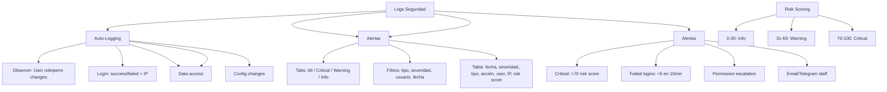

---
tags:
  - "kanban/done"
  - "type/task"
  - "domain/ADM"
  - "priority/P1"
parent: "[[desarrollo]]"
children: []
depends_on:
  - "[[ADM-006]]"
  - "[[FUN-005]]"
  - "[[FUN-006]]"
blocks:
  - "[[ADM-008]]"
status: "done"
assignee: "@dev"
created: "2026-08-04"
updated: "2026-08-05"
---

# [[ADM-007]] Logs Seguridad: Login Attempts, Permission Changes, Critical Actions (SIEM Lite)

## Descripción
Implementar panel de logs de seguridad en Admin: intentos de login, cambios de permisos, acciones críticas, alertas automáticas (SIEM Lite).

## Código de Ejemplo
```php
// app/Domains/Staff/Http/Controllers/Admin/SecurityLogController.php
namespace App\Domains\Staff\Http\Controllers\Admin;

use App\Models\SecurityLog;

class SecurityLogController extends Controller
{
    public function index()
    {
        $logs = \App\Models\SecurityLog::with(['user', 'subject'])
            ->when(request('type'), fn($q) => $q->where('type', request('type')))
            ->when(request('severity'), fn($q) => $q->where('severity', request('severity')))
            ->when(request('user_id'), fn($q) => $q->where('user_id', request('user_id')))
            ->when(request('date_from'), fn($q) => $q->whereDate('created_at', '>=', request('date_from')))
            ->when(request('date_to'), fn($q) => $q->whereDate('created_at', '<=', request('date_to')))
            ->latest()
            ->paginate(50);

        $types = \App\Models\SecurityLog::distinct('type')->pluck('type');
        $severities = ['info', 'warning', 'critical'];

        return view('domains.staff.admin.security-logs.index', compact('securityLogs', 'types', 'severities'));
    }

    public function show(\App\Models\SecurityLog $log)
    {
        $log->load(['user', 'subject']);
        return view('domains.staff.admin.security-logs.show', compact('log'));
    }

    public function export(SecurityLogExportRequest $request)
    {
        return \Maatwebsite\Excel\Facades\Excel::download(
            new \App\Exports\SecurityLogsExport($request->validated()),
            "security-logs-{$request->date_from}-to-{$request->date_to}.xlsx"
        );
    }
}
```

```php
// app/Models/SecurityLog.php
class SecurityLog extends Model
{
    protected $fillable = [
        'user_id', 'type', 'severity', 'action', 'description',
        'subject_type', 'subject_id', 'ip_address', 'user_agent',
        'metadata', 'risk_score',
    ];

    protected $casts = [
        'metadata' => 'array',
        'risk_score' => 'integer',
        'created_at' => 'datetime',
    ];

    public function user()
    {
        return $this->belongsTo(User::class);
    }

    public function subject()
    {
        return $this->morphTo();
    }

    public static function log(array $data): self
    {
        return self::create([
            'user_id' => $data['user_id'] ?? auth()->id(),
            'type' => $data['type'],
            'severity' => $data['severity'] ?? 'info',
            'action' => $data['action'],
            'description' => $data['description'],
            'subject_type' => $data['subject_type'] ?? null,
            'subject_id' => $data['subject_id'] ?? null,
            'ip_address' => request()->ip(),
            'user_agent' => request()->userAgent(),
            'metadata' => $data['metadata'] ?? [],
            'risk_score' => $data['risk_score'] ?? 0,
        ]);
    }

    // Tipos de eventos
    const TYPE_LOGIN = 'login';
    const TYPE_PERMISSION = 'permission_change';
    const TYPE_DATA_ACCESS = 'data_access';
    const TYPE_CONFIG_CHANGE = 'config_change';
    const TYPE_PAYMENT = 'payment';
    const TYPE_SECURITY = 'security_alert';
}
```

```php
// app/Observers/UserObserver.php (para auto-logging)
class UserObserver
{
    public function updated(User $user)
    {
        if ($user->isDirty('role') || $user->isDirty('permissions') || $user->isDirty('is_active')) {
            \App\Models\SecurityLog::log([
                'type' => \App\Models\SecurityLog::TYPE_PERMISSION,
                'severity' => 'warning',
                'action' => 'user_updated',
                'description' => "Usuario {$user->name} actualizado: " . implode(', ', $user->getDirty()),
                'subject_type' => User::class,
                'subject_id' => $user->id,
                'risk_score' => 50,
            ]);
        }
    }

    public function deleted(User $user)
    {
        \App\Models\SecurityLog::log([
            'type' => \App\Models\SecurityLog::TYPE_PERMISSION,
            'severity' => 'critical',
            'action' => 'user_deleted',
            'description' => "Usuario {$user->name} eliminado",
            'subject_type' => User::class,
            'subject_id' => $user->id,
            'risk_score' => 80,
        ]);
    }
}
```

```php
// app/Services/SecurityMonitor.php
class SecurityMonitor
{
    public function checkFailedLogins(string $ip): void
    {
        $failedCount = \App\Models\SecurityLog::where('type', \App\Models\SecurityLog::TYPE_LOGIN)
            ->where('action', 'login_failed')
            ->where('ip_address', $ip)
            ->where('created_at', '>=', now()->subMinutes(15))
            ->count();

        if ($failedCount >= 5) {
            $this->alertSecurityTeam("Múltiples intentos fallidos de login desde IP: {$ip} ({$failedCount} intentos)");
            
            \App\Models\SecurityLog::log([
                'type' => \App\Models\SecurityLog::TYPE_SECURITY,
                'severity' => 'critical',
                'action' => 'brute_force_detected',
                'description' => "Posible ataque de fuerza bruta desde IP {$ip}",
                'ip_address' => $ip,
                'risk_score' => 90,
            ]);
        }
    }

    public function checkPermissionEscalation(User $user): void
    {
        if ($user->wasChanged('role') && $user->role === 'admin') {
            \App\Models\SecurityLog::log([
                'type' => \App\Models\SecurityLog::TYPE_PERMISSION,
                'severity' => 'critical',
                'action' => 'role_escalated_to_admin',
                'description' => "Usuario {$user->name} elevado a admin por " . auth()->user()->name,
                'subject_type' => User::class,
                'subject_id' => $user->id,
                'risk_score' => 90,
            ]);
        }
    }

    public function checkSensitiveDataAccess(User $user, string $resource): void
    {
        \App\Models\SecurityLog::log([
            'type' => \App\Models\SecurityLog::TYPE_DATA_ACCESS,
            'severity' => 'info',
            'action' => 'sensitive_data_accessed',
            'description' => "Usuario {$user->name} accedió a {$resource}",
            'subject_type' => 'resource',
            'risk_score' => 30,
        ]);
    }
}
```

```blade
{{-- resources/views/domains/staff/admin/security-logs/index.blade.php --}}
@extends('layouts.admin')

@section('content')
<div class="container mx-auto px-4 py-8">
    <div class="mb-8">
        <h1 class="text-2xl font-bold text-text-primary">Logs de Seguridad</h1>
        <p class="text-text-secondary">Monitoreo de eventos de seguridad (SIEM Lite)</p>
    </div>

    {{-- Alertas Críticas --}}
    @if($criticalAlerts = \App\Models\SecurityLog::where('severity', 'critical')->where('created_at', '>=', now()->subHour())->count())
    <div class="mb-6 p-4 bg-error-50 dark:bg-error-900/30 border border-error-200 rounded-lg">
        <div class="flex items-center gap-3">
            <x-icon name="alert-triangle" class="w-6 h-6 text-error-600" />
            <div>
                <p class="font-semibold text-error-700">⚠️ {{ $criticalAlerts }} alertas críticas en la última hora</p>
                <p class="text-sm text-error-600">Revisar inmediatamente</p>
            </div>
        </div>
    @endif

    {{-- Filtros --}}
    <div class="card card--elevated p-4 mb-6">
        <form method="GET" class="flex flex-wrap gap-4 items-end">
            <div>
                <label class="label">Tipo</label>
                <select name="type" class="select">
                    <option value="">Todos</option>
                    @foreach(\App\Models\SecurityLog::distinct('type')->pluck('type') as $type)
                    <option value="{{ $type }}" {{ request('type') === $type ? 'selected' : '' }}>{{ ucfirst($type) }}</option>
                    @endforeach
                </select>
            </div>
            <div>
                <label class="label">Severidad</label>
                <select name="severity" class="select">
                    <option value="">Todas</option>
                    <option value="info" {{ request('severity') === 'info' ? 'selected' : '' }}>Info</option>
                    <option value="warning" {{ request('severity') === 'warning' ? 'selected' : '' }}>Warning</option>
                    <option value="critical" {{ request('severity') === 'critical' ? 'selected' : '' }}>Critical</option>
                </select>
            </div>
            <div>
                <label class="label">Usuario</label>
                <input type="text" name="user_id" class="input" placeholder="ID Usuario" value="{{ request('user_id') }}">
            </div>
            <div>
                <label class="label">Desde</label>
                <input type="date" name="date_from" class="input" value="{{ request('date_from') }}">
            </div>
            <div>
                <label class="label">Hasta</label>
                <input type="date" name="date_to" class="input" value="{{ request('date_to') }}">
            </div>
            <div class="flex gap-2">
                <button type="submit" class="btn btn--primary">Filtrar</button>
                <a href="{{ route('admin.security-logs.index') }}" class="btn btn--ghost">Limpiar</a>
                <a href="{{ route('admin.security-logs.export') }}?date_from={{ request('date_from') }}&date_to={{ request('date_to') }}" class="btn btn--ghost">
                    <x-icon name="download" class="w-4 h-4 mr-1" />
                    Exportar
                </a>
            </div>
        </form>
    </div>

    {{-- Tabla Logs --}}
    <div class="card card--elevated overflow-hidden">
        @if($securityLogs->isEmpty())
        <div class="p-12 text-center">
            <x-empty-state illustration="empty-logs" title="No hay logs de seguridad" />
        </div>
        @else
        <table class="w-full">
            <thead class="bg-bg-tertiary">
                <tr>
                    <th class="p-4 text-left text-sm font-semibold text-text-secondary">Fecha</th>
                    <th class="p-4 text-center text-sm font-semibold text-text-secondary">Severidad</th>
                    <th class="p-4 text-left text-sm font-semibold text-text-secondary">Tipo</th>
                    <th class="p-4 text-left text-sm font-semibold text-text-secondary">Acción</th>
                    <th class="p-4 text-left text-sm font-semibold text-text-secondary">Usuario</th>
                    <th class="p-4 text-center text-sm font-semibold text-text-secondary">IP</th>
                    <th class="p-4 text-center text-sm font-semibold text-text-secondary">Risk</th>
                    <th class="p-4 text-center text-sm font-semibold text-text-secondary">Acciones</th>
                </tr>
            </thead>
            <tbody class="divide-y divide-border-primary">
                @foreach($securityLogs as $log)
                <tr class="hover:bg-bg-tertiary {{ $log->severity === 'critical' ? 'bg-error-50/50 dark:bg-error-900/20' : '' }}">
                    <td class="p-4 text-sm text-text-secondary">{{ $log->created_at->format('d/m/Y H:i:s') }}</td>
                    <td class="p-4 text-center">
                        <span class="badge badge--{{ $log->severity }}">{{ ucfirst($log->severity) }}</span>
                    </td>
                    <td class="p-4 text-sm text-text-secondary">{{ ucfirst(str_replace('_', ' ', $log->type)) }}</td>
                    <td class="p-4 text-sm text-text-primary max-w-xs truncate">{{ $log->action }}</td>
                    <td class="p-4 text-sm">
                        @if($log->user)
                        <a href="{{ route('admin.users.show', $log->user) }}" class="text-accent-primary hover:underline">{{ $log->user->name }}</a>
                        @else
                        <span class="text-text-muted">Sistema</span>
                        @endif
                    </td>
                    <td class="p-4 text-center text-sm font-mono text-text-secondary">{{ $log->ip_address }}</td>
                    <td class="p-4 text-center">
                        <span class="inline-flex items-center gap-1 px-2 py-1 rounded-full text-xs font-medium
                            {{ $log->risk_score >= 70 ? 'bg-error-100 text-error-700' : ($log->risk_score >= 40 ? 'bg-warning-100 text-warning-700' : 'bg-info-100 text-info-700') }}">
                        <span class="w-2 h-2 rounded-full {{ $log->risk_score >= 70 ? 'bg-error-500' : ($log->risk_score >= 40 ? 'bg-warning-500' : 'bg-info-500') }}"></span>
                        {{ $log->risk_score }}
                    </span>
                    </td>
                    <td class="p-4 text-center">
                        <a href="{{ route('admin.security-logs.show', $log) }}" class="btn btn--ghost btn--sm">
                            <x-icon name="eye" class="w-4 h-4" />
                        </a>
                    </td>
                </tr>
                @endforeach
            </tbody>
        </table>
        <div class="p-4 border-t border-border-primary">
            {{ $securityLogs->links() }}
        </div>
        @endif
    </div>
</div>
@endsection
```

## Diagramas Mermaid


## Criterios de Aceptación
- [ ] Auto-logging: Observer User (role/perm/active), Login (success/failed), Permissions, Data access, Config changes
- [ ] Dashboard: tabla con fecha, severidad (badge), tipo, acción, usuario, IP, risk score (0-100)
- [ ] Filtros: tipo, severidad (info/warning/critical), usuario, fecha desde/hasta
- [ ] Risk scoring: 0-30 info, 31-69 warning, 70-100 critical
- [ ] Alertas automáticas: >5 login failed en 15min (IP), role escalation to admin, critical actions
- [ ] Alertas: email/Telegram a staff de seguridad, badge contador en header
- [ ] Detalle log: metadata JSON expandible, IP geolocation (opcional), user agent
- [ ] Exportación: Excel/CSV con filtros aplicados
- [ ] Retención: 90 días logs, 1 año critical logs
- [ ] Alertas en header: badge contador alertas críticas última hora

## Notas Técnicas
- SecurityLog model con morphTo subject (polymorphic)
- Risk score calculado automáticamente por tipo/acción
- Job diario: limpieza logs >90 días (excepto critical >1 año)
- Middleware para logging automático en rutas sensibles
- Geolocation IP opcional (MaxMind GeoIP)
- Alerting: queue job para notificaciones async

## Enlaces
- [[ADM-006]] Transacciones (logs pago)
- [[ADM-008]] Feature Flags (toggle logging)
- [[ADM-009]] Backup/Restore (logs backup)
- [[FUN-005]] Spatie Permission (role changes)
- [[FUN-006]] User Model (observer)