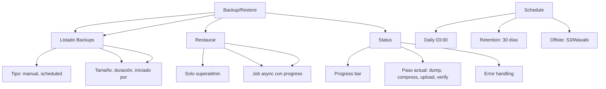

---
tags:
  - "kanban/done"
  - "type/task"
  - "domain/ADM"
  - "priority/P1"
parent: "[[desarrollo]]"
children: []
depends_on:
  - "[[ADM-008]]"
  - "[[ADM-007]]"
blocks:
  - "[[ADM-010]]"
status: "done"
assignee: "@dev"
created: "2026-08-04"
updated: "2026-08-05"
---

# [[ADM-009]] Backup/Restore: Trigger Manual, Ver Status, Download (Solo Superadmin)

## Descripción
Implementar sistema de backup/restore en Admin: trigger manual, ver estado, descargar backups, solo accesible para superadmin.

## Código de Ejemplo
```php
// app/Domains/Staff/Http/Controllers/Admin/BackupController.php
namespace App\Domains\Staff\Http\Controllers\Admin;

use Illuminate\Support\Facades\Storage;
use Illuminate\Support\Facades\Artisan;

class BackupController extends Controller
{
    public function __construct()
    {
        $this->middleware('role:superadmin');
    }

    public function index()
    {
        $backups = \App\Models\Backup::latest()->paginate(20);
        $lastBackup = \App\Models\Backup::latest()->first();
        
        $diskUsage = $this->getDiskUsage();
        $nextScheduled = $this->getNextScheduledBackup();
        
        return view('domains.staff.admin.backups.index', compact('backups', 'lastBackup', 'diskUsage', 'nextScheduled'));
    }

    public function create()
    {
        $backup = \App\Models\Backup::create([
            'type' => 'manual',
            'status' => 'pending',
            'started_at' => now(),
            'initiated_by' => auth()->id(),
        ]);

        // Dispatch job
        \App\Jobs\CreateBackup::dispatch($backup->id);

        return back()->with('success', 'Backup iniciado. Se procesará en background.');
    }

    public function download(\App\Models\Backup $backup)
    {
        if (!$backup->file_path || !Storage::disk('backups')->exists($backup->file_path)) {
            abort(404, 'Archivo de backup no encontrado');
        }

        return Storage::disk('backups')->download($backup->file_path, $backup->filename);
    }

    public function restore(\App\Models\Backup $backup)
    {
        $this->authorize('restore', $backup);
        
        if ($backup->status !== 'completed') {
            return back()->with('error', 'Solo backups completados pueden restaurarse');
        }

        // Crear job de restore
        \App\Models\Backup::create([
            'type' => 'restore',
            'status' => 'pending',
            'started_at' => now(),
            'initiated_by' => auth()->id(),
            'metadata' => ['source_backup_id' => $backup->id],
        ]);

        \App\Jobs\RestoreBackup::dispatch($backup->id);

        return back()->with('success', 'Restauración iniciada. Esto puede tardar varios minutos.');
    }

    public function status(\App\Models\Backup $backup)
    {
        return response()->json([
            'status' => $backup->status,
            'progress' => $backup->progress ?? 0,
            'current_step' => $backup->current_step ?? '',
            'error' => $backup->error_message,
        ]);
    }
}
```

```blade
{{-- resources/views/domains/staff/admin/backups/index.blade.php --}}
@extends('layouts.admin')

@section('content')
<div class="container mx-auto px-4 py-8">
    <div class="mb-8">
        <h1 class="text-2xl font-bold text-text-primary">Backup & Restore</h1>
        <p class="text-text-secondary">Gestión de backups de la plataforma (Solo Superadmin)</p>
    </div>

    {{-- Stats --}}
    <div class="grid grid-cols-1 md:grid-cols-4 gap-4 mb-8">
        <div class="card card--elevated p-6">
            <p class="text-sm text-text-secondary">Último Backup</p>
            <p class="text-2xl font-bold text-text-primary">{{ $lastBackup?->created_at->diffForHumans() ?? 'Nunca' }}</p>
        </div>
        <div class="card card--elevated p-6">
            <p class="text-sm text-text-secondary">Estado</p>
            <p class="text-2xl font-bold {{ $lastBackup?->status === 'completed' ? 'text-success' : 'text-warning' }}">
                {{ $lastBackup?->status ?? 'N/A' }}
            </p>
        </div>
        <div class="card card--elevated p-6">
            <p class="text-sm text-text-secondary">Tamaño Último</p>
            <p class="text-2xl font-bold text-text-primary">{{ $lastBackup?->file_size ? number_format($lastBackup->file_size / 1024 / 1024, 1) . ' MB' : '—' }}</p>
        </div>
        <div class="card card--elevated p-6">
            <p class="text-sm text-text-secondary">Próximo Programado</p>
            <p class="text-2xl font-bold text-text-primary">{{ $nextScheduled ?? 'No configurado' }}</p>
        </div>
    </div>

    {{-- Acciones --}}
    <div class="card card--elevated p-6 mb-8">
        <h2 class="text-xl font-semibold mb-4">Acciones</h2>
        <div class="flex flex-wrap gap-4">
            <form action="{{ route('admin.backups.create') }}" method="POST" class="inline">
                @csrf
                <button type="submit" class="btn btn--primary">
                    <x-icon name="database" class="w-4 h-4 mr-2" />
                    Crear Backup Manual
                </button>
            </form>
            <button onclick="checkBackupStatus()" class="btn btn--ghost">
                <x-icon name="refresh-cw" class="w-4 h-4 mr-2" />
                Actualizar Estado
            </button>
        </div>
    </div>

    {{-- Lista Backups --}}
    <div class="card card--elevated overflow-hidden">
        @if($backups->isEmpty())
        <div class="p-12 text-center">
            <x-empty-state illustration="empty-backups" title="No hay backups" />
        </div>
        @else
        <table class="w-full">
            <thead class="bg-bg-tertiary">
                <tr>
                    <th class="p-4 text-left text-sm font-semibold text-text-secondary">Fecha</th>
                    <th class="p-4 text-center text-sm font-semibold text-text-secondary">Tipo</th>
                    <th class="p-4 text-center text-sm font-semibold text-text-secondary">Estado</th>
                    <th class="p-4 text-right text-sm font-semibold text-text-secondary">Tamaño</th>
                    <th class="p-4 text-center text-sm font-semibold text-text-secondary">Duración</th>
                    <th class="p-4 text-center text-sm font-semibold text-text-secondary">Iniciado por</th>
                    <th class="p-4 text-center text-sm font-semibold text-text-secondary">Acciones</th>
                </tr>
            </thead>
            <tbody class="divide-y divide-border-primary">
                @foreach($backups as $backup)
                <tr class="hover:bg-bg-tertiary">
                    <td class="p-4 text-sm text-text-secondary">{{ $backup->created_at->format('d/m/Y H:i') }}</td>
                    <td class="p-4 text-center">
                        <span class="badge badge--{{ $backup->type === 'manual' ? 'info' : 'default' }}">{{ ucfirst($backup->type) }}</span>
                    </td>
                    <td class="p-4 text-center">
                        <span class="badge badge--{{ match($backup->status) 'completed' => 'success', 'failed' => 'error', 'pending' => 'warning', 'running' => 'info' }}">{{ ucfirst($backup->status) }}</span>
                    </td>
                    <td class="p-4 text-right text-sm text-text-secondary">{{ $backup->file_size ? number_format($backup->file_size / 1024 / 1024, 1) . ' MB' : '—' }}</td>
                    <td class="p-4 text-center text-sm text-text-secondary">{{ $backup->duration ? $backup->duration . 's' : '—' }}</td>
                    <td class="p-4 text-center text-sm text-text-secondary">{{ $backup->initiator->name ?? 'Sistema' }}</td>
                    <td class="p-4 text-center space-x-2">
                        @if($backup->status === 'completed' && $backup->file_path)
                        <a href="{{ route('admin.backups.download', $backup) }}" class="btn btn--ghost btn--sm" title="Descargar">
                            <x-icon name="download" class="w-4 h-4" />
                        </a>
                        @endif
                        @if($backup->type === 'backup' && $backup->status === 'completed')
                        <form action="{{ route('admin.backups.restore', $backup) }}" method="POST" class="inline" onsubmit="return confirm('¿Restaurar este backup? SOLO SUPERADMIN.')">
                            @csrf
                            <button type="submit" class="btn btn--ghost btn--sm text-warning" title="Restaurar">
                                <x-icon name="rotate-ccw" class="w-4 h-4" />
                            </button>
                        </form>
                        @endif
                        <a href="{{ route('admin.backups.status', $backup) }}" class="btn btn--ghost btn--sm" title="Estado">
                            <x-icon name="info" class="w-4 h-4" />
                        </a>
                    </td>
                </tr>
                @endforeach
            </tbody>
        </table>
        <div class="p-4 border-t border-border-primary">
            {{ $backups->links() }}
        </div>
        @endif
    </div>
</div>
@endsection
```

## Diagramas Mermaid


## Criterios de Aceptación
- [ ] Solo superadmin puede acceder (middleware role:superadmin)
- [ ] Botón "Crear Backup Manual" dispara job async
- [ ] Lista: tipo (manual/scheduled), estado (pending/running/completed/failed), tamaño, duración, iniciador
- [ ] Descargar: solo backups completed, stream download
- [   ] Restaurar: confirmación doble, solo superadmin, job async con progreso
- [ ] Status API: progress %, paso actual (dump, compress, upload, verify), error si falla
- [ ] Solo superadmin: middleware `role:superadmin`
- [ ] Limpieza automática: retención 30 días, max 50 backups
- [ ] Notificaciones: email/Telegram al completar/fallar

## Notas Técnicas
- Job `CreateBackup`: dump DB (mysqldump/pg_dump), compress (gzip), upload (S3/local), verify checksum
- Job `RestoreBackup`: download, verify checksum, decompress, restore DB, run migrations
- Progress: guardado en BD cada paso, consultable via AJAX
- Storage: disco `backups` (local o S3), lifecycle policy 30 días
- Superadmin: gate `isSuperAdmin()` en User model
- Offsite: configurable S3/Wasabi/Backblaze B2

## Enlaces
- [[ADM-007]] Logs Seguridad (backup logs)
- [[ADM-010]] Config Fiscal (backup config)
- [[ADM-012]] Reportes Fiscales (backup reports)