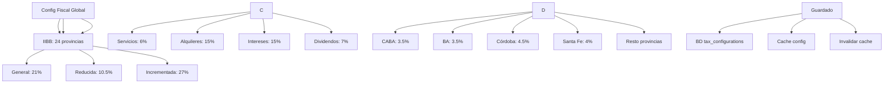

---
tags:
  - "kanban/done"
  - "type/task"
  - "domain/ADM"
  - "priority/P1"
parent: "[[desarrollo]]"
children: []
depends_on:
  - "[[ADM-009]]"
  - "[[FUN-001]]"
  - "[[FUN-005]]"
blocks:
  - "[[ADM-011]]"
  - "[[ADM-012]]"
  - "[[ADM-013]]"
status: "done"
assignee: "@dev"
created: "2026-08-04"
updated: "2026-08-05"
---

# [[ADM-010]] Configuración Fiscal Global: IVA 21%/10.5%/27%, Ganancias, IIBB por Provincia, Retenciones

## Descripción
Implementar panel de configuración fiscal global en Admin: alícuotas IVA (21%/10.5%/27%), Ganancias, IIBB por provincia, configuración de retenciones automáticas.

## Código de Ejemplo
```php
// app/Domains/Staff/Http/Controllers/Admin/TaxConfigurationController.php
namespace App\Domains\Staff\Http\Controllers\Admin;

use App\Services\ArgentineTaxService;

class TaxConfigurationController extends Controller
{
    public function __construct(protected ArgentineTaxService $taxService) {}

    public function index()
    {
        return view('domains.staff.admin.tax-config.index', [
            'vatRates' => config('tax.vat_rates', ArgentineTaxService::VAT_RATES),
            'gananciasRates' => config('tax.ganancias_rates', ArgentineTaxService::GANANCIAS_WITHHOLDINGS),
            'iibbRates' => config('tax.iibb_rates', ArgentineTaxService::IIBB_RATES),
            'provinces' => ArgentineTaxService::PROVINCES,
        ]);
    }

    public function updateVat(TaxConfigRequest $request)
    {
        $rates = $request->validated();
        foreach ($rates as $key => $value) {
            config(["tax.vat_rates.{$key}" => $value]);
        }
        $this->saveTaxConfig('vat_rates', $rates);
        return back()->with('success', 'Alícuotas IVA actualizadas');
    }

    public function updateGanancias(TaxConfigRequest $request)
    {
        $rates = $request->validated();
        foreach ($rates as $key => $value) {
            config(["tax.ganancias_rates.{$key}" => $value]);
        }
        $this->saveTaxConfig('ganancias_rates', $rates);
        return back()->with('success', 'Retenciones Ganancias actualizadas');
    }

    public function updateIibb(TaxConfigRequest $request)
    {
        $rates = $request->validated();
        foreach ($rates as $province => $rate) {
            config(["tax.iibb_rates.{$province}" => $rate]);
        }
        $this->saveTaxConfig('iibb_rates', $rates);
        return back()->with('success', 'IIBB por provincia actualizado');
    }

    private function saveTaxConfig(string $key, array $value): void
    {
        \App\Models\TaxConfiguration::updateOrCreate(
            ['key' => $key],
            ['value' => json_encode($value)]
        );
    }
}
```

```blade
{{-- resources/views/domains/staff/admin/tax-config/index.blade.php --}}
@extends('layouts.admin')

@section('content')
<div class="container mx-auto px-4 py-8">
    <div class="mb-8">
        <h1 class="text-2xl font-bold text-text-primary">Configuración Fiscal Global</h1>
        <p class="text-text-secondary">Alícuotas y retenciones para facturación Argentina (AFIP/ARCA)</p>
    </div>

    <form action="{{ route('admin.tax-config.update-vat') }}" method="POST" class="space-y-8">
        @csrf
        @method('PUT')

        {{-- IVA --}}
        <div class="card card--elevated p-6">
            <h2 class="text-xl font-semibold mb-4">Alícuotas IVA</h2>
            <div class="grid md:grid-cols-3 gap-4">
                @foreach(['general' => 'General (21%)', 'reduced' => 'Reducida (10.5%)', 'increased' => 'Incrementada (27%)'] as $key => $label)
                <div>
                    <label class="label">{{ $label }}</label>
                    <div class="flex items-center gap-2">
                        <input type="number" name="vat_rates[{{ $key }}]" class="input" 
                               value="{{ config("tax.vat_rates.{$key}", 0.21) * 100 }}" 
                               step="0.01" min="0" max="100" required>
                        <span class="text-text-muted">%</span>
                    </div>
                </div>
                @endforeach
            </div>
            <p class="text-sm text-text-muted mt-2">IVA General: servicios digitales, streaming. Reducida: alimentos, medicamentos. Incrementada: servicios financieros.</p>
        </div>

        {{-- Retenciones Ganancias --}}
        <div class="card card--elevated p-6">
            <h2 class="text-xl font-semibold mb-4">Retenciones Impuesto a las Ganancias (RG 830/2023)</h2>
            <div class="grid md:grid-cols-2 lg:grid-cols-4 gap-4">
                @foreach(['services' => 'Servicios (6%)', 'rent' => 'Alquileres (15%)', 'interest' => 'Intereses (15%)', 'dividends' => 'Dividendos (7%)'] as $key => $label)
                <div>
                    <label class="label">{{ $label }}</label>
                    <div class="flex items-center gap-2">
                        <input type="number" name="ganancias_rates[{{ $key }}]" class="input" 
                               value="{{ config("tax.ganancias_rates.{$key}", 0.06) * 100 }}" 
                               step="0.01" min="0" max="100" required>
                        <span class="text-text-muted">%</span>
                    </div>
                </div>
                @endforeach
            </div>
            <p class="text-sm text-text-muted mt-2">Basado en RG 830/2023. Aplicable a Responsables Inscriptos.</p>
        </div>

        {{-- IIBB por Provincia --}}
        <div class="card card--elevated p-6">
            <h2 class="text-xl font-semibold mb-4">IIBB por Provincia</h2>
            <p class="text-text-secondary mb-4">Alícuotas Ingresos Brutos por jurisdicción. CABA/BA: 3.5%, Córdoba: 4.5%, etc.</<p>
            
            <div class="overflow-x-auto">
                <table class="w-full">
                    <thead class="bg-bg-tertiary">
                        <tr>
                            <th class="p-4 text-left text-sm font-semibold text-text-secondary">Provincia</th>
                            <th class="p-4 text-right text-sm font-semibold text-text-secondary">Alícuota (%)</th>
                        </tr>
                    </thead>
                    <tbody class="divide-y divide-border-primary">
                        @foreach($provinces as $code => $name)
                        <tr class="hover:bg-bg-tertiary">
                            <td class="p-4 text-sm text-text-primary">{{ $name }} ({{ $code }})</td>
                            <td class="p-4 text-right">
                                <input type="number" name="iibb_rates[{{ $code }}]" class="input w-24 text-right" 
                                       value="{{ config("tax.iibb_rates.{$code}", 0.035) * 100 }}" 
                                       step="0.01" min="0" max="10">
                            </td>
                        </tr>
                        @endforeach
                    </tbody>
                </table>
            </div>
        </div>

        <div class="flex justify-end">
            <button type="submit" class="btn btn--primary">Guardar Configuración Fiscal</button>
        </div>
    </form>
</div>
@endsection
```

## Diagramas Mermaid


## Criterios de Aceptación
- [ ] IVA: 3 alícuotas editables (General 21%, Reducida 10.5%, Incrementada 27%)
- [ ] Ganancias: 4 conceptos editables (Servicios 6%, Alquileres 15%, Intereses 15%, Dividendos 7%)
- [ ] IIBB: 24 provincias editables (CABA 3.5%, BA 3.5%, Córdoba 4.5%, Santa Fe 4%, etc.)
- [ ] Validación: porcentajes 0-100%, step 0.01
- [ ] Guardado en BD (tax_configurations) + cache
- [ ] Ayuda contextual: qué servicios aplican a cada alícuota
- [ ] Documentado en `docu/especificaciones/admin-tax-config.md`

## Notas Técnicas
- Guardar en tabla `tax_configurations` (key, value JSON)
- Cache con `Cache::tags(['tax-config'])->forever()`
- Invalidar cache al actualizar
- Usar en `ArgentineTaxService` vía `config('tax.vat_rates')`
- RG 830/2023 para Ganancias (vigente desde 2023)

## Enlaces
- [[ADM-011]] Compliance AFIP
- [[ADM-012]] Reportes fiscales
- [[ADM-013]] Retenciones config
- [[CRE-015]] Config fiscal creador
- [[CRE-016]] Ciclos cobro (retenciones)
- [[CRE-013]] Facturación creador
- [[CRM-011]] Gestión fiscal clientes
- [[CRM-012]] Facturación CRM
- [[PUB-019]] Legislación argentina