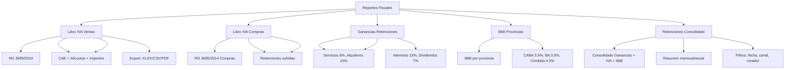

---
tags:
  - "kanban/done"
  - "type/task"
  - "domain/ADM"
  - "priority/P0"
parent: "[[desarrollo]]"
children: []
depends_on:
  - "[[ADM-010]]"
  - "[[ADM-011]]"
  - "[[CRE-013]]"
  - "[[CRM-012]]"
  - "[[PUB-017]]"
blocks: []
status: "done"
assignee: "@dev"
created: "2026-08-04"
updated: "2026-08-05"
---

# [[ADM-012]] Reportes Fiscales: Libro IVA Ventas/Compras, Ganancias, IIBB, Retenciones

## Descripción
Implementar generación de reportes fiscales obligatorios en Admin: Libro IVA Ventas/Compras (RG 3685/2014), Ganancias, IIBB por provincia, Retenciones, exportación CSV/Excel/PDF.

## Código de Ejemplo
```php
// app/Domains/Staff/Http/Controllers/Admin/FiscalReportsController.php
namespace App\Domains\Staff\Http\Controllers\Admin;

use App\Models\{Invoice, Payment, Payout, User};
use App\Services\ArgentineTaxService;
use Maatwebsite\Excel\Facades\Excel;

class FiscalReportsController extends Controller
{
    public function index()
    {
        return view('domains.staff.admin.fiscal-reports.index');
    }

    public function generateLibroIvaVentas(FiscalReportRequest $request)
    {
        $from = $request->date_from;
        $to = $request->date_to;

        $invoices = Invoice::where('status', 'authorized')
            ->whereBetween('created_at', [$from, $to])
            ->with(['channel', 'receiver'])
            ->get();

        $rows = $invoices->map(function ($invoice) {
            $taxService = app(ArgentineTaxService::class);
            $vat = $taxService->calculateVAT($invoice->total_gravado, 'general');
            
            return [
                'fecha' => $invoice->created_at->format('d/m/Y'),
                'tipo_comprobante' => $invoice->type,
                'punto_venta' => $invoice->point_of_sale,
                'numero' => str_pad($invoice->number, 8, '0', STR_PAD_LEFT),
                'fecha_emision' => $invoice->created_at->format('d/m/Y'),
                'tipo_doc_receptor' => $this->getDocTypeCode($invoice->receiver->taxpayer_type),
                'nro_doc_receptor' => $invoice->receiver->cuit_cuil ?? '0',
                'denominacion_receptor' => $invoice->receiver->name,
                'gravado' => number_format($invoice->total_gravado, 2, ',', '.'),
                'iva_21' => number_format($vat, 2, ',', '.'),
                'iva_105' => '0,00',
                'iva_27' => '0,00',
                'total' => number_format($invoice->total, 2, ',', '.'),
                'cae' => $invoice->cai,
                'fecha_vto_cae' => $invoice->cae_due_date->format('d/m/Y'),
            ];
        });

        return Excel::download(new \App\Exports\LibroIvaVentasExport($rows), "libro_iva_ventas_{$request->date_from}_to_{$request->date_to}.xlsx");
    }

    public function generateLibroIvaCompras(FiscalReportRequest $request)
    {
        // Similar para libro IVA compras (facturas recibidas de proveedores)
        // En TG-PayGate: pagos a proveedores, comisiones pasarelas, etc.
    }

    public function generateGananciasReport(FiscalReportRequest $request)
    {
        // Retenciones Ganancias por concepto
        $withholdings = Invoice::where('status', 'authorized')
            ->whereBetween('created_at', [$request->date_from, $request->date_to])
            ->where('ganancias_withholding', '>', 0)
            ->get();

        $rows = $withholdings->map(function ($inv) {
            return [
                'fecha' => $inv->created_at->format('d/m/Y'),
                'tipo_comprobante' => $inv->type,
                'punto_venta' => $inv->point_of_sale,
                'numero' => $inv->number,
                'cuit_receptor' => $inv->receiver->cuit_cuil,
                'denominacion' => $inv->receiver->name,
                'importe_sujeto' => number_format($inv->total_gravado, 2, ',', '.'),
                'alicuota' => '6,00',
                'retencion' => number_format($inv->ganancias_withholding, 2, ',', '.'),
            ];
        });

        return Excel::download(new \App\Exports\GananciasWithholdingsExport($rows), "ganancias_retenciones_{$request->date_from}_to_{$request->date_to}.xlsx");
    }

    public function generateIibbReport(FiscalReportRequest $request)
    {
        // IIBB por provincia
    }

    public function generateRetentionsReport(FiscalReportRequest $request)
    {
        // Consolidado retenciones: Ganancias, IVA, IIBB
    }

    private function getDocTypeCode(string $type): string
    {
        return match($type) {
            'responsable_inscripto' => '80',
            'monotributo' => '96',
            'exento' => '97',
            'consumidor_final' => '99',
            default => '99',
        };
    }
}
```

```blade
{{-- resources/views/domains/staff/admin/fiscal-reports/index.blade.php --}}
@extends('layouts.admin')

@section('content')
<div class="container mx-auto px-4 py-8">
    <div class="mb-8">
        <h1 class="text-2xl font-bold text-text-primary">Reportes Fiscales</h1>
        <p class="text-text-secondary">Generación de libros y reportes obligatorios AFIP/ARCA</p>
    </div>

    <div class="grid gap-6">
        {{-- Libro IVA Ventas --}}
        <div class="card card--elevated p-6">
            <h2 class="text-xl font-semibold mb-4">Libro IVA Ventas (RG 3685/2014)</h2>
            <p class="text-text-secondary mb-4">Registro de facturas emitidas (Factura A/B/E) con CAE, alícuotas IVA, importes.</p>
            
            <form action="{{ route('admin.fiscal-reports.libro-iva-ventas') }}" method="POST" class="flex flex-wrap gap-4 items-end">
                @csrf
                <div>
                    <label class="label">Desde</label>
                    <input type="date" name="date_from" class="input" value="{{ now()->startOfMonth()->format('Y-m-d') }}" required>
                </div>
                <div>
                    <label class="label">Hasta</label>
                    <input type="date" name="date_to" class="input" value="{{ now()->format('Y-m-d') }}" required>
                </div>
                <div>
                    <label class="label">Formato</label>
                    <select name="format" class="select">
                        <option value="xlsx">Excel (.xlsx)</option>
                        <option value="csv">CSV</option>
                        <option value="pdf">PDF</option>
                    </select>
                </div>
                <button type="submit" class="btn btn--primary">Generar Libro IVA Ventas</button>
            </form>
        </div>

        {{-- Libro IVA Compras --}}
        <div class="card card--elevated p-6">
            <h2 class="text-xl font-semibold mb-4">Libro IVA Compras (RG 3685/2014)</h2>
            <p class="text-text-secondary mb-4">Registro de facturas recibidas (proveedores, comisiones pasarelas, servicios).</p>
            
            <form action="{{ route('admin.fiscal-reports.libro-iva-compras') }}" method="POST" class="flex flex-wrap gap-4 items-end">
                @csrf
                <div>
                    <label class="label">Desde</label>
                    <input type="date" name="date_from" class="input" value="{{ now()->startOfMonth()->format('Y-m-d') }}" required>
                </div>
                <div>
                    <label class="label">Hasta</label>
                    <input type="date" name="date_to" class="input" value="{{ now()->format('Y-m-d') }}" required>
                </div>
                <div>
                    <label class="label">Formato</label>
                    <select name="format" class="select">
                        <option value="xlsx">Excel (.xlsx)</option>
                        <option value="csv">CSV</option>
                    </select>
                </div>
                <button type="submit" class="btn btn--primary">Generar Libro IVA Compras</button>
            </form>
        </div>

        {{-- Retenciones Ganancias --}}
        <div class="card card--elevated p-6">
            <h2 class="text-xl font-semibold mb-4">Retenciones Ganancias (RG 830/2023)</h2>
            <p class="text-text-secondary mb-4">Detalle retenciones por concepto: servicios 6%, alquileres 15%, intereses 15%, dividendos 7%.</p>
            
            <form action="{{ route('admin.fiscal-reports.ganancias') }}" method="POST" class="flex flex-wrap gap-4 items-end">
                @csrf
                <div>
                    <label class="label">Desde</label>
                    <input type="date" name="date_from" class="input" value="{{ now()->startOfMonth()->format('Y-m-d') }}" required>
                </div>
                <div>
                    <label class="label">Hasta</label>
                    <input type="date" name="date_to" class="input" value="{{ now()->format('Y-m-d') }}" required>
                </div>
                <div>
                    <label class="label">Formato</label>
                    <select name="format" class="select">
                        <option value="xlsx">Excel (.xlsx)</option>
                        <option value="csv">CSV</option>
                    </select>
                </div>
                <button type="submit" class="btn btn--primary">Generar Reporte Ganancias</button>
            </form>
        </div>

        {{-- IIBB por Provincia --}}
        <div class="card card--elevated p-6">
            <h2 class="text-xl font-semibold mb-4">IIBB por Provincia</h2>
            <p class="text-text-secondary mb-4">Ingresos Brutos por jurisdicción: CABA 3.5%, BA 3.5%, Córdoba 4.5%, etc.</<p>
            
            <form action="{{ route('admin.fiscal-reports.iibb') }}" method="POST" class="flex flex-wrap gap-4 items-end">
                @csrf
                <div>
                    <label class="label">Desde</label>
                    <input type="date" name="date_from" class="input" value="{{ now()->startOfMonth()->format('Y-m-d') }}" required>
                </div>
                <div>
                    <label class="label">Hasta</label>
                    <input type="date" name="date_to" class="input" value="{{ now()->format('Y-m-d') }}" required>
                </div>
                <div>
                    <label class="label">Formato</label>
                    <select name="format" class="select">
                        <option value="xlsx">Excel (.xlsx)</option>
                        <option value="csv">CSV</option>
                    </select>
                </div>
                <button type="submit" class="btn btn--primary">Generar Reporte IIBB</button>
            </form>
        </div>

        {{-- Retenciones Consolidadas --}}
        <div class="card card--elevated p-6">
            <h2 class="text-xl font-semibold mb-4">Retenciones Consolidadas</h2>
            <p class="text-text-secondary mb-4">Consolidado: Ganancias, IVA (100%/50%), IIBB por provincia.</p>
            
            <form action="{{ route('admin.fiscal-reports.retentions') }}" method="POST" class="flex flex-wrap gap-4 items-end">
                @csrf
                <div>
                    <label class="label">Desde</label>
                    <input type="date" name="date_from" class="input" value="{{ now()->startOfMonth()->format('Y-m-d') }}" required>
                </div>
                <div>
                    <label class="label">Hasta</label>
                    <input type="date" name="date_to" class="input" value="{{ now()->format('Y-m-d') }}" required>
                </div>
                <div>
                    <label class="label">Formato</label>
                    <select name="format" class="select">
                        <option value="xlsx">Excel (.xlsx)</option>
                        <option value="csv">CSV</option>
                        <option value="pdf">PDF</option>
                    </select>
                </div>
                <button type="submit" class="btn btn--primary">Generar Consolidado Retenciones</button>
            </form>
        </div>
    </div>
</div>
@endsection
```

## Diagramas Mermaid


## Criterios de Aceptación
- [ ] Libro IVA Ventas (RG 3685/2014): fecha, tipo, punto venta, número, CAE, gravado, IVA 21%/10.5%/27%, total
- [ ] Libro IVA Compras (RG 3685/2014): facturas proveedores, comisiones pasarelas, retenciones sufridas
- [ ] Retenciones Ganancias (RG 830/2023): servicios 6%, alquileres 15%, intereses 15%, dividendos 7%
- [ ] IIBB por provincia: alícuotas configurables (CABA 3.5%, BA 3.5%, Córdoba 4.5%, etc.)
- [ ] Retenciones Consolidado: Ganancias + IVA (100% RI / 50% Mono) + IIBB por provincia
- [ ] Exportación: Excel (.xlsx), CSV, PDF
- [ ] Filtros: fecha desde/hasta, canal, creador, tipo factura
- [ ] Validación RG 3685/2014: formato exacto columnas, separador decimal coma
- [ ] Testing: comparación con AFIP, conciliación mensual

## Notas Técnicas
- Export: Maatwebsite\Excel (Laravel Excel 3.x)
- Formato RG 3685: columnas exactas, separador decimal coma, fecha dd/mm/yyyy
- Separador decimal: coma (estándar Argentina)
- Encoding: UTF-8 BOM para Excel
- Filtros: date_from, date_to, channel_id, creator_id, invoice_type
- Libro IVA Ventas: solo facturas `authorized` con CAE
- Libro IVA Compras: facturas proveedores + comisiones pasarelas + retenciones

## Enlaces
- [[ADM-010]] Config fiscal global (alícuotas)
- [[ADM-011]] Compliance AFIP (CAE)
- [[ADM-013]] Retenciones config
- [[CRE-013]] Facturación creador
- [[CRE-016]] Ciclos cobro (retenciones)
- [[CRM-012]] Facturación CRM
- [[PUB-017]] Facturación clientes
- [[PUB-019]] Legislación argentina