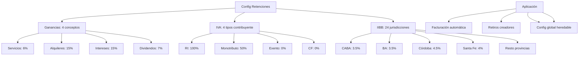

---
tags:
  - "kanban/done"
  - "type/task"
  - "domain/ADM"
  - "priority/P0"
parent: "[[desarrollo]]"
children: []
depends_on:
  - "[[ADM-010]]"
  - "[[PUB-019]]"
  - "[[CRE-015]]"
  - "[[CRM-011]]"
blocks:
  - "[[ADM-012]]"
status: "done"
assignee: "@dev"
created: "2026-08-04"
updated: "2026-08-05"
---

# [[ADM-013]] Configuración Retenciones: Ganancias, IVA, IIBB por Jurisdicción, Alícuotas

## Descripción
Implementar panel de configuración de retenciones globales en Admin: alícuotas de retención Ganancias (servicios, alquileres, intereses, dividendos), IVA (100% RI / 50% Monotributo), IIBB por jurisdicción.

## Código de Ejemplo
```php
// app/Domains/Staff/Http/Controllers/Admin/RetentionConfigController.php
namespace App\Domains\Staff\Http\Controllers\Admin;

use App\Services\ArgentineTaxService;

class RetentionConfigController extends Controller
{
    public function __construct(protected ArgentineTaxService $taxService) {}

    public function index()
    {
        return view('domains.staff.admin.retention-config.index', [
            'ganancias' => config('tax.ganancias_withholding', ArgentineTaxService::GANANCIAS_WITHHOLDINGS),
            'iva' => config('tax.iva_withholding', [
                'responsable_inscripto' => 1.0,    // 100%
                'monotributo' => 0.5,              // 50%
                'exento' => 0.0,
                'consumidor_final' => 0.0,
            ]),
            'iibb' => config('tax.iibb_withholding', ArgentineTaxService::IIBB_RATES),
            'provinces' => ArgentineTaxService::PROVINCES,
        );
    }

    public function updateGanancias(RetentionConfigRequest $request)
    {
        $rates = $request->validated();
        foreach ($rates as $key => $value) {
            config(["tax.ganancias_withholding.{$key}" => $value]);
        }
        $this->saveRetentionConfig('ganancias_withholding', $rates);
        return back()->with('success', 'Retenciones Ganancias actualizadas');
    }

    public function updateIva(RetentionConfigRequest $request)
    {
        $rates = $request->validated();
        foreach ($rates as $key => $value) {
            config(["tax.iva_withholding.{$key}" => $value]);
        }
        $this->saveRetentionConfig('iva_withholding', $rates);
        return back()->with('success', 'Retenciones IVA actualizadas');
    }

    public function updateIibb(RetentionConfigRequest $request)
    {
        $rates = $request->validated();
        foreach ($rates as $province => $rate) {
            config(["tax.iibb_withholding.{$province}" => $rate]);
        }
        $this->saveRetentionConfig('iibb_withholding', $rates);
        return back()->with('success', 'Retenciones IIBB actualizadas');
    }

    private function saveRetentionConfig(string $key, array $value): void
    {
        \App\Models\RetentionConfiguration::updateOrCreate(
            ['key' => $key],
            ['value' => json_encode($value)]
        );
    }
}
```

```blade
{{-- resources/views/domains/staff/admin/retention-config/index.blade.php --}}
@extends('layouts.admin')

@section('content')
<div class="container mx-auto px-4 py-8">
    <div class="mb-8">
        <h1 class="text-2xl font-bold text-text-primary">Configuración de Retenciones</h1>
        <p class="text-text-secondary">Alícuotas de retención automáticas para facturación y retiros creadores</p>
    </div>

    <form action="{{ route('admin.retention-config.update-ganancias') }}" method="POST" class="space-y-8">
        @csrf
        @method('PUT')

        {{-- Retenciones Ganancias --}}
        <div class="card card--elevated p-6">
            <h2 class="text-xl font-semibold mb-4">Retenciones Ganancias (RG 830/2023)</h2>
            <p class="text-text-secondary mb-4">Alícuotas aplicables a Responsables Inscriptos. Basado en RG 830/2023.</p>
            
            <div class="grid md:grid-cols-2 lg:grid-cols-4 gap-4">
                @foreach(['services' => 'Servicios Profesionales (6%)', 'rent' => 'Alquileres (15%)', 'interest' => 'Intereses (15%)', 'dividends' => 'Dividendos (7%)'] as $key => $label)
                <div>
                    <label class="label">{{ $label }}</label>
                    <div class="flex items-center gap-2">
                        <input type="number" name="ganancias[{{ $key }}]" class="input" 
                               value="{{ config("tax.ganancias_withholding.{$key}", 0.06) * 100 }}" 
                               step="0.01" min="0" max="50" required>
                        <span class="text-text-muted">%</span>
                    </div>
                </div>
                @endforeach
            </div>
            <p class="text-sm text-text-muted mt-2">Aplicable a Responsables Inscriptos. Exentos: Monotributo, Exentos, Consumidor Final.</p>
        </div>

        {{-- Retenciones IVA --}}
        <div class="card card--elevated p-6">
            <h2 class="text-xl font-semibold mb-4">Retenciones IVA</h2>
            <p class="text-text-secondary mb-4">Porcentaje de IVA a retener según tipo de contribuyente receptor.</p>
            
            <div class="grid md:grid-cols-4 gap-4">
                @foreach([
                    'responsable_inscripto' => 'Responsable Inscripto (100%)',
                    'monotributo' => 'Monotributo (50%)',
                    'exento' => 'Exento (0%)',
                    'consumidor_final' => 'Consumidor Final (0%)'
                ] as $key => $label)
                <div>
                    <label class="label">{{ $label }}</label>
                    <div class="flex items-center gap-2">
                        <input type="number" name="iva[{{ $key }}]" class="input" 
                               value="{{ config("tax.iva_withholding.{$key}", ($key === 'responsable_inscripto' ? 1.0 : ($key === 'monotributo' ? 0.5 : 0.0))) * 100 }}" 
                               step="0.1" min="0" max="100" required>
                    <span class="text-text-muted">%</span>
                </div>
                @endforeach
            </div>
            <p class="text-sm text-text-muted mt-2">RI retiene 100% IVA facturado. Monotributo retiene 50%. Exento/CF no retiene IVA.</p>
        </div>

        {{-- Retenciones IIBB --}}
        <div class="card card--elevated p-6">
            <h2 class="text-xl font-semibold mb-4">Retenciones IIBB por Jurisdicción</h2>
            <p class="text-text-secondary mb-4">Alícuotas Ingresos Brutos por provincia. Aplicable según domicilio fiscal del receptor.</p>
            
            <div class="overflow-x-auto">
                <table class="w-full">
                    <thead class="bg-bg-tertiary">
                        <tr>
                            <th class="p-4 text-left text-sm font-semibold text-text-secondary">Jurisdicción</th>
                            <th class="p-4 text-right text-sm font-semibold text-text-secondary">Alícuota (%)</th>
                        </tr>
                    </thead>
                    <tbody class="divide-y divide-border-primary">
                        @foreach($provinces as $code => $name)
                        <tr class="hover:bg-bg-tertiary">
                            <td class="p-4 text-sm text-text-primary">{{ $name }} ({{ $code }})</td>
                            <td class="p-4 text-right">
                                <input type="number" name="iibb[{{ $code }}]" class="input w-24 text-right" 
                                       value="{{ config("tax.iibb_withholding.{$code}", 0.035) * 100 }}" 
                                       step="0.01" min="0" max="10">
                            </td>
                        </tr>
                        @endforeach
                    </tbody>
                </table>
            </div>
            <p class="text-sm text-text-muted mt-2">Valores por defecto: CABA 3.5%, BA 3.5%, Córdoba 4.5%, Santa Fe 4%, resto según legislación provincial.</p>
        </div>

        <div class="flex justify-end">
            <button type="submit" class="btn btn--primary">Guardar Configuración de Retenciones</button>
        </div>
    </form>
</div>
@endsection
```

## Diagramas Mermaid


## Criterios de Aceptación
- [ ] Ganancias: 4 conceptos editables (Servicios 6%, Alquileres 15%, Intereses 15%, Dividendos 7%)
- [ ] IVA: 4 tipos contribuyente (RI 100%, Monotributo 50%, Exento 0%, CF 0%)
- [ ] IIBB: 24 jurisdicciones editables (CABA 3.5%, BA 3.5%, Córdoba 4.5%, Santa Fe 4%, etc.)
- [ ] Validación: porcentajes 0-50%, step 0.01
- [ ] Herencia: config global heredable por creadores/clients (override opcional)
- [ ] Aplicación automática: facturación, retiros creadores, facturación clientes
- [ ] Testing: cálculos retenciones, herencia config, override por canal/cliente

## Notas Técnicas
- Guardar en tabla `retention_configurations` (key, value JSON)
- Cache con tags `retention-config`
- Herencia: config global → config creador/cliente (override)
- RG 830/2023 vigente para Ganancias
- IIBB: alícuotas variables, actualizar según legislación provincial
- Aplicar en: facturación creadores (CRE-013), retiros (CRE-016), facturación clientes (PUB-017), CRM (CRM-012)

## Enlaces
- [[ADM-010]] Config fiscal global (alícuotas base)
- [[ADM-012]] Reportes fiscales (retenciones)
- [[CRE-015]] Config fiscal creador (override)
- [[CRE-016]] Ciclos cobro (retenciones automáticas)
- [[CRE-013]] Facturación creador (retenciones)
- [[CRM-012]] Facturación CRM (retenciones)
- [[PUB-017]] Facturación clientes (retenciones)
- [[PUB-019]] Legislación argentina