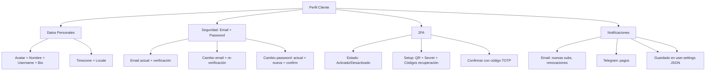

---
tags:
  - "kanban/done"
  - "type/task"
  - "domain/CLI"
  - "priority/P1"
parent: "[[desarrollo]]"
children: []
depends_on:
  - "[[CLI-001]]"
  - "[[FUN-006]]"
  - "[[FUN-008]]"
blocks:
  - "[[CLI-004]]"
status: "done"
assignee: "@dev"
created: "2026-08-04"
updated: "2026-08-05"
---

# [[CLI-003]] Perfil: Datos Personales, Email, Password, 2FA, Notificaciones

## Descripción
Implementar perfil de usuario en área cliente: edición de datos personales, email, cambio de password, 2FA (opcional), preferencias de notificaciones.

## Código de Ejemplo
```php
// app/Domains/Public/Http/Controllers/ClientProfileController.php
namespace App\Domains\Public\Http\Controllers;

use App\Models\User;
use Illuminate\Support\Facades\Hash;
use Laravel\Fortify\TwoFactorAuthenticationProvider;

class ClientProfileController extends Controller
{
    public function index()
    {
        return view('domains.public.client.profile.index', [
            'user' => auth()->user()->load('twoFactorAuthentication'),
        ]);
    }

    public function update(ProfileUpdateRequest $request)
    {
        $user = auth()->user();
        $user->update($request->validated([
            'name', 'username', 'bio', 'avatar', 'timezone', 'locale',
        ]));

        if ($request->hasFile('avatar')) {
            $path = $request->file('avatar')->store('avatars', 'public');
            $user->update(['avatar_url' => $path]);
        }

        return redirect()->back()->with('success', 'Perfil actualizado');
    }

    public function updateEmail(EmailUpdateRequest $request)
    {
        $user = auth()->user();
        $user->update([
            'email' => $request->email,
            'email_verified_at' => null,
        ]);

        $user->sendEmailVerificationNotification();

        return redirect()->back()->with('success', 'Email actualizado. Revisa tu bandeja para verificar.');
    }

    public function updatePassword(PasswordUpdateRequest $request)
    {
        $user = auth()->user();
        
        if (!Hash::check($request->current_password, $user->password)) {
            return back()->withErrors(['current_password' => 'Contraseña actual incorrecta']);
        }

        $user->update(['password' => Hash::make($request->password)]);

        return redirect()->back()->with('success', 'Contraseña actualizada');
    }

    public function enable2FA(TwoFactorAuthRequest $request)
    {
        $user = auth()->user();
        $provider = app(TwoFactorAuthenticationProvider::class);
        
        $secret = $provider->generateSecretKey();
        $user->forceFill([
            'two_factor_secret' => encrypt($secret),
            'two_factor_recovery_codes' => encrypt(json_encode($provider->generateRecoveryCodes())),
        ])->save();

        $qrCode = $provider->getQRCodeUrl($user, $secret);
        
        return view('domains.public.client.profile.2fa-setup', compact('qrCode', 'secret'));
    }

    public function confirm2FA(Confirm2FARequest $request)
    {
        $user = auth()->user();
        $provider = app(TwoFactorAuthenticationProvider::class);
        
        if (!$provider->verify($request->code, decrypt($user->two_factor_secret))) {
            return back()->withErrors(['code' => 'Código inválido']);
        }

        $user->update([
            'two_factor_confirmed_at' => now(),
            'two_factor_secret' => decrypt($user->two_factor_secret), // ya confirmado
        ]);

        return redirect()->route('client.profile')->with('success', '2FA activado correctamente');
    }

    public function disable2FA()
    {
        $user = auth()->user();
        $user->update([
            'two_factor_secret' => null,
            'two_factor_recovery_codes' => null,
            'two_factor_confirmed_at' => null,
        ]);
        return redirect()->back()->with('success', '2FA desactivado');
    }

    public function updateNotifications(NotificationPreferencesRequest $request)
    {
        $user = auth()->user();
        $user->settings = array_merge($user->settings ?? [], [
            'notifications' => $request->validated(),
        ]);
        $user->save();

        return redirect()->back()->with('success', 'Preferencias de notificación actualizadas');
    }
}
```

```blade
{{-- resources/views/domains/public/client/profile/index.blade.php --}}
@extends('layouts.dashboard')

@section('content')
<div class="container mx-auto px-4 py-8 max-w-3xl">
    <div class="mb-8">
        <h1 class="text-2xl font-bold text-text-primary">Mi Perfil</h1>
    </div>

    <form action="{{ route('client.profile.update') }}" method="POST" class="space-y-8">
        @csrf
        @method('PUT')

        {{-- Avatar y Datos Básicos --}}
        <div class="card card--elevated p-6">
            <h2 class="text-xl font-semibold mb-6">Información Personal</h2>
            
            <div class="flex items-center gap-6 mb-6">
                <div class="relative">
                    user()->avatar_url ?? asset('images/default-avatar.png') }}" 
                         alt="" class="w-24 h-24 rounded-full object-cover" id="avatar-preview">
                    <label for="avatar" class="absolute bottom-0 right-0 bg-accent-primary text-white p-2 rounded-full cursor-pointer hover:bg-accent-600">
                        <input type="file" id="avatar" name="avatar" accept="image/*" class="sr-only" accept="image/*">
                        <x-icon name="camera" class="w-5 h-5" />
                    </label>
                </div>
                <div class="flex-1 space-y-4">
                    <div>
                        <label class="label">Nombre</label>
                        <input type="text" name="name" class="input" value="{{ old('name', auth()->user()->name) }}" required>
                    </div>
                    <div>
                        <label class="label">Usuario (username)</label>
                        <div class="flex items-center gap-2">
                            <span class="text-text-muted">@</span>
                            <input type="text" name="username" class="input flex-1" value="{{ old('username', auth()->user()->username) }}" required>
                        </div>
                    </div>
                    <div>
                        <label class="label">Bio</label>
                        <textarea name="bio" class="input" rows="3">{{ old('bio', auth()->user()->bio) }}</textarea>
                    </div>
                </div>
            </div>

            <div class="grid md:grid-cols-2 gap-4">
                <div>
                    <label class="label">Zona Horaria</label>
                    <select name="timezone" class="select">
                        @foreach(\DateTimeZone::listIdentifiers(\DateTimeZone::ALL) as $tz)
                        <option value="{{ $tz }}" {{ old('timezone', auth()->user()->timezone) === $tz ? 'selected' : '' }}>{{ $tz }}</option>
                        @endforeach
                    </select>
                </div>
                <div>
                    <label class="label">Idioma</label>
                    <select name="locale" class="select">
                        <option value="es" {{ old('locale', auth()->user()->locale) === 'es' ? 'selected' : '' }}>Español</option>
                        <option value="en" {{ old('locale', auth()->user()->locale) === 'en' ? 'selected' : '' }}>English</option>
                    </select>
                </div>
            </div>
        </div>

        {{-- Email y Password --}}
        <div class="card card--elevated p-6">
            <h2 class="text-xl font-semibold mb-6">Seguridad</h2>
            
            <div class="grid md:grid-cols-2 gap-8">
                <div class="border-r md:border-r-0 md:border-b border-border-primary pr-8 md:pr-0 pb-8 md:pb-0">
                    <h3 class="font-semibold mb-4">Email</h3>
                    <p class="text-sm text-text-secondary mb-4">Actual: {{ auth()->user()->email }} {{ auth()->user()->email_verified_at ? '<span class="badge badge--success ml-2">Verificado</span>' : '<span class="badge badge--warning ml-2">No verificado</span>' }}</p>
                    
                    <form action="{{ route('client.profile.email') }}" method="POST" class="flex gap-2">
                        @csrf
                        <input type="email" name="email" class="input flex-1" placeholder="Nuevo email" required>
                        <button type="submit" class="btn btn--primary">Cambiar</button>
                    </form>
                    @if(!auth()->user()->email_verified_at)
                    <p class="text-sm text-warning mt-2"><x-icon name="alert-triangle" class="w-4 h-4 inline mr-1" /> Email no verificado. <a href="#" class="text-accent-primary">Reenviar verificación</a></p>
                    @endif
                </div>

                <div>
                    <h3 class="font-semibold mb-4">Cambiar Contraseña</h3>
                    <form action="{{ route('client.profile.password') }}" method="POST" class="space-y-3">
                        @csrf
                        <div>
                            <label class="label">Contraseña Actual</label>
                            <input type="password" name="current_password" class="input" required>
                        </div>
                        <div>
                            <label class="label">Nueva Contraseña</label>
                            <input type="password" name="password" class="input" required minlength="8">
                        </div>
                        <div>
                            <label class="label">Confirmar Nueva Contraseña</label>
                            <input type="password" name="password_confirmation" class="input" required minlength="8">
                        </div>
                        <button type="submit" class="btn btn--primary">Actualizar</button>
                    </form>
                </div>
            </div>
        </div>

        {{-- 2FA --}}
        <div class="card card--elevated p-6">
            <h2 class="text-xl font-semibold mb-6">Autenticación de Dos Factores (2FA)</h2>
            
            @if(auth()->user()->two_factor_confirmed_at)
            <div class="flex items-center justify-between p-4 bg-success-50 dark:bg-success-900/20 rounded-lg">
                <div>
                    <p class="font-semibold text-success-700 dark:text-success-300">2FA Activado</p>
                    <p class="text-sm text-text-secondary">Protección adicional activada</p>
                </div>
                <form action="{{ route('client.profile.2fa.disable') }}" method="POST" onsubmit="return confirm('¿Desactivar 2FA?')">
                    @csrf
                    <button type="submit" class="btn btn--ghost btn--sm text-error">Desactivar</button>
                </form>
            </div>
            @else
            <div class="p-4 bg-warning-50 dark:bg-warning-900/20 rounded-lg">
                <p class="font-semibold text-warning-700 dark:text-warning-300 mb-2">2FA Desactivado</p>
                <p class="text-sm text-text-secondary mb-4">Añade una capa extra de seguridad a tu cuenta.</p>
                <a href="{{ route('client.profile.2fa.enable') }}" class="btn btn--primary">Activar 2FA</a>
            </div>
            @endif
        </div>
        </div>

        {{-- Notificaciones --}}
        <div class="card card--elevated p-6">
            <h2 class="text-xl font-semibold mb-6">Preferencias de Notificación</h2>
            
            <form action="{{ route('client.profile.notifications') }}" method="POST" class="space-y-4">
                @csrf
                
                <div class="flex items-center justify-between p-4 bg-bg-tertiary rounded-lg">
                    <div>
                        <p class="font-medium text-text-primary">Email: Nuevas suscripciones</p>
                        <p class="text-sm text-text-secondary">Recibir email cuando alguien se suscribe a tus canales</p>
                    </div>
                    <label class="flex items-center gap-2 cursor-pointer">
                        <input type="checkbox" name="notifications[email_new_subscription]" class="checkbox" {{ old('notifications.email_new_subscription', auth()->user()->settings['notifications']['email_new_subscription'] ?? true) ? 'checked' : '' }}>
                        <span class="sr-only">Email nuevas suscripciones</span>
                    </label>
                </div>

                <div class="flex items-center justify-between p-4 bg-bg-tertiary rounded-lg">
                    <div>
                        <p class="font-semibold text-text-primary">Email: Renovaciones próximas</p>
                        <p class="text-sm text-text-secondary">Recordatorio 3 días antes de renovación</p>
                    </div>
                    <label class="flex items-center gap-2 cursor-pointer">
                        <input type="checkbox" name="notifications[email_renewal_reminder]" class="checkbox" {{ old('notifications.email_renewal_reminder', auth()->user()->settings['notifications']['email_renewal_reminder'] ?? true) ? 'checked' : '' }}>
                        <span class="sr-only">Email renovaciones</span>
                    </label>
                </div>

                <div class="flex items-center justify-between p-4 bg-bg-tertiary rounded-lg">
                    <div>
                        <p class="font-semibold text-text-primary">Telegram: Notificaciones de pagos</p>
                        <p class="text-sm text-text-secondary">Recibir notificaciones en Telegram cuando recibas un pago</p>
                    </div>
                    <label class="flex items-center gap-2 cursor-pointer">
                        <input type="checkbox" name="notifications[telegram_payouts]" class="checkbox" {{ old('notifications.telegram_payouts', auth()->user()->settings['notifications']['telegram_payouts'] ?? false) ? 'checked' : '' }}>
                        <span class="sr-only">Telegram pagos</span>
                    </label>
                </div>

                <div class="flex items-center justify-between p-4 bg-bg-tertiary rounded-lg">
                    <div>
                        <p class="font-semibold text-text-primary">In-App: Actividad en mis canales</p>
                        <p class="text-sm text-text-secondary">Notificaciones dentro de la plataforma</p>
                    </div>
                    <label class="flex items-center gap-2 cursor-pointer">
                        <input type="checkbox" name="notifications[in_app_activity]" class="checkbox" {{ old('notifications.in_app_activity', auth()->user()->settings['notifications']['in_app_activity'] ?? true) ? 'checked' : '' }}>
                        <span class="sr-only">In-app actividad</span>
                    </label>
                </div>

                <button type="submit" class="btn btn--primary">Guardar Preferencias</button>
            </form>
        </div>

        <div class="flex justify-end">
            <button type="submit" class="btn btn--primary">Guardar Cambios</button>
        </div>
    </form>
</div>
@endsection
```

## Diagramas Mermaid


## Criterios de Aceptación
- [ ] Datos personales: avatar (upload + preview), nombre, username, bio, timezone, locale
- [ ] Email: mostrar actual, estado verificado, cambiar email + re-verificación
- [ ] Password: actual + nueva + confirmación, validación fortaleza
- [ ] 2FA: TOTP (Google Authenticator/Authy), QR setup, códigos recuperación, activar/desactivar
- [ ] Notificaciones: 4 toggles (email nuevas subs, email renovaciones, telegram pagos, in-app actividad) guardados en user.settings JSON
- [ ] Validaciones: email único, password fortaleza, 2FA códigos válidos TOTP
- [ ] UX: tabs o accordion para secciones, feedback visual éxito/error

## Notas Técnicas
- Laravel Fortify para 2FA (TOTP + recovery codes)
- Avatar: upload a `storage/app/public/avatars`, resize 512x512
- Settings en `user.settings` JSON column
- Email verification: `MustVerifyEmail` trait + `sendEmailVerificationNotification()`
- Password: `Hash::check()` + `Hash::make()`, validación min 8 chars
- 2FA: `Laravel\Fortify\TwoFactorAuthenticationProvider`, TOTP RFC 6238

## Enlaces
- [[CLI-001]] Dashboard (link a perfil)
- [[CLI-002]] Mis Canales (link a perfil)
- [[FUN-005]] Spatie Permission (roles)
- [[FUN-006]] User Model (settings JSON)