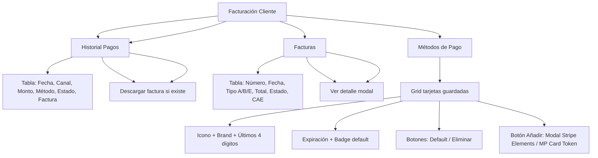

---
tags:
  - "kanban/done"
  - "type/task"
  - "domain/CLI"
  - "priority/P1"
parent: "[[desarrollo]]"
children: []
depends_on:
  - "[[CLI-003]]"
  - "[[FUN-006]]"
  - "[[CRE-013]]"
  - "[[PUB-017]]"
blocks:
  - "[[CLI-005]]"
status: "done"
assignee: "@dev"
created: "2026-08-04"
updated: "2026-08-05"
---

# [[CLI-004]] Facturación: Historial Pagos, Descargar Facturas PDF, Método Pago Guardado

## Descripción
Implementar sección de facturación del cliente: historial de pagos con filtros, descarga de facturas PDF (Factura A/B/C), métodos de pago guardados (tokenizados).

## Código de Ejemplo
```php
// app/Domains/Public/Http/Controllers/ClientBillingController.php
namespace App\Domains\Public\Http\Controllers;

use App\Models\{Payment, Invoice, User};

class ClientBillingController extends Controller
{
    public function index()
    {
        $payments = Payment::where('user_id', auth()->id())
            ->where('status', 'approved')
            ->with(['subscription.channel', 'invoice'])
            ->latest()
            ->paginate(20);

        $invoices = Invoice::where('receiver_id', auth()->id())
            ->latest()
            ->paginate(20);

        $savedMethods = auth()->user()->paymentMethods()
            ->where('is_active', true)
            ->get();

        return view('domains.public.client.billing.index', compact(
            'payments', 'invoices', 'savedMethods'
        ));
    }

    public function downloadInvoice(Invoice $invoice)
    {
        $this->authorize('view', $invoice);
        
        if (!$invoice->pdf_path || !\Storage::disk('local')->exists($invoice->pdf_path)) {
            abort(404, 'PDF no disponible');
        }

        return \Storage::disk('local')->download($invoice->pdf_path, "factura-{$invoice->number}.pdf");
    }

    public function savePaymentMethod(PaymentMethodRequest $request)
    {
        $user = auth()->user();
        
        // Tokenizar tarjeta via pasarela (Stripe/MercadoPago)
        $gatewayService = app(\App\Services\PaymentGatewayService::class);
        $token = $gatewayService->tokenizeCard($request->validated());

        $method = $user->paymentMethods()->create([
            'type' => $request->type, // card, mp_account, bank_transfer
            'gateway' => $request->gateway, // stripe, mercadopago
            'token' => encrypt($token),
            'last_four' => $request->last_four,
            'brand' => $request->brand, // visa, mastercard, amex
            'exp_month' => $request->exp_month,
            'exp_year' => $request->exp_year,
            'holder_name' => $request->holder_name,
            'is_default' => $request->is_default ?? false,
            'metadata' => $request->metadata ?? [],
        ]);

        if ($method->is_default) {
            $user->paymentMethods()->where('id', '!=', $method->id)
                ->update(['is_default' => false]);
        }

        return response()->json(['success' => true, 'method' => $method]);
    }

    public function deletePaymentMethod(PaymentMethod $method)
    {
        $this->authorize('delete', $method);
        $method->delete();
        return response()->json(['success' => true]);
    }

    public function setDefaultPaymentMethod(PaymentMethod $method)
    {
        $this->authorize('update', $method);
        
        auth()->user()->paymentMethods()->update(['is_default' => false]);
        $method->update(['is_default' => true]);
        
        return response()->json(['success' => true]);
    }
}
```

```blade
{{-- resources/views/domains/public/client/billing/index.blade.php --}}
@extends('layouts.dashboard')

@section('content')
<div class="container mx-auto px-4 py-8">
    <div class="mb-8 flex justify-between items-center">
        <div>
            <h1 class="text-2xl font-bold text-text-primary">Facturación</h1>
            <p class="text-text-secondary">Historial de pagos, facturas y métodos de pago</p>
        </div>
    </div>

    {{-- Tabs --}}
    <div class="border-b border-border-primary mb-6">
        <nav class="flex gap-1" aria-label="Tabs">
            @foreach(['payments' => 'Historial de Pagos', 'invoices' => 'Facturas', 'methods' => 'Métodos de Pago'] as $key => $label)
            <button onclick="showBillingTab('{{ $key }}')" 
                    id="billing-tab-{{ $key }}" 
                    class="billing-tab-btn px-4 py-2 font-medium text-sm rounded-t-lg 
                        {{ request()->tab === $key ? 'bg-accent-50 text-accent-700 border-b-2 border-accent-primary' : 'text-text-secondary hover:text-text-primary hover:bg-bg-tertiary' }}"
                    data-tab="{{ $key }}">
                {{ $label }}
            </button>
            @endforeach
        </nav>
    </div>

    {{-- Panel: Historial de Pagos --}}
    <div id="billing-panel-payments" class="billing-panel {{ request()->tab !== 'invoices' && request()->tab !== 'methods' ? '' : 'hidden' }}">
        <div class="card card--elevated overflow-hidden">
            <table class="w-full">
                <thead class="bg-bg-tertiary">
                    <tr>
                        <th class="p-4 text-left text-sm font-semibold text-text-secondary">Fecha</th>
                        <th class="p-4 text-left text-sm font-semibold text-text-secondary">Canal</th>
                        <th class="p-4 text-right text-sm font-semibold text-text-secondary">Monto</th>
                        <th class="p-4 text-center text-sm font-semibold text-text-secondary">Método</th>
                        <th class="p-4 text-center text-sm font-semibold text-text-secondary">Estado</th>
                        <th class="p-4 text-center text-sm font-semibold text-text-secondary">Factura</th>
                    </tr>
                </thead>
                <tbody class="divide-y divide-border-primary">
                    @foreach($payments as $payment)
                    <tr class="hover:bg-bg-tertiary">
                        <td class="p-4 text-sm text-text-secondary">{{ $payment->created_at->format('d/m/Y H:i') }}</td>
                        <td class="p-4 text-sm text-text-primary">
                            <a href="{{ route('client.channels.show', $payment->subscription->channel) }}" class="hover:underline">
                                {{ $payment->subscription->channel->name }}
                            </a>
                        </td>
                        <td class="p-4 text-right text-sm font-medium text-text-primary">
                            ${{ number_format($payment->amount, 2) }} {{ $payment->currency }}
                        </td>
                        <td class="p-4 text-center text-sm text-text-secondary">
                            <span class="badge badge--{{ match($payment->gateway)
                                'mercadopago' => 'info'
                                'stripe' => 'primary'
                                'bank_transfer' => 'warning'
                                default => 'default'
                            }}">{{ ucfirst($payment->gateway) }}</span>
                        </td>
                        <td class="p-4 text-center">
                            <span class="badge badge--success">Aprobado</span>
                        </td>
                        <td class="p-4 text-center">
                            @if($payment->invoice)
                            <a href="{{ route('client.billing.download-invoice', $payment->invoice) }}" 
                               class="btn btn--ghost btn--sm" title="Descargar factura">
                                <x-icon name="download" class="w-4 h-4" />
                            </a>
                            @else
                            <span class="text-text-muted text-sm">—</span>
                            @endif
                        </td>
                    </tr>
                    @endforeach
                </tbody>
            </table>
            <div class="p-4 border-t border-border-primary">
                {{ $payments->links() }}
            </div>
        </div>
    </div>

    {{-- Panel: Facturas --}}
    <div id="billing-panel-invoices" class="billing-panel hidden">
        <div class="card card--elevated overflow-hidden">
            <table class="w-full">
                <thead class="bg-bg-tertiary">
                    <tr>
                        <th class="p-4 text-left text-sm font-semibold text-text-secondary">Número</th>
                        <th class="p-4 text-left text-sm font-semibold text-text-secondary">Fecha</th>
                        <th class="p-4 text-center text-sm font-semibold text-text-secondary">Tipo</th>
                        <th class="p-4 text-right text-sm font-semibold text-text-secondary">Total</th>
                        <th class="p-4 text-center text-sm font-semibold text-text-secondary">Estado</th>
                        <th class="p-4 text-center text-sm font-semibold text-text-secondary">Acciones</th>
                    </tr>
                </thead>
                <tbody class="divide-y divide-border-primary">
                    @foreach($invoices as $invoice)
                    <tr class="hover:bg-bg-tertiary">
                        <td class="p-4 text-sm font-mono text-text-primary">{{ $invoice->number }}</td>
                        <td class="p-4 text-sm text-text-secondary">{{ $invoice->created_at->format('d/m/Y') }}</td>
                        <td class="p-4 text-center">
                            <span class="badge badge--{{ match($invoice->type) 'A' => 'success', 'B' => 'info', 'E' => 'warning', default => 'default' }}">{{ $invoice->type }}</span>
                        </td>
                        <td class="p-4 text-right text-sm font-medium text-text-primary">{{ number_format($invoice->total, 2) }} {{ $invoice->currency }}</td>
                        <td class="p-4 text-center">
                            <span class="badge badge--{{ match($invoice->status) 'authorized' => 'success', 'rejected' => 'error', 'cancelled' => 'warning', default => 'default' }}">{{ ucfirst($invoice->status) }}</span>
                        </td>
                        <td class="p-4 text-center space-x-2">
                            @if($invoice->pdf_path)
                            <a href="{{ route('client.billing.download-invoice', $invoice) }}" class="btn btn--ghost btn--sm" title="Descargar PDF">
                                <x-icon name="download" class="w-4 h-4" />
                            </a>
                            @endif
                            <button onclick="viewInvoice('{{ $invoice->id }}')" class="btn btn--ghost btn--sm" title="Ver detalle">
                                <x-icon name="eye" class="w-4 h-4" />
                            </button>
                        </td>
                    </tr>
                    @endforeach
                </tbody>
            </table>
            <div class="p-4 border-t border-border-primary">
                {{ $invoices->links() }}
            </div>
        </div>
    </div>

    {{-- Panel: Métodos de Pago --}}
    <div id="billing-panel-methods" class="billing-panel hidden">
        <div class="mb-6 flex justify-between items-center">
            <h2 class="text-xl font-semibold text-text-primary">Métodos de Pago Guardados</h2>
            <button onclick="openAddPaymentMethodModal()" class="btn btn--primary">
                <x-icon name="plus" class="w-4 h-4 mr-2" />
                Añadir Método
            </button>
        </div>

        @if($savedMethods->isEmpty())
        <div class="card card--elevated p-12 text-center">
            <x-empty-state 
                illustration="empty-payment-methods"
                title="No tienes métodos de pago guardados"
                description="Añade una tarjeta o cuenta para pagos rápidos"
                ctaText="Añadir método"
                ctaUrl="#" onclick="openAddPaymentMethodModal()"
            />
        </div>
        @else
        <div class="grid gap-4">
            @foreach($savedMethods as $method)
            <div class="card card--elevated p-4 flex items-center justify-between">
                <div class="flex items-center gap-4">
                    <div class="w-12 h-8 rounded-lg bg-{{ match($method->brand) 'visa' => 'blue-100', 'mastercard' => 'red-100', 'amex' => 'green-100', default => 'gray-100' }} flex items-center justify-center">
                        @if($method->type === 'card')
                        <x-icon name="credit-card" class="w-5 h-5 text-{{ match($method->brand) 'visa' => 'blue-700', 'mastercard' => 'red-700', 'amex' => 'green-700', default => 'gray-700' }}" />
                        @else
                        <x-icon name="bank" class="w-5 h-5 text-gray-700" />
                        @endif
                    </div>
                    <div>
                        <p class="font-medium text-text-primary">
                            @if($method->type === 'card')
                            {{ $method->brand }} •••• {{ $method->last_four }}
                            @else
                            {{ ucfirst($method->type) }}: {{ $method->alias ?? $method->gateway }}
                            @endif
                        </p>
                        @if($method->exp_month && $method->exp_year)
                        <p class="text-sm text-text-secondary">Expira: {{ $method->exp_month }}/{{ $method->exp_year }}</p>
                        @endif
                        @if($method->is_default)
                        <span class="badge badge--success badge--xs">Predeterminado</span>
                        @endif
                    </div>
                </div>
                
                <div class="flex items-center gap-2">
                    @if(!$method->is_default)
                    <button onclick="setDefaultPaymentMethod({{ $method->id }})" class="btn btn--ghost btn--sm text-success">
                        <x-icon name="check" class="w-4 h-4 mr-1" />
                        Predeterminado
                    </button>
                    @endif
                    <button onclick="deletePaymentMethod({{ $method->id }})" class="btn btn--ghost btn--sm text-error">
                        <x-icon name="trash" class="w-4 h-4" />
                    </button>
                </div>
            </div>
            @endforeach
        </div>
        @endif
    </div>
</div>

<script>
function showBillingTab(tab) {
    document.querySelectorAll('.billing-panel').forEach(p => p.classList.add('hidden'));
    document.querySelectorAll('.billing-tab-btn').forEach(b => b.classList.remove('bg-accent-50', 'text-accent-700', 'border-b-2', 'border-accent-primary'));
    document.querySelectorAll('.billing-tab-btn').forEach(b => b.classList.add('text-text-secondary', 'hover:text-text-primary', 'hover:bg-bg-tertiary'));
    
    document.getElementById('billing-panel-' + tab).classList.remove('hidden');
    document.getElementById('billing-tab-' + tab).classList.add('bg-accent-50', 'text-accent-700', 'border-b-2', 'border-accent-primary');
    document.getElementById('billing-tab-' + tab).classList.remove('text-text-secondary', 'hover:text-text-primary', 'hover:bg-bg-tertiary');
}

function openAddPaymentMethodModal() {
    // Abrir modal para añadir tarjeta (Stripe Elements / MercadoPago Card Token)
    alert('Implementar modal con Stripe Elements / MercadoPago Card Token');
}

function setDefaultPaymentMethod(id) {
    fetch(`/client/billing/methods/${id}/default`, { method: 'PUT', headers: { 'X-CSRF-TOKEN': '{{ csrf_token() }}' }})
        .then(() => location.reload());
}

function deletePaymentMethod(id) {
    if (confirm('¿Eliminar este método de pago?')) {
        fetch(`/client/billing/methods/${id}`, { method: 'DELETE', headers: { 'X-CSRF-TOKEN': '{{ csrf_token() }}' }})
            .then(() => location.reload());
    }
}
</script>
@endsection
```

## Diagramas Mermaid


## Criterios de Aceptación
- [ ] Tab "Pagos": tabla con fecha, canal (link), monto, método (badge), estado, descargar factura
- [ ] Tab "Facturas": tabla con número, fecha, tipo (badge A/B/E), total, estado, CAE, acciones (descargar, ver)
- [ ] Tab "Métodos": grid tarjetas con icono brand, últimos 4 dígitos, expiración, badge default, botones default/eliminar
- [ ] Botón "Añadir método": modal con Stripe Elements / MercadoPago Card Form (tokenización)
- [ ] Descargar factura PDF (Storage::download)
- [ ] Tokenización: nunca guardar PAN, solo token encriptado + últimos 4 dígitos
- [ ] PCI compliance: nunca tocar PAN en backend
- [ ] Filtros y paginación en todas las tablas

## Notas Técnicas
- Tokenización: Stripe PaymentMethod / MercadoPago Card Token
- Encriptar tokens: `Crypt::encryptString()` / `decryptString()`
- Solo últimos 4 dígitos + brand en BD
- PCI SAQ-A compliance (tokenización externa)
- Stripe Elements / MercadoPago Card Form para UI segura

## Enlaces
- [[CLI-001]] Dashboard (link a facturación)
- [[CLI-003]] Perfil (link a facturación)
- [[PUB-017]] Facturación clientes (paralelo creador)
- [[CRE-013]] Facturación creadores (paralelo)
- [[PUB-017]] Facturación clientes