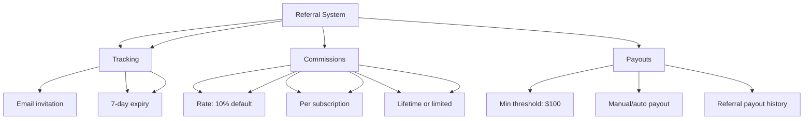

---
tags:
  - "kanban/done"
  - "type/task"
  - "domain/CLI"
  - "priority/P1"
parent: "[[desarrollo]]"
children: []
depends_on:
  - "[[CLI-006]]"
blocks: []
status: "done"
assignee: "@dev"
created: "2026-08-04"
updated: "2026-08-05"
---

# [[CLI-007]] Referidos/Affiliate (Opcional v1.1): Link, Stats, Pagos

## Descripción
Implementar sistema de referidos/afiliados opcional para v1.1: generación de links únicos, tracking de estadísticas, gestión de pagos de comisiones.

## Código de Ejemplo
```php
// app/Models/Referral.php
class Referral extends Model
{
    protected $fillable = [
        'referrer_id', 'referred_id', 'code', 'status', 'commission_rate',
        'total_earnings', 'paid_earnings', 'converted_at',
    ];

    protected $casts = [
        'commission_rate' => 'decimal:4',
        'total_earnings' => 'decimal:2',
        'paid_earnings' => 'decimal:2',
        'converted_at' => 'datetime',
    ];

    public function referrer() { return $this->belongsTo(User::class, 'referrer_id'); }
    public function referred() { return $this->belongsTo(User::class, 'referred_id'); }
}
```

```php
// app/Domains/CLI/Http/Controllers/ReferralController.php
class ReferralController extends Controller
{
    public function index()
    {
        $referrals = auth()->user()->referrals()->with('referred')->latest()->paginate(20);
        $stats = [
            'total' => auth()->user()->referrals()->count(),
            'converted' => auth()->user()->referrals()->where('status', 'converted')->count(),
            'pending' => auth()->user()->referrals()->where('status', 'pending')->count(),
            'earnings' => auth()->user()->referrals()->where('status', 'converted')->sum('total_earnings'),
            'paid' => auth()->user()->referrals()->where('status', 'paid')->sum('paid_earnings'),
            'pending_payout' => auth()->user()->referrals()->where('status', 'converted')->where('paid_earnings', '<', 'total_earnings')->sum('total_earnings'),
        ];

        return view('domains.cli.referrals.index', compact('referrals', 'stats'));
    }

    public function store(ReferralStoreRequest $request)
    {
        $referral = auth()->user()->referrals()->create([
            'referred_email' => $request->email,
            'code' => Str::random(8),
            'commission_rate' => config('referral.default_commission', 0.10),
        ]);

        // Enviar email de invitación
        \Mail::to($request->email)->send(new \App\Mail\ReferralInvitationMail($referral));

        return back()->with('success', 'Invitación enviada');
    }
}
```

```blade
{{-- resources/views/domains/cli/referrals/index.blade.php --}}
@extends('layouts.dashboard')

@section('content')
<div class="container mx-auto px-4 py-8">
    <div class="mb-8 flex justify-between items-center">
        <div>
            <h1 class="text-2xl font-bold text-text-primary">Programa de Referidos</h1>
            <p class="text-text-secondary">Invita a creadores y gana comisiones por cada suscripción</p>
        </div>
        <a href="{{ route('cli.referrals.create') }}" class="btn btn--primary">
            <x-icon name="plus" class="w-4 h-4 mr-2" />
            Invitar Colaborador
        </a>
    </div>

    {{-- Stats --}}
    <div class="grid grid-cols-1 md:grid-cols-4 gap-4 mb-8">
        <div class="card card--elevated p-6">
            <p class="text-sm text-text-secondary">Total Invitados</p>
            <p class="text-3xl font-bold text-text-primary">{{ $stats['total'] }}</p>
        </div>
        <div class="card card--elevated p-6">
            <p class="text-sm text-text-secondary">Convertidos</p>
            <p class="text-3xl font-bold text-success">{{ $stats['converted'] }}</p>
        </div>
        <div class="card card--elevated p-6">
            <p class="text-sm text-text-secondary">Ganancias Totales</p>
            <p class="text-3xl font-bold text-text-primary">${{ number_format($stats['earnings'], 2) }}</p>
        </div>
        <div class="card card--elevated p-6">
            <p class="text-sm text-text-secondary">Por Cobrar</p>
            <p class="text-3xl font-bold text-warning">${{ number_format($stats['pending_payout'], 2) }}</p>
        </div>
    </div>

    {{-- Tabla Referidos --}}
    <div class="card card--elevated overflow-hidden">
        @if($referrals->isEmpty())
        <div class="p-12 text-center">
            <x-empty-state illustration="empty-referrals" title="Sin referidos aún" description="Invita a tus primeros creadores" cta_text="Invitar" cta_url="{{ route('cli.referrals.create') }}" />
        </div>
        @else
        <table class="w-full">
            <thead class="bg-bg-tertiary">
                <tr>
                    <th class="p-4 text-left text-sm font-semibold text-text-secondary">Referido</th>
                    <th class="p-4 text-center text-sm font-semibold text-text-secondary">Estado</th>
                    <th class="p-4 text-right text-sm font-semibold text-text-secondary">Ganancias</th>
                    <th class="p-4 text-center text-sm font-semibold text-text-secondary">Fecha</th>
                    <th class="p-4 text-center text-sm font-semibold text-text-secondary">Acciones</th>
                </tr>
            </thead>
            <tbody class="divide-y divide-border-primary">
                @foreach($referrals as $referral)
                <tr class="hover:bg-bg-tertiary">
                    <td class="p-4">
                        <div class="flex items-center gap-3">
                            referred->avatar_url ?? asset('images/default-avatar.png') }}" alt="" class="w-10 h-10 rounded-full">
                            <div>
                                <p class="font-medium text-text-primary">{{ $referral->referred->name ?? $referral->referred_email }}</p>
                                <p class="text-sm text-text-secondary">{{ $referral->code }}</p>
                            </div>
                        </td>
                        <td class="p-4 text-center">
                            <span class="badge badge--{{ $referral->status === 'converted' ? 'success' : ($referral->status === 'pending' ? 'warning' : 'default') }}">
                                {{ ucfirst($referral->status) }}
                            </span>
                        </td>
                        <td class="p-4 text-right text-sm font-medium text-text-primary">
                            ${{ number_format($referral->total_earnings, 2) }}
                        </td>
                        <td class="p-4 text-center text-sm text-text-secondary">{{ $referral->created_at->format('d/m/Y') }}</td>
                        <td class="p-4 text-center">
                            @if($referral->status === 'converted')
                            <span class="badge badge--success">Convertido</span>
                            @elseif($referral->status === 'pending')
                            <span class="badge badge--warning">Pendiente</span>
                            @else
                            <span class="badge badge--error">Expirado</span>
                            @endif
                        </td>
                    </tr>
                @endforeach
            </tbody>
        </table>
        {{ $referrals->links() }}
        @endif
    </div>
</div>
@endsection
```

## Diagramas Mermaid


## Criterios de Aceptación
- [ ] Generar link único de invitación por creador
- [ ] Tracking de visitas y conversiones por código único
- [ ] Comisión configurable (default 10% por suscripción)
- [ ] Estados: pending, converted, expired, paid
- [ ] Dashboard con stats: total, convertidos, ganancias, por cobrar
- [ ] Reenvío de invitaciones pendientes
- [ ] Historial de pagos de comisiones
- [ ] Notificaciones: email + in-app + telegram (opcional)
- [ ] Expiración de invitaciones a 7 días

## Notas Técnicas
- Token único de 8 chars por invitación
- Tracking via cookie + URL param por 30 días
- Comisión solo en suscripciones activas (no trials)
- Payout mínimo: $100 ARS
- Pagos semanales automáticos (opcional v1.1)

## Enlaces
- [[CLI-001]] Dashboard (link a referidos)
- [[CLI-003]] Perfil (pestaña referidos)
- [[CLI-004]] Facturación (historial comisiones)