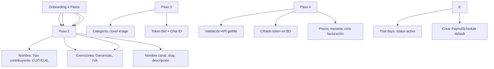

---
tags:
  - "kanban/done"
  - "type/task"
  - "domain/CRE"
  - "priority/P0"
parent: "[[desarrollo]]"
children: []
depends_on:
  - "[[FUN-006]]"
  - "[[FUN-008]]"
  - "[[PUB-005]]"
  - "[[INS-011]]"
blocks:
  - "[[CRE-002]]"
  - "[[CRE-003]]"
  - "[[CRE-011]]"
  - "[[CRE-004]]"
  - "[[CRE-005]]"
  - "[[TST-F-006]]"
  - "[[TST-F-007]]"
  - "[[TST-F-010]]"
status: "done"
assignee: "@dev"
created: "2026-08-04"
updated: "2026-08-05"
---

# [[CRE-001]] Onboarding Creador: Wizard 4 Pasos (Datos, Canal, Bot, Precios)

## Descripción
Implementar onboarding guiado de 4 pasos para creadores: datos personales/fiscales, configuración de canal/grupo Telegram, vinculación de bot, configuración de precios y planes.

## Código de Ejemplo
```php
// app/Domains/Creadores/Http/Controllers/OnboardingController.php
namespace App\Domains\Creadores\Http\Controllers;

class OnboardingController extends Controller
{
    public function __construct(protected OnboardingService $onboarding) {}

    public function index()
    {
        $step = auth()->user()->onboarding_step ?? 1;
        return redirect()->route("creadores.onboarding.step{$step}");
    }

    public function step1()
    {
        return view('domains.creadores.onboarding.step1', [
            'countries' => Country::where('is_active', true)->get(),
            'taxpayerTypes' => \App\Services\ArgentineTaxService::TAXPAYER_TYPES,
        ]);
    }

    public function step1Store(OnboardingStep1Request $request)
    {
        $user = auth()->user();
        $user->update($request->validated([
            'name', 'taxpayer_type', 'cuit_cuil', 'tax_province', 'tax_city',
            'tax_zip_code', 'tax_address', 'iibb_number', 'monotributo_category',
            'ganancias_exempt', 'iva_exempt',
        ]));

        $user->update(['onboarding_step' => 2]);
        return redirect()->route('creadores.onboarding.step2');
    }

    public function step2()
    {
        $categories = Category::where('is_active', true)->get();
        return view('domains.creadores.onboarding.step2', compact('categories'));
    }

    public function step2Store(OnboardingStep2Request $request)
    {
        $channel = ChannelPago::create([
            'owner_id' => auth()->id(),
            'name' => $request->name,
            'slug' => Str::slug($request->name),
            'description' => $request->description,
            'category_id' => $request->category_id,
            'telegram_chat_id' => $request->telegram_chat_id,
            'telegram_bot_token' => Crypt::encryptString($request->telegram_bot_token),
            'status' => 'pending',
        ]);

        auth()->user()->update(['onboarding_step' => 3]);
        return redirect()->route('creadores.onboarding.step3', $channel);
    }

    public function step3(ChannelPago $channel)
    {
        $this->authorize('manage', $channel);
        return view('domains.creadores.onboarding.step3', compact('channel'));
    }

    public function step3Store(ChannelPago $channel, OnboardingStep3Request $request)
    {
        $this->authorize('manage', $channel);
        
        // Validar bot token con API Telegram
        $telegramService = app(\App\Services\TelegramService::class);
        $botInfo = $telegramService->getBotInfo($request->telegram_bot_token);
        
        if (!$botInfo['ok']) {
            return back()->withErrors(['telegram_bot_token' => 'Token de bot inválido']);
        }

        $channel->update([
            'telegram_bot_token' => Crypt::encryptString($request->telegram_bot_token),
            'telegram_chat_id' => $request->telegram_chat_id,
            'telegram_bot_username' => $botInfo['result']['username'],
        ]);

        auth()->user()->update(['onboarding_step' => 4]);
        return redirect()->route('creadores.onboarding.step4', $channel);
    }

    public function step4(ChannelPago $channel)
    {
        $this->authorize('manage', $channel);
        return view('domains.creadores.onboarding.step4', compact('channel'));
    }

    public function step4Store(ChannelPago $channel, OnboardingStep4Request $request)
    {
        $this->authorize('manage', $channel);
        
        $channel->update([
            'price' => $request->price,
            'currency' => $request->currency ?? 'ARS',
            'billing_cycle' => $request->billing_cycle ?? 'monthly',
            'trial_days' => $request->trial_days ?? 0,
            'status' => 'active',
        ]);

        auth()->user()->update(['onboarding_step' => 5, 'onboarding_completed_at' => now()]);

        // Crear schedule de cobro por defecto
        \App\Models\PayoutSchedule::create([
            'channel_pago_id' => $channel->id,
            'frequency' => 'monthly',
            'minimum_amount' => 1000,
            'platform_fee_percentage' => 0.05,
            'gateway_fee_percentage' => 0.035,
            'fixed_fee' => 50,
        ]);

        return redirect()->route('creadores.dashboard')
            ->with('success', '¡Onboarding completado! Tu canal está listo para recibir suscriptores.');
    }
}
```

```blade
{{-- resources/views/domains/creadores/onboarding/step1.blade.php --}}
@extends('layouts.dashboard')

@section('content')
<div class="container mx-auto px-4 py-8 max-w-2xl">
    <div class="mb-8">
        <div class="flex items-center gap-4 mb-6">
            <div class="w-10 h-10 rounded-full bg-accent-100 dark:bg-accent-900/30 flex items-center justify-center">
                <x-icon name="user" class="w-5 h-5 text-accent-primary" />
            </div>
            <div>
                <p class="text-sm text-text-secondary">Paso 1 de 4</p>
                <h1 class="text-2xl font-bold text-text-primary">Datos Personales y Fiscales</h1>
            </div>
        </div>

        <form action="{{ route('creadores.onboarding.step1.store') }}" method="POST" class="space-y-6">
            @csrf

            <div class="card card--elevated p-6">
                <h3 class="text-lg font-semibold mb-4">Datos Personales</h3>
                <div class="grid md:grid-cols-2 gap-4">
                    <div>
                        <label class="label">Nombre Completo</label>
                        <input type="text" name="name" class="input" value="{{ old('name', auth()->user()->name) }}" required>
                    </div>
                </div>
            </div>

            <div class="card card--elevated p-6">
                <h3 class="text-lg font-semibold mb-4">Configuración Fiscal (Argentina)</h3>
                
                <div>
                    <label class="label">Tipo de Contribuyente AFIP/ARCA</label>
                    <div class="grid grid-cols-2 md:grid-cols-4 gap-4 mt-2">
                        @foreach(\App\Services\ArgentineTaxService::TAXPAYER_TYPES as $key => $label)
                        <label class="relative cursor-pointer">
                            <input type="radio" name="taxpayer_type" value="{{ $key }}" class="sr-only peer" {{ old('taxpayer_type', auth()->user()->taxpayer_type) === $key ? 'checked' : '' }}>
                            <div class="p-4 border-2 rounded-xl text-center
                                peer-checked:border-accent-primary peer-checked:bg-accent-50
                                border-border-primary hover:border-accent-primary/50 transition-colors">
                                <p class="font-semibold text-text-primary">{{ $label }}</p>
                                <p class="text-xs text-text-muted mt-1">
                                    {{ match($key)
                                        'responsable_inscripto' => 'Factura A/B, IVA, Ganancias'
                                        'monotributo' => 'Factura C, cuota fija mensual'
                                        'exento' => 'Factura E, sin IVA'
                                        'consumidor_final' => 'Factura B, sin obligaciones'
                                    }}
                                </p>
                            </div>
                        </label>
                        @endforeach
                    </div>
                </div>

                <div class="mt-6 grid md:grid-cols-2 gap-4">
                    <div>
                        <label class="label">CUIT / CUIL</label>
                        <input type="text" name="cuit_cuil" class="input" 
                               value="{{ old('cuit_cuil', auth()->user()->cuit_cuil) }}" 
                               maxlength="11" pattern="\d{11}" placeholder="20123456789" required>
                    </div>
                    <div>
                        <label class="label">Provincia</label>
                        <select name="tax_province" class="select" required>
                            <option value="">Seleccionar</option>
                            @foreach(\App\Services\ArgentineTaxService::PROVINCES as $code => $name)
                            <option value="{{ $code }}" {{ old('tax_province', auth()->user()->tax_province) === $code ? 'selected' : '' }}>
                                {{ $name }}
                            </option>
                            @endforeach
                        </select>
                    </div>
                    <div class="md:col-span-2">
                        <label class="label">Domicilio Fiscal Completo</label>
                        <textarea name="tax_address" class="input" rows="2" required>{{ old('tax_address', auth()->user()->tax_address) }}</textarea>
                    </div>
                    <div>
                        <label class="label">Ciudad</label>
                        <input type="text" name="tax_city" class="input" value="{{ old('tax_city', auth()->user()->tax_city) }}" required>
                    </div>
                    <div>
                        <label class="label">Código Postal</label>
                        <input type="text" name="tax_zip_code" class="input" value="{{ old('tax_zip_code', auth()->user()->tax_zip_code) }}" maxlength="4" pattern="\d{4}" required>
                    </div>
                </div>

                <div class="mt-6 grid md:grid-cols-2 gap-4">
                    <div>
                        <label class="label">Número IIBB Provincial</label>
                        <input type="text" name="iibb_number" class="input" value="{{ old('iibb_number', auth()->user()->iibb_number) }}" placeholder="Ej: 12345678-9">
                    </div>
                    <div>
                        <label class="label">Categoría Monotributo</label>
                        <select name="monotributo_category" class="select">
                            <option value="">No aplica / No es Monotributo</option>
                            @foreach(range('A', 'K') as $cat)
                            <option value="{{ $cat }}" {{ old('monotributo_category', auth()->user()->monotributo_category) === $cat ? 'selected' : '' }}>
                                Categoría {{ $cat }}
                            </option>
                            @endforeach
                        </select>
                    </div>
                    <div class="flex items-center gap-2">
                        <input type="checkbox" name="ganancias_exempt" class="checkbox" {{ old('ganancias_exempt', auth()->user()->ganancias_exempt) ? 'checked' : '' }}>
                        <span class="label">Exento Ganancias (certificado)</span>
                    </div>
                    <div class="flex items-center gap-2">
                        <input type="checkbox" name="iva_exempt" class="checkbox" {{ old('iva_exempt', auth()->user()->iva_exempt) ? 'checked' : '' }}>
                        <span class="label">Exento IVA</span>
                    </div>
                </div>
            </div>
        </div>

        <div class="flex justify-end gap-4 pt-6 border-t border-border-primary">
            <button type="submit" class="btn btn--primary">
                Continuar al Paso 2
                <x-icon name="arrow-right" class="w-4 h-4 ml-2" />
            </button>
        </div>
    </form>
</div>
@endsection
```

## Diagramas Mermaid


## Criterios de Aceptación
- [ ] Paso 1: Datos personales + configuración fiscal completa (tipo contribuyente, CUIT, domicilio, IIBB, monotributo, exenciones)
- [ ] Paso 2: Canal - nombre, slug, descripción, categoría, cover image
- [ ] Paso 3: Bot Telegram - token validado via getMe, chat ID, token cifrado en BD
- [ ] Paso 4: Precios - precio, moneda, ciclo facturación, trial days, activación canal
- [ ] Progreso persistente: usuario.onboarding_step (1-5)
- [ ] Validación CUIT/CUIL: algoritmo Módulo 11
- [ ] Validación Bot: llamada getMe a Telegram API
- [ ] Tokens cifrados: Crypt::encryptString() / decryptString()
- [ ] PayoutSchedule default creado al finalizar
- [ ] Navegación: anterior/siguiente, guardado automático por paso

## Notas Técnicas
- User model: onboarding_step (1-5), onboarding_completed_at
- ChannelPago: telegram_bot_token (encrypted), telegram_chat_id, telegram_bot_username
- PayoutSchedule creado automáticamente al finalizar
- Validación CUIT: algoritmo Módulo 11
- Tokens cifrados con Laravel Crypt (AES-256)
- Wizard con Livewire o Alpine.js para UX fluida

## Enlaces
- [[CRE-002]] Dashboard (post-onboarding)
- [[CRE-003]] Canales CRUD
- [[CRE-011]] Config pasarelas
- [[CRE-015]] Config fiscal creador
- [[INS-011]] Instalador config pasarelas