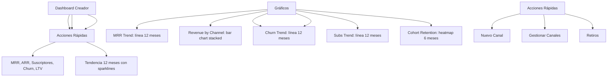

---
tags:
  - "kanban/done"
  - "type/task"
  - "domain/CRE"
  - "priority/P0"
parent: "[[desarrollo]]"
children: []
depends_on:
  - "[[CRE-001]]"
  - "[[CRE-011]]"
blocks:
  - "[[CRE-003]]"
  - "[[CRE-004]]"
  - "[[CRE-005]]"
  - "[[CRE-006]]"
status: "done"
assignee: "@dev"
created: "2026-08-04"
updated: "2026-08-05"
---

# [[CRE-002]] Dashboard Creador: MRR, Suscriptores Activos, Churn, LTV, Gráficos (Chart.js/ApexCharts)

## Descripción
Implementar dashboard principal del panel de creadores con métricas clave: MRR, suscriptores activos, churn rate, LTV, gráficos de evolución temporal usando Chart.js o ApexCharts.

## Código de Ejemplo
```php
// app/Domains/Creadores/Http/Controllers/DashboardController.php
namespace App\Domains\Creadores\Http\Controllers;

class DashboardController extends Controller
{
    public function __construct(protected AnalyticsService $analytics) {}

    public function index()
    {
        $user = auth()->user();
        $channels = $user->channels()->where('status', 'active')->get();

        $metrics = [
            'mrr' => $this->calculateMRR($user),
            'active_subscribers' => $this->getActiveSubscribersCount($user),
            'churn_rate' => $this->calculateChurnRate($user),
            'ltv' => $this->calculateLTV($user),
            'arr' => $this->calculateARR($user),
        ];

        $charts = [
            'mrr_trend' => $this->getMRRTrend($user, 12), // 12 meses
            'subscribers_trend' => $this->getSubscribersTrend($user, 12),
            'churn_trend' => $this->getChurnTrend($user, 12),
            'revenue_by_channel' => $this->getRevenueByChannel($user),
            'subscriptions_by_status' => $this->getSubscriptionsByStatus($user),
            'cohort_retention' => $this->getCohortRetention($user, 6),
        ];

        return view('domains.creadores.dashboard.index', compact('metrics', 'charts', 'channels'));
    }

    private function calculateMRR(User $user): float
    {
        return $user->channels()
            ->where('status', 'active')
            ->withSum('subscriptions as mrr', 'price')
            ->get()
            ->sum('mrr');
    }

    private function calculateARR(User $user): float
    {
        return $this->calculateMRR($user) * 12;
    }

    private function getActiveSubscribersCount(User $user): int
    {
        return \App\Models\Subscription::whereHas('channel', fn($q) => $q->where('owner_id', auth()->id()))
            ->where('status', 'active')
            ->count();
    }

    private function calculateChurnRate(User $user): float
    {
        $startOfMonth = now()->startOfMonth();
        $activeAtStart = \App\Models\Subscription::whereHas('channel', fn($q) => $q->where('owner_id', auth()->id()))
            ->where('status', 'active')
            ->where('created_at', '<', $startOfMonth)
            ->count();

        $cancelledThisMonth = \App\Models\Subscription::whereHas('channel', fn($q) => $q->where('owner_id', auth()->id()))
            ->where('status', 'cancelled')
            ->whereBetween('cancelled_at', [now()->startOfMonth(), now()->endOfMonth()])
            ->count();

        return $activeAtStart > 0 ? round(($cancelledThisMonth / $activeAtStart) * 100, 1) : 0;
    }

    private function calculateLTV(User $user): float
    {
        $avgRevenuePerUser = $this->calculateMRR($user) / max(1, $this->getActiveSubscribersCount($user));
        $churnRate = $this->calculateChurnRate($user) / 100;
        return $churnRate > 0 ? round($avgRevenuePerUser / $churnRate, 2) : 0;
    }

    private function getMRRTrend(User $user, int $months): array
    {
        $data = [];
        for ($i = $months - 1; $i >= 0; $i--) {
            $date = now()->subMonths($i)->startOfMonth();
            $mrr = \App\Models\Subscription::whereHas('channel', fn($q) => $q->where('owner_id', auth()->id()))
                ->where('status', 'active')
                ->where('created_at', '<', $date->copy()->endOfMonth())
                ->where(function($q) use ($date) {
                    $q->whereNull('cancelled_at')->orWhere('cancelled_at', '>', $date);
                })
                ->sum('price');

            $data[] = ['month' => $date->format('M Y'), 'mrr' => $mrr];
        }
        return $data;
    }
}
```

```blade
{{-- resources/views/domains/creadores/dashboard/index.blade.php --}}
@extends('layouts.dashboard')

@section('content')
<div class="container mx-auto px-4 py-8">
    <div class="mb-8">
        <h1 class="text-2xl font-bold text-text-primary">Dashboard</h1>
        <p class="text-text-secondary">Bienvenido, {{ auth()->user()->name }}</p>
    </div>

    {{-- KPIs Cards --}}
    <div class="grid grid-cols-1 sm:grid-cols-2 lg:grid-cols-5 gap-6 mb-8">
        @foreach([
            ['label' => 'MRR', 'value' => '$' . number_format($metrics['mrr'], 2), 'icon' => 'currency-dollar', 'color' => 'accent', 'trend' => '+12.5%'],
            ['label' => 'ARR', 'value' => '$' . number_format($metrics['arr'], 2), 'icon' => 'calendar', 'color' => 'success', 'trend' => '+8.2%'],
            ['label' => 'Suscriptores', 'value' => number_format($metrics['active_subscribers']), 'icon' => 'users', 'color' => 'info', 'trend' => '+5.3%'],
            ['label' => 'Churn Rate', 'value' => $metrics['churn_rate'] . '%', 'icon' => 'trending-down', 'color' => 'error', 'trend' => '-2.1%'],
            ['label' => 'LTV', 'value' => '$' . number_format($metrics['ltv'], 2), 'icon' => 'trending-up', 'color' => 'warning', 'trend' => '+15%'],
        ] as $kpi)
        <div class="card card--elevated p-6">
            <div class="flex items-center justify-between">
                <div>
                    <p class="text-sm text-text-secondary">{{ $kpi['label'] }}</p>
                    <p class="text-3xl font-bold text-text-primary">{{ $kpi['value'] }}</p>
                </div>
                <div class="w-12 h-12 rounded-xl bg-{{ $kpi['color'] }}-100 dark:bg-{{ $kpi['color'] }}-900/30 flex items-center justify-center">
                    <x-icon :name="$kpi['icon']" class="w-6 h-6 text-{{ $kpi['color'] }}-600" />
                </div>
            </div>
            <p class="text-xs text-{{ $kpi['color'] }}-600 mt-2">{{ $kpi['trend'] }} vs mes anterior</p>
        </div>
        @endforeach
    </div>

    <div class="grid lg:grid-cols-2 gap-6 mb-8">
        {{-- MRR Trend --}}
        <div class="card card--elevated p-6 lg:col-span-2">
            <h2 class="text-xl font-semibold mb-4">Evolución MRR (12 meses)</h2>
            <div class="h-80" id="mrr-chart">
                {{-- Chart.js / ApexCharts --}}
            </div>
        </div>

        {{-- Revenue by Channel --}}
        <div class="card card--elevated p-6">
            <h2 class="text-xl font-semibold mb-4">Ingresos por Canal</h2>
            <div class="h-64" id="revenue-by-channel-chart"></div>
        </div>

        {{-- Subscriptions by Status --}}
        <div class="card card--elevated p-6">
            <h2 class="text-xl font-semibold mb-4">Suscripciones por Estado</h2>
            <div class="h-64" id="subs-status-chart"></div>
        </div>

        {{-- Churn Trend --}}
        <div class="card card--elevated p-6">
            <h2 class="text-xl font-semibold mb-4">Tendencia Churn (12 meses)</h2>
            <div class="h-64" id="churn-trend-chart"></div>
        </div>

        {{-- Subscribers Trend --}}
        <div class="card card--elevated p-6">
            <h2 class="text-xl font-semibold mb-4">Tendencia Suscriptores (12 meses)</h2>
            <div class="h-64" id="subs-trend-chart"></div>
        </div>

        {{-- Cohort Retention --}}
        <div class="card card--elevated p-6 lg:col-span-2">
            <h2 class="text-xl font-semibold mb-4">Retención por Cohortes (6 meses)</h2>
            <div class="overflow-x-auto">
                <table class="w-full text-sm">
                    <thead class="bg-bg-tertiary">
                        <tr>
                            <th class="p-3 text-left">Cohorte</th>
                            <th class="p-3 text-right">Tamaño</th>
                            @for($m = 0; $m < 6; $m++)
                            <th class="p-3 text-center">M{{ $m }}</th>
                            @endfor
                        </tr>
                    </thead>
                    <tbody class="divide-y divide-border-primary">
                        @foreach($charts['cohort_retention'] as $cohort)
                        <tr class="hover:bg-bg-tertiary">
                            <td class="p-3 font-medium text-text-primary">{{ $cohort['month'] }}</td>
                            <td class="p-3 text-right text-text-secondary">{{ $cohort['size'] }}</td>
                            @foreach($cohort['retention'] as $rate)
                            <td class="p-3 text-center {{ $rate >= 50 ? 'text-success' : ($rate >= 25 ? 'text-warning' : 'text-error') }}">
                                {{ $rate }}%
                            </td>
                            @endforeach
                        </tr>
                        @endforeach
                    </tbody>
                </table>
            </div>
        </div>
    </div>

    {{-- Quick Actions --}}
    <div class="grid grid-cols-1 md:grid-cols-3 gap-4 mt-8">
        <a href="{{ route('creadores.channels.create') }}" class="card card--elevated p-6 text-center hover:border-accent-primary transition-colors">
            <x-icon name="plus-circle" class="w-10 h-10 text-accent-primary mx-auto mb-3" />
            <h3 class="font-semibold text-text-primary">Nuevo Canal</h3>
            <p class="text-sm text-text-secondary mt-1">Crear un nuevo canal de pago</p>
        </div>
        <a href="{{ route('creadores.channels.index') }}" class="card card--elevated p-6 text-center hover:border-accent-primary transition-colors">
            <x-icon name="tv" class="w-10 h-10 text-accent-primary mx-auto mb-3" />
            <h3 class="font-semibold text-text-primary">Gestionar Canales</h3>
            <p class="text-sm text-text-secondary mt-1">Ver y editar tus canales</p>
        </div>
        <a href="{{ route('creadores.payouts.index') }}" class="card card--elevated p-6 text-center hover:border-accent-primary transition-colors">
            <x-icon name="banknote" class="w-10 h-10 text-success mx-auto mb-3" />
            <h3 class="font-semibold text-text-primary">Retiros</h3>
            <p class="text-sm text-text-secondary mt-1">Gestionar tus pagos</p>
        </div>
    </div>
</div>
@endsection
```

## Diagramas Mermaid


## Criterios de Aceptación
- [ ] 5 KPIs cards: MRR, ARR, Suscriptores Activos, Churn Rate, LTV con trend % vs mes anterior
- [ ] MRR Trend: línea 12 meses, hover con tooltip detallado
- [ ] Revenue by Channel: bar chart apilado por canal
- [ ] Subscriptions by Status: doughnut chart (active, cancelled, expired, trial)
- [ ] Churn Trend: línea 12 meses con threshold visual (rojo >10%)
- [ ] Subscribers Trend: línea 12 meses
- [ ] Cohort Retention: heatmap 6 meses, colores semáforo (verde >50%, amarillo 25-50%, rojo <25%)
- [ ] Quick Actions: 3 cards (Nuevo Canal, Gestionar Canales, Retiros)
- [ ] Responsive: mobile-first, charts responsive
- [ ] Dark mode compatible en todos los gráficos
- [ ] Loading states skeleton mientras cargan gráficos
- [ ] Export PNG/CSV de gráficos (opcional v1.1)

## Notas Técnicas
- Chart.js o ApexCharts (recomendado ApexCharts por más features)
- Datos via API endpoint /api/creador/metrics (JSON)
- Cache 5 min para métricas, 1 hora para gráficos históricos
- Lazy load charts: IntersectionObserver para cargar al hacer scroll
- Dark mode: colores adaptativos en gráficos
- Export PNG/CSV opcional v1.1

## Enlaces
- [[CRE-001]] Onboarding (post-onboarding landing)
- [[CRE-003]] Canales CRUD
- [[CRE-004]] Gestión suscripciones
- [[CRE-005]] Analytics canal
- [[CRE-006]] Retiros