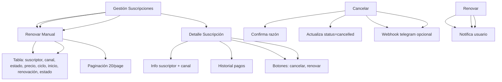

---
tags:
  - "kanban/done"
  - "type/task"
  - "domain/CRE"
  - "priority/P0"
parent: "[[desarrollo]]"
children: []
depends_on:
  - "[[CRE-001]]"
  - "[[CRE-003]]"
blocks:
  - "[[CRE-005]]"
  - "[[CRE-006]]"
status: "done"
assignee: "@dev"
created: "2026-08-04"
updated: "2026-08-05"
---

# [[CRE-004]] Gestión Suscripciones: Lista, Buscar, Filtrar, Ver Detalle, Cancelar Manual, Renovar

## Descripción
Implementar gestión completa de suscripciones en panel de creadores: listado con filtros, búsqueda, ver detalle, cancelación manual, renovación manual.

## Código de Ejemplo
```php
// app/Domains/Creadores/Http/Controllers/SubscriptionController.php
namespace App\Domains\Creadores\Http\Controllers;

class SubscriptionController extends Controller
{
    public function index()
    {
        $subscriptions = auth()->user()
            ->channels()
            ->where('status', 'active')
            ->with(['subscriptions' => fn($q) => $q->with('user')
                ->when(request('status'), fn($q) => $q->where('status', request('status')))
                ->when(request('search'), fn($q) => $q->whereHas('user', fn($q) => 
                    $q->where('name', 'like', "%".request('search')."%")
                    ->orWhere('email', 'like', "%".request('search')."%")
                ))
                ->latest()
            ])
            ->get()
            ->flatMap->subscriptions
            ->sortByDesc('created_at');

        return view('domains.creadores.subscriptions.index', compact('subscriptions'));
    }

    public function show(\App\Models\Subscription $subscription)
    {
        $this->authorize('view', $subscription);
        $subscription->load(['user', 'channel', 'payments', 'invoices']);
        return view('domains.creadores.subscriptions.show', compact('subscription'));
    }

    public function cancel(\App\Models\Subscription $subscription, CancelSubscriptionRequest $request)
    {
        $this->authorize('manage', $subscription->channel);
        
        $subscription->update([
            'status' => 'cancelled',
            'cancelled_at' => now(),
            'cancelled_by' => auth()->id(),
            'cancellation_reason' => $request->reason,
        ]);

        // Notificar usuario
        \Mail::to($subscription->user->email)->send(
            new \App\Mail\SubscriptionCancelledMail($subscription)
        );

        // Notificar creador
        \Mail::to($subscription->channel->owner->email)->send(
            new \App\Mail\SubscriptionCancelledCreatorMail($subscription)
        );

        return back()->with('success', 'Suscripción cancelada');
    }

    public function renew(\App\Models\Subscription $subscription)
    {
        $this->authorize('manage', $subscription->channel);
        
        $subscription->update([
            'status' => 'active',
            'cancelled_at' => null,
            'cancelled_by' => null,
            'cancelled_at' => null,
            'renews_at' => now()->addMonth(),
        ]);

        return back()->with('success', 'Suscripción renovada manualmente');
    }
}
```

```blade
{{-- resources/views/domains/creadores/subscriptions/index.blade.php --}}
@extends('layouts.dashboard')

@section('content')
<div class="container mx-auto px-4 py-8">
    <div class="mb-8">
        <h1 class="text-2xl font-bold text-text-primary">Gestión de Suscripciones</h1>
        <p class="text-text-secondary">Administra las suscripciones de tus canales</p>
    </div>

    {{-- Filtros --}}
    <div class="card card--elevated p-4 mb-6">
        <form method="GET" class="flex flex-wrap gap-4 items-end">
            <div>
                <label class="label">Buscar</label>
                <input type="text" name="search" class="input" placeholder="Usuario, email..." value="{{ request('search') }}">
            </div>
            <div>
                <label class="label">Estado</label>
                <select name="status" class="select">
                    <option value="">Todos</option>
                    <option value="active" {{ request('status') === 'active' ? 'selected' : '' }}>Activas</option>
                    <option value="cancelled" {{ request('status') === 'cancelled' ? 'selected' : '' }}>Canceladas</option>
                    <option value="expired" {{ request('status') === 'expired' ? 'selected' : '' }}>Expiradas</option>
                    <option value="trial" {{ request('status') === 'trial' ? 'selected' : '' }}>En prueba</option>
                </select>
            </div>
            <div>
                <label class="label">Canal</label>
                <select name="channel_id" class="select">
                    <option value="">Todos los canales</option>
                    @foreach(auth()->user()->channels->where('status', 'active') as $channel)
                    <option value="{{ $channel->id }}" {{ request('channel_id') == $channel->id ? 'selected' : '' }}>
                        {{ $channel->name }}
                    </option>
                    @endforeach
                </select>
            </div>
            <div class="flex gap-2">
                <button type="submit" class="btn btn--primary">Filtrar</button>
                <a href="{{ route('creadores.subscriptions.index') }}" class="btn btn--ghost">Limpiar</a>
            </div>
        </form>
    </div>

    {{-- Tabla Suscripciones --}}
    <div class="card card--elevated overflow-hidden">
        @if($subscriptions->isEmpty())
        <div class="p-12 text-center">
            <x-empty-state illustration="empty-subscriptions" title="No hay suscripciones" />
        </div>
        @else
        <table class="w-full">
            <thead class="bg-bg-tertiary">
                <tr>
                    <th class="p-4 text-left text-sm font-semibold text-text-secondary">Suscriptor</th>
                    <th class="p-4 text-center text-sm font-semibold text-text-secondary">Canal</th>
                    <th class="p-4 text-center text-sm font-semibold text-text-secondary">Estado</th>
                    <th class="p-4 text-right text-sm font-semibold text-text-secondary">Precio</th>
                    <th class="p-4 text-center text-sm font-semibold text-text-secondary">Ciclo</th>
                    <th class="p-4 text-center text-sm font-semibold text-text-secondary">Inicio</th>
                    <th class="p-4 text-center text-sm font-semibold text-text-secondary">Renovación</th>
                    <th class="p-4 text-center text-sm font-semibold text-text-secondary">Estado</th>
                    <th class="p-4 text-center text-sm font-semibold text-text-secondary">Acciones</th>
                </tr>
            </thead>
            <tbody class="divide-y divide-border-primary">
                @foreach($subscriptions as $subscription)
                <tr class="hover:bg-bg-tertiary">
                    <td class="p-4">
                        <div class="flex items-center gap-3">
                            user->avatar_url ?? asset('images/default-avatar.png') }}" alt="" class="w-10 h-10 rounded-full">
                            <div>
                                <p class="font-medium text-text-primary">{{ $subscription->user->name }}</p>
                                <p class="text-sm text-text-secondary">{{ $subscription->user->email }}</p>
                            </div>
                        </div>
                    </td>
                    <td class="p-4 text-center text-sm text-text-secondary">
                        <a href="{{ route('creadores.channels.show', $subscription->channel) }}" class="hover:underline">
                            {{ $subscription->channel->name }}
                        </a>
                    </td>
                    <td class="p-4 text-center">
                        <span class="badge badge--{{ match($subscription->status)
                            'active' => 'success'
                            'cancelled' => 'warning'
                            'expired' => 'error'
                            'trial' => 'info'
                            default => 'default'
                        }}">{{ ucfirst($subscription->status) }}</span>
                    </td>
                    <td class="p-4 text-right text-sm font-medium text-text-primary">
                        ${{ number_format($subscription->price, 2) }} {{ $subscription->currency }}
                    </td>
                    <td class="p-4 text-center text-sm text-text-secondary">{{ ucfirst($subscription->billing_cycle) }}</td>
                    <td class="p-4 text-center text-sm text-text-secondary">{{ $subscription->created_at->format('d/m/Y') }}</td>
                    <td class="p-4 text-center text-sm text-text-secondary">{{ $subscription->renews_at?->format('d/m/Y') ?? '—' }}</td>
                    <td class="p-4 text-center">
                        <span class="badge badge--{{ match($subscription->status)
                            'active' => 'success'
                            'cancelled' => 'warning'
                            'expired' => 'error'
                            'trial' => 'info'
                            default => 'default'
                        }}">{{ ucfirst($subscription->status) }}</span>
                    </td>
                    <td class="p-4 text-center space-x-2">
                        <a href="{{ route('creadores.subscriptions.show', $subscription) }}" class="btn btn--ghost btn--sm" title="Ver detalle">
                            <x-icon name="eye" class="w-4 h-4" />
                        </a>
                        @if($subscription->status === 'active')
                        <form action="{{ route('creadores.subscriptions.cancel', $subscription) }}" method="POST" class="inline" onsubmit="return confirm('¿Cancelar esta suscripción?')">
                            @csrf @method('PUT')
                            <button type="submit" class="btn btn--ghost btn--sm text-warning" title="Cancelar">
                                <x-icon name="x-circle" class="w-4 h-4" />
                            </button>
                        </form>
                        @endif
                        @if($subscription->status === 'cancelled' || $subscription->status === 'expired')
                        <form action="{{ route('creadores.subscriptions.renew', $subscription) }}" method="POST" class="inline">
                            @csrf @method('PUT')
                            <button type="submit" class="btn btn--ghost btn--sm text-success" title="Renovar">
                                <x-icon name="rotate-ccw" class="w-4 h-4" />
                            </button>
                        </form>
                        @endif
                    </td>
                </tr>
                @endforeach
            </tbody>
        </table>
        <div class="p-4 border-t border-border-primary">
            {{ $subscriptions->links() }}
        </div>
        @endif
    </div>
</div>
@endsection
```

## Diagramas Mermaid


## Criterios de Aceptación
- [ ] Listado con filtros: estado (active/cancelled/expired/trial), canal, búsqueda por usuario/email
- [ ] Tabla: suscriptor (avatar, nombre, email), canal, estado (badge), precio, ciclo, inicio, renovación, estado, acciones
- [ ] Detalle: info suscriptor + canal, historial pagos, facturas, botones cancelar/renovar
- [ ] Cancelar manual: razón obligatoria, actualiza status, notifica usuario + creador (email + telegram)
- [ ] Renovar manual: reactiva status=active, renueva renews_at +1 mes, notifica
- [ ] Paginación 20/page, orden por fecha desc
- [ ] Permisos: policy SubscriptionPolicy (view, manage)

## Notas Técnicas
- Cancelar: status=cancelled, cancelled_at=now, cancelled_by=auth()->id(), cancellation_reason
- Renovar: status=active, cancelled_at=null, renews_at=now()+1month
- Notificaciones: Email + Telegram (si configurado) a usuario y creador
- Webhook opcional a Telegram bot del creador

## Enlaces
- [[CRE-002]] Dashboard (link a suscripciones)
- [[CRE-005]] Analytics (usa datos suscripciones)
- [[CRE-006]] Retiros (usa datos suscripciones)
- [[CRE-013]] Facturación (genera factura al cancelar/renovar)
- [[CRE-016]] Ciclos cobro (usa datos suscripciones)
- [[PUB-009]] Mis accesos (vista usuario)