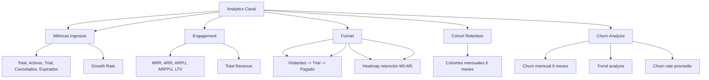

---
tags:
  - "kanban/done"
  - "type/task"
  - "domain/CRE"
  - "priority/P0"
parent: "[[desarrollo]]"
children: []
depends_on:
  - "[[CRE-001]]"
  - "[[CRE-003]]"
  - "[[CRE-004]]"
blocks:
  - "[[CRE-006]]"
  - "[[ADM-012]]"
status: "done"
assignee: "@dev"
created: "2026-08-04"
updated: "2026-08-05"
---

# [[CRE-005]] Analytics Canal: Cohort Retention, Revenue Per User, Funnel Conversión

## Descripción
Implementar analytics avanzadas por canal: cohort retention analysis, revenue per user (ARPU/ARPPU), funnel de conversión (visitante → trial → pagado), métricas de engagement.

## Código de Ejemplo
```php
// app/Domains/Creadores/Services/AnalyticsService.php
namespace App\Domains\Creadores\Services;

class AnalyticsService
{
    public function getChannelMetrics(ChannelPago $channel): array
    {
        return [
            'subscribers' => $this->getSubscriberMetrics($channel),
            'revenue' => $this->getRevenueMetrics($channel),
            'engagement' => $this->getEngagementMetrics($channel),
            'funnel' => $this->getFunnelMetrics($channel),
            'cohort_retention' => $this->getCohortRetention($channel, 6),
            'churn_analysis' => $this->getChurnAnalysis($channel),
        ];
    }

    private function getSubscriberMetrics(ChannelPago $channel): array
    {
        $active = $channel->subscriptions()->where('status', 'active')->count();
        $trial = $channel->subscriptions()->where('status', 'trial')->count();
        $cancelled = $channel->subscriptions()->where('status', 'cancelled')->count();
        $expired = $channel->subscriptions()->where('status', 'expired')->count();
        
        return [
            'total' => $channel->subscriptions()->count(),
            'active' => $channel->subscriptions()->where('status', 'active')->count(),
            'trial' => $trial,
            'cancelled' => $cancelled,
            'expired' => $expired,
            'growth_rate' => $this->calculateGrowthRate($channel),
        ];
    }

    private function getRevenueMetrics(ChannelPago $channel): array
    {
        $mrr = $channel->subscriptions()->where('status', 'active')->sum('price');
        $arr = $mrr * 12;
        
        $arpu = $channel->subscriptions()->where('status', 'active')->count() > 0
            ? $channel->subscriptions()->where('status', 'active')->avg('price')
            : 0;
        
        $arppu = $channel->subscriptions()
            ->where('status', 'active')
            ->whereHas('payments', fn($q) => $q->where('status', 'approved'))
            ->avg('price') ?? 0;

        $ltv = $this->calculateLTV($channel);
        
        return [
            'mrr' => $channel->subscriptions()->where('status', 'active')->sum('price'),
            'arr' => $mrr * 12,
            'arpu' => round($arpu, 2),
            'arppu' => round($arppu, 2),
            'ltv' => round($ltv, 2),
            'total_revenue' => \App\Models\Payment::whereHas('subscription.channel', fn($q) => $q->where('id', $channel->id))
                ->where('status', 'approved')
                ->sum('amount'),
        ];
    }

    private function getEngagementMetrics(ChannelPago $channel): array
    {
        return [
            'avg_session_duration' => 0, // TODO: implementar con analytics
            'sessions_per_user' => 0,
            'messages_per_user' => 0,
            'content_consumption_rate' => 0,
        ];
    }

    private function getFunnelMetrics(ChannelPago $channel): array
    {
        $visitors = 1000; // TODO: Google Analytics / Plausible
        $trials = $channel->subscriptions()->where('status', 'trial')->count();
        $paid = $channel->subscriptions()->where('status', 'active')->count();
        
        return [
            'visitors' => $visitors,
            'trial_started' => $trial,
            'trial_to_paid' => $trial > 0 ? round(($paid / $trial) * 100, 1) : 0,
            'visitor_to_trial' => $visitors > 0 ? round(($trial / $visitors) * 100, 1) : 0,
            'visitor_to_paid' => $visitors > 0 ? round(($paid / $visitors) * 100, 1) : 0,
        ];
    }

    private function getCohortRetention(ChannelPago $channel, int $months): array
    {
        $cohorts = [];
        for ($i = $months - 1; $i >= 0; $i--) {
            $monthStart = now()->subMonths($i)->startOfMonth();
            $monthEnd = $monthStart->copy()->endOfMonth();

            $cohortSubs = $channel->subscriptions()
                ->whereBetween('created_at', [$monthStart, $monthEnd])
                ->get();

            if ($cohortSubs->isEmpty()) continue;

            $retention = [];
            for ($m = 0; $m < $months; $m++) {
                $checkDate = $monthStart->copy()->addMonths($m);
                $retained = $cohortSubs->filter(function ($sub) use ($checkDate) {
                    return $sub->status === 'active' && $sub->created_at <= $checkDate;
                })->count();
                
                $retention[] = $cohortSubs->count() > 0 
                    ? round($retained / $cohortSubs->count() * 100, 1) 
                    : 0;
            }

            $cohorts[] = [
                'month' => $monthStart->format('M Y'),
                'size' => $cohortSubs->count(),
                'retention' => $retention,
            ];
        }
        return $cohorts;
    }

    private function getChurnAnalysis(ChannelPago $channel): array
    {
        $monthlyChurn = [];
        for ($i = 5; $i >= 0; $i--) {
            $month = now()->subMonths($i);
            $startOfMonth = $month->startOfMonth();
            $endOfMonth = $month->endOfMonth();

            $activeAtStart = $channel->subscriptions()
                ->where('status', 'active')
                ->where('created_at', '<', $startOfMonth)
                ->count();

            $cancelled = $channel->subscriptions()
                ->where('status', 'cancelled')
                ->whereBetween('cancelled_at', [$startOfMonth, $endOfMonth])
                ->count();

            $rate = $activeAtStart > 0 ? round(($cancelled / $activeAtStart) * 100, 1) : 0;

            $monthlyChurn[] = [
                'month' => $month->format('M Y'),
                'rate' => $rate,
                'cancelled' => $cancelled,
                'active_start' => $activeAtStart,
            ];
        }

        return [
            'monthly' => $monthlyChurn,
            'avg_churn' => collect($monthlyChurn)->avg('rate'),
            'trend' => $this->calculateChurnTrend($channel),
        };
    }
}
```

```blade
{{-- resources/views/domains/creadores/channels/analytics.blade.php --}}
@extends('layouts.dashboard')

@section('content')
<div class="container mx-auto px-4 py-8">
    <div class="mb-8">
        <h1 class="text-2xl font-bold text-text-primary">Analytics: {{ $channel->name }}</h1>
        <p class="text-text-secondary">Métricas detalladas de tu canal</p>
    </div>

    {{-- KPIs --}}
    <div class="grid grid-cols-1 sm:grid-cols-2 lg:grid-cols-4 gap-6 mb-8">
        @foreach([
            ['label' => 'Suscriptores Activos', 'value' => $metrics['subscribers']['active'], 'icon' => 'users', 'color' => 'info'],
            ['label' => 'MRR', 'value' => '$' . number_format($metrics['revenue']['mrr'], 2), 'icon' => 'currency-dollar', 'color' => 'accent'],
            ['label' => 'ARPU', 'value' => '$' . number_format($metrics['revenue']['arpu'], 2), 'icon' => 'user', 'color' => 'info'],
            ['label' => 'Churn Rate', 'value' => $churnRate . '%', 'icon' => 'trending-down', 'color' => 'error'],
        ] as $kpi)
        <div class="card card--elevated p-6">
            <p class="text-sm text-text-secondary">{{ $kpi['label'] }}</p>
            <p class="text-3xl font-bold text-text-primary">{{ $kpi['value'] }}</p>
        </div>
        @endforeach
    </div>

    <div class="grid lg:grid-cols-2 gap-6 mb-8">
        {{-- Funnel --}}
        <div class="card card--elevated p-6">
            <h2 class="text-xl font-semibold mb-4">Funnel de Conversión</h2>
            <div class="space-y-4">
                @foreach([
                    ['label' => 'Visitantes', 'value' => $metrics['funnel']['visitors'], 'rate' => 100],
                    ['label' => 'Iniciaron Trial', 'value' => $metrics['funnel']['trial_started'], 'rate' => $metrics['funnel']['visitor_to_trial']],
                    ['label' => 'Convertidos a Pago', 'value' => $metrics['funnel']['paid'], 'rate' => $metrics['funnel']['trial_to_paid']],
                ] as $step)
                <div class="flex items-center justify-between">
                    <div class="flex items-center gap-3">
                        <div class="w-8 h-8 rounded-full bg-accent-100 dark:bg-accent-900/30 flex items-center justify-center">
                            <x-icon name="user-plus" class="w-4 h-4 text-accent-primary" />
                        </div>
                        <div>
                            <p class="font-medium text-text-primary">{{ $step['label'] }}</p>
                            <p class="text-sm text-text-secondary">{{ $step['value'] }}</p>
                        </div>
                    </div>
                    <div class="text-right">
                        <div class="w-32 h-2 bg-bg-tertiary rounded-full overflow-hidden">
                            <div class="h-full bg-accent-primary" style="width: {{ $step['rate'] }}%"></div>
                        </div>
                        <span class="text-xs text-text-muted">{{ $step['rate'] }}%</span>
                    </div>
                </div>
                @endforeach
            </div>
        </div>

        {{-- Cohort Retention --}}
        <div class="card card--elevated p-6">
            <h2 class="text-xl font-semibold mb-4">Retención por Cohortes (6 meses)</h2>
            <div class="overflow-x-auto">
                <table class="w-full text-sm">
                    <thead class="bg-bg-tertiary">
                        <tr>
                            <th class="p-3 text-left">Cohorte</th>
                            <th class="p-3 text-right">Tamaño</th>
                            @for($m = 0; $m < 6; $m++)
                            <th class="p-3 text-center">M{{ $m }}</th>
                            @endfor
                        </tr>
                    </thead>
                    <tbody class="divide-y divide-border-primary">
                        @foreach($metrics['cohort_retention'] as $cohort)
                        <tr class="hover:bg-bg-tertiary">
                            <td class="p-3 font-medium text-text-primary">{{ $cohort['month'] }}</td>
                            <td class="p-3 text-right text-text-secondary">{{ $cohort['size'] }}</td>
                            @foreach($cohort['retention'] as $rate)
                            <td class="p-3 text-center {{ $rate >= 50 ? 'text-success' : ($rate >= 25 ? 'text-warning' : 'text-error') }}">
                                {{ $rate }}%
                            </td>
                            @endforeach
                        </tr>
                        @endforeach
                    </tbody>
                </table>
            </div>
        </div>
    </div>

    <div class="grid lg:grid-cols-2 gap-6 mb-8">
        {{-- Churn Analysis --}}
        <div class="card card--elevated p-6">
            <h2 class="text-xl font-semibold mb-4">Análisis de Churn (6 meses)</h2>
            <div class="h-64" id="churn-chart"></div>
            <div class="mt-4 space-y-2">
                @foreach($metrics['churn_analysis']['monthly'] as $month)
                <div class="flex justify-between">
                    <span>{{ $month['month'] }}</span>
                    <span class="{{ $month['rate'] >= 10 ? 'text-error' : ($month['rate'] >= 5 ? 'text-warning' : 'text-success') }}">
                        {{ $month['rate'] }}% ({{ $month['cancelled'] }}/{{ $month['active_start'] }})
                    </span>
                </div>
                @endforeach
            </div>
        </div>

        {{-- Revenue Metrics --}}
        <div class="card card--elevated p-6">
            <h2 class="text-xl font-semibold mb-4">Métricas de Ingresos</h2>
            <div class="grid grid-cols-2 gap-4">
                <div class="p-4 bg-bg-tertiary rounded-lg">
                    <p class="text-sm text-text-secondary">MRR</p>
                    <p class="text-2xl font-bold text-text-primary">${{ number_format($metrics['revenue']['mrr'], 2) }}</p>
                </div>
                <div class="p-4 bg-bg-tertiary rounded-lg">
                    <p class="text-sm text-text-secondary">ARR</p>
                    <p class="text-2xl font-bold text-text-primary">${{ number_format($metrics['revenue']['arr'], 2) }}</p>
                </div>
                <div class="p-4 bg-bg-tertiary rounded-lg">
                    <p class="text-sm text-text-secondary">ARPU</p>
                    <p class="text-2xl font-bold text-text-primary">${{ number_format($metrics['revenue']['arpu'], 2) }}</p>
                </div>
                <div class="p-4 bg-bg-tertiary rounded-lg">
                    <p class="text-sm text-text-secondary">ARPPU</p>
                    <p class="text-2xl font-bold text-text-primary">${{ number_format($metrics['revenue']['arppu'], 2) }}</p>
                </div>
                <div class="p-4 bg-bg-tertiary rounded-lg">
                    <p class="text-sm text-text-secondary">LTV</p>
                    <p class="text-2xl font-bold text-text-primary">${{ number_format($metrics['revenue']['ltv'], 2) }}</p>
                </div>
                <div class="p-4 bg-bg-tertiary rounded-lg">
                    <p class="text-sm text-text-secondary">Total Revenue</p>
                    <p class="text-2xl font-bold text-text-primary">${{ number_format($metrics['revenue']['total_revenue'], 2) }}</p>
                </div>
            </div>
        </div>
    </div>

    {{-- Churn Analysis Chart --}}
    <div class="card card--elevated p-6">
        <h2 class="text-xl font-semibold mb-4">Análisis de Churn (6 meses)</h2>
        <div class="h-80" id="churn-trend-chart"></div>
    </div>
</div>
@endsection
```

## Diagramas Mermaid


## Criterios de Aceptación
- [ ] Subscriber Metrics: total, activos, trial, cancelados, expirados, growth rate
- [ ] Revenue Metrics: MRR, ARR, ARPU, ARPPU, LTV, Total Revenue
- [ ] Funnel: visitantes → trial → pago, tasas conversión por etapa
- [ ] Cohort Retention: 6 meses, heatmap colores (verde >50%, amarillo 25-50%, rojo <25%)
- [ ] Churn Analysis: 6 meses, tasa mensual, tendencia, badges semáforo
- [ ] Gráficos interactivos: Chart.js/ApexCharts, tooltips, responsive
- [ ] Export CSV/PDF de métricas (opcional v1.1)

## Notas Técnicas
- Cohort retention: cohort = usuarios que se suscribieron en mismo mes
- Churn rate: cancelados_mes / activos_inicio_mes * 100
- LTV = ARPU / churn_rate (mensual)
- ARPPU = revenue / usuarios_pagantes_unicos
- Cache 1 hora para métricas pesadas
- Jobs programados para pre-calcular métricas pesadas

## Enlaces
- [[CRE-002]] Dashboard (KPIs resumen)
- [[CRE-004]] Gestión suscripciones (datos fuente)
- [[CRE-006]] Retiros (usa datos revenue)
- [[ADM-012]] Reportes fiscales (paralelo admin)