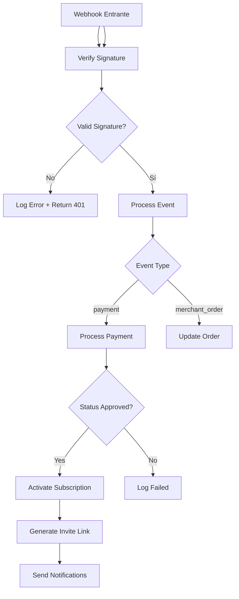

---
tags:
  - "kanban/done"
  - "type/task"
  - "domain/CRE"
  - "priority/P0"
parent: "[[desarrollo]]"
children: []
depends_on:
  - "[[CRE-006]]"
  - "[[CRE-011]]"
  - "[[PUB-008]]"
blocks:
  - "[[CRE-013]]"
  - "[[ADM-012]]"
  - "[[CRM-012]]"
status: "done"
assignee: "@dev"
created: "2026-08-04"
updated: "2026-08-05"
---

# [[CRE-007]] Webhooks Entrantes: Logs, Reintentar, Debugging, Firma Verificación

## Descripción
Implementar sistema de webhooks entrantes para creadores: logging completo, reintento automático, debugging, verificación de firma.

## Código de Ejemplo
```php
// app/Models/WebhookLog.php
class WebhookLog extends Model
{
    protected $fillable = [
        'channel_pago_id', 'gateway', 'event_type', 'payload',
        'headers', 'response_code', 'response_body', 'processed',
        'error_message', 'retry_count', 'processed_at',
    ];

    protected $casts = [
        'payload' => 'array',
        'headers' => 'array',
        'processed' => 'boolean',
    ];

    public function channel() { return $this->belongsTo(ChannelPago::class); }
}
```

```php
// app/Services/WebhookProcessor.php
class WebhookProcessor
{
    public function process(string $gateway, array $payload): array
    {
        // Log entrada
        $log = WebhookLog::create([
            'gateway' => $gateway,
            'payload' => $payload,
            'headers' => request()->headers->all(),
        ]);

        try {
            $result = $this->handle($gateway, $payload);
            
            $log->update([
                'processed' => true,
                'processed_at' => now(),
                'response_code' => 200,
            ]);
            
            return $result;
        } catch (\Exception $e) {
            $log->update([
                'processed' => false,
                'error_message' => $e->getMessage(),
                'retry_count' => $log->retry_count + 1,
            ]);
            
            // Reintento automático (máx 3)
            if ($log->retry_count < 3) {
                ProcessWebhook::dispatch($gateway, $payload, request()->headers->all())
                    ->delay(now()->addMinutes(5 * $log->retry_count));
            }
            
            throw $e;
        }
    }
}
```

```php
// app/Services/MercadoPagoWebhookHandler.php
class MercadoPagoWebhookHandler
{
    public function handle(array $payload): void
    {
        $topic = $payload['topic'] ?? '';
        
        if ($topic === 'payment') {
            $paymentId = $payload['data']['id'];
            $payment = $this->getPayment($paymentId);
            
            if ($payment['status'] === 'approved') {
                $this->activateSubscription($payment['external_reference']);
            }
        }
    }
    
    private function verifySignature(array $payload, string $signature): bool
    {
        // Validar firma HMAC SHA256 de MercadoPago
        $manifest = $this->buildManifest($payload);
        $expected = hash_hmac('sha256', $manifest, config('mercadopago.webhook_secret'));
        
        return hash_equals($expected, $signature);
    }
}
```

## Diagramas Mermaid


## Criterios de Aceptación
- [ ] Log completo: request/response, headers, timestamps
- [ ] Verificación firma HMAC SHA256 (MercadoPago, Stripe, PayPal)
- [ ] Reintento automático: max 3 intentos, backoff exponencial
- [ ] Dead letter queue para fallos persistentes
- [ ] Dashboard debugging: ver payload, response, errors
- [ ] Reprocesar manualmente desde UI
- [ ] Alertas: Slack/Telegram si fallos > threshold
- [ ] Métricas: latency, success rate, error rate

## Notas Técnicas
- Idempotencia: external_reference único por suscripción
- Queue: `ProcessWebhook` job con retry 3x, backoff exponencial
- Signature verification: HMAC SHA256 (MP), stripe-signature (Stripe), paypal-signature (PayPal)
- Dead letter queue para fallos > 3 retries

## Enlaces
- [[CRE-011]] Config pasarelas creador
- [[CRE-013]] Facturación creadores
- [[CRE-016]] Ciclos de cobro
- [[PUB-007]] Webhook handler público
- [[PUB-014]] MercadoPago webhook validation