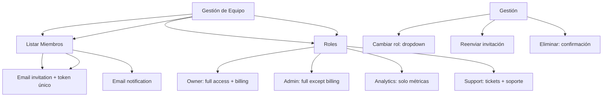

---
tags:
  - "kanban/done"
  - "type/task"
  - "domain/CRE"
  - "priority/P0"
parent: "[[desarrollo]]"
children: []
depends_on:
  - "[[CRE-009]]"
  - "[[FUN-005]]"
  - "[[FUN-006]]"
blocks:
  - "[[CRE-013]]"
status: "done"
assignee: "@dev"
created: "2026-08-04"
updated: "2026-08-05"
---

# [[CRE-010]] Equipo: Invitar Colaboradores (Roles: Owner, Admin, Analytics, Support)

## Descripción
Implementar gestión de equipo para creadores: invitar colaboradores con roles específicos (Owner, Admin, Analytics, Support), gestión de invitaciones y permisos.

## Código de Ejemplo
```php
// app/Models/ChannelTeam.php
class ChannelTeam extends Model
{
    protected $fillable = [
        'channel_pago_id', 'user_id', 'role', 'invited_by', 'accepted_at', 'token',
    ];

    protected $casts = [
        'accepted_at' => 'datetime',
        'invited_at' => 'datetime',
    ]

    public function channel() { return $this->belongsTo(ChannelPago::class); }
    public function user() { return $this->belongsTo(User::class); }
    public function inviter() { return $this->belongsTo(User::class, 'invited_by'); }
}
```

```php
// app/Domains/Creadores/Http/Controllers/TeamController.php
namespace App\Domains\Creadores\Http\Controllers;

class TeamController extends Controller
{
    public function index(ChannelPago $channel)
    {
        $this->authorize('manage', $channel);
        $members = $channel->team()->with('user')->get();
        return view('domains.creadores.channels.team.index', compact('channel', 'members'));
    }

    public function invite(ChannelPago $channel, InviteRequest $request)
    {
        $this->authorize('manage', $channel);

        $user = User::where('email', $request->email)->first();
        
        $member = $channel->team()->create([
            'user_id' => $user?->id,
            'invited_by' => auth()->id(),
            'role' => $request->role,
            'token' => Str::random(64),
            'invited_at' => now(),
        ]);

        // Enviar email de invitación
        \Mail::to($request->email)->send(new \App\Mail\ChannelInvitationMail($channel, $member));

        return redirect()->back()->with('success', 'Invitación enviada');
    }

    public function update(ChannelPago $channel, ChannelTeam $member, TeamUpdateRequest $request)
    {
        $this->authorize('manage', $channel);
        $member->update($request->validated(['role']));
        return back()->with('success', 'Rol actualizado');
    }

    public function remove(ChannelPago $channel, ChannelTeam $member)
    {
        $this->authorize('manage', $channel);
        
        if ($member->role === 'owner') {
            return back()->with('error', 'No puedes eliminar al owner');
        }

        $member->delete();
        return back()->with('success', 'Miembro eliminado');
    }

    public function resendInvitation(ChannelPago $channel, ChannelTeam $member)
    {
        $this->authorize('manage', $channel);
        
        $member->update(['token' => Str::random(64), 'invited_at' => now()]);
        
        \Mail::to($member->user->email)->send(
            new \App\Mail\ChannelInvitationMail($channel, $member)
        );

        return back()->with('success', 'Invitación reenviada');
    }
}
```

```blade
{{-- resources/views/domains/creadores/channels/team/index.blade.php --}}
@extends('layouts.dashboard')

@section('content')
<div class="container mx-auto px-4 py-8">
    <div class="mb-8 flex justify-between items-center">
        <div>
            <h1 class="text-2xl font-bold text-text-primary">Equipo de {{ $channel->name }}</h1>
            <p class="text-text-secondary">Gestiona colaboradores y permisos</p>
        </div>
        <a href="{{ route('creadores.channels.team.invite', $channel) }}" class="btn btn--primary">
            <x-icon name="plus" class="w-4 h-4 mr-2" />
            Invitar Colaborador
        </a>
    </div>

    <div class="card card--elevated overflow-hidden">
        @if($members->isEmpty())
        <div class="p-12 text-center">
            <x-empty-state 
                illustration="empty-team"
                title="Sin colaboradores"
                description="Invita a tu equipo para gestionar el canal juntos"
                cta_text="Invitar colaborador"
                cta_url="{{ route('creadores.channels.team.invite', $channel) }}"
            />
        </div>
        @else
        <div class="overflow-x-auto">
            <table class="w-full">
                <thead class="bg-bg-tertiary">
                    <tr>
                        <th class="p-4 text-left text-sm font-semibold text-text-secondary">Miembro</th>
                        <th class="p-4 text-center text-sm font-semibold text-text-secondary">Rol</th>
                        <th class="p-4 text-center text-sm font-semibold text-text-secondary">Estado</th>
                        <th class="p-4 text-center text-sm font-semibold text-text-secondary">Invitado</th>
                        <th class="p-4 text-center text-sm font-semibold text-text-secondary">Acciones</th>
                    </tr>
                </thead>
                <tbody class="divide-y divide-border-primary">
                    @foreach($members as $member)
                    <tr class="hover:bg-bg-tertiary">
                        <td class="p-4">
                            <div class="flex items-center gap-3">
                                user->avatar_url ?? asset('images/default-avatar.png') }}" alt="" class="w-10 h-10 rounded-full">
                                <div>
                                    <p class="font-medium text-text-primary">{{ $member->user->name }}</p>
                                    <p class="text-sm text-text-secondary">{{ $member->user->email }}</p>
                                </div>
                            </div>
                        </td>
                        <td class="p-4 text-center">
                            <select class="select select--sm" onchange="updateRole({{ $member->id }}, this.value)" {{ $member->role === 'owner' ? 'disabled' : '' }}>
                                @foreach(['owner' => 'Owner', 'admin' => 'Admin', 'analytics' => 'Analytics', 'support' => 'Support'] as $key => $label)
                                <option value="{{ $key }}" {{ $member->role === $key ? 'selected' : '' }} {{ $member->role === 'owner' && $key !== 'owner' ? 'disabled' : '' }}>
                                    {{ $label }}
                                </option>
                                @endforeach
                            </select>
                        </td>
                        <td class="p-4 text-center">
                            @if($member->accepted_at)
                            <span class="badge badge--success">Activo</span>
                            @else
                            <span class="badge badge--warning">Pendiente</span>
                            @endif
                        </td>
                        <td class="p-4 text-center text-sm text-text-muted">{{ $member->invited_at->diffForHumans() }}</td>
                        <td class="p-4 text-center">
                            <div class="flex items-center justify-center gap-2">
                                @if(!$member->accepted_at)
                                <button onclick="resendInvite({{ $member->id }})" class="btn btn--ghost btn--sm text-info" title="Reenviar invitación">
                                    <x-icon name="mail" class="w-4 h-4" />
                                </button>
                                @endif
                                @if($member->role !== 'owner')
                                <button onclick="removeMember({{ $member->id }})" class="btn btn--ghost btn--sm text-error" title="Eliminar">
                                    <x-icon name="user-minus" class="w-4 h-4" />
                                </button>
                                @endif
                            </div>
                        </td>
                    </tr>
                    @endforeach
                </tbody>
            </table>
        </div>
        @endif
    </div>
</div>
@endsection

@push('scripts')
<script>
function removeMember(id) {
    if (confirm('¿Eliminar a este colaborador?')) {
        fetch(`/creadores/channels/{{ $channel->id }}/team/${id}`, {
            method: 'DELETE',
            headers: { 'X-CSRF-TOKEN': '{{ csrf_token() }}', 'Content-Type': 'application/json' }
        }).then(() => location.reload());
    }
}

function updateRole(memberId, role) {
    fetch(`/creadores/channels/{{ $channel->id }}/team/${memberId}`, {
        method: 'PUT',
        headers: { 'Content-Type': 'application/json', 'X-CSRF-TOKEN': '{{ csrf_token() }}' },
        body: JSON.stringify({ role })
    }).then(() => location.reload());
}
</script>
@endpush
```

## Diagramas Mermaid


## Criterios de Aceptación
- [ ] Invitar: email + rol (owner/admin/analytics/support), email único por canal
- [ ] Roles: Owner (facturación + todo), Admin (todo menos billing), Analytics (solo métricas), Support (tickets + soporte)
- [ ] Invitación: email único, token único, expiración 7 días, email con link
- [ ] Pendiente: badge "Pendiente", reenviar invitación
- [ ] Activo: badge "Activo", muestra fecha aceptación
- [ ] Cambiar rol: dropdown, owner no editable
- [ ] Eliminar: confirmación, no permite borrar owner
- [ ] Reenviar invitación: regenera token, reenvía email
- [ ] Permisos: policy TeamPolicy (owner/admin gestionan)

## Notas Técnicas
- Token único por invitación (64 chars, crypto random)
- Expiración invitación: 7 días
- Owner inmutable (no se puede cambiar/borrar)
- Notificaciones: email + Telegram (si configurado)
- Policy: ChannelTeamPolicy (view, invite, update, delete)

## Enlaces
- [[CRE-009]] Configuración marca blanca (pestaña adyacente)
- [[CRE-011]] Configuración pasarelas (pestaña adyacente)
- [[CRE-013]] Facturación (usa equipo para facturas)
- [[CRE-016]] Ciclos de cobro (equipo recibe notificaciones)