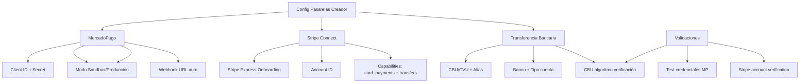

---
tags:
  - "kanban/done"
  - "type/task"
  - "domain/CRE"
  - "priority/P0"
parent: "[[desarrollo]]"
children: []
depends_on:
  - "[[CRE-006]]"
  - "[[FUN-008]]"
  - "[[INS-011]]"
  - "[[PUB-014]]"
blocks:
  - "[[CRE-015]]"
status: "done"
assignee: "@dev"
created: "2026-08-04"
updated: "2026-08-05"
---

# [[CRE-011]] Configuración Pasarelas de Pago Creador: MercadoPago, Stripe Connect, Transferencias

## Descripción
Implementar panel de configuración de pasarelas de pago para creadores: MercadoPago (credenciales, webhook URL), Stripe Connect (onboarding), transferencias bancarias (CBU/CVU).

## Código de Ejemplo
```php
// app/Domains/Creadores/Http/Controllers/PaymentGatewayController.php
namespace App\Domains\Creadores\Http\Controllers;

use App\Domains\Creadores\Services\PaymentGatewayService;
use App\Models\ChannelPago;

class PaymentGatewayController extends Controller
{
    public function __construct(protected PaymentGatewayService $gatewayService) {}

    public function index(ChannelPago $channel)
    {
        $this->authorize('manage', $channel);
        $gateways = $this->gatewayService->getConfiguredGateways($channel);
        return view('domains.creadores.channels.gateways.index', compact('channel', 'gateways'));
    }

    public function mercadopagoConfig(ChannelPago $channel)
    {
        $this->authorize('manage', $channel);
        return view('domains.creadores.channels.gateways.mercadopago', compact('channel'));
    }

    public function mercadopagoSave(ChannelPago $channel, MercadopagoConfigRequest $request)
    {
        $this->authorize('manage', $channel);
        $this->gatewayService->saveMercadopagoConfig($channel, $request->validated());
        return redirect()->back()->with('success', 'MercadoPago configurado correctamente');
    }

    public function stripeConnect(ChannelPago $channel)
    {
        $this->authorize('manage', $channel);
        $url = $this->gatewayService->getStripeConnectOnboardingUrl($channel);
        return redirect($url);
    }

    public function bankTransferConfig(ChannelPago $channel)
    {
        $this->authorize('manage', $channel);
        return view('domains.creadores.channels.gateways.bank-transfer', compact('channel'));
    }

    public function bankTransferSave(ChannelPago $channel, BankTransferConfigRequest $request)
    {
        $this->authorize('manage', $channel);
        $this->gatewayService->saveBankTransferConfig($channel, $request->validated());
        return redirect()->back()->with('success', 'Transferencia bancaria configurada');
    }
}
```

```php
// app/Domains/Creadores/Services/PaymentGatewayService.php
namespace App\Domains\Creadores\Services;

use App\Models\ChannelPago;
use Illuminate\Support\Facades\Crypt;

class PaymentGatewayService
{
    public function getConfiguredGateways(ChannelPago $channel): array
    {
        return [
            'mercadopago' => $channel->mercadopago_client_id ? [
                'configured' => true,
                'client_id' => $channel->mercadopago_client_id,
                'mode' => $channel->mercadopago_mode ?? 'sandbox',
            ] : ['configured' => false],

            'stripe' => $channel->stripe_account_id ? [
                'configured' => true,
                'account_id' => $channel->stripe_account_id,
            ] : ['configured' => false],

            'bank_transfer' => $channel->bank_cbu_cvu ? [
                'configured' => true,
                'cbu_cvu' => $channel->bank_cbu_cvu,
                'alias' => $channel->bank_alias,
                'bank_name' => $channel->bank_name,
                'account_type' => $channel->bank_account_type,
            ] : ['configured' => false],
        ];
    }

    public function saveMercadopagoConfig(ChannelPago $channel, array $data): void
    {
        $channel->update([
            'mercadopago_client_id' => $data['client_id'],
            'mercadopago_client_secret' => Crypt::encryptString($data['client_secret']),
            'mercadopago_access_token' => Crypt::encryptString($data['access_token']),
            'mercadopago_public_key' => Crypt::encryptString($data['public_key']),
            'mercadopago_mode' => $data['mode'] ?? 'sandbox',
            'mercadopago_webhook_url' => route('webhooks.mercadopago', $channel),
        ]);
    }

    public function getStripeConnectOnboardingUrl(ChannelPago $channel): string
    {
        $stripe = new \Stripe\StripeClient(config('services.stripe.secret'));
        $accountLink = $stripe->accountLinks->create([
            'account' => $channel->stripe_account_id ?? $this->createStripeAccount($channel),
            'refresh_url' => route('creadores.channels.gateways.stripe.refresh', $channel),
            'return_url' => route('creadores.channels.gateways.index', $channel),
            'type' => 'account_onboarding',
        ]);
        return $accountLink->url;
    }

    public function saveBankTransferConfig(ChannelPago $channel, array $data): void
    {
        $channel->update([
            'bank_cbu_cvu' => $data['cbu_cvu'],
            'bank_alias' => $data['alias'] ?? null,
            'bank_name' => $data['bank_name'],
            'bank_account_type' => $data['account_type'], // caja_ahorro, cuenta_corriente
            'bank_holder_name' => $data['holder_name'],
            'bank_holder_cuit_cuil' => $data['holder_cuit_cuil'],
        ]);
    }

    private function createStripeAccount(ChannelPago $channel): string
    {
        $stripe = new \Stripe\StripeClient(config('services.stripe.secret'));
        $account = $stripe->accounts->create([
            'type' => 'express',
            'country' => 'AR',
            'email' => $channel->owner->email,
            'capabilities' => ['card_payments' => ['requested' => true], 'transfers' => ['requested' => true]],
            'business_type' => 'individual',
            'business_profile' => [
                'name' => $channel->name,
                'url' => route('channels.show', $channel->slug),
            ],
        ]);
        $channel->update(['stripe_account_id' => $account->id]);
        return $account->id;
    }
}
```

```blade
{{-- resources/views/domains/creadores/channels/gateways/mercadopago.blade.php --}}
@extends('layouts.dashboard')

@section('content')
<div class="container mx-auto px-4 py-8 max-w-3xl">
    <div class="mb-8">
        <h1 class="text-2xl font-bold text-text-primary">Configurar MercadoPago</h1>
        <p class="text-text-secondary">Conecta tu cuenta de MercadoPago para recibir pagos de tus suscriptores.</p>
    </div>

    <div class="card card--elevated p-6">
        <h2 class="text-xl font-semibold mb-4">Credenciales de Producción</h2>
        <form action="{{ route('creadores.channels.gateways.mercadopago.save', $channel) }}" method="POST" class="space-y-4">
            @csrf
            @method('PUT')
            
            <div>
                <label class="label">Client ID</label>
                <input type="text" name="client_id" class="input" value="{{ old('client_id', $channel->mercadopago_client_id) }}" required>
            </div>
            
            <div>
                <label class="label">Client Secret</label>
                <input type="password" name="client_secret" class="input" required>
            </div>

            <div>
                <label class="label">Access Token</label>
                <input type="password" name="access_token" class="input" required>
            </div>

            <div>
                <label class="label">Public Key</label>
                <input type="text" name="public_key" class="input" value="{{ old('public_key') }}" required>
            </div>

            <div>
                <label class="flex items-center gap-2">
                    <input type="checkbox" name="test_mode" class="checkbox" {{ old('test_mode', $channel->mercadopago_mode === 'sandbox') ? 'checked' : '' }}>
                    <span class="label">Modo Sandbox (pruebas)</span>
                </label>
            </div>

            <div class="pt-4 border-t border-border-primary">
                <button type="submit" class="btn btn--primary">Guardar configuración</button>
            </div>
        </form>
    </div>

    <div class="mt-6 card card--outlined p-6">
        <h3 class="font-semibold mb-2">Webhook URL</h3>
        <p class="text-sm text-text-secondary mb-2">Configura esta URL en tu panel de MercadoPago > Configuración > Notificaciones</p>
        <div class="flex gap-2">
            <input type="text" value="{{ route('webhooks.mercadopago', $channel) }}" class="input flex-1 font-mono text-sm" readonly>
            <button class="btn btn--ghost btn--sm" onclick="navigator.clipboard.writeText('{{ route('webhooks.mercadopago', $channel) }}')">
                <x-icon name="copy" class="w-4 h-4" />
            </button>
        </div>
    </div>
</div>
@endsection
```

## Diagramas Mermaid


## Criterios de Aceptación
- [ ] MercadoPago: Client ID, Client Secret, Access Token, Public Key, modo Sandbox/Producción
- [ ] Webhook URL autogenerada y copiable para panel MercadoPago
- [ ] Stripe Connect: Onboarding Express, account ID, capabilities card_payments + transfers
- [ ] Transferencia Bancaria: CBU/CVU (22 dígitos), Alias CBU, Banco, Tipo cuenta (caja_ahorro/cuenta_corriente), Titular, CUIT/CUIL
- [ ] Validación algoritmo CBU (verificación dígito verificador)
- [ ] Test de credenciales: botón "Probar conexión" para cada pasarela
- [ ] Tokens encriptados con `Crypt::encryptString()` en BD
- [ ] Vista única por canal: `creadores.channels.gateways.index`
- [ ] Permisos: solo owner/admin del canal pueden configurar

## Notas Técnicas
- MercadoPago SDK PHP para validación credenciales
- Stripe Connect Express para onboarding simplificado
- CBU: 22 dígitos, validar dígito verificador (módulo 10)
- CVU: 22 dígitos, para cuentas virtuales (MercadoPago, Ualá, etc.)
- Alias CBU: 6-20 caracteres alfanuméricos
- Encriptar secrets con `Crypt::encryptString()` / `decryptString()`
- Webhook URL: `route('webhooks.mercadopago', $channel)`

## Enlaces
- [[CRE-001]] Onboarding (paso pagos)
- [[CRE-006]] Retiros (usa pasarelas configuradas)
- [[CRE-012]] Ciclos de cobro
- [[PUB-014]] MercadoPago Argentina
- [[PUB-015]] Transferencias bancarias
- [[INS-011]] Instalador config pasarelas