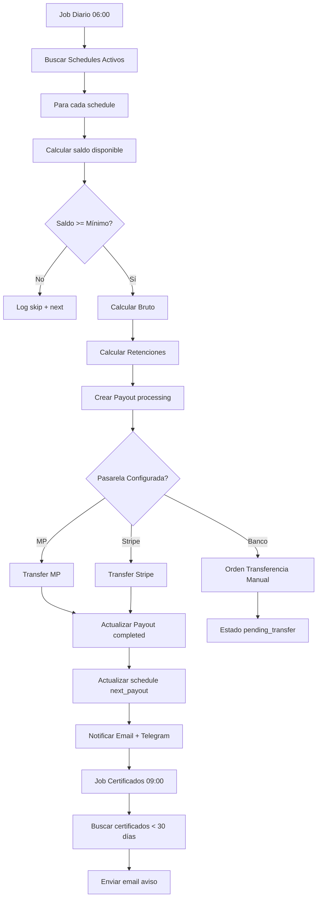

---
tags:
  - "kanban/done"
  - "type/task"
  - "domain/CRE"
  - "priority/P0"
parent: "[[desarrollo]]"
children: []
depends_on:
  - "[[CRE-012]]"
  - "[[CRE-013]]"
  - "[[CRE-015]]"
blocks:
  - "[[ADM-012]]"
status: "done"
assignee: "@dev"
created: "2026-08-04"
updated: "2026-08-05"
---

# [[CRE-016]] Ciclos de Cobro Creador: Frecuencia, Mínimo, Retenciones Automáticas

## Descripción
Implementar lógica completa de ciclos de cobro para creadores: job automático diario, cálculo de retenciones (Ganancias, IVA, IIBB), generación de órdenes de pago, notificaciones.

## Código de Ejemplo
```php
// app/Domains/Creadores/Jobs/ProcessCreatorPayouts.php
namespace App\Domains\Creadores\Jobs;

use App\Models\{ChannelPago, Payout, PayoutSchedule, Subscription, User};
use App\Services\{ArgentineTaxService, MercadoPagoArgentinaService, StripeConnectService};
use Illuminate\Bus\Queueable;
use Illuminate\Contracts\Queue\ShouldQueue;
use Illuminate\Foundation\Bus\Dispatchable;
use Illuminate\Queue\InteractsWithQueue;
use Illuminate\Queue\SerializesModels;
use Illuminate\Support\Facades\DB;
use Illuminate\Support\Facades\Log;

class ProcessCreatorPayouts implements ShouldQueue
{
    use Dispatchable, InteractsWithQueue, Queueable, SerializesModels;

    public function handle(): void
    {
        $schedules = PayoutSchedule::with('channel.owner')
            ->where('is_active', true)
            ->where(function($q) {
                $q->whereNull('next_payout_at')
                  ->orWhere('next_payout_at', '<=', now());
            })
            ->get();

        foreach ($schedules as $schedule) {
            $this->processSchedule($schedule);
        }
    }

    private function processSchedule(PayoutSchedule $schedule): void
    {
        $channel = $schedule->channel;
        $creator = $channel->owner;

        // Calcular saldo disponible (suscripciones activas - retiros previos)
        $availableBalance = $this->calculateAvailableBalance($channel);

        if (!$schedule->canRequestPayout($availableBalance)) {
            Log::info("Payout skipped: insufficient balance", [
                'channel_id' => $channel->id,
                'available' => $availableBalance,
                'minimum' => $schedule->minimum_amount,
            ]);
            return;
        }

        DB::transaction(function () use ($schedule, $channel, $availableBalance) {
            $grossAmount = min($availableBalance, $schedule->getNextPayoutAmount());
            
            // Calcular neto con retenciones
            $taxService = app(\App\Services\ArgentineTaxService::class);
            $creator = $channel->owner;
            
            $taxData = $taxService->calculateWithholdings(
                $grossAmount,
                $creator->taxpayer_type ?? 'consumidor_final',
                $creator->tax_province ?? 'CABA'
            );

            $payout = Payout::create([
                'channel_pago_id' => $channel->id,
                'schedule_id' => $schedule->id,
                'gross_amount' => $grossAmount,
                'platform_fee' => $grossAmount * $schedule->platform_fee_percentage,
                'gateway_fee' => $grossAmount * $schedule->gateway_fee_percentage,
                'fixed_fee' => $schedule->fixed_fee,
                'ganancias_withholding' => $taxData['ganancias'],
                'iva_withholding' => $taxData['iva_retention'],
                'iibb_withholding' => $taxData['iibb'],
                'net_amount' => $taxData['net'],
                'currency' => $schedule->currency,
                'status' => 'processing',
            ]);

            // Procesar pago según pasarela configurada
            $this->executePayout($payout, $channel);

            // Actualizar schedule
            $schedule->update([
                'last_payout_at' => now(),
                'next_payout_at' => $schedule->getNextPayoutDate(),
            ]);

            // Notificar creador
            $this->notifyPayoutProcessed($payout);
        });
    }

    private function calculateAvailableBalance(ChannelPago $channel): float
    {
        $totalEarned = Subscription::where('channel_pago_id', $channel->id)
            ->where('status', 'active')
            ->whereHas('payments', fn($q) => $q->where('status', 'approved'))
            ->sum('price'); // Simplificado: en realidad sumar pagos aprobados

        $totalWithdrawn = Payout::where('channel_pago_id', $channel->id)
            ->whereIn('status', ['completed', 'processing'])
            ->sum('gross_amount');

        return max(0, $totalEarned - $totalWithdrawn);
    }

    private function executePayout(Payout $payout, ChannelPago $channel): void
    {
        $gateways = $channel->configured_gateways ?? [];
        
        if (isset($gateways['mercadopago']) && $gateways['mercadopago']['configured']) {
            $this->payoutViaMercadoPago($payout, $channel);
        } elseif (isset($gateways['stripe']) && $gateways['stripe']['configured']) {
            $this->payoutViaStripe($payout, $channel);
        } elseif (isset($gateways['bank_transfer']) && $gateways['bank_transfer']['configured']) {
            $this->queueBankTransfer($payout, $channel);
        } else {
            throw new \Exception('No hay pasarela de pago configurada para retiros');
        }
    }

    private function payoutViaMercadoPago(Payout $payout, ChannelPago $channel): void
    {
        $mpService = app(\App\Services\MercadoPagoArgentinaService::class);
        
        try {
            $transfer = $mpService->createTransfer([
                'amount' => $payout->net_amount,
                'currency' => 'ARS',
                'destination_account' => $channel->mercadopago_account_id,
                'description' => "Retiro TG-PayGate - Canal {$payout->channel->name}",
            ]);

            $payout->update([
                'status' => 'completed',
                'external_id' => $transfer['id'],
                'completed_at' => now(),
            ]);
        } catch (\Exception $e) {
            $payout->update(['status' => 'failed', 'failure_reason' => $e->getMessage()]);
            throw $e;
        }
    }

    private function queueBankTransfer(Payout $payout, ChannelPago $channel): void
    {
        // Crear orden de transferencia bancaria para procesamiento manual
        \App\Models\BankTransferOrder::create([
            'payout_id' => $payout->id,
            'channel_pago_id' => $payout->channel_pago_id,
            'amount' => $payout->net_amount,
            'currency' => $payout->currency,
            'destination_cbu' => $payout->channel->bank_cbu_cvu,
            'destination_alias' => $payout->channel->bank_alias,
            'beneficiary' => $payout->channel->bank_holder_name,
            'beneficiary_cuit' => $payout->channel->bank_holder_cuit_cuil,
            'bank_name' => $payout->channel->bank_name,
            'status' => 'pending',
            'reference' => "PAYOUT-{$payout->id}-" . now()->format('YmdHis'),
        ]);

        $payout->update(['status' => 'pending_transfer']);
    }

    private function notifyPayoutProcessed(Payout $payout): void
    {
        $creator = $payout->channel->owner;
        \Mail::to($payout->channel->owner->email)->send(
            new \App\Mail\PayoutProcessedMail($payout)
        );

        // Notificación Telegram si configurado
        if ($creator->telegram_id && $creator->settings['notifications']['telegram_payouts'] ?? false) {
            app(\App\Services\TelegramService::class)->sendMessage(
                $creator->telegram_id,
                "💰 Retiro procesado: {$payout->net_amount} ARS netos. Referencia: {$payout->id}"
            );
        }
    }
}
```

```php
// app/Console/Kernel.php - Programar job diario
protected function schedule(Schedule $schedule): void
{
    // Procesar retiros creadores cada día a las 06:00
    $schedule->job(new \App\Domains\Creadores\Jobs\ProcessCreatorPayouts())
        ->dailyAt('06:00')
        ->withoutOverlapping()
        ->runInBackground();

    // Verificar certificados digitales vencimiento (30 días)
    $schedule->call(function () {
        \App\Models\User::whereNotNull('digital_certificate_expires_at')
            ->where('digital_certificate_expires_at', '<=', now()->addDays(30))
            ->where('digital_certificate_expires_at', '>', now())
            ->chunk(100, function ($users) {
                foreach ($users as $user) {
                    \Mail::to($user->email)->send(
                        new \App\Mail\CertificateExpiringMail($user)
                    );
                }
            });
    })->dailyAt('09:00');
}
```

```blade
{{-- resources/views/domains/creadores/channels/payouts/history.blade.php --}}
@extends('layouts.dashboard')

@section('content')
<div class="container mx-auto px-4 py-8">
    <div class="mb-8">
        <h1 class="text-2xl font-bold text-text-primary">Historial de Retiros</h1>
    </div>

    <div class="card card--elevated overflow-hidden">
        <table class="w-full">
            <thead class="bg-bg-tertiary">
                <tr>
                    <th class="p-4 text-left text-sm font-semibold text-text-secondary">Fecha</th>
                    <th class="p-4 text-right text-sm font-semibold text-text-secondary">Bruto</th>
                    <th class="p-4 text-right text-sm font-semibold text-text-secondary">Comisiones</th>
                    <th class="p-4 text-right text-sm font-semibold text-text-secondary">Retenciones</th>
                    <th class="p-4 text-right text-sm font-semibold text-text-secondary">Neto</th>
                    <th class="p-4 text-center text-sm font-semibold text-text-secondary">Estado</th>
                    <th class="p-4 text-center text-sm font-semibold text-text-secondary">Acción</th>
                </tr>
            </thead>
            <tbody class="divide-y divide-border-primary">
                @foreach($payouts as $payout)
                <tr class="hover:bg-bg-tertiary">
                    <td class="p-4 text-sm text-text-primary">{{ $payout->created_at->format('d/m/Y H:i') }}</td>
                    <td class="p-4 text-right text-sm text-text-primary">{{ number_format($payout->gross_amount, 2) }} {{ $payout->currency }}</td>
                    <td class="p-4 text-right text-sm text-text-secondary">
                        {{ number_format($payout->platform_fee + $payout->gateway_fee + $payout->fixed_fee, 2) }}
                    </td>
                    <td class="p-4 text-right text-sm text-text-secondary">
                        {{ number_format($payout->ganancias_withholding + $payout->iva_withholding + $payout->iibb_withholding, 2) }}
                    </td>
                    <td class="p-4 text-right text-sm font-semibold text-text-primary">
                        {{ number_format($payout->net_amount, 2) }} {{ $payout->currency }}
                    </td>
                    <td class="p-4 text-center">
                        <span class="badge badge--{{ match($payout->status)
                            'completed' => 'success'
                            'processing' => 'info'
                            'pending_transfer' => 'warning'
                            'failed' => 'error'
                            default => 'default'
                        }}">{{ ucfirst($payout->status) }}</span>
                    </td>
                    <td class="p-4 text-center">
                        @if($payout->pdf_path)
                        <a href="{{ route('creadores.payouts.download', $payout) }}" class="btn btn--ghost btn--sm">
                            <x-icon name="download" class="w-4 h-4" />
                        </a>
                        @endif
                    </td>
                </tr>
                @endforeach
            </tbody>
        </table>

        {{-- Paginación --}}
        <div class="p-4 border-t border-border-primary">
            {{ $payouts->links() }}
        </div>
    </div>
</div>
@endsection
```

## Diagramas Mermaid


## Criterios de Aceptación
- [ ] Job diario a las 06:00 (Scheduler) procesa todos los schedules activos
- [ ] Cálculo saldo disponible: ingresos aprobados - retiros previos
- [ ] Verificación monto mínimo antes de procesar
- [ ] Cálculo retenciones automático: Ganancias (6% RI), IVA (100%/50%), IIBB provincia
- [ ] Procesamiento por pasarela: MP Transfer, Stripe Connect, Orden Transferencia Manual
- [ ] Actualización schedule: last_payout_at, next_payout_at según frecuencia
- [ ] Notificaciones: Email + Telegram (si configurado) al creador
- [ ] Historial retiros en panel creador con filtros y descarga comprobante
- [ ] Job certificado diario 09:00: aviso 30 días antes vencimiento
- [ ] Manejo errores: reintento 3x, notificación admin si falla crítico
- [ ] Transacciones DB atómicas para consistencia
- [ ] Idempotencia: external_id único por payout

## Notas Técnicas
- Queue: `payouts` queue con `ShouldQueue`, timeout 300s
- Retries: 3 intentos con backoff exponencial
- Idempotency: `external_id` único = `PAYOUT-{id}-{timestamp}`
- Lock: `withoutOverlapping()` en scheduler para evitar duplicados
- Monitoreo: Log cada payout con channel_id, amounts, status
- Métricas: Prometheus/Grafana para payouts processed/failed/daily

## Enlaces
- [[CRE-012]] Configuración ciclos (frecuencia, mínimo, comisiones)
- [[CRE-011]] Pasarelas configuradas (MP, Stripe, Banco)
- [[CRE-015]] Config fiscal creador (retenciones)
- [[CRE-013]] Facturación (trigger al procesar payout)
- [[ADM-013]] Config global comisiones/retenciones
- [[PUB-019]] Legislación argentina (retenciones)