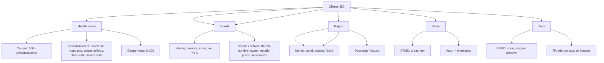

---
tags:
  - "kanban/done"
  - "type/task"
  - "domain/CRM"
  - "priority/P1"
parent: "[[desarrollo]]"
children: []
depends_on:
  - "[[CRM-001]]"
  - "[[CRM-002]]"
  - "[[CRM-003]]"
blocks:
  - "[[CRM-005]]"
  - "[[CRM-006]]"
status: "done"
assignee: "@dev"
created: "2026-08-04"
updated: "2026-08-05"
---

# [[CRM-004]] Cliente 360: Perfil, Accesos, Pagos, Tickets Previos, Notas, Tags, Health Score

## Descripción
Implementar vista 360° del cliente en CRM: perfil completo, accesos a canales, historial de pagos, tickets previos, notas internas, tags, health score calculado.

## Código de Ejemplo
```php
// app/Domains/Staff/Http/Controllers/Crm/ClientController.php
namespace App\Domains\Staff\Http\Controllers\Crm;

class ClientController extends Controller
{
    public function show(User $client)
    {
        $this->authorize('view', $client);

        $client->load([
            'taxConfiguration',
            'subscriptions' => fn($q) => $q->with('channel')->withCount('payments'),
            'tickets' => fn($q) => $q->with('category', 'assignee')->latest()->take(10),
            'payments' => fn($q) => $q->where('status', 'approved')->with('subscription.channel')->latest()->take(20),
            'tags',
            'notes' => fn($q) => $q->with('author')->latest()->take(20),
        );

        $healthScore = $this->calculateHealthScore($client);

        return view('domains.staff.crm.clients.show', compact('client', 'healthScore'));
    }

    private function calculateHealthScore(User $client): int
    {
        $score = 100;

        // Tickets abiertos sin responder > 24h
        $unansweredTickets = $client->tickets()
            ->whereIn('status', ['open', 'pending'])
            ->where('updated_at', '<', now()->subHours(24))
            ->count();
        $score -= min($unansweredTickets * 10, 30);

        // Pagos fallidos recientes
        $failedPayments = $client->payments()
            ->where('status', 'failed')
            ->where('created_at', '>=', now()->subDays(30))
            ->count();
        $score -= min($failedPayments * 15, 30);

        // Suscripciones canceladas/expiradas vs activas
        $activeSubs = $client->subscriptions()->where('status', 'active')->count();
        $cancelledSubs = $client->subscriptions()->whereIn('status', ['cancelled', 'expired'])->count();
        if ($activeSubs + $cancelledSubs > 0) {
            $cancelRate = $cancelledSubs / ($activeSubs + $cancelledSubs);
            $score -= $cancelRate * 20;
        }

        // Ticket sin responder > 48h
        $staleTickets = $client->tickets()
            ->whereIn('status', ['open', 'pending'])
            ->where('updated_at', '<', now()->subHours(48))
            ->count();
        $score -= min($staleTickets * 10, 20);

        return max(0, $score);
    }

    public function addNote(User $client, NoteRequest $request)
    {
        $note = $client->notes()->create([
            'author_id' => auth()->id(),
            'content' => $request->content,
            'is_internal' => true,
        ]);
        return response()->json(['note' => $note->load('author')]);
    }

    public function addTag(User $client, TagRequest $request)
    {
        $tag = Tag::firstOrCreate(['name' => $request->tag_name]);
        $client->tags()->syncWithoutDetaching([$tag->id]);
        return back()->with('success', 'Tag añadido');
    }

    public function removeTag(User $client, Tag $tag)
    {
        $client->tags()->detach($tag->id);
        return back()->with('success', 'Tag eliminado');
    }
}
```

```blade
{{-- resources/views/domains/staff/crm/clients/show.blade.php --}}
@extends('layouts.crm')

@section('content')
<div class="container mx-auto px-4 py-8">
    <div class="mb-8 flex justify-between items-center">
        <div>
            <h1 class="text-2xl font-bold text-text-primary">{{ $client->name }}</h1>
            <p class="text-text-secondary">{{ $client->email }}</p>
        </div>
        <div class="flex gap-2">
            <button onclick="openNoteModal()" class="btn btn--primary">
                <x-icon name="plus" class="w-4 h-4 mr-1" />
                Nueva Nota
            </button>
            <button onclick="openTagModal()" class="btn btn--ghost btn--sm">
                <x-icon name="tag" class="w-4 h-4 mr-1" />
                Añadir Tag
            </button>
        </div>
    </div>

    {{-- Health Score --}}
    <div class="mb-8">
        <div class="card card--elevated p-6 bg-gradient-to-r from-accent-50 to-primary-50 dark:from-accent-900/20 dark:to-primary-900/20">
            <div class="flex items-center justify-between">
                <div>
                    <p class="text-sm text-text-secondary mb-1">Health Score</p>
                    <p class="text-4xl font-bold text-text-primary">{{ $healthScore }}</p>
                    <p class="text-sm text-text-secondary mt-1">
                        {{ $healthScore >= 80 ? 'Excelente' : ($healthScore >= 60 ? 'Bueno' : ($healthScore >= 40 ? 'Regular' : 'Crítico')) }}
                    </p>
                </div>
                <div class="w-32 h-32">
                    <canvas id="health-score-chart"></canvas>
                </div>
            </div>
        </div>

    <div class="grid lg:grid-cols-3 gap-6">
        {{-- Panel Izquierdo: Perfil + Accesos --}}
        <div class="lg:col-span-2 space-y-6">
            {{-- Perfil --}}
            <div class="card card--elevated p-6">
                <div class="flex items-center gap-4 mb-6">
                    avatar_url ?? asset('images/default-avatar.png') }}" alt="" class="w-20 h-20 rounded-full">
                    <div>
                        <h2 class="text-xl font-bold text-text-primary">{{ $client->name }}</h2>
                        <p class="text-text-secondary">{{ $client->email }}</p>
                        <div class="flex items-center gap-2 mt-2">
                            <span class="badge badge--{{ match($client->role) 'creador' => 'success', 'staff' => 'info', 'admin' => 'error', default => 'default' }}">{{ ucfirst($client->role) }}</span>
                            @if($client->kyc_status === 'verified')
                            <span class="badge badge--success"><x-icon name="shield-check" class="w-3 h-3 mr-1" /> KYC Verificado</span>
                            @endif
                        </div>
                    </div>
                    <div class="grid grid-cols-2 gap-4 text-sm">
                        <div><span class="text-text-secondary">Teléfono</span> <p class="font-medium">{{ $client->phone ?? '—' }}</p></div>
                        <div><span class="text-text-secondary">Zona Horaria</span> <p class="font-medium">{{ $client->timezone }}</p></div>
                        <div><span class="text-text-secondary">Idioma</span> <p class="font-medium">{{ $client->locale }}</p></div>
                        <div><span class="text-text-secondary">Registrado</span> <p class="font-medium">{{ $client->created_at->format('d/m/Y') }}</p></div>
                    </div>
                </div>

                {{-- Accesos / Canales --}}
                <div class="card card--elevated p-6">
                    <h3 class="font-semibold text-text-primary mb-4">Accesos a Canales</h3>
                    @if($client->subscriptions->isEmpty())
                    <p class="text-text-secondary text-center py-4">Sin accesos activos</p>
                    @else
                    <div class="space-y-3">
                        @foreach($client->subscriptions as $sub)
                        <div class="flex items-center justify-between p-4 bg-bg-tertiary rounded-lg">
                            <div class="flex items-center gap-3">
                                channel->cover_image ?? asset('images/channel-placeholder.svg') }}" alt="" class="w-10 h-10 rounded-lg object-cover">
                                <div>
                                    <p class="font-medium text-text-primary">{{ $sub->channel->name }}</p>
                                    <p class="text-sm text-text-secondary">{{ $sub->channel->owner->name }}</p>
                                </div>
                                <div class="flex items-center gap-4 text-sm">
                                    <span class="badge badge--{{ $sub->status === 'active' ? 'success' : 'warning' }}">{{ ucfirst($sub->status) }}</span>
                                    <span class="text-text-secondary">${{ number_format($sub->price, 2) }}/mes</span>
                                    <span class="text-text-muted">Renueva: {{ $sub->renews_at?->format('d/m/Y') ?? '—' }}</span>
                                    @if($sub->telegram_invite_link)
                                    <a href="{{ $sub->telegram_invite_link }}" target="_blank" class="btn btn--ghost btn--sm">Acceder</a>
                                    @endif
                                </div>
                            </div>
                        @endforeach
                    </div>
                    @endif
                </div>
            </div>

            {{-- Tickets --}}
            <div class="card card--elevated p-6">
                <h3 class="font-semibold text-text-primary mb-4">Tickets Recientes</h3>
                @if($client->tickets->isEmpty())
                <p class="text-text-secondary text-center py-4">Sin tickets</p>
                @else
                <div class="space-y-2">
                    @foreach($client->tickets->take(5) as $ticket)
                    <a href="{{ route('crm.tickets.show', $ticket) }}" class="flex items-center justify-between p-3 bg-bg-tertiary rounded-lg hover:bg-bg-secondary transition-colors">
                        <div>
                            <p class="font-medium text-text-primary">{{ $ticket->subject }}</p>
                            <p class="text-sm text-text-secondary">{{ $ticket->category->name }} · {{ ucfirst($ticket->status) }} · {{ $ticket->priority }}</p>
                        </div>
                        <span class="badge badge--{{ match($ticket->status) 'open' => 'info', 'pending' => 'warning', 'waiting' => 'warning', 'closed' => 'success' }}">{{ ucfirst($ticket->status) }}</span>
                    </div>
                    @endforeach
                </div>
                <a href="{{ route('crm.clients.tickets', $client) }}" class="btn btn--ghost btn--sm mt-2">Ver todos</a>
                </div>
            </div>

        {{-- Panel Derecho: Pagos + Notas + Tags --}}
        <div class="lg:col-span-1 space-y-6">
            {{-- Pagos --}}
            <div class="card card--elevated p-6">
                <h3 class="font-semibold text-text-primary mb-4">Historial de Pagos</h3>
                @if($client->payments->isEmpty())
                <p class="text-text-secondary text-center py-4">Sin pagos</p>
                @else
                <div class="space-y-2 max-h-96 overflow-y-auto">
                    @foreach($client->payments->take(10) as $payment)
                    <div class="flex items-center justify-between p-3 bg-bg-tertiary rounded-lg">
                        <div>
                            <p class="font-medium text-text-primary">${{ number_format($payment->amount, 2) }} {{ $payment->currency }}</p>
                            <p class="text-xs text-text-secondary">{{ $payment->subscription->channel->name }}</p>
                        </div>
                        <div class="text-right text-sm">
                            <span class="badge badge--{{ $payment->status === 'approved' ? 'success' : 'error' }}">{{ ucfirst($payment->status) }}</span>
                            <p class="text-text-muted mt-1">{{ $payment->created_at->format('d/m/Y') }}</p>
                        </div>
                    </div>
                    @endforeach
                </div>
                @endif
                <a href="{{ route('crm.clients.payments', $client) }}" class="btn btn--ghost btn--sm mt-2 btn--full-width">Ver todos</a>
            </div>

            {{-- Notas Internas --}}
            <div class="card card--elevated p-6">
                <div class="flex justify-between items-center mb-4">
                    <h3 class="font-semibold text-text-primary">Notas Internas</h3>
                    <button onclick="openNoteModal()" class="btn btn--primary btn--sm"><x-icon name="plus" class="w-4 h-4 mr-1" /> Nota</button>
                </div>
                <div class="space-y-3 max-h-96 overflow-y-auto">
                    @foreach($client->notes as $note)
                    <div class="p-3 bg-bg-tertiary rounded-lg border-l-4 border-accent-primary">
                        <div class="flex justify-between mb-1">
                            <span class="font-medium text-text-primary">{{ $note->author->name }}</span>
                            <span class="text-xs text-text-muted">{{ $note->created_at->diffForHumans() }}</span>
                        </div>
                        <p class="text-sm text-text-secondary">{{ $note->content }}</p>
                    </div>
                    @endforeach
                </div>
            </div>

            {{-- Tags --}}
            <div class="card card--elevated p-6">
                <div class="flex justify-between items-center mb-4">
                    <h3 class="font-semibold text-text-primary">Tags</h3>
                    <button onclick="openTagModal()" class="btn btn--primary btn--sm"><x-icon name="tag" class="w-4 h-4 mr-1" /> Tag</button>
                </div>
                <div class="flex flex-wrap gap-2">
                    @foreach($client->tags as $tag)
                    <span class="badge badge--info flex items-center gap-1">
                        {{ $tag->name }}
                        <button onclick="removeTag({{ $tag->id }})" class="text-error hover:text-error-600"><x-icon name="x" class="w-3 h-3" /></button>
                    </span>
                    @endforeach
                </div>
            </div>
        </div>
    </div>
</div>
@endsection

@push('scripts')
<script>
    // Chart.js para Health Score
    const ctx = document.getElementById('health-score-chart');
    new Chart(ctx, {
        type: 'doughnut',
        data: {
            datasets: [{
                data: [{{ $healthScore }}, {{ 100 - $healthScore }}],
                backgroundColor: ['#82B7C3', '#e5e7eb'],
                borderWidth: 0
            }]
        },
        options: {
            cutout: '70%',
            plugins: { legend: { display: false } }
        }
    });
</script>
@endpush
```

## Diagramas Mermaid


## Criterios de Aceptación
- [ ] Health Score: cálculo 0-100, gauge visual, desglose penalizaciones
- [ ] Perfil: avatar, nombre, email, rol, KYC, teléfono, timezone, fecha registro
- [ ] Accesos: lista canales con thumbnail, estado, precio, renovación, botón acceso
- [ ] Tickets: lista 5 recientes, link a detalle, badges prioridad/estado
- [ ] Pagos: últimos 10, monto, canal, estado, fecha, link descarga factura
- [ ] Notas: CRUD, autor, timestamp, solo staff
- [ ] Tags: crear, asignar, remover, filtrar por tags en listados
- [ ] Health Score: gauge visual 0-100, colores semáforo
- [ ] Responsive: 2 columnas desktop, 1 columna mobile
- [ ] Permisos: policy ClientPolicy (view, manage, add_note, add_tag)

## Notas Técnicas
- Health Score: base 100 - penalizaciones (tickets sin respuesta 10pts, pagos fallidos 15pts, churn 20%, tickets stale 10pts)
- Cálculo en tiempo real o cache 1 hora
- Notas/tags: polymorphic relations para reutilizar en otros modelos
- Permisos: policy ClientPolicy (view, manage, add_note, add_tag)
- Chart.js para gauge Health Score

## Enlaces
- [[CRM-001]] Ticketing (tickets del cliente)
- [[CRM-002]] Colas (tickets del cliente en colas)
- [[CRM-005]] Canales en CRM (canales del cliente)
- [[CRM-007]] Reportes (health score trends)
- [[ADM-004]] Gestión creadores (paralelo)
- [[CRM-011]] Gestión fiscal clientes
- [[CRM-012]] Facturación CRM
- [[PUB-009]] Mis accesos (vista cliente)