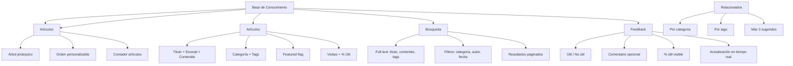

---
tags:
  - "kanban/done"
  - "type/task"
  - "domain/CRM"
  - "priority/P1"
parent: "[[desarrollo]]"
children: []
depends_on:
  - "[[CRM-004]]"
  - "[[FUN-005]]"
  - "[[FUN-006]]"
blocks:
  - "[[ADM-012]]"
  - "[[CRM-012]]"
status: "done"
assignee: "@dev"
created: "2026-08-04"
updated: "2026-08-05"
---

# [[CRM-006]] Base de Conocimiento: Artículos, Categorías, Búsqueda, Feedback (Útil/No Útil)

## Descripción
Implementar Base de Conocimiento (Knowledge Base) en CRM: artículos con categorías, búsqueda full-text, feedback de utilidad (útil/no útil), versión pública y privada.

## Código de Ejemplo
```php
// app/Models/KnowledgeBaseArticle.php
class KnowledgeBaseArticle extends Model
{
    protected $fillable = [
        'category_id', 'author_id', 'title', 'slug', 'excerpt', 'content',
        'is_published', 'is_internal', 'is_featured', 'tags', 'view_count',
    ];

    protected $casts = [
        'is_published' => 'boolean',
        'is_internal' => 'boolean',
        'is_featured' => 'boolean',
        'tags' => 'array',
        'published_at' => 'datetime',
    ];

    public function category() { return $this->belongsTo(KnowledgeBaseCategory::class); }
    public function author() { return $this->belongsTo(User::class, 'author_id'); }
    public function feedbacks() { return $this->hasMany(KnowledgeBaseFeedback::class); }

    public function incrementViewCount()
    {
        $this->increment('view_count');
    }

    public function getUsefulPercentageAttribute(): int
    {
        $total = $this->feedbacks()->count();
        if ($total === 0) return 0;
        $useful = $this->feedbacks()->where('is_useful', true)->count();
        return round(($useful / $total) * 100);
    }
}
```

```php
// app/Models/KnowledgeBaseCategory.php
class KnowledgeBaseCategory extends Model
{
    protected $fillable = ['name', 'slug', 'description', 'icon', 'sort_order', 'is_active'];

    public function articles() { return $this->hasMany(KnowledgeBaseArticle::class); }
}
```

```php
// app/Models/KnowledgeBaseFeedback.php
class KnowledgeBaseFeedback extends Model
{
    protected $fillable = [
        'article_id', 'user_id', 'is_useful', 'comment',
    ];

    protected $casts = [
        'is_useful' => 'boolean',
    ];

    public function article() { return $this->belongsTo(KnowledgeBaseArticle::class); }
    public function user() { return $this->belongsTo(User::class); }
}
```

```php
// app/Domains/Staff/Http/Controllers/Crm/KnowledgeBaseController.php
class KnowledgeBaseController extends Controller
{
    public function index()
    {
        $categories = KnowledgeBaseCategory::where('is_active', true)
            ->withCount(['articles' => fn($q) => $q->where('is_published', true)->where('is_internal', false)])
            ->orderBy('sort_order')
            ->get();

        $featured = KnowledgeBaseArticle::where('is_published', true)
            ->where('is_internal', false)
            ->where('is_featured', true)
            ->latest()
            ->take(5)
            ->get();

        return view('domains.staff.crm.knowledge-base.index', compact('categories', 'featured'));
    }

    public function show(KnowledgeBaseArticle $article)
    {
        if (!$article->is_published || $article->is_internal) {
            abort(404);
        }

        $article->incrementViewCount();
        $article->load(['category', 'author', 'feedbacks']);

        $related = KnowledgeBaseArticle::where('is_published', true)
            ->where('is_internal', false)
            ->where('category_id', $article->category_id)
            ->where('id', '!=', $article->id)
            ->latest()
            ->take(3)
            ->get();

        return view('domains.staff.crm.knowledge-base.show', compact('article', 'related'));
    }

    public function search(Request $request)
    {
        $query = $request->get('q');
        $articles = KnowledgeBaseArticle::where('is_published', true)
            ->where('is_internal', false)
            ->where(function($q) use ($query) {
                $q->where('title', 'LIKE', "%{$query}%")
                  ->orWhere('content', 'LIKE', "%{$query}%")
                  ->orWhere('tags', 'LIKE', "%{$query}%");
            })
            ->with('category')
            ->paginate(10);

        return view('domains.staff.crm.knowledge-base.search', compact('articles', 'query'));
    }

    public function feedback(KnowledgeBaseArticle $article, FeedbackRequest $request)
    {
        $feedback = $article->feedbacks()->updateOrCreate(
            ['user_id' => auth()->id()],
            ['is_useful' => $request->is_useful, 'comment' => $request->comment]
        );

        return response()->json(['success' => true, 'useful_percentage' => $article->useful_percentage]);
    }
}
```

```blade
{{-- resources/views/domains/staff/crm/knowledge-base/index.blade.php --}}
@extends('layouts.crm')

@section('content')
<div class="container mx-auto px-4 py-8">
    <div class="mb-8">
        <h1 class="text-2xl font-bold text-text-primary">Base de Conocimiento</h1>
        <p class="text-text-secondary">Encuentra respuestas a tus preguntas</p>
    </div>

    {{-- Búsqueda --}}
    <form action="{{ route('crm.kb.search') }}" method="GET" class="mb-8">
        <div class="relative max-w-2xl">
            <input type="text" name="q" class="input pr-12" placeholder="Buscar artículos..." value="{{ request('q') }}">
            <button type="submit" class="absolute right-3 top-1/2 -translate-y-1/2 text-text-muted">
                <x-icon name="search" class="w-5 h-5" />
            </button>
        </div>
    </form>

    {{-- Artículos Destacados --}}
    @if($featured->isNotEmpty())
    <div class="mb-8">
        <h2 class="text-xl font-semibold text-text-primary mb-4">Artículos Destacados</h2>
        <div class="grid gap-4">
            @foreach($featured as $article)
            <a href="{{ route('crm.kb.article', $article) }}" class="card card--elevated p-4 hover:border-accent-primary transition-colors flex items-start gap-4">
                <x-icon name="star" class="w-6 h-6 text-warning-500 flex-shrink-0 mt-1" />
                <div>
                    <h3 class="font-semibold text-text-primary">{{ $article->title }}</h3>
                    <p class="text-sm text-text-secondary mt-1 line-clamp-2">{{ $article->excerpt }}</p>
                    <span class="badge badge--info text-xs mt-2">{{ $article->category->name }}</span>
                </div>
            </a>
            @endforeach
        </div>
    </div>
    @endif

    {{-- Categorías --}}
    <div class="space-y-8">
        @foreach($categories as $category)
        <div>
            <h2 class="text-xl font-semibold text-text-primary mb-4 flex items-center gap-2">
                <x-icon :name="$category->icon" class="w-6 h-6" />
                {{ $category->name }}
            </h2>
            <div class="grid gap-4">
                @foreach($category->articles()->where('is_published', true)->where('is_internal', false)->latest()->get() as $article)
                <a href="{{ route('crm.kb.article', $article) }}" class="card card--elevated p-4 hover:bg-bg-tertiary transition-colors flex items-start justify-between gap-4">
                    <div class="flex-1">
                        <h3 class="font-semibold text-text-primary">{{ $article->title }}</h3>
                        <p class="text-sm text-text-secondary mt-1 line-clamp-2">{{ $article->excerpt }}</p>
                    </div>
                    <div class="flex items-center gap-2 text-xs text-text-muted">
                        <span>{{ $article->view_count }} vistas</span>
                        <span>{{ $article->useful_percentage }}% útil</span>
                    </div>
                </a>
                @endforeach
            </div>
        </div>
        @endforeach
    </div>
</div>
@endsection
```

```blade
{{-- resources/views/domains/staff/crm/knowledge-base/show.blade.php --}}
@extends('layouts.crm')

@section('content')
<div class="container mx-auto px-4 py-8 max-w-3xl">
    <nav class="mb-6" aria-label="Breadcrumb">
        <ol class="flex items-center gap-2 text-sm text-text-muted">
            <li><a href="{{ route('crm.kb.index') }}" class="hover:underline">Base de Conocimiento</a></li>
            <li class="text-text-muted">/</li>
            <li><a href="{{ route('crm.kb.category', $article->category) }}" class="hover:underline">{{ $article->category->name }}</a></li>
            <li class="text-text-muted">/</li>
            <li class="text-text-primary">{{ $article->title }}</li>
        </ol>
    </nav>

    <article class="card card--elevated p-8">
        <header class="mb-6">
            <div class="flex items-center gap-2 mb-2">
                <span class="badge badge--info">{{ $article->category->name }}</span>
                <span class="text-sm text-text-muted">{{ $article->created_at->format('d/m/Y') }}</span>
                <span class="badge badge--info">{{ $article->view_count }} vistas</span>
                <span class="badge badge--{{ $article->useful_percentage >= 70 ? 'success' : ($article->useful_percentage >= 40 ? 'warning' : 'error') }}">
                    {{ $article->useful_percentage }}% útil
                </span>
            </div>
            <h1 class="text-3xl font-bold text-text-primary mb-4">{{ $article->title }}</h1>
        </header>

        <div class="prose prose-lg dark:prose-invert max-w-none">
            {!! $article->content !!}
        </div>

        {{-- Feedback --}}
        <div class="mt-8 pt-6 border-t border-border-primary">
            <h3 class="font-semibold text-text-primary mb-4">¿Te fue útil este artículo?</h3>
            <div class="flex gap-4">
                <button onclick="submitFeedback(true)" class="btn btn--success">
                    <x-icon name="thumbs-up" class="w-4 h-4 mr-1" /> Sí, útil
                </button>
                <button onclick="submitFeedback(false)" class="btn btn--ghost">
                    <x-icon name="thumbs-down" class="w-4 h-4 mr-1" /> No útil
                </button>
            </div>
            <div class="mt-4" id="feedback-comment" style="display: none;">
                <label class="label">Comentario (opcional)</label>
                <textarea id="feedback-comment" class="input" rows="3" placeholder="¿Qué podemos mejorar?"></textarea>
                <button onclick="submitFeedbackWithComment()" class="btn btn--primary btn--sm mt-2">Enviar</button>
            </div>
            <p class="text-sm text-text-muted mt-2">{{ $article->useful_percentage }}% de {{ $article->feedbacks_count }} personas lo encontraron útil</p>
        </div>

        {{-- Artículos Relacionados --}}
        @if($related->isNotEmpty())
        <div class="mt-10">
            <h3 class="text-xl font-semibold text-text-primary mb-4">Artículos Relacionados</h3>
            <div class="grid gap-4">
                @foreach($related as $relatedArticle)
                <a href="{{ route('crm.kb.article', $relatedArticle) }}" class="card card--elevated p-4 hover:border-accent-primary transition-colors">
                    <h3 class="font-semibold text-text-primary">{{ $relatedArticle->title }}</h3>
                    <p class="text-sm text-text-secondary mt-1 line-clamp-2">{{ $relatedArticle->excerpt }}</span>
                </a>
                @endforeach
            </div>
        </div>
        @endif
    </article>
</div>
@endsection

@push('scripts')
<script>
function submitFeedback(isUseful) {
    const articleId = {{ $article->id }};
    fetch(`/crm/kb/articles/${articleId}/feedback`, {
        method: 'POST',
        headers: {
            'Content-Type': 'application/json',
            'X-CSRF-TOKEN': document.querySelector('meta[name="csrf-token"]').content
        },
        body: JSON.stringify({ is_useful: isUseful })
    }).then(r => r.json()).then(data => {
        alert(isUseful ? '¡Gracias por tu feedback!' : 'Gracias, lo tendremos en cuenta');
        location.reload();
    });
}

function submitFeedbackWithComment() {
    // Implementar con comentario
}
</script>
@endpush
```

## Diagramas Mermaid


## Criterios de Aceptación
- [ ] Categorías: árbol jerárquico, orden personalizable, contador artículos
- [ ] Artículos: título, excerpt, contenido (WYSIWYG), categoría, tags, featured, interno/público
- [ ] Búsqueda: full-text título/contenido/tags, filtros categoría/autor/fecha
- [ ] Feedback: útil/no útil + comentario opcional, % útil visible, tiempo real
- [ ] Artículos relacionados: por categoría + tags, máx 3
- [ ] Contador vistas, % útil visible
- [ ] Artículos internos (solo staff) vs públicos
- [ ] SEO: meta tags, canonical, JSON-LD Article schema
- [ ] Versionado: historial cambios, revertir versión

## Notas Técnicas
- Full-text search: MySQL FULLTEXT o Meilisearch/Algolia
- Editor WYSIWYG: TinyMCE, Quill, o Trix
- Slug auto-generado desde título, único
- Artículos internos: flag `is_internal` + policy
- Versionado: tabla `knowledge_base_article_versions`
- Analytics: vistas, % útil, tiempo en página

## Enlaces
- [[CRM-001]] Ticketing (link a KB desde tickets)
- [[CRM-002]] Colas (link a KB desde tickets)
- [[CRM-004]] Cliente 360 (link a KB)
- [[CLI-005]] Soporte cliente (KB público)
- [[CRM-007]] Reportes (artículos más vistos, % útil)