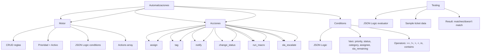

---
tags:
  - "kanban/done"
  - "type/task"
  - "domain/CRM"
  - "priority/P1"
parent: "[[desarrollo]]"
children: []
depends_on:
  - "[[CRM-007]]"
  - "[[FUN-005]]"
  - "[[FUN-006]]"
blocks: []
status: "done"
assignee: "@dev"
created: "2026-08-04"
updated: "2026-08-05"
---

# [[CRM-008]] Automatizaciones: Reglas (Auto-assign, SLA Breach, Tags, Macros)

## Descripción
Implementar motor de automatizaciones en CRM: reglas de auto-asignación, alertas de SLA breach, etiquetado automático, ejecución de macros.

## Código de Ejemplo
```php
// app/Models/AutomationRule.php
class AutomationRule extends Model
{
    protected $fillable = [
        'name', 'description', 'trigger', 'conditions', 'actions', 
        'is_active', 'priority', 'execution_count',
    ];

    protected $casts = [
        'conditions' => 'array',
        'actions' => 'array',
        'is_active' => 'boolean',
    ];

    // Triggers: ticket_created, ticket_updated, reply_added, sla_breached, status_changed
    // Conditions: JSON Logic format
    // Actions: assign, tag, notify, change_status, set_priority, run_macro, webhook
}
```

```php
// app/Services/AutomationEngine.php
class AutomationEngine
{
    public function process(string $trigger, Ticket $ticket, array $context = []): void
    {
        $rules = AutomationRule::where('is_active', true)
            ->where('trigger', $trigger)
            ->orderBy('priority')
            ->get();

        foreach ($rules as $rule) {
            if ($this->evaluateConditions($rule->conditions, $ticket)) {
                $this->executeActions($rule->actions, $ticket);
                $rule->increment('execution_count');
            }
        }
    }

    private function evaluateConditions(array $conditions, Ticket $ticket): bool
    {
        // Evaluar JSON Logic: https://jsonlogic.com/
        // Ejemplos:
        // {"==": [{"var": "priority"}, "urgent"]}
        // {">": [{"var": "sla_remaining_hours"}, 2]}
        // {"in": [{"var": "status"}, ["open", "pending"]]}
        
        return json_logic_evaluate($conditions, $ticket->toArray());
    }

    private function executeActions(array $actions, Ticket $ticket): void
    {
        foreach ($actions as $action) {
            match($action['type']) {
                'assign' => $this->assignTicket($ticket, $action['user_id']),
                'tag' => $ticket->tags()->syncWithoutDetaching($action['tag_ids']),
                'notify' => $this->sendNotification($ticket, $action['template'], $action['channels']),
                'change_status' => $ticket->update(['status' => $action['status']]),
                'set_priority' => $ticket->update(['priority' => $action['priority']]),
                'run_macro' => $this->applyMacro($ticket, $action['macro_id']),
                'webhook' => $this->callWebhook($action['url'], $ticket),
                'sla_escalate' => $this->escalateSla($ticket),
            };
        }
    }
}
```

```php
// app/Jobs/ProcessAutomationRules.php
class ProcessAutomationRules implements ShouldQueue
{
    use Dispatchable, InteractsWithQueue, Queueable, SerializesModels;

    public function __construct(
        public string $trigger,
        public int $ticketId,
        public array $context = []
    ) {}

    public function handle(): void
    {
        $ticket = Ticket::findOrFail($this->ticketId);
        app(AutomationEngine::class)->process($this->trigger, $ticket, $this->context);
    }
}
```

```php
// Event listeners para disparar automatizaciones
class TicketEventSubscriber
{
    public function onCreated(TicketCreated $event): void
    {
        ProcessAutomationRules::dispatch('ticket_created', $event->ticket->id);
    }

    public function onUpdated(TicketUpdated $event): void
    {
        ProcessAutomationRules::dispatch('ticket_updated', $event->ticket->id, $event->changes);
    }

    public function onReplied(TicketReplied $event): void
    {
        ProcessAutomationRules::dispatch('reply_added', $event->ticket->id);
    }

    public function onSlaBreached(SlaBreached $event): void
    {
        ProcessAutomationRules::dispatch('sla_breached', $event->ticket->id);
    }
}
```

```blade
{{-- resources/views/domains/staff/crm/automation-rules/index.blade.php --}}
@extends('layouts.crm')

@section('content')
<div class="container mx-auto px-4 py-8">
    <div class="mb-8 flex justify-between items-center">
        <div>
            <h1 class="text-2xl font-bold text-text-primary">Automatizaciones</h1>
            <p class="text-text-secondary">Reglas automáticas para tickets</p>
        </div>
        <a href="{{ route('crm.automation-rules.create') }}" class="btn btn--primary">
            <x-icon name="plus" class="w-4 h-4 mr-2" />
            Nueva Regla
        </a>
    </div>

    <div class="card card--elevated overflow-hidden">
        <table class="w-full">
            <thead class="bg-bg-tertiary">
                <tr>
                    <th class="p-4 text-left text-sm font-semibold text-text-secondary">Regla</th>
                    <th class="p-4 text-center text-sm font-semibold text-text-secondary">Trigger</th>
                    <th class="p-4 text-center text-sm font-semibold text-text-secondary">Condiciones</th>
                    <th class="p-4 text-center text-sm font-semibold text-text-secondary">Acciones</th>
                    <th class="p-4 text-center text-sm font-semibold text-text-secondary">Prioridad</th>
                    <th class="p-4 text-center text-sm font-semibold text-text-secondary">Estado</th>
                    <th class="p-4 text-center text-sm font-semibold text-text-secondary">Ejecuciones</th>
                    <th class="p-4 text-center text-sm font-semibold text-text-secondary">Acciones</th>
                </tr>
            </thead>
            <tbody class="divide-y divide-border-primary">
                @foreach($rules as $rule)
                <tr class="hover:bg-bg-tertiary">
                    <td class="p-4">
                        <p class="font-medium text-text-primary">{{ $rule->name }}</p>
                        <p class="text-sm text-text-muted">{{ $rule->description }}</p>
                    </td>
                    <td class="p-4 text-center">
                        <span class="badge badge--info">{{ ucfirst($rule->trigger) }}</span>
                    </td>
                    <td class="p-4 text-center">
                        <span class="text-xs text-text-muted">{{ json_encode($rule->conditions) }}</span>
                    </td>
                    <td class="p-4 text-center">
                        <span class="badge badge--info">{{ count($rule->actions) }} acciones</span>
                    </td>
                    <td class="p-4 text-center text-sm font-medium">{{ $rule->priority }}</td>
                    <td class="p-4 text-center">
                        <label class="flex items-center gap-2 cursor-pointer">
                            <input type="checkbox" class="checkbox" 
                                   {{ $rule->is_active ? 'checked' : '' }}
                                   onchange="toggleRule({{ $rule->id }}, this.checked)">
                            <span class="sr-only">{{ $rule->is_active ? 'Activo' : 'Inactivo' }}</span>
                        </label>
                    </td>
                    <td class="p-4 text-center text-sm text-text-secondary">{{ $rule->execution_count }}</td>
                    <td class="p-4 text-center">
                        <a href="{{ route('crm.automation-rules.edit', $rule) }}" class="btn btn--ghost btn--sm">
                            <x-icon name="edit" class="w-4 h-4" />
                        </a>
                    </td>
                </tr>
                @endforeach
            </tbody>
        </table>
    </div>
</div>
@endsection
```

```php
// app/Http/Controllers/Api/AutomationRuleController.php (para JSON Logic builder)
class AutomationRuleController extends Controller
{
    public function testConditions(Request $request)
    {
        $conditions = $request->input('conditions');
        $sampleTicket = Ticket::factory()->make($request->input('sample_data', []));
        
        $result = app(AutomationEngine::class)->evaluateConditions($conditions, $request->input('sample_data', []));
        
        return response()->json(['matches' => $result]);
    }
}
```

## Diagramas Mermaid


## Criterios de Aceptación
- [ ] CRUD reglas: nombre, descripción, trigger, condiciones (JSON Logic), acciones, prioridad, activo
- [ ] Triggers: ticket_created, ticket_updated, reply_added, sla_breached, status_changed, priority_changed
- [ ] Condiciones: JSON Logic (==, !=, >, <, in, contains, var)
- [ ] Acciones: assign, tag, notify, change_status, set_priority, run_macro, webhook, sla_escalate
- [ ] Prioridad: orden de ejecución (menor = primero)
- [ ] Kill switch: is_active toggle, contador ejecuciones
- [ ] Testing: UI para probar condiciones con ticket sample
- [ ] Logging: log de cada ejecución con resultado
- [ ] Métricas: execution_count, última ejecución, éxito/fallo

## Notas Técnicas
- JSON Logic: usar librería `json-logic/php` o implementación custom
- Queue job para procesar reglas async
- Event listeners para disparar triggers
- Variables disponibles en conditions: ticket.*, user.*, channel.*, sla_remaining_hours, etc.
- Actions ejecutadas en orden, stop on error configurable
- Audit log de cada ejecución

## Enlaces
- [[CRM-001]] Ticketing (trigger ticket_created)
- [[CRM-002]] Colas (auto-assign)
- [[CRM-003]] Respuestas (run_macro action)
- [[CRM-007]] Reportes (métricas automatización)
- [[ADM-007]] Logs Seguridad (auditoría automatizaciones)