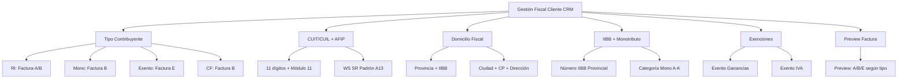

---
tags:
  - "kanban/done"
  - "type/task"
  - "domain/CRM"
  - "priority/P0"
parent: "[[desarrollo]]"
children: []
depends_on:
  - "[[FUN-006]]"
  - "[[FUN-008]]"
  - "[[CRM-001]]"
  - "[[PUB-017]]"
  - "[[PUB-019]]"
blocks:
  - "[[ADM-012]]"
status: "done"
assignee: "@dev"
created: "2026-08-04"
updated: "2026-08-05"
---

# [[CRM-011]] Gestión Fiscal Clientes: Tipo Contribuyente, Factura A/B/C, IVA, Retenciones

## Descripción
Implementar gestión fiscal de clientes en CRM: tipo de contribuyente AFIP, tipo de factura a emitir (A/B/C/E), IVA, retenciones aplicadas según legislación argentina.

## Código de Ejemplo
```php
// app/Domains/Staff/Http/Controllers/Crm/ClientTaxController.php
namespace App\Domains\Staff\Http\Controllers\Crm;

use App\Models\User;
use App\Services\ArgentineTaxService;

class ClientTaxController extends Controller
{
    public function __construct(protected ArgentineTaxService $taxService) {}

    public function index(User $client)
    {
        $this->authorize('view', $client);
        
        return view('domains.staff.crm.clients.tax.index', [
            'client' => $client->load('taxConfiguration'),
            'taxpayerTypes' => ArgentineTaxService::TAXPAYER_TYPES,
            'provinces' => ArgentineTaxService::PROVINCES,
        ]);
    }

    public function update(User $client, ClientTaxRequest $request)
    {
        $this->authorize('manage', $client);
        
        $client->update($request->validated([
            'taxpayer_type',      // responsable_inscripto, monotributo, exento, consumidor_final
            'cuit_cuil',          // 11 dígitos
            'tax_province',       // CABA, BA, CORDOBA, etc.
            'tax_address',        // Domicilio fiscal completo
            'tax_city',
            'tax_zip_code',
            'iibb_number',        // Número IIBB provincial
            'monotributo_category', // A-K (si monotributo)
            'ganancias_exempt',   // boolean
            'iva_exempt',         // boolean
        ]));

        if (!$this->taxService->validateCuitCuil($client->cuit_cuil)) {
            return back()->withErrors(['cuit_cuil' => 'CUIT/CUIL inválido']);
        }

        return redirect()->back()->with('success', 'Configuración fiscal actualizada');
    }

    public function fetchAfipData(User $client, Request $request)
    {
        $afipService = app(\App\Services\AfipWsSrPadronService::class);
        $data = $afipService->queryPadron($request->cuit_cuil);
        return response()->json($data);
    }

    public function previewInvoiceType(User $client)
    {
        $invoiceType = app(ArgentineTaxService::class)->determineInvoiceType(
            $client->taxpayer_type ?? 'consumidor_final'
        );
        
        return response()->json([
            'invoice_type' => $invoiceType,
            'description' => match($invoiceType) {
                'A' => 'Factura A: Emisor RI → Receptor RI',
                'B' => 'Factura B: Emisor RI → Receptor Mono/CF',
                'E' => 'Factura E: Emisor Exento',
                default => 'Factura B: Por defecto',
            }
        ]);
    }
}
```

```blade
{{-- resources/views/domains/staff/crm/clients/tax/index.blade.php --}}
@extends('layouts.crm')

@section('content')
<div class="container mx-auto px-4 py-8 max-w-3xl">
    <div class="mb-8 flex justify-between items-center">
        <div>
            <h1 class="text-2xl font-bold text-text-primary">Configuración Fiscal - {{ $client->name }}</h1>
        </div>
        <div class="flex gap-2">
            <button onclick="previewInvoiceType()" class="btn btn--ghost btn--sm">
                <x-icon name="eye" class="w-4 h-4 mr-1" />
                Previsualizar Factura
            </button>
        </div>
    </div>

    <form action="{{ route('crm.clients.tax.update', $client) }}" method="POST" class="space-y-8">
        @csrf
        @method('PUT')

        {{-- Tipo Contribuyente --}}
        <div class="card card--elevated p-6">
            <h2 class="text-xl font-semibold mb-4">Tipo de Contribuyente AFIP/ARCA</h2>
            <div class="grid grid-cols-2 md:grid-cols-4 gap-4">
                @foreach(\App\Services\ArgentineTaxService::TAXPAYER_TYPES as $key => $label)
                <label class="relative cursor-pointer">
                    <input type="radio" name="taxpayer_type" value="{{ $key }}" class="sr-only peer" 
                           {{ $client->taxpayer_type === $key ? 'checked' : '' }}>
                    <div class="p-4 border-2 rounded-xl text-center
                        peer-checked:border-accent-primary peer-checked:bg-accent-50
                        border-border-primary hover:border-accent-primary/50 transition-colors">
                        <p class="font-semibold text-text-primary">{{ $label }}</p>
                        <p class="text-xs text-text-muted mt-1">
                            {{ match($key)
                                'responsable_inscripto' => 'Factura A/B, IVA, Ganancias'
                                'monotributo' => 'Factura C, cuota fija'
                                'exento' => 'Factura E, sin IVA'
                                'consumidor_final' => 'Factura B, sin obligaciones'
                            }}
                        </p>
                    </div>
                </label>
                @endforeach
            </div>
            
            {{-- Preview Factura --}}
            <div id="invoice-preview" class="mt-6 p-4 bg-bg-tertiary rounded-lg hidden">
                <p class="font-semibold text-text-primary">Tipo de factura a emitir: <span id="preview-invoice-type" class="text-accent-primary"></span></p>
            </div>
        </div>

        {{-- CUIT/CUIL --}}
        <div class="card card--elevated p-6">
            <h2 class="text-xl font-semibold mb-4">CUIT / CUIL</h2>
            <div class="flex gap-4">
                <div class="flex-1">
                    <label class="label">CUIT / CUIL (11 dígitos)</label>
                    <div class="flex gap-2">
                        <input type="text" name="cuit_cuil" class="input flex-1" 
                               value="{{ old('cuit_cuil', $client->cuit_cuil) }}" 
                               maxlength="11" pattern="\d{11}" required
                               placeholder="20123456789">
                        <button type="button" class="btn btn--ghost btn--sm" onclick="fetchAfipData()">
                            <x-icon name="refresh-cw" class="w-4 h-4" />
                            Consultar AFIP
                        </button>
                    </div>
                    <div id="afip-result" class="mt-2 text-sm text-text-muted hidden"></div>
                </div>
                <div>
                    <label class="flex items-center gap-2 cursor-pointer mt-6">
                        <input type="checkbox" name="cuit_validated" class="checkbox" 
                               {{ $client->cuit_validated ? 'checked' : '' }} disabled>
                        <span class="text-sm text-text-secondary">Validado en AFIP</span>
                    </label>
                </div>
            </div>
        </div>

        {{-- Domicilio Fiscal --}}
        <div class="card card--elevated p-6">
            <h2 class="text-xl font-semibold mb-4">Domicilio Fiscal</h2>
            <div class="grid md:grid-cols-2 gap-4">
                <div>
                    <label class="label">Provincia</label>
                    <select name="tax_province" class="select" required>
                        <option value="">Seleccionar</option>
                        @foreach(\App\Services\ArgentineTaxService::PROVINCES as $code => $name)
                        <option value="{{ $code }}" {{ old('tax_province', $client->tax_province) === $code ? 'selected' : '' }}>
                            {{ $name }}
                        </option>
                        @endforeach
                    </select>
                </div>
                <div>
                    <label class="label">Ciudad / Localidad</label>
                    <input type="text" name="tax_city" class="input" value="{{ old('tax_city', $client->tax_city) }}" required>
                </div>
                <div>
                    <label class="label">Código Postal</label>
                    <input type="text" name="tax_zip_code" class="input" value="{{ old('tax_zip_code', $client->tax_zip_code) }}" maxlength="4" pattern="\d{4}" required>
                </div>
                <div class="md:col-span-2">
                    <label class="label">Dirección Completa</label>
                    <textarea name="tax_address" class="input" rows="2" required>{{ old('tax_address', $client->tax_address) }}</textarea>
                </div>
            </div>
        </div>

        {{-- IIBB y Monotributo --}}
        <div class="card card--elevated p-6">
            <h2 class="text-xl font-semibold mb-4">IIBB y Monotributo</h2>
            <div class="grid md:grid-cols-2 gap-4">
                <div>
                    <label class="label">Número IIBB Provincial</label>
                    <input type="text" name="iibb_number" class="input" value="{{ old('iibb_number', $client->iibb_number) }}" placeholder="Ej: 12345678-9">
                </div>
                <div>
                    <label class="label">Categoría Monotributo</label>
                    <select name="monotributo_category" class="select">
                        <option value="">No aplica / No es Monotributo</option>
                        @foreach(range('A', 'K') as $cat)
                        <option value="{{ $cat }}" {{ old('monotributo_category', $client->monotributo_category) === $cat ? 'selected' : '' }}>
                            Categoría {{ $cat }}
                        </option>
                        @endforeach
                    </select>
                </div>
                <div class="flex items-center gap-2">
                    <input type="checkbox" name="ganancias_exempt" class="checkbox" {{ old('ganancias_exempt', $client->ganancias_exempt) ? 'checked' : '' }}>
                    <span class="label">Exento Ganancias (certificado)</span>
                </div>
                <div class="flex items-center gap-2">
                    <input type="checkbox" name="iva_exempt" class="checkbox" {{ old('iva_exempt', $client->iva_exempt) ? 'checked' : '' }}>
                    <span class="label">Exento IVA</span>
                </div>
            </div>
        </div>

        <div class="flex justify-end gap-4 pt-4 border-t border-border-primary">
            <button type="submit" class="btn btn--primary">Guardar Configuración Fiscal</button>
        </div>
    </form>
</div>
@endsection

@push('scripts')
<script>
function fetchAfipData() {
    const cuit = document.querySelector('input[name="cuit_cuil"]').value;
    if (cuit.length !== 11) return alert('CUIT debe tener 11 dígitos');
    
    const resultDiv = document.getElementById('afip-result');
    resultDiv.classList.remove('hidden');
    resultDiv.textContent = 'Consultando AFIP...';
    resultDiv.className = 'mt-2 text-sm';
    
    fetch('{{ route("crm.clients.tax.fetch-afip", $client) }}', {
        method: 'POST',
        headers: {
            'Content-Type': 'application/json',
            'X-CSRF-TOKEN': document.querySelector('meta[name="csrf-token"]').content
        },
        body: JSON.stringify({ cuit_cuil: cuit })
    })
    .then(r => r.json())
    .then(data => {
        if (data.success) {
            resultDiv.className = 'mt-2 text-sm text-success';
            resultDiv.innerHTML = `<strong>Datos AFIP:</strong> ${data.data.denominacion} - ${data.data.impuesto}`;
        } else {
            resultDiv.className = 'mt-2 text-sm text-error';
            resultDiv.textContent = 'Error: ' + (data.message || 'CUIT no encontrado');
        }
    })
    .catch(() => {
        resultDiv.className = 'mt-2 text-sm text-error';
        resultDiv.textContent = 'Error de conexión';
    });
}

function previewInvoiceType() {
    const type = document.querySelector('input[name="taxpayer_type"]:checked')?.value || 'consumidor_final';
    const types = {
        'responsable_inscripto': 'Factura A (si TG-PayGate es RI)',
        'monotributo': 'Factura B',
        'exento': 'Factura E',
        'consumidor_final': 'Factura B'
    };
    document.getElementById('preview-invoice-type').textContent = types[type] || types.consumidor_final;
    document.getElementById('invoice-preview').classList.remove('hidden');
}
</script>
@endpush
```

## Diagramas Mermaid


## Criterios de Aceptación
- [ ] Tipo contribuyente: 4 opciones (RI, Mono, Exento, CF) con preview factura A/B/E
- [ ] CUIT/CUIL: 11 dígitos, validación Módulo 11, botón consultar AFIP (WS SR Padrón A13)
- [ ] Domicilio fiscal: Provincia (24), Ciudad, CP, Dirección completa
- [ ] IIBB: Número inscripción provincial, Categoría Mono A-K
- [ ] Exenciones: Checkboxes Ganancias (certificado), IVA (certificado)
- [ ] Preview factura: muestra A/B/E según tipo contribuyente seleccionado
- [ ] Validación CUIT: algoritmo Módulo 11 + consulta AFIP WS SR Padrón A13
- [ ] Autocompletado: consulta AFIP autocompleta domicilio, impuestos, condición

## Notas Técnicas
- WS SR Padrón A13: `wswhomo.afip.gov.ar` (testing) / `servicios1.afip.gov.ar` (prod)
- CUIT/CUIL: 11 dígitos (prefijo 20/23/24/27 + 8 dígitos + dígito verificador)
- IIBB: alícuotas por provincia (CABA 3.5%, BA 3.5%, Córdoba 4.5%, etc.)
- Monotributo: categorías A-K, recategorización semestral
- Preview factura: lógica emisor RI (TG-PayGate) → receptor según tipo

## Enlaces
- [[CRM-004]] Cliente 360 (pestaña fiscal)
- [[CRM-012]] Facturación CRM (usa config fiscal)
- [[CRM-013]] Conciliación fiscal
- [[PUB-019]] Legislación argentina
- [[ADM-010]] Config fiscal global
- [[ADM-013]] Retenciones config