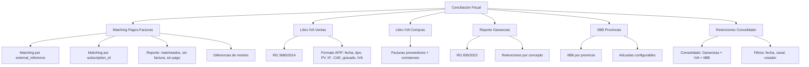

---
tags:
  - "kanban/done"
  - "type/task"
  - "domain/CRM"
  - "priority/P1"
parent: "[[desarrollo]]"
children: []
depends_on:
  - "[[CRM-012]]"
  - "[[FUN-005]]"
  - "[[FUN-006]]"
blocks: []
status: "done"
assignee: "@dev"
created: "2026-08-04"
updated: "2026-08-05"
---

# [[CRM-013]] Conciliación Fiscal: Matching Pagos vs Facturas, Reporte IVA, Ganancias, IIBB

## Descripción
Implementar conciliación fiscal en CRM: matching automático de pagos contra facturas, generación de reportes IVA (ventas/compras), Ganancias, IIBB por provincia.

## Código de Ejemplo
```php
// app/Domains/Staff/Http/Controllers/Crm/FiscalConciliationController.php
namespace App\Domains\Staff\Http\Controllers\Crm;

class FiscalConciliationController extends Controller
{
    public function index()
    {
        return view('domains.staff.crm.fiscal-conciliation.index');
    }

    public function matchPaymentsInvoices(FiscalConciliationRequest $request)
    {
        $from = $request->date_from;
        $to = $request->date_to;

        $payments = Payment::where('status', 'approved')
            ->whereBetween('created_at', [$from, $to])
            ->with(['subscription.channel', 'user'])
            ->get();

        $invoices = Invoice::whereBetween('created_at', [$from, $to])
            ->with(['channel', 'receiver'])
            ->get();

        // Matching automático: payment.external_reference = invoice.external_reference
        // O por: payment.subscription_id = invoice.subscription_id
        $matched = $payments->map(function ($payment) use ($invoices) {
            $invoice = $invoices->firstWhere('external_reference', $payment->external_reference);
            return [
                'payment' => $payment,
                'invoice' => $invoice,
                'matched' => (bool)$invoice,
                'diff_amount' => $invoice ? abs($payment->amount - $invoice->total) : null,
            ];
        });

        $unmatchedPayments = $matched->where('matched', false);
        $unmatchedInvoices = $invoices->whereNotIn('external_reference', $payments->pluck('external_reference'));

        return view('domains.staff.crm.fiscal-conciliation.results', compact(
            'matched', 'unmatchedPayments', 'unmatchedInvoices', 'from', 'to'
        ));
    }

    public function generateLibroIvaVentas(FiscalReportRequest $request)
    {
        $from = $request->date_from;
        $to = $request->date_to;

        $invoices = Invoice::where('status', 'authorized')
            ->whereBetween('created_at', [$from, $to])
            ->with(['channel', 'receiver'])
            ->get();

        $rows = $invoices->map(function ($invoice) {
            return [
                'fecha' => $invoice->created_at->format('d/m/Y'),
                'tipo_comprobante' => $invoice->type,
                'punto_venta' => $invoice->point_of_sale,
                'numero' => str_pad($invoice->number, 8, '0', STR_PAD_LEFT),
                'fecha_emision' => $invoice->created_at->format('d/m/Y'),
                'tipo_doc_receptor' => $this->getDocTypeCode($invoice->receiver->taxpayer_type),
                'nro_doc_receptor' => $invoice->receiver->cuit_cuil ?? '0',
                'denominacion_receptor' => $invoice->receiver->name,
                'gravado' => number_format($invoice->total_gravado, 2, ',', '.'),
                'iva_21' => number_format($invoice->vat_amount, 2, ',', '.'),
                'iva_105' => '0,00',
                'iva_27' => '0,00',
                'total' => number_format($invoice->total, 2, ',', '.'),
                'cae' => $invoice->cai,
                'fecha_vto_cae' => $invoice->cae_due_date->format('d/m/Y'),
            ];
        });

        return \Maatwebsite\Excel\Facades\Excel::download(
            new \App\Exports\LibroIvaVentasExport($rows),
            "libro_iva_ventas_{$from}_to_{$to}.xlsx"
        );
    }

    public function generateLibroIvaCompras(FiscalReportRequest $request)
    {
        // Similar para libro IVA compras (facturas proveedores, comisiones pasarelas, etc.)
    }

    public function generateGananciasReport(FiscalReportRequest $request)
    {
        // Retenciones Ganancias por concepto
    }

    public function generateIibbReport(FiscalReportRequest $request)
    {
        // IIBB por provincia
    }

    public function generateRetentionsReport(FiscalReportRequest $request)
    {
        // Consolidado retenciones: Ganancias, IVA, IIBB
    }

    private function getDocTypeCode(string $type): string
    {
        return match($type) {
            'responsable_inscripto' => '80',
            'monotributo' => '96',
            'exento' => '97',
            'consumidor_final' => '99',
            default => '99',
        };
    }
}
```

```blade
{{-- resources/views/domains/staff/crm/fiscal-conciliation/index.blade.php --}}
@extends('layouts.crm')

@section('content')
<div class="container mx-auto px-4 py-8">
    <div class="mb-8">
        <h1 class="text-2xl font-bold text-text-primary">Conciliación Fiscal</h1>
        <p class="text-text-secondary">Matching de pagos contra facturas y generación de reportes fiscales</p>
    </div>

    {{-- Formulario Matching --}}
    <div class="card card--elevated p-6 mb-8">
        <h2 class="text-xl font-semibold mb-4">Matching Pagos vs Facturas</h2>
        <form action="{{ route('crm.fiscal-conciliation.match') }}" method="POST" class="flex flex-wrap gap-4 items-end">
            @csrf
            <div>
                <label class="label">Desde</label>
                <input type="date" name="date_from" class="input" value="{{ request('date_from', now()->startOfMonth()->format('Y-m-d')) }}" required>
            </div>
            <div>
                <label class="label">Hasta</label>
                <input type="date" name="date_to" class="input" value="{{ request('date_to', now()->format('Y-m-d')) }}" required>
            </div>
            <button type="submit" class="btn btn--primary">Ejecutar Matching</button>
        </form>
    </div>

    {{-- Resultados Matching --}}
    @if(isset($matched))
    <div class="card card--elevated p-6 mb-8">
        <h2 class="text-xl font-semibold mb-4">Resultados del Matching</h2>
        <div class="mb-4 flex gap-4">
            <div class="p-4 bg-success-50 dark:bg-success-900/30 rounded-lg">
                <p class="text-sm text-success-700">Matcheados</p>
                <p class="text-3xl font-bold text-success-700">{{ $matched->where('matched', true)->count() }}</p>
            </div>
            <div class="p-4 bg-error-50 dark:bg-error-900/30 rounded-lg">
                <p class="text-sm text-error-700">Pagos sin Factura</p>
                <p class="text-3xl font-bold text-error-700">{{ $unmatchedPayments->count() }}</p>
            </div>
            <div class="p-4 bg-warning-50 dark:bg-warning-900/30 rounded-lg">
                <p class="text-sm text-warning-700">Facturas sin Pago</p>
                <p class="text-3xl font-bold text-warning-700">{{ $unmatchedInvoices->count() }}</p>
            </div>
        </div>

        <div class="overflow-x-auto">
            <table class="w-full">
                <thead class="bg-bg-tertiary">
                    <tr>
                        <th class="p-4 text-left text-sm font-semibold text-text-secondary">Pago</th>
                        <th class="p-4 text-left text-sm font-semibold text-text-secondary">Factura</th>
                        <th class="p-4 text-right text-sm font-semibold text-text-secondary">Monto Pago</th>
                        <th class="p-4 text-right text-sm font-semibold text-text-secondary">Monto Factura</th>
                        <th class="p-4 text-center text-sm font-semibold text-text-secondary">Diferencia</th>
                        <th class="p-4 text-center text-sm font-semibold text-text-secondary">Estado</th>
                    </tr>
                </thead>
                <tbody class="divide-y divide-border-primary">
                    @foreach($matched as $match)
                    <tr class="hover:bg-bg-tertiary {{ !$match['matched'] ? 'bg-error-50/50 dark:bg-error-900/20' : '' }}">
                        <td class="p-4 text-sm font-mono text-text-primary">{{ $match['payment']->external_reference }}</td>
                        <td class="p-4 text-sm text-text-secondary">{{ $match['invoice']?->number ?? '—' }}</td>
                        <td class="p-4 text-right text-sm text-text-primary">${{ number_format($match['payment']->amount, 2) }}</td>
                        <td class="p-4 text-right text-sm text-text-secondary">{{ $match['invoice'] ? number_format($match['invoice']->total, 2) : '—' }}</td>
                        <td class="p-4 text-center">
                            @if($match['diff_amount'] !== null)
                            <span class="{{ $match['diff_amount'] > 0.01 ? 'text-error' : 'text-success' }}">
                                ${{ number_format($match['diff_amount'], 2) }}
                            @else
                            —
                            @endif
                        </td>
                        <td class="p-4 text-center">
                            <span class="badge badge--{{ $match['matched'] ? 'success' : 'error' }}">
                                {{ $match['matched'] ? 'Match' : 'No Match' }}
                            </span>
                        </td>
                    </tr>
                    @endforeach
                </tbody>
            </table>
        </div>
    </div>
    @endif
</div>
@endsection
```

## Diagramas Mermaid


## Criterios de Aceptación
- [ ] Matching automático: pagos ↔ facturas por external_reference y subscription_id
- [ ] Reporte: matcheados, pagos sin factura, facturas sin pago, diferencias de monto
- [ ] Libro IVA Ventas (RG 3685/2014): export Excel con formato AFIP exacto
- [ ] Libro IVA Compras (RG 3685/2014): facturas proveedores + comisiones pasarelas
- [ ] Ganancias (RG 830/2023): retenciones por concepto (servicios 6%, alquileres 15%, etc.)
- [ ] IIBB por provincia: alícuotas configurables por jurisdicción
- [ ] Retenciones Consolidado: Ganancias + IVA (100% RI / 50% Mono) + IIBB por provincia
- [ ] Export: Excel (.xlsx), CSV, PDF
- [ ] Filtros: fecha desde/hasta, canal, creador, tipo factura

## Notas Técnicas
- Matching: prioridad 1) external_reference, 2) subscription_id, 3) monto+fecha+cliente
- Libro IVA: formato RG 3685 columnas exactas, separador decimal coma
- Export: Maatwebsite\Excel (Laravel Excel 3.x)
- Jobs para reportes pesados (queue: reports)
- Cache de alícuotas IIBB por provincia

## Enlaces
- [[ADM-010]] Config fiscal global
- [[ADM-011]] Compliance AFIP
- [[ADM-012]] Reportes fiscales
- [[ADM-013]] Retenciones config
- [[CRE-013]] Facturación creador
- [[CRE-016]] Ciclos cobro
- [[CRE-013]] Facturación creador
- [[PUB-017]] Facturación clientes