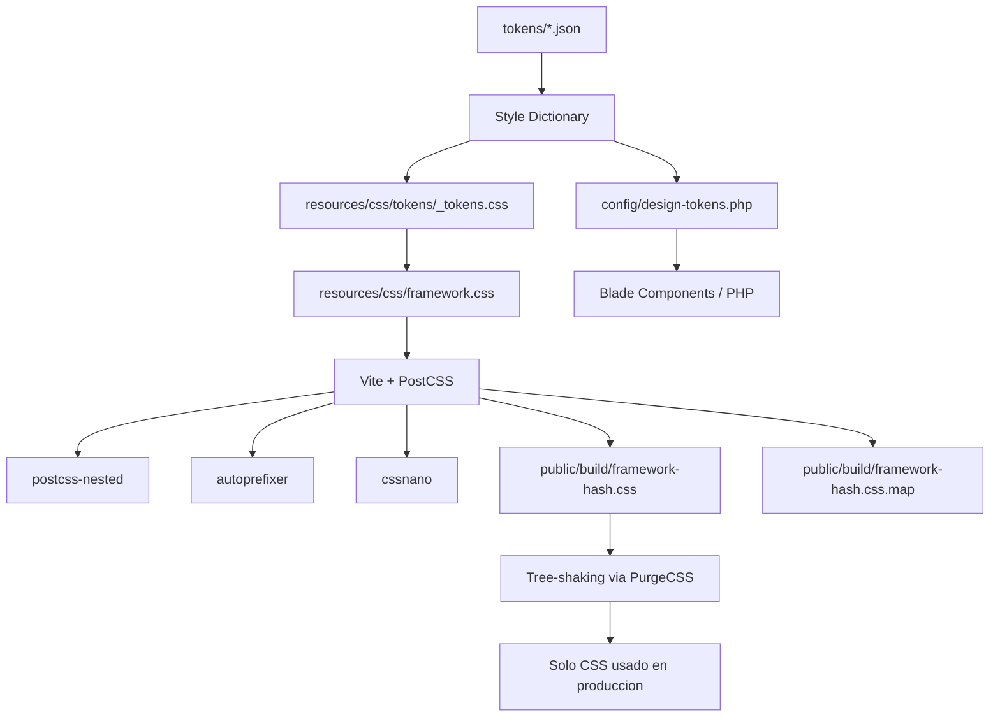

---
tags:
  - "kanban/done"
  - "type/task"
  - "domain/CSS"
  - "priority/P0"
parent: "[[desarrollo]]"
children: []
depends_on:
  - "[[FUN-001]]"
  - "[[WEB-001]]"
blocks:
  - "[[CSS-002]]"
  - "[[CSS-003]]"
  - "[[CSS-004]]"
  - "[[CSS-005]]"
  - "[[CSS-006]]"
  - "[[CSS-034]]"
  - "[[UI-001]]"
  - "[[UI-003]]"
status: "done"
assignee: "@dev"
created: "2026-08-04"
updated: "2026-08-05"
---

# [[CSS-001]] Arquitectura del Framework CSS: Decisiones Técnicas, Estructura, Build Tool (Vite)

## Descripción
Definir arquitectura del framework CSS propio: decisiones técnicas, estructura de carpetas, build tool (Vite), naming convention, estrategia de distribución.

## Código de Ejemplo
```javascript
// vite.config.js
import { defineConfig } from 'vite';
import laravel from 'laravel-vite-plugin';
import postcss from 'postcss';
import autoprefixer from 'autoprefixer';
import cssnano from 'cssnano';
import postcssNested from 'postcss-nested';
import styleDictionary from 'style-dictionary';

export default defineConfig({
    plugins: [
        laravel({
            input: [
                'resources/css/app.css',
                'resources/css/framework.css',
                'resources/js/app.js'
            ],
            refresh: true,
        }),
        {
            name: 'build-tokens',
            buildStart() {
                const sd = styleDictionary.extend({
                    source: ['tokens/**/*.json'],
                    platforms: {
                        css: {
                            transformGroup: 'css',
                            buildPath: 'resources/css/tokens/',
                            files: [{
                                destination: '_tokens.css',
                                format: 'css/variables',
                                options: {
                                    outputReferences: true,
                                },
                            }],
                        },
                        php: {
                            transformGroup: 'php',
                            buildPath: 'config/',
                            files: [{
                                destination: 'design-tokens.php',
                                format: 'php/array',
                            }],
                        },
                    },
                });
                sd.buildAllPlatforms();
            },
        },
    ],
    css: {
        postcss: {
            plugins: [
                postcssNested(),
                autoprefixer(),
                cssnano({ preset: 'default' }),
            ],
        },
    },
    build: {
        cssCodeSplit: true,
        sourcemap: true,
        rollupOptions: {
            output: {
                entryFileNames: 'assets/[name]-[hash].js',
                chunkFileNames: 'assets/[name]-[hash].js',
                assetFileNames: 'assets/[name]-[hash].[ext]',
            },
        },
    },
});
```

```bash
# Estructura de carpetas del framework
resources/
├── css/
│   ├── framework.css          # Entry point principal
│   ├── app.css                # App-specific (importa framework)
│   ├── tokens/                # Generado por Style Dictionary
│   │   └── _tokens.css        # CSS Custom Properties
│   ├── components/            # Componentes individuales
│   │   ├── _button.css
│   │   ├── _input.css
│   │   └── ...
│   ├── utilities/             # Utilidades
│   │   ├── _spacing.css
│   │   ├── _typography.css
│   │   └── ...
│   └── vendor/                # Normalize, reset
│       └── _reset.css
├── js/
│   ├── framework.js           # Alpine.js components
│   └── app.js
└── tokens/                    # Source tokens (Style Dictionary)
    ├── color.json
    ├── spacing.json
    ├── typography.json
    ├── borderRadius.json
    ├── shadow.json
    ├── zIndex.json
    ├── breakpoints.json
    └── transition.json
```

## Cálculos y Algoritmos (LaTeX)
### Bundle Size Targets
$$
\begin{aligned}
\text{Framework CSS (gzipped)} &< 15\text{KB} \\
\text{Framework CSS (minified)} &< 50\text{KB} \\
\text{Tree-shaking} &> 80\% \text{ unused removed}
\end{aligned}
$$

### Build Pipeline
$$
\text{Tokens JSON} \xrightarrow{\text{Style Dictionary}} \text{CSS Variables + PHP Config} \xrightarrow{\text{Vite + PostCSS}} \text{Bundles Optimizados}
$$

## Diagramas Mermaid


## Criterios de Aceptación
- [ ] Vite configurado con laravel-vite-plugin
- [ ] Style Dictionary genera CSS variables + PHP config desde tokens JSON
- [ ] PostCSS pipeline: nested, autoprefixer, cssnano
- [ ] Build genera: framework.css, framework.css.map, hashed filenames
- [ ] Tree-shaking / PurgeCSS configurado para producción
- [ ] Source maps habilitados para desarrollo
- [ ] CSS code splitting habilitado
- [ ] Naming convention: `--tgp-` prefix (configurable via CSS_FRAMEWORK_PREFIX)
- [ ] Documentado en `docu/especificaciones/css-framework-architecture.md`

## Notas Técnicas
- Prefijo configurable: `--tgp-color-primary` (default) via `CSS_FRAMEWORK_PREFIX` env
- No usar `@import` en CSS (usa PostCSS nested + Vite entry points)
- Componentes como partials `_component.css` importados en framework.css
- Utilities generadas programáticamente desde tokens
- Evaluar `@layer` (CSS Cascade Layers) para v1.1
- Compatibilidad: IE11 no soportado, evergreen browsers

## Enlaces
- [[WEB-001]] Brand Guidelines (tokens source)
- [[UI-001]] Design Tokens (source of truth)
- [[CSS-002]] Design Tokens Implementation
- [[CSS-003]] Typography System
- [[CSS-004]] Custom Properties Strategy
- [[CSS-005]] Reset + Normalize
- [[CSS-034]] Build System (esta tarea)
- [[CSS-035]] Tree Shaking / Modular Import