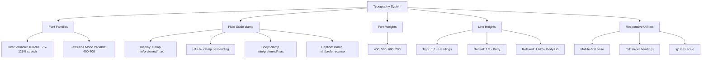

---
tags:
  - "kanban/done"
  - "type/task"
  - "domain/CSS"
  - "priority/P0"
parent: "[[desarrollo]]"
children: []
depends_on:
  - "[[CSS-002]]"
blocks:
  - "[[CSS-004]]"
  - "[[CSS-006]]"
  - "[[CSS-025]]"
  - "[[UI-001]]"
  - "[[CSS-034]]"
status: "done"
assignee: "@dev"
created: "2026-08-04"
updated: "2026-08-05"
---

# [[CSS-003]] Sistema de Tipografía: Font Families, Escalas Fluidas (clamp), Pesos, Line-Height, Responsive

## Descripción
Implementar sistema tipográfico completo: fuente principal Inter (variable font), mono JetBrains Mono, escalas fluidas con clamp(), pesos, line-heights, y utilities responsive.

## Código de Ejemplo
```css
/* resources/css/components/_typography.css */
@font-face {
  font-family: 'Inter';
  src: url('/fonts/Inter-Variable.woff2') format('woff2-variations');
  font-weight: 100 900;
  font-stretch: 75% 125%;
  font-display: swap;
}

@font-face {
  font-family: 'JetBrains Mono';
  src: url('/fonts/JetBrainsMono-Variable.woff2') format('woff2-variations');
  font-weight: 400 700;
  font-display: swap;
}

/* Fluid Type Scale con clamp() */
:root {
  /* Display / Headings - Fluid scaling */
  --tgp-text-display-4xl: clamp(2.5rem, 5vw, 4rem);      /* 40-64px */
  --tgp-text-display-3xl: clamp(2rem, 4vw, 3rem);        /* 32-48px */
  --tgp-text-display-2xl: clamp(1.75rem, 3.5vw, 2.5rem); /* 28-40px */
  --tgp-text-display-xl: clamp(1.5rem, 3vw, 2rem);       /* 24-32px */
  --tgp-text-display-lg: clamp(1.25rem, 2.5vw, 1.75rem); /* 20-28px */
  
  /* Body - Fluid scaling */
  --tgp-text-body-lg: clamp(1.125rem, 2vw, 1.25rem);     /* 18-20px */
  --tgp-text-body: clamp(1rem, 1.5vw, 1.125rem);         /* 16-18px */
  --tgp-text-body-sm: clamp(0.875rem, 1vw, 1rem);        /* 14-16px */
  --tgp-text-caption: clamp(0.75rem, 0.8vw, 0.875rem);   /* 12-14px */
  
  /* Line Heights */
  --tgp-leading-tight: 1.1;
  --tgp-leading-snug: 1.25;
  --tgp-leading-normal: 1.5;
  --tgp-leading-relaxed: 1.625;
  --tgp-leading-loose: 2;
}

/* Utility Classes */
.font-sans { font-family: var(--tgp-font-family-sans); }
.font-mono { font-family: var(--tgp-font-family-mono); }

.text-display-4xl { font-size: var(--tgp-text-display-4xl); line-height: var(--tgp-leading-tight); font-weight: 700; }
.text-display-3xl { font-size: var(--tgp-text-display-3xl); line-height: var(--tgp-leading-tight); font-weight: 700; }
.text-display-2xl { font-size: var(--tgp-text-display-2xl); line-height: var(--tgp-leading-tight); font-weight: 700; }
.text-display-xl { font-size: var(--tgp-text-display-xl); line-height: var(--tgp-leading-snug); font-weight: 700; }
.text-display-lg { font-size: var(--tgp-text-display-lg); line-height: var(--tgp-leading-snug); font-weight: 600; }

.text-h1 { font-size: var(--tgp-text-display-3xl); line-height: var(--tgp-leading-tight); font-weight: 700; }
.text-h2 { font-size: var(--tgp-text-display-2xl); line-height: var(--tgp-leading-tight); font-weight: 600; }
.text-h3 { font-size: var(--tgp-text-display-xl); line-height: var(--tgp-leading-snug); font-weight: 600; }
.text-h4 { font-size: var(--tgp-text-display-lg); line-height: var(--tgp-leading-snug); font-weight: 600; }

.text-body-lg { font-size: var(--tgp-text-body-lg); line-height: var(--tgp-leading-relaxed); }
.text-body { font-size: var(--tgp-text-body); line-height: var(--tgp-leading-normal); }
.text-body-sm { font-size: var(--tgp-text-body-sm); line-height: var(--tgp-leading-normal); }
.text-caption { font-size: var(--tgp-text-caption); line-height: var(--tgp-leading-normal); font-weight: 500; }

.font-normal { font-weight: var(--tgp-font-weight-normal); }
.font-medium { font-weight: var(--tgp-font-weight-medium); }
.font-semibold { font-weight: var(--tgp-font-weight-semibold); }
.font-bold { font-weight: var(--tgp-font-weight-bold); }

.leading-tight { line-height: var(--tgp-leading-tight); }
.leading-snug { line-height: var(--tgp-leading-snug); }
.leading-normal { line-height: var(--tgp-leading-normal); }
.leading-relaxed { line-height: var(--tgp-leading-relaxed); }

/* Responsive adjustments */
@media (min-width: 768px) {
  .md\:text-display-4xl { font-size: var(--tgp-text-display-4xl); }
  .md\:text-h1 { font-size: var(--tgp-text-display-3xl); }
  .md\:text-h2 { font-size: var(--tgp-text-display-2xl); }
  .md\:text-body { font-size: var(--tgp-text-body); }
}
```

```blade
{{-- Uso en Blade --}}
<h1 class="text-h1 font-bold text-text-primary">Título Principal</h1>
<h2 class="text-h2 font-semibold text-text-primary">Subtítulo</h2>
<p class="text-body text-text-secondary">Párrafo estándar</p>
<p class="text-body-sm text-text-muted">Texto pequeño</p>
<code class="font-mono text-body-sm bg-bg-tertiary px-1.5 py-0.5 rounded">Código inline</code>
```

## Cálculos y Algoritmos (LaTeX)
### Escala Tipográfica Fluida (clamp)
$$
\text{clamp}(min, preferred, max) = \text{clamp}(1.5rem, 3vw, 2.5rem)
$$
$$
\text{preferred} = \text{viewport\_width} \times \text{ratio} + \text{base}
$$

### Ratio Modular (Major Third 1.25)
$$
\text{Size}_{n+1} = \text{Size}_n \times 1.25
$$
Base: 1rem → 1.25rem → 1.56rem → 1.95rem → 2.44rem → 3.05rem

### Line Height Óptimo
$$
\text{Line Height} = \begin{cases}
1.1-1.2 & \text{Headings (display)} \\
1.5-1.6 & \text{Body text} \\
1.4-1.5 & \text{Captions/UI}
\end{cases}
$$

## Diagramas Mermaid


## Criterios de Aceptación
- [ ] Inter Variable Font cargada (woff2-variations, font-display: swap)
- [ ] JetBrains Mono Variable Font cargada
- [ ] 10+ fluid type scales con clamp() (display, headings, body, caption)
- [ ] 4 font weights: 400, 500, 600, 700
- [ ] 5 line heights: tight, snug, normal, relaxed, loose
- [ ] Utility classes: .text-h1 a .text-h4, .text-body, .text-body-sm, .text-caption
- [ ] Responsive: base mobile, md: ajustes headings
- [ ] Font-display: swap para evitar FOIT/FOUT
- [ ] Preload en HTML head para fonts críticas

## Notas Técnicas
- Variable fonts: un archivo .woff2 con ejes wght, opsz, slnt
- clamp() evita media queries para tipografía
- Ratio Major Third (1.25) para escala armoniosa
- Line height unitless para heredar correctamente
- font-synthesis: none para evitar faux bold/italic

## Enlaces
- [[CSS-002]] Design Tokens (tokens tipográficos)
- [[CSS-001]] Arquitectura Framework
- [[CSS-025]] Typography Utilities
- [[UI-001]] Design Tokens
- [[UI-003]] Layouts (jerarquía headings)
- [[WEB-004]] Landing (hero typography)