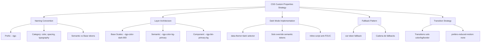

---
tags:
  - "kanban/done"
  - "type/task"
  - "domain/CSS"
  - "priority/P0"
parent: "[[desarrollo]]"
children: []
depends_on:
  - "[[CSS-002]]"
  - "[[CSS-003]]"
blocks:
  - "[[CSS-005]]"
  - "[[CSS-006]]"
  - "[[CSS-031]]"
  - "[[UI-005]]"
  - "[[CSS-034]]"
status: "done"
assignee: "@dev"
created: "2026-08-04"
updated: "2026-08-05"
---

# [[CSS-004]] CSS Custom Properties: Estrategia Naming, Fallback, Dark Mode via [data-theme]

## Descripción
Definir estrategia completa de CSS Custom Properties: naming convention (`--tgp-*`), fallback values, dark mode implementation via `[data-theme="dark"]`, y organización por capas semánticas.

## Código de Ejemplo
```css
/* Estrategia de Naming: --tgp-{category}-{subcategory}-{variant}-{scale} */

/* Colores - Base Scales (no usar directamente en componentes) */
--tgp-color-dark-900: #100f0f;
--tgp-color-accent-400: #82b7c3;
--tgp-color-light-100: #e0e0e0;

/* Colores - Semantic Tokens (USAR EN COMPONENTES) */
--tgp-color-bg-primary: var(--tgp-color-light-100);        /* Light default */
--tgp-color-bg-secondary: #ffffff;
--tgp-color-bg-tertiary: var(--tgp-color-light-50);
--tgp-color-text-primary: var(--tgp-color-dark-900);
--tgp-color-text-secondary: var(--tgp-color-dark-700);
--tgp-color-text-muted: var(--tgp-color-muted-400);
--tgp-color-border-primary: var(--tgp-color-light-200);
--tgp-color-border-focus: var(--tgp-color-accent-400);
--tgp-color-accent-primary: var(--tgp-color-accent-400);
--tgp-color-accent-hover: var(--tgp-color-accent-500);
--tgp-color-accent-active: var(--tgp-color-accent-600);

/* Estados Semánticos */
--tgp-color-success: #2e7d32;
--tgp-color-error: #c62828;
--tgp-color-warning: #ef6c00;
--tgp-color-info: var(--tgp-color-accent-400);

/* Fallback Pattern: var(--token, fallback-value) */
.component {
  /* Fallback a valor hardcodeado si token no existe */
  background: var(--tgp-color-bg-primary, #e0e0e0);
  color: var(--tgp-color-text-primary, #100f0f);
  border: 1px solid var(--tgp-color-border-primary, #cccccc);
}

/* Dark Mode Override - Solo tokens semánticos */
[data-theme="dark"] {
  --tgp-color-bg-primary: var(--tgp-color-dark-900);
  --tgp-color-bg-secondary: var(--tgp-color-dark-400);
  --tgp-color-bg-tertiary: var(--tgp-color-dark-100);
  --tgp-color-text-primary: var(--tgp-color-light-100);
  --tgp-color-text-secondary: var(--tgp-color-muted-200);
  --tgp-color-text-muted: var(--tgp-color-muted-300);
  --tgp-color-border-primary: var(--tgp-color-muted-600);
  --tgp-color-border-focus: var(--tgp-color-accent-400);
  --tgp-color-accent-primary: var(--tgp-color-accent-400);
  --tgp-color-accent-hover: var(--tgp-color-accent-300);
  --tgp-color-accent-active: var(--tgp-color-accent-200);
}

/* Transición suave de tema */
*, *::before, *::after {
  transition: background-color var(--tgp-duration-normal) var(--tgp-easing-out),
              border-color var(--tgp-duration-normal) var(--tgp-easing-out),
              color var(--tgp-duration-normal) var(--tgp-easing-out);
}

@media (prefers-reduced-motion: reduce) {
  *, *::before, *::after {
    transition: none !important;
  }
}

/* Uso en componentes - SIEMPRE tokens semánticos */
.btn--primary {
  background: var(--tgp-color-accent-primary);
  color: var(--tgp-color-bg-primary);  /* Contraste automático light/dark */
  border: none;
}

.btn--primary:hover {
  background: var(--tgp-color-accent-hover);
}

.card {
  background: var(--tgp-color-bg-secondary);
  border: 1px solid var(--tgp-color-border-primary);
  color: var(--tgp-color-text-primary);
}
```

```javascript
// Inline script en <head> para evitar FOUC (Flash of Unstyled Content)
<script>
(function() {
  const theme = localStorage.getItem('theme') || 'system';
  const prefersDark = window.matchMedia('(prefers-color-scheme: dark)').matches;
  const isDark = theme === 'dark' || (theme === 'system' && prefersDark);
  document.documentElement.dataset.theme = isDark ? 'dark' : 'light';
})();
</script>
```

## Cálculos y Algoritmos (LaTeX)
### Naming Convention
$$
\text{Token} = \text{--tgp-} + \text{category} + \text{-} + \text{subcategory} + \text{-} + \text{variant} + \text{-} + \text{scale}
$$
Ejemplo: `--tgp-color-bg-primary`, `--tgp-spacing-4`, `--tgp-font-size-xl`

### Dark Mode Resolution
$$
\text{resolved}(token) = 
\begin{cases}
\text{dark\_value} & \text{si } [data-theme="dark"] \\
\text{light\_value} & \text{si } :root
\end{cases}
$$

### Fallback Chain
$$
\text{value} = \text{var}(--token, \text{fallback\_1}, \text{fallback\_2}, \dots, \text{hardcoded})
$$

## Diagramas Mermaid


## Criterios de Aceptación
- [ ] Prefijo `--tgp-` consistente en todos los tokens
- [ ] Separación clara: base scales (no usar) vs semantic tokens (usar en componentes)
- [ ] Dark mode via `[data-theme="dark"]` override solo tokens semánticos (no duplicar componentes)
- [ ] Fallback pattern `var(--token, fallback)` en componentes críticos
- [ ] Inline script en `<head>` para evitar FOUC
- [ ] Transiciones suaves 200ms respetando `prefers-reduced-motion`
- [ ] Documentado en `docu/especificaciones/css-custom-properties.md`
- [ ] Ejemplos de uso correcto/incorrecto

## Notas Técnicas
- NO crear tokens a nivel componente (--tgp-btn-*) - usar semantic tokens directamente
- Base scales son "private" - prefijo interno `_` opcional
- Dark mode: solo 10-12 semantic tokens cambian, no 60+
- `color-scheme: light dark` en `:root` para UA styles
- `interpolation: sRGB` default, evaluar `oklch` para v1.1

## Enlaces
- [[CSS-002]] Design Tokens (generación tokens)
- [[CSS-001]] Arquitectura Framework
- [[CSS-031]] Dark Mode Strategy
- [[UI-005]] Dark Mode (toggle implementation)
- [[CSS-005]] Reset + Normalize
- [[CSS-006]] Layout Primitives