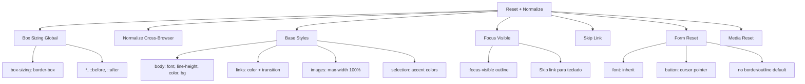

---
tags:
  - "kanban/done"
  - "type/task"
  - "domain/CSS"
  - "priority/P0"
parent: "[[desarrollo]]"
children: []
depends_on:
  - "[[CSS-004]]"
blocks:
  - "[[CSS-006]]"
  - "[[CSS-007]]"
  - "[[CSS-033]]"
  - "[[CSS-034]]"
status: "done"
assignee: "@dev"
created: "2026-08-04"
updated: "2026-08-05"
---

# [[CSS-005]] Reset + Normalize: Reset Moderno, Box-Sizing Border-Box, Base Styles, Focus-Visible

## Descripción
Implementar reset CSS moderno: box-sizing border-box global, normalize cross-browser, base styles para tipografía, formularios, imágenes, y focus-visible para accesibilidad.

## Código de Ejemplo
```css
/* resources/css/vendor/_reset.css */

/* Box sizing global */
*, *::before, *::after {
  box-sizing: border-box;
}

/* Reset margins/padding */
* {
  margin: 0;
  padding: 0;
}

/* HTML5 display-role reset */
article, aside, details, figcaption, figure,
footer, header, hgroup, main, nav, section {
  display: block;
}

/* Body base */
body {
  font-family: var(--tgp-font-family-sans);
  font-size: var(--tgp-font-size-base);
  line-height: var(--tgp-line-height-normal);
  color: var(--tgp-color-text-primary);
  background-color: var(--tgp-color-bg-primary);
  -webkit-font-smoothing: antialiased;
  -moz-osx-font-smoothing: grayscale;
  text-rendering: optimizeLegibility;
}

/* Links */
a {
  color: var(--tgp-color-accent-primary);
  text-decoration: none;
  transition: color var(--tgp-duration-fast) var(--tgp-easing-out);
}

a:hover {
  color: var(--tgp-color-accent-hover);
  text-decoration: underline;
}

/* Focus visible - Accesibilidad */
:focus {
  outline: none;
}

:focus-visible {
  outline: 2px solid var(--tgp-color-border-focus);
  outline-offset: 2px;
}

/* Skip link */
.skip-link {
  position: absolute;
  top: -100%;
  left: 50%;
  transform: translateX(-50%);
  padding: var(--tgp-spacing-3) var(--tgp-spacing-4);
  background: var(--tgp-color-accent-primary);
  color: var(--tgp-color-bg-primary);
  border-radius: var(--tgp-border-radius-md);
  z-index: var(--tgp-z-index-tooltip);
  font-weight: var(--tgp-font-weight-medium);
}

.skip-link:focus {
  top: var(--tgp-spacing-4);
}

/* Images */
img, picture, video, canvas, svg {
  display: block;
  max-width: 100%;
  height: auto;
  vertical-align: middle;
}

/* Forms */
input, button, textarea, select {
  font: inherit;
  color: inherit;
  background: none;
  border: none;
  outline: none;
}

button {
  cursor: pointer;
  background: none;
  border: none;
}

/* Lists */
ul, ol {
  list-style: none;
}

/* Tables */
table {
  border-collapse: collapse;
  border-spacing: 0;
}

/* Selection */
::selection {
  background: var(--tgp-color-accent-primary);
  color: var(--tgp-color-bg-primary);
}

/* Horizontal rule */
hr {
  border: 0;
  border-top: 1px solid var(--tgp-color-border-primary);
  margin: var(--tgp-spacing-8) 0;
}

/* Address */
address {
  font-style: normal;
}

/* Code */
code, kbd, samp, pre {
  font-family: var(--tgp-font-family-mono);
  font-size: var(--tgp-font-size-sm);
}

pre {
  overflow-x: auto;
  padding: var(--tgp-spacing-4);
  background: var(--tgp-color-bg-tertiary);
  border-radius: var(--tgp-border-radius-md);
}

/* Blockquote */
blockquote {
  border-left: 4px solid var(--tgp-color-accent-primary);
  padding-left: var(--tgp-spacing-4);
  margin: var(--tgp-spacing-6) 0;
  color: var(--tgp-color-text-secondary);
  font-style: italic;
}
```

## Cálculos y Algoritmos (LaTeX)
### Focus Ring Accesible
$$
\text{Focus Ring} = \text{outline: 2px solid accent} + \text{outline-offset: 2px}
$$
No usar `outline: none` sin `:focus-visible` replacement.

## Diagramas Mermaid


## Criterios de Aceptación
- [ ] Box-sizing border-box en *, ::before, ::after
- [ ] Normalize cross-browser para elementos HTML5
- [ ] Base styles: body, links, images, selection, hr, code, blockquote
- [ ] Focus-visible con outline 2px accent + offset 2px (no outline: none sin replacement)
- [ ] Skip link funcional (position absolute, visible on focus)
- [ ] Form reset: font inherit, button cursor pointer, sin border/outline default
- [ ] Media reset: img/video max-width 100%, height auto
- [ ] Selection colors usando tokens semánticos
- [ ] Documentado en `docu/especificaciones/css-reset.md`

## Notas Técnicas
- No usar `normalize.css` externo - mantener control total
- `:focus-visible` polyfill no necesario (soporte nativo 95%+)
- Skip link: first focusable element en página
- No resetear `list-style` en contenido editorial (usar clase `.list-reset`)
- `text-rendering: optimizeLegibility` para mejor kerning

## Enlaces
- [[CSS-004]] Custom Properties (tokens en reset)
- [[CSS-001]] Arquitectura Framework
- [[CSS-006]] Layout Primitives
- [[CSS-033]] Accesibilidad (focus-visible, skip-link)
- [[UI-003]] Layouts (skip link en layouts)