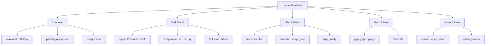

---
tags:
  - "kanban/done"
  - "type/task"
  - "domain/CSS"
  - "priority/P0"
parent: "[[desarrollo]]"
children: []
depends_on:
  - "[[CSS-005]]"
blocks:
  - "[[CSS-007]]"
  - "[[CSS-008]]"
  - "[[CSS-009]]"
  - "[[CSS-010]]"
  - "[[CSS-011]]"
  - "[[CSS-012]]"
  - "[[CSS-013]]"
  - "[[CSS-014]]"
  - "[[CSS-015]]"
  - "[[CSS-016]]"
  - "[[CSS-017]]"
  - "[[CSS-018]]"
  - "[[CSS-019]]"
  - "[[CSS-020]]"
  - "[[CSS-021]]"
  - "[[CSS-022]]"
  - "[[CSS-023]]"
  - "[[CSS-024]]"
  - "[[CSS-025]]"
  - "[[CSS-026]]"
  - "[[CSS-027]]"
  - "[[CSS-028]]"
  - "[[CSS-029]]"
  - "[[CSS-030]]"
  - "[[UI-002]]"
  - "[[UI-003]]"
  - "[[CSS-034]]"
status: "done"
assignee: "@dev"
created: "2026-08-04"
updated: "2026-08-05"
---

# [[CSS-006]] Layout Primitives: Container, Grid (12-col), Flex Utilities, Gap, Aspect-Ratio

## Descripción
Implementar primitivas de layout fundamentales: container responsivo, grid system 12-columnas, flex utilities, gap utilities, y aspect-ratio utilities.

## Código de Ejemplo
```css
/* resources/css/components/_layout.css */

/* Container */
.container {
  width: 100%;
  max-width: 1280px;
  margin-left: auto;
  margin-right: auto;
  padding-left: var(--tgp-spacing-4);
  padding-right: var(--tgp-spacing-4);
}

@media (min-width: 640px) {
  .container { padding-left: var(--tgp-spacing-6); padding-right: var(--tgp-spacing-6); }
}
@media (min-width: 1024px) {
  .container { padding-left: var(--tgp-spacing-8); padding-right: var(--tgp-spacing-8); }
}

/* Grid 12-column */
.grid {
  display: grid;
  gap: var(--tgp-spacing-4);
}

.grid-cols-1 { grid-template-columns: repeat(1, minmax(0, 1fr)); }
.grid-cols-2 { grid-template-columns: repeat(2, minmax(0, 1fr)); }
.grid-cols-3 { grid-template-columns: repeat(3, minmax(0, 1fr)); }
.grid-cols-4 { grid-template-columns: repeat(4, minmax(0, 1fr)); }
.grid-cols-5 { grid-template-columns: repeat(5, minmax(0, 1fr)); }
.grid-cols-6 { grid-template-columns: repeat(6, minmax(0, 1fr)); }
.grid-cols-12 { grid-template-columns: repeat(12, minmax(0, 1fr)); }

/* Responsive Grid */
@media (min-width: 640px) {
  .sm\:grid-cols-1 { grid-template-columns: repeat(1, minmax(0, 1fr)); }
  .sm\:grid-cols-2 { grid-template-columns: repeat(2, minmax(0, 1fr)); }
  .sm\:grid-cols-3 { grid-template-columns: repeat(3, minmax(0, 1fr)); }
  .sm\:grid-cols-4 { grid-template-columns: repeat(4, minmax(0, 1fr)); }
}
@media (min-width: 768px) {
  .md\:grid-cols-1 { grid-template-columns: repeat(1, minmax(0, 1fr)); }
  .md\:grid-cols-2 { grid-template-columns: repeat(2, minmax(0, 1fr)); }
  .md\:grid-cols-3 { grid-template-columns: repeat(3, minmax(0, 1fr)); }
  .md\:grid-cols-4 { grid-template-columns: repeat(4, minmax(0, 1fr)); }
  .md\:grid-cols-6 { grid-template-columns: repeat(6, minmax(0, 1fr)); }
}
@media (min-width: 1024px) {
  .lg\:grid-cols-1 { grid-template-columns: repeat(1, minmax(0, 1fr)); }
  .lg\:grid-cols-2 { grid-template-columns: repeat(2, minmax(0, 1fr)); }
  .lg\:grid-cols-3 { grid-template-columns: repeat(3, minmax(0, 1fr)); }
  .lg\:grid-cols-4 { grid-template-columns: repeat(4, minmax(0, 1fr)); }
  .lg\:grid-cols-6 { grid-template-columns: repeat(6, minmax(0, 1fr)); }
}

/* Gap utilities */
.gap-0 { gap: 0; }
.gap-1 { gap: var(--tgp-spacing-1); }
.gap-2 { gap: var(--tgp-spacing-2); }
.gap-3 { gap: var(--tgp-spacing-3); }
.gap-4 { gap: var(--tgp-spacing-4); }
.gap-6 { gap: var(--tgp-spacing-6); }
.gap-8 { gap: var(--tgp-spacing-8); }

/* Flex utilities */
.flex { display: flex; }
.inline-flex { display: inline-flex; }
.flex-col { flex-direction: column; }
.flex-wrap { flex-wrap: wrap; }
.flex-1 { flex: 1 1 0%; }
.flex-auto { flex: 1 1 auto; }
.flex-initial { flex: 0 1 auto; }
.flex-none { flex: none; }
.items-start { align-items: flex-start; }
.items-center { align-items: center; }
.items-end { align-items: flex-end; }
.items-stretch { align-items: stretch; }
.justify-start { justify-content: flex-start; }
.justify-center { justify-content: center; }
.justify-end { justify-content: flex-end; }
.justify-between { justify-content: space-between; }
.justify-around { justify-content: space-around; }
.gap-x-4 { column-gap: var(--tgp-spacing-4); }
.gap-y-4 { row-gap: var(--tgp-spacing-4); }

/* Aspect Ratio */
.aspect-square { aspect-ratio: 1 / 1; }
.aspect-video { aspect-ratio: 16 / 9; }
.aspect-photo { aspect-ratio: 4 / 3; }
.aspect-[16/10] { aspect-ratio: 16 / 10; }
```

## Cálculos y Algoritmos (LaTeX)
### Grid Column Width
$$
\text{col-width} = \frac{\text{container-width} - (\text{gap} \times (\text{cols} - 1))}{\text{cols}}
$$

### Responsive Breakpoints
$$
\text{Grid Cols}(bp) = \begin{cases}
1 & bp < 640 \\
2 & 640 \leq bp < 768 \\
3 & 768 \leq bp < 1024 \\
4 & bp \geq 1024
\end{cases}
$$

## Diagramas Mermaid


## Criterios de Aceptación
- [ ] Container: max-width 1280px, padding responsive (4/6/8), margin auto
- [ ] Grid 12-col: repeat(12, minmax(0, 1fr)), gap integrado
- [ ] Grid responsive: sm, md, lg breakpoints con col-1 a col-12
- [ ] Flex utilities: direction, wrap, grow, align, justify
- [ ] Gap utilities: 0-8 scale, gap-x, gap-y
- [ ] Aspect-ratio: square, video (16:9), photo (4:3), arbitrario
- [ ] Documentado en `docu/especificaciones/css-layout-primitives.md`

## Notas Técnicas
- Grid usa `minmax(0, 1fr)` para evitar overflow
- Gap en grid/flex usa tokens de spacing
- Aspect-ratio nativo (soporte 95%+), sin polyfill
- Container queries evaluar para v1.1

## Enlaces
- [[CSS-005]] Reset + Normalize
- [[CSS-004]] Custom Properties (tokens spacing)
- [[CSS-022]] Spacing Utilities
- [[CSS-023]] Display/Visibility Utilities
- [[CSS-024]] Flexbox/Grid Utilities
- [[UI-003]] Layouts (usan estas primitivas)
- [[CSS-034]] Build System