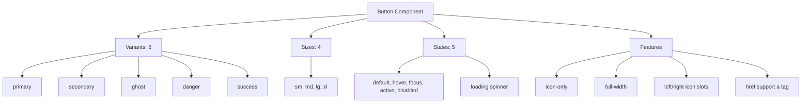

---
tags:
  - "kanban/done"
  - "type/task"
  - "domain/CSS"
  - "priority/P1"
parent: "[[desarrollo]]"
children: []
depends_on:
  - "[[CSS-006]]"
  - "[[UI-002]]"
blocks:
  - "[[CSS-008]]"
  - "[[CSS-034]]"
  - "[[CLI-001]]"
  - "[[PUB-001]]"
status: "done"
assignee: "@dev"
created: "2026-08-04"
updated: "2026-08-05"
---

# [[CSS-007]] Componente Button: Variantes, Tamaños, Estados, Loading, Icon-Only

## Descripción
Implementar componente Button completo: variantes (primary, secondary, ghost, danger, success), tamaños (sm, md, lg, xl), estados (hover, focus, active, disabled, loading), icon-only, full-width.

## Código de Ejemplo
```css
/* resources/css/components/_button.css */
.btn {
  display: inline-flex;
  align-items: center;
  justify-content: center;
  gap: var(--tgp-spacing-2);
  font-family: var(--tgp-font-family-sans);
  font-weight: var(--tgp-font-weight-medium);
  border-radius: var(--tgp-border-radius-md);
  transition: all var(--tgp-duration-fast) var(--tgp-easing-out);
  white-space: nowrap;
  user-select: none;
  cursor: pointer;
  border: 1px solid transparent;
}

/* Tamaños */
.btn--sm { padding: var(--tgp-spacing-1) var(--tgp-spacing-3); font-size: var(--tgp-font-size-sm); }
.btn--md { padding: var(--tgp-spacing-2) var(--tgp-spacing-4); font-size: var(--tgp-font-size-base); }
.btn--lg { padding: var(--tgp-spacing-3) var(--tgp-spacing-6); font-size: var(--tgp-font-size-lg); }
.btn--xl { padding: var(--tgp-spacing-4) var(--tgp-spacing-8); font-size: var(--tgp-font-size-xl); }

/* Variantes */
.btn--primary {
  background: var(--tgp-color-accent-primary);
  color: var(--tgp-color-bg-primary);
  border-color: var(--tgp-color-accent-primary);
}
.btn--primary:hover:not(:disabled) { background: var(--tgp-color-accent-hover); border-color: var(--tgp-color-accent-hover); }
.btn--primary:active:not(:disabled) { background: var(--tgp-color-accent-active); border-color: var(--tgp-color-accent-active); }

.btn--secondary {
  background: var(--tgp-color-bg-secondary);
  color: var(--tgp-color-text-primary);
  border-color: var(--tgp-color-border-primary);
}
.btn--secondary:hover:not(:disabled) { background: var(--tgp-color-bg-tertiary); border-color: var(--tgp-color-border-primary); }

.btn--ghost {
  background: transparent;
  color: var(--tgp-color-text-primary);
  border-color: transparent;
}
.btn--ghost:hover:not(:disabled) { background: var(--tgp-color-bg-tertiary); }

.btn--danger {
  background: var(--tgp-color-error);
  color: #ffffff;
  border-color: var(--tgp-color-error);
}
.btn--danger:hover:not(:disabled) { background: var(--tgp-color-warning); border-color: var(--tgp-color-warning); }

.btn--success {
  background: var(--tgp-color-success);
  color: #ffffff;
  border-color: var(--tgp-color-success);
}

/* Estados */
.btn:disabled,
.btn[disabled] {
  opacity: 0.5;
  cursor: not-allowed;
  pointer-events: none;
}

.btn:focus-visible {
  outline: 2px solid var(--tgp-color-border-focus);
  outline-offset: 2px;
}

/* Loading state */
.btn--loading {
  position: relative;
  color: transparent !important;
}
.btn--loading::after {
  content: "";
  position: absolute;
  width: 1em;
  height: 1em;
  border: 2px solid currentColor;
  border-right-color: transparent;
  border-radius: 50%;
  animation: spin 0.75s linear infinite;
}

@keyframes spin {
  to { transform: rotate(360deg); }
}

/* Icon only */
.btn--icon-only { padding-left: var(--tgp-spacing-2); padding-right: var(--tgp-spacing-2); }
.btn--icon-only.btn--sm { padding: var(--tgp-spacing-1); }
.btn--icon-only.btn--md { padding: var(--tgp-spacing-2); }
.btn--icon-only.btn--lg { padding: var(--tgp-spacing-3); }
.btn--icon-only.btn--xl { padding: var(--tgp-spacing-4); }

/* Full width */
.btn--full-width { width: 100%; }
```

```blade
{{-- resources/views/components/button.blade.php --}}
@props(['variant' => 'primary', 'size' => 'md', 'disabled' => false, 'loading' => false, 'fullWidth' => false, 'iconOnly' => false, 'leftIcon', 'rightIcon', 'type' => 'button', 'href', 'class' => ''])

@php
$classes = ['btn', "btn--{$variant}", "btn--{$size}"];
if ($disabled) $classes[] = 'btn:disabled';
if ($loading) $classes[] = 'btn--loading';
if ($fullWidth) $classes[] = 'btn--full-width';
if ($iconOnly) $classes[] = 'btn--icon-only';
$classes = implode(' ', array_merge($classes, explode(' ', $class)));
@endphp

@if($href)
    <a href="{{ $href }}" class="{{ $classes }}" {{ $attributes->merge(['role' => 'button', 'aria-disabled' => $disabled ? 'true' : 'false']) }}>
        {{-- content --}}
    </a>
@else
    <button type="{{ $type }}" class="{{ $classes }}" {{ $attributes->merge(['disabled' => $disabled, 'aria-busy' => $loading ? 'true' : 'false']) }}>
        {{-- content --}}
    </button>
@endif
```

## Diagramas Mermaid


## Criterios de Aceptación
- [ ] 5 variantes: primary, secondary, ghost, danger, success
- [ ] 4 tamaños: sm, md, lg, xl con padding/tipografía escalados
- [ ] 5 estados: default, hover, focus, active, disabled
- [ ] Loading state: spinner animado, texto oculto, aria-busy
- [ ] Icon-only: padding cuadrado, tamaños consistentes
- [ ] Full-width: width 100%
- [ ] Soporte `<button>` y `<a href>` (Blade component)
- [ ] Focus-visible con outline accent
- [ ] Dark mode compatible (tokens semánticos)
- [ ] Documentado en `docu/especificaciones/css-button.md`

## Notas Técnicas
- Blade component con slots para leftIcon/rightIcon
- `aria-disabled` para links, `disabled` para buttons
- Loading: color transparent + ::after spinner
- No usar `pointer-events: none` en loading (mantener focus)

## Enlaces
- [[CSS-006]] Layout Primitives
- [[CSS-004]] Custom Properties (tokens)
- [[CSS-033]] Accesibilidad
- [[UI-002]] Component Library (Button spec)
- [[CSS-034]] Build System