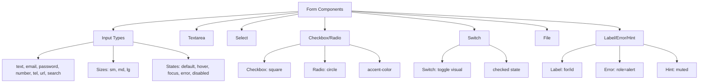

---
tags:
  - "kanban/done"
  - "type/task"
  - "domain/CSS"
  - "priority/P1"
parent: "[[desarrollo]]"
children: []
depends_on:
  - "[[CSS-006]]"
  - "[[UI-002]]"
blocks:
  - "[[CSS-034]]"
status: "done"
assignee: "@dev"
created: "2026-08-04"
updated: "2026-08-05"
---

# [[CSS-008]] Componente Form: Input, Textarea, Select, Checkbox, Radio, Switch, File, Label, Error, Hint

## Descripción
Implementar componentes de formulario completos: Input (text, email, password, number, tel, url, search), Textarea, Select, Checkbox, Radio, Switch, File, Label, Error message, Hint.

## Código de Ejemplo
```css
/* resources/css/components/_form.css */

/* Base Input */
.form-input {
  display: block;
  width: 100%;
  padding: var(--tgp-spacing-2) var(--tgp-spacing-3);
  font-size: var(--tgp-font-size-base);
  line-height: var(--tgp-line-height-normal);
  color: var(--tgp-color-text-primary);
  background: var(--tgp-color-bg-secondary);
  border: 1px solid var(--tgp-color-border-primary);
  border-radius: var(--tgp-border-radius-md);
  transition: border-color var(--tgp-duration-fast) var(--tgp-easing-out),
              box-shadow var(--tgp-duration-fast) var(--tgp-easing-out);
}

.form-input::placeholder { color: var(--tgp-color-text-muted); }

.form-input:hover:not(:disabled):not(.form-input--error) {
  border-color: var(--tgp-color-muted-300);
}

.form-input:focus {
  outline: none;
  border-color: var(--tgp-color-border-focus);
  box-shadow: 0 0 0 3px var(--tgp-color-accent-200);
}

.form-input:disabled {
  background: var(--tgp-color-bg-tertiary);
  color: var(--tgp-color-text-muted);
  cursor: not-allowed;
}

.form-input--error {
  border-color: var(--tgp-color-error);
}
.form-input--error:focus {
  box-shadow: 0 0 0 3px var(--tgp-color-error);
  box-shadow: 0 0 0 3px rgba(198, 40, 40, 0.2);
}

/* Sizes */
.form-input--sm { padding: var(--tgp-spacing-1) var(--tgp-spacing-2); font-size: var(--tgp-font-size-sm); }
.form-input--lg { padding: var(--tgp-spacing-3) var(--tgp-spacing-4); font-size: var(--tgp-font-size-lg); }

/* Textarea */
.form-textarea {
  min-height: 100px;
  resize: vertical;
  font-family: var(--tgp-font-family-sans);
}

/* Select */
.form-select {
  appearance: none;
  background-image: url("data:image/svg+xml,<svg xmlns='http://www.w3.org/2000/svg' viewBox='0 0 20 20' fill='%2365727C'><path d='M5.293 7.293a1 1 0 011.414 0L10 10.586l3.293-3.293a1 1 0 111.414 1.414l-4 4a1 1 0 01-1.414 0l-4-4a1 1 0 010-1.414z'/></svg>");
  background-position: right var(--tgp-spacing-3) center;
  background-repeat: no-repeat;
  background-size: 1.5em;
  padding-right: var(--tgp-spacing-10);
}

/* Label */
.form-label {
  display: block;
  margin-bottom: var(--tgp-spacing-1);
  font-size: var(--tgp-font-size-sm);
  font-weight: var(--tgp-font-weight-medium);
  color: var(--tgp-color-text-primary);
}

/* Checkbox / Radio */
.form-checkbox, .form-radio {
  width: 1.125rem;
  height: 1.125rem;
  accent-color: var(--tgp-color-accent-primary);
  border: 1px solid var(--tgp-color-border-primary);
  border-radius: var(--tgp-border-radius-sm);
  cursor: pointer;
}
.form-radio { border-radius: 50%; }

/* Switch */
.form-switch {
  position: relative;
  width: 2.5rem;
  height: 1.5rem;
  background: var(--tgp-color-border-primary);
  border-radius: var(--tgp-border-radius-full);
  cursor: pointer;
  transition: background var(--tgp-duration-fast);
}
.form-switch::after {
  content: "";
  position: absolute;
  top: 0.125rem;
  left: 0.125rem;
  width: 1.25rem;
  height: 1.25rem;
  background: white;
  border-radius: 50%;
  box-shadow: 0 1px 3px rgba(0,0,0,0.1);
  transition: transform var(--tgp-duration-fast);
}
.form-checkbox:checked + .form-switch,
.form-radio:checked + .form-switch { background: var(--tgp-color-accent-primary); }
.form-checkbox:checked + .form-switch::after { transform: translateX(1rem); }

/* File Input */
.form-file {
  display: block;
  width: 100%;
  padding: var(--tgp-spacing-3);
  border: 2px dashed var(--tgp-color-border-primary);
  border-radius: var(--tgp-border-radius-md);
  background: var(--tgp-color-bg-tertiary);
  cursor: pointer;
  transition: border-color var(--tgp-duration-fast);
}
.form-file:hover { border-color: var(--tgp-color-accent-primary); }
.form-file:focus { outline: none; border-color: var(--tgp-color-border-focus); box-shadow: 0 0 0 3px var(--tgp-color-accent-200); }

/* Error / Hint */
.form-error {
  display: block;
  margin-top: var(--tgp-spacing-1);
  font-size: var(--tgp-font-size-sm);
  color: var(--tgp-color-error);
}
.form-hint {
  display: block;
  margin-top: var(--tgp-spacing-1);
  font-size: var(--tgp-font-size-sm);
  color: var(--tgp-color-text-muted);
}

/* Field wrapper */
.form-field { margin-bottom: var(--tgp-spacing-4); }
.form-field--error .form-input { border-color: var(--tgp-color-error); }
.form-field--error .form-error { display: block; }
```

```blade
{{-- resources/views/components/input.blade.php --}}
@props(['type' => 'text', 'name', 'id', 'value', 'label', 'error', 'hint', 'placeholder', 'disabled' => false, 'required' => false, 'class' => ''])

<div class="form-field {{ $error ? 'form-field--error' : '' }}">
    @if($label)
        <label for="{{ $id }}" class="form-label">{{ $label }} @if($required)<span class="text-error" aria-hidden="true">*</span>@endif</label>
    @endif
    <input type="{{ $type }}" name="{{ $name }}" id="{{ $id }}" value="{{ $value }}" class="form-input {{ $error ? 'form-input--error' : '' }} {{ $class }}" placeholder="{{ $placeholder }}" @disabled($disabled) @required($required) aria-describedby="{{ $id }}-help" aria-invalid="{{ $error ? 'true' : 'false' }}">
    @if($error)
        <p id="{{ $id }}-help" class="form-error" role="alert">{{ $error }}</p>
    @elseif($hint)
        <p id="{{ $id }}-help" class="form-hint">{{ $hint }}</p>
    @endif
</div>
```

## Diagramas Mermaid


## Criterios de Aceptación
- [ ] Input: 7 types, 3 sizes, 5 states (default, hover, focus, error, disabled)
- [ ] Textarea: resize vertical, min-height, hereda input styles
- [ ] Select: appearance none, custom chevron, focus ring
- [ ] Checkbox/Radio: accent-color, focus visible, label association
- [ ] Switch: toggle visual animado, checked state
- [ ] File: drag-drop zone style, focus ring
- [ ] Label: for/id association, required asterisk
- [ ] Error: role=alert, color error, focus ring error
- [ ] Hint: muted color, vinculado via aria-describedby
- [ ] Dark mode compatible (tokens semánticos)
- [ ] Documentado en `docu/especificaciones/css-form.md`

## Notas Técnicas
- `accent-color` para checkbox/radio/switch (CSS moderno)
- `aria-describedby` vincula input con error/hint
- `role=alert` en error para screen readers
- File input: stylable via wrapper, input real oculto
- Select: no stylable option nativo, evaluar combobox custom v1.1

## Enlaces
- [[CSS-006]] Layout Primitives
- [[CSS-004]] Custom Properties (tokens)
- [[CSS-033]] Accesibilidad
- [[UI-002]] Component Library (Form spec)
- [[CSS-034]] Build System