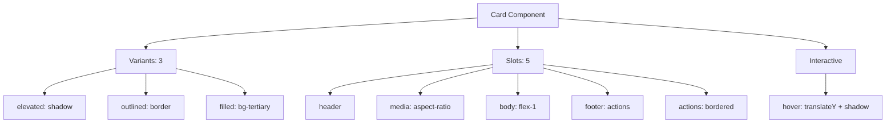

---
tags:
  - "kanban/done"
  - "type/task"
  - "domain/CSS"
  - "priority/P1"
parent: "[[desarrollo]]"
children: []
depends_on:
  - "[[CSS-006]]"
  - "[[UI-002]]"
blocks:
  - "[[CSS-034]]"
  - "[[CLI-001]]"
  - "[[PUB-001]]"
status: "done"
assignee: "@dev"
created: "2026-08-04"
updated: "2026-08-05"
---

# [[CSS-009]] Componente Card: Base, Header/Body/Footer, Image, Action, Variantes

## Descripción
Implementar componente Card con variantes: elevated, outlined, filled. Slots para header, media, body, footer, actions.

## Código de Ejemplo
```css
/* resources/css/components/_card.css */
.card {
  display: flex;
  flex-direction: column;
  background: var(--tgp-color-bg-secondary);
  border-radius: var(--tgp-border-radius-lg);
  overflow: hidden;
  transition: box-shadow var(--tgp-duration-normal) var(--tgp-easing-out);
}

/* Variantes */
.card--elevated { box-shadow: var(--tgp-shadow-md); }
.card--elevated:hover { box-shadow: var(--tgp-shadow-lg); }

.card--outlined { border: 1px solid var(--tgp-color-border-primary); }
.card--filled { background: var(--tgp-color-bg-tertiary); border: none; }

/* Slots */
.card__header { padding: var(--tgp-spacing-4) var(--tgp-spacing-4) 0; }
.card__media { width: 100%; aspect-ratio: 16 / 9; object-fit: cover; }
.card__body { padding: var(--tgp-spacing-4); flex: 1; }
.card__footer { padding: 0 var(--tgp-spacing-4) var(--tgp-spacing-4); display: flex; gap: var(--tgp-spacing-2); justify-content: flex-end; }
.card__actions { padding: var(--tgp-spacing-3) var(--tgp-spacing-4); border-top: 1px solid var(--tgp-color-border-primary); display: flex; gap: var(--tgp-spacing-2); justify-content: flex-end; }

/* Interactive */
.card--interactive { cursor: pointer; }
.card--interactive:hover { transform: translateY(-2px); box-shadow: var(--tgp-shadow-lg); }
```

```blade
{{-- resources/views/components/card.blade.php --}}
@props(['variant' => 'elevated', 'interactive' => false, 'image', 'imageAlt', 'class' => ''])

@php
$classes = ['card', "card--{$variant}"];
if ($interactive) $classes[] = 'card--interactive';
$classes = implode(' ', array_merge($classes, explode(' ', $class)));
@endphp

<article class="{{ $classes }}" {{ $attributes }}>
    @if($image)
        
    @endif
    <div class="card__body">
        {{ $slot }}
    </div>
    @if(isset($footer))
        <div class="card__footer">{{ $footer }}</div>
    @endif
</article>
```

## Diagramas Mermaid


## Criterios de Aceptación
- [ ] 3 variantes: elevated, outlined, filled
- [ ] 5 slots: header, media, body, footer, actions
- [ ] Media con aspect-ratio 16:9
- [ ] Interactive: hover translateY + shadow
- [ ] Dark mode compatible
- [ ] Documentado en `docu/especificaciones/css-card.md`

## Notas Técnicas
- Blade component con slots nombrados
- Media usa aspect-ratio nativo
- Elevated usa shadow tokens
- Outlined usa border tokens

## Enlaces
- [[CSS-006]] Layout Primitives
- [[CSS-004]] Custom Properties
- [[UI-002]] Component Library
- [[CSS-034]] Build System