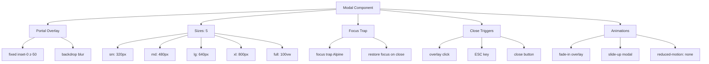

---
tags:
  - "kanban/done"
  - "type/task"
  - "domain/CSS"
  - "priority/P1"
parent: "[[desarrollo]]"
children: []
depends_on:
  - "[[CSS-006]]"
  - "[[UI-002]]"
blocks:
  - "[[CSS-034]]"
status: "done"
assignee: "@dev"
created: "2026-08-04"
updated: "2026-08-05"
---

# [[CSS-010]] Componente Modal/Dialog: Portal, Backdrop, Focus Trap, ESC Close, Animaciones, Responsive

## Descripción
Implementar componente Modal/Dialog: portal rendering, backdrop, focus trap, ESC para cerrar, animaciones slide-up/fade, responsive.

## Código de Ejemplo
```css
/* resources/css/components/_modal.css */
.modal-overlay {
  position: fixed;
  inset: 0;
  background: var(--tgp-color-overlay);
  z-index: var(--tgp-z-index-modal);
  display: flex;
  align-items: center;
  justify-content: center;
  padding: var(--tgp-spacing-4);
  animation: fade-in var(--tgp-duration-fast) var(--tgp-easing-out);
}

.modal {
  background: var(--tgp-color-bg-secondary);
  border-radius: var(--tgp-border-radius-xl);
  box-shadow: var(--tgp-shadow-xl);
  max-height: 90vh;
  overflow: hidden;
  display: flex;
  flex-direction: column;
  animation: slide-up var(--tgp-duration-normal) var(--tgp-easing-spring);
}

.modal--sm { width: 100%; max-width: 320px; }
.modal--md { width: 100%; max-width: 480px; }
.modal--lg { width: 100%; max-width: 640px; }
.modal--xl { width: 100%; max-width: 800px; }
.modal--full { width: 100%; max-width: 100%; max-height: 100vh; border-radius: 0; }

.modal__header { padding: var(--tgp-spacing-4) var(--tgp-spacing-6); border-bottom: 1px solid var(--tgp-color-border-primary); display: flex; align-items: center; justify-content: space-between; }
.modal__title { font-size: var(--tgp-font-size-lg); font-weight: var(--tgp-font-weight-semibold); color: var(--tgp-color-text-primary); }
.modal__close { padding: var(--tgp-spacing-1); color: var(--tgp-color-text-muted); border-radius: var(--tgp-border-radius-md); }
.modal__close:hover { background: var(--tgp-color-bg-tertiary); color: var(--tgp-color-text-primary); }

.modal__body { padding: var(--tgp-spacing-6); overflow-y: auto; flex: 1; }
.modal__footer { padding: var(--tgp-spacing-4) var(--tgp-spacing-6); border-top: 1px solid var(--tgp-color-border-primary); display: flex; justify-content: flex-end; gap: var(--tgp-spacing-3); }

@keyframes fade-in { from { opacity: 0; } to { opacity: 1; } }
@keyframes slide-up { from { opacity: 0; transform: translateY(20px); } to { opacity: 1; transform: translateY(0); } }

@media (prefers-reduced-motion: reduce) {
  .modal-overlay, .modal { animation: none; }
}
```

```blade
{{-- resources/views/components/modal.blade.php --}}
@props(['open' => false, 'size' => 'md', 'title', 'closeOnOverlay' => true, 'closeOnEscape' => true, 'class' => ''])

@php
$classes = ['modal', "modal--{$size}"];
$classes = implode(' ', array_merge($classes, explode(' ', $class)));
@endphp

@if($open)
<div class="modal-overlay" {{ $closeOnOverlay ? 'wire:click.self="close"' : '' }} x-data="{ open: true }" x-show="open" @keydown.escape.window="$closeOnEscape && close()">
    <div class="{{ $classes }}" {{ $attributes }} role="dialog" aria-modal="true" aria-labelledby="modal-title">
        @if($title)
        <header class="modal__header">
            <h2 id="modal-title" class="modal__title">{{ $title }}</h2>
            <button type="button" class="modal__close" @click="close" aria-label="Cerrar">
                <x-icon name="x-mark" class="w-5 h-5" />
            </button>
        </header>
        @endif
        <div class="modal__body">{{ $slot }}</div>
        @if(isset($footer))
        <footer class="modal__footer">{{ $footer }}</footer>
        @endif
    </div>
</div>
@endif
```

## Diagramas Mermaid


## Criterios de Aceptación
- [ ] Portal rendering (fixed overlay)
- [ ] 5 tamaños: sm, md, lg, xl, full
- [ ] Focus trap (Alpine.js)
- [ ] ESC close, overlay click, close button
- [ ] Animaciones: fade-in overlay, slide-up modal
- [ ] Responsive: padding en mobile, max-height 90vh
- [ ] Dark mode compatible
- [ ] Documentado en `docu/especificaciones/css-modal.md`

## Notas Técnicas
- Alpine.js x-data para focus trap
- Focus restore al cerrar
- `role="dialog" aria-modal="true"`
- Reduced-motion desactiva animaciones

## Enlaces
- [[CSS-006]] Layout Primitives
- [[CSS-004]] Custom Properties
- [[CSS-033]] Accesibilidad
- [[UI-002]] Component Library
- [[CSS-034]] Build System