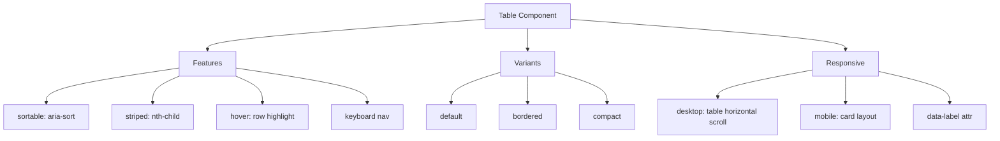

---
tags:
  - "kanban/done"
  - "type/task"
  - "domain/CSS"
  - "priority/P1"
parent: "[[desarrollo]]"
children: []
depends_on:
  - "[[CSS-006]]"
  - "[[UI-002]]"
blocks:
  - "[[CSS-034]]"
status: "done"
assignee: "@dev"
created: "2026-08-04"
updated: "2026-08-05"
---

# [[CSS-011]] Componente Table: Sortable, Striped, Hover, Responsive (scroll horizontal / card en móvil)

## Descripción
Implementar componente Table: sortable, striped, hover, responsive con scroll horizontal en desktop y layout card en móvil.

## Código de Ejemplo
```css
/* resources/css/components/_table.css */
.table-wrapper {
  overflow-x: auto;
  -webkit-overflow-scrolling: touch;
}

.table {
  width: 100%;
  border-collapse: collapse;
  font-size: var(--tgp-font-size-sm);
}

.table th,
.table td {
  padding: var(--tgp-spacing-3) var(--tgp-spacing-4);
  text-align: left;
  border-bottom: 1px solid var(--tgp-color-border-primary);
}

.table th {
  font-weight: var(--tgp-font-weight-semibold);
  color: var(--tgp-color-text-secondary);
  background: var(--tgp-color-bg-tertiary);
  white-space: nowrap;
  cursor: default;
}

.table tbody tr { transition: background var(--tgp-duration-fast); }
.table tbody tr:hover { background: var(--tgp-color-bg-tertiary); }

.table--striped tbody tr:nth-child(even) { background: var(--tgp-color-bg-tertiary); }

.table--sortable th[role="columnheader"] { cursor: pointer; user-select: none; }
.table--sortable th[aria-sort="ascending"]::after { content: " ▲"; }
.table--sortable th[aria-sort="descending"]::after { content: " ▼"; }

/* Responsive: card layout en mobile */
@media (max-width: 767px) {
  .table-responsive { display: block; }
  .table-responsive .table { display: block; }
  .table-responsive thead { display: none; }
  .table-responsive tbody { display: block; }
  .table-responsive tr { display: block; margin-bottom: var(--tgp-spacing-4); padding: var(--tgp-spacing-4); background: var(--tgp-color-bg-secondary); border: 1px solid var(--tgp-color-border-primary); border-radius: var(--tgp-border-radius-md); }
  .table-responsive td { display: flex; justify-content: space-between; padding: var(--tgp-spacing-2) 0; border-bottom: 1px solid var(--tgp-color-border-primary); }
  .table-responsive td:last-child { border-bottom: none; }
  .table-responsive td::before { content: attr(data-label); font-weight: var(--tgp-font-weight-medium); color: var(--tgp-color-text-secondary); }
}
```

```blade
{{-- resources/views/components/table.blade.php --}}
@props(['striped' => false, 'sortable' => false, 'responsive' => true, 'class' => ''])

@php
$classes = ['table'];
if ($striped) $classes[] = 'table--striped';
if ($sortable) $classes[] = 'table--sortable';
if ($responsive) $classes[] = 'table-responsive';
$classes = implode(' ', array_merge($classes, explode(' ', $class)));
@endphp

<div class="table-wrapper">
    <table class="{{ $classes }}" {{ $attributes }}>
        {{ $slot }}
    </table>
</div>
```

```blade
{{-- Uso --}}
<x-table striped sortable responsive>
    <thead>
        <tr>
            <th scope="col" data-sort="name">Nombre</th>
            <th scope="col" data-sort="email">Email</th>
            <th scope="col">Plan</th>
            <th scope="col" data-sort="created_at">Fecha</th>
        </tr>
    </thead>
    <tbody>
        @foreach($users as $user)
        <tr>
            <td data-label="Nombre">{{ $user->name }}</td>
            <td data-label="Email">{{ $user->email }}</td>
            <td data-label="Plan">{{ $user->plan }}</td>
            <td data-label="Fecha">{{ $user->created_at->format('d/m/Y') }}</td>
        </tr>
        @endforeach
    </tbody>
</x-table>
```

## Diagramas Mermaid


## Criterios de Aceptación
- [ ] Sortable: aria-sort, headers clickables
- [ ] Striped: nth-child(even)
- [ ] Hover: row highlight
- [ ] Responsive: desktop table + horizontal scroll, mobile card layout con data-label
- [ ] Keyboard navigation en headers
- [ ] Dark mode compatible
- [ ] Documentado en `docu/especificaciones/css-table.md`

## Notas Técnicas
- `data-label` attr para mobile card layout
- `scope="col"` en th para accesibilidad
- `aria-sort` para estado ordenación
- Horizontal scroll con `-webkit-overflow-scrolling: touch`

## Enlaces
- [[CSS-006]] Layout Primitives
- [[CSS-004]] Custom Properties
- [[UI-002]] Component Library
- [[CSS-033]] Accesibilidad
- [[CSS-034]] Build System