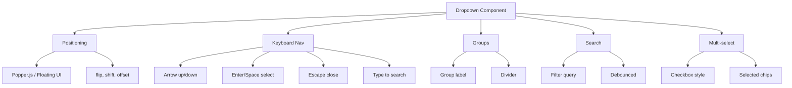

---
tags:
  - "kanban/done"
  - "type/task"
  - "domain/CSS"
  - "priority/P1"
parent: "[[desarrollo]]"
children: []
depends_on:
  - "[[CSS-006]]"
  - "[[UI-002]]"
blocks:
  - "[[CSS-034]]"
status: "done"
assignee: "@dev"
created: "2026-08-04"
updated: "2026-08-05"
---

# [[CSS-012]] Componente Dropdown/Select: Popper Positioning, Keyboard Nav, Grupos, Búsqueda, Multi-select

## Descripción
Implementar componente Dropdown/Select con posicionamiento Popper, navegación teclado, grupos, búsqueda, multi-select.

## Código de Ejemplo
```css
/* resources/css/components/_dropdown.css */
.dropdown { position: relative; display: inline-block; }

.dropdown__trigger { display: flex; align-items: center; gap: var(--tgp-spacing-2); cursor: pointer; }

.dropdown__menu {
  position: absolute;
  top: 100%;
  left: 0;
  z-index: var(--tgp-z-index-dropdown);
  min-width: 12rem;
  margin-top: var(--tgp-spacing-1);
  background: var(--tgp-color-bg-secondary);
  border: 1px solid var(--tgp-color-border-primary);
  border-radius: var(--tgp-border-radius-md);
  box-shadow: var(--tgp-shadow-lg);
  overflow: hidden;
  animation: slide-down var(--tgp-duration-fast) var(--tgp-easing-out);
}

.dropdown__search {
  padding: var(--tgp-spacing-2) var(--tgp-spacing-3);
  border-bottom: 1px solid var(--tgp-color-border-primary);
}

.dropdown__group { border-bottom: 1px solid var(--tgp-color-border-primary); }
.dropdown__group:last-child { border-bottom: none; }
.dropdown__group-label { padding: var(--tgp-spacing-2) var(--tgp-spacing-3); font-size: var(--tgp-font-size-xs); font-weight: var(--tgp-font-weight-semibold); color: var(--tgp-color-text-muted); text-transform: uppercase; background: var(--tgp-color-bg-tertiary); }

.dropdown__item {
  display: flex;
  align-items: center;
  gap: var(--tgp-spacing-2);
  width: 100%;
  padding: var(--tgp-spacing-2) var(--tgp-spacing-3);
  font-size: var(--tgp-font-size-sm);
  color: var(--tgp-color-text-primary);
  background: none;
  border: none;
  cursor: pointer;
  text-align: left;
}
.dropdown__item:hover,
.dropdown__item:focus { background: var(--tgp-color-bg-tertiary); outline: none; }
.dropdown__item--selected { background: var(--tgp-color-accent-100); color: var(--tgp-color-accent-700); font-weight: var(--tgp-font-weight-medium); }
.dropdown__item--disabled { color: var(--tgp-color-text-muted); cursor: not-allowed; }

.dropdown__divider { height: 1px; background: var(--tgp-color-border-primary); margin: var(--tgp-spacing-1) 0; }

@keyframes slide-down { from { opacity: 0; transform: translateY(-8px); } to { opacity: 1; transform: translateY(0); } }
```

```blade
{{-- resources/views/components/dropdown.blade.php --}}
@props(['searchable' => false, 'multi' => false, 'placeholder' => 'Seleccionar', 'options' => [], 'groups' => [], 'value', 'class' => ''])

<div class="dropdown" x-data="dropdown({ searchable: {{ $searchable ? 'true' : 'false' }}, multi: {{ $multi ? 'true' : 'false' }})" {{ $attributes }}>
    <button type="button" class="dropdown__trigger btn btn--secondary btn--md" @click="toggle" aria-expanded="false" aria-haspopup="listbox">
        <span x-show="!selected.length">{{ $placeholder }}</span>
        <template x-for="sel in selected" :key="sel">{{ sel.label }}<span class="ml-1">,</span></template>
        <x-icon name="chevron-down" class="w-4 h-4 ml-2" />
    </button>
    
    <div class="dropdown__menu" x-show="open" @click.outside="close" role="listbox" x-transition:enter="transition ease-out duration-100" x-transition:enter-start="opacity-0 transform -translate-y-2" x-transition:enter-end="opacity-100 transform translate-y-0">
        @if($searchable)
        <input type="text" class="dropdown__search" placeholder="Buscar..." x-model="query" @keydown.arrow-down="focusFirst" aria-label="Buscar opciones">
        @endif
        
        @if($groups)
            @foreach($groups as $group)
            <div class="dropdown__group">
                <div class="dropdown__group-label">{{ $group['label'] }}</div>
                @foreach($group['options'] as $opt)
                <button type="button" class="dropdown__item {{ in_array($opt['value'], (array)$value) ? 'dropdown__item--selected' : '' }} {{ $opt['disabled'] ? 'dropdown__item--disabled' : '' }}" @click="select('{{ $opt['value'] }}', '{{ $opt['label'] }}')" :disabled="$opt['disabled']" role="option" :aria-selected="in_array($opt['value'], (array)$value)">
                    {{ $opt['label'] }}
                </button>
                @endforeach
            </div>
            @endforeach
        @else
            @foreach($options as $opt)
            <button type="button" class="dropdown__item {{ in_array($opt['value'], (array)$value) ? 'dropdown__item--selected' : '' }} {{ $opt['disabled'] ? 'dropdown__item--disabled' : '' }}" @click="select('{{ $opt['value'] }}', '{{ $opt['label'] }}')" :disabled="$opt['disabled']" role="option" :aria-selected="in_array($opt['value'], (array)$value)">
                {{ $opt['label'] }}
            </button>
            @endforeach
        @endif
    </div>
</div>
```

```javascript
// Alpine.js component
document.addEventListener('alpine:init', () => {
    Alpine.data('dropdown', (config = {}) => ({
        open: false,
        query: '',
        selected: [],
        toggle() { this.open = !this.open; },
        close() { this.open = false; this.query = ''; },
        select(value, label) {
            if (config.multi) {
                const idx = this.selected.findIndex(s => s.value === value);
                if (idx >= 0) this.selected.splice(idx, 1);
                else this.selected.push({ value, label });
            } else {
                this.selected = [{ value, label }];
                this.close();
            }
            this.$dispatch('change', { value: config.multi ? this.selected.map(s => s.value) : this.selected[0]?.value });
        },
        focusFirst() { this.$nextTick(() => this.$refs.menu?.querySelector('.dropdown__item:not(.dropdown__item--disabled)')?.focus()); },
        get filteredOptions() { /* filter logic */ }
    }));
});
```

## Diagramas Mermaid


## Criterios de Aceptación
- [ ] Popper positioning (flip, shift, offset)
- [ ] Keyboard nav: arrows, enter, escape, type-to-search
- [ ] Groups con label y divider
- [ ] Search: filter en tiempo real, debounced
- [ ] Multi-select: chips visuales, checkbox style
- [ ] Focus trap, click outside close
- [ ] Dark mode compatible
- [ ] Documentado en `docu/especificaciones/css-dropdown.md`

## Notas Técnicas
- Floating UI (popper successor) para positioning
- Alpine.js para estado y keyboard
- `role="listbox"`, `role="option"`, `aria-selected`
- Multi: chips removibles en trigger

## Enlaces
- [[CSS-006]] Layout Primitives
- [[CSS-004]] Custom Properties
- [[CSS-008]] Form (Select usa base)
- [[UI-002]] Component Library
- [[CSS-034]] Build System