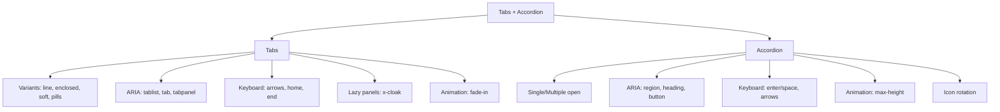

---
tags:
  - "kanban/done"
  - "type/task"
  - "domain/CSS"
  - "priority/P1"
parent: "[[desarrollo]]"
children: []
depends_on:
  - "[[CSS-006]]"
  - "[[UI-002]]"
blocks:
  - "[[CSS-034]]"
status: "done"
assignee: "@dev"
created: "2026-08-04"
updated: "2026-08-05"
---

# [[CSS-013]] Componente Tabs/Accordion: ARIA, Keyboard, Animaciones, Lazy Panels

## Descripción
Implementar componentes Tabs y Accordion: ARIA completo, navegación teclado, animaciones slide/fade, lazy panels.

## Código de Ejemplo
```css
/* resources/css/components/_tabs.css */
.tabs { border-bottom: 1px solid var(--tgp-color-border-primary); }
.tabs__list { display: flex; gap: var(--tgp-spacing-1); margin-bottom: -1px; }
.tabs__trigger {
  padding: var(--tgp-spacing-3) var(--tgp-spacing-4);
  font-size: var(--tgp-font-size-sm);
  font-weight: var(--tgp-font-weight-medium);
  color: var(--tgp-color-text-secondary);
  background: none;
  border: 1px solid transparent;
  border-bottom: 2px solid transparent;
  border-radius: var(--tgp-border-radius-md) var(--tgp-border-radius-md) 0 0;
  cursor: pointer;
  transition: color var(--tgp-duration-fast);
}
.tabs__trigger:hover { color: var(--tgp-color-text-primary); }
.tabs__trigger[aria-selected="true"] { color: var(--tgp-color-accent-primary); border-bottom-color: var(--tgp-color-accent-primary); }
.tabs__trigger:focus-visible { outline: 2px solid var(--tgp-color-border-focus); outline-offset: -2px; }

.tabs__panel { padding: var(--tgp-spacing-6) 0; animation: fade-in var(--tgp-duration-normal); }
.tabs__panel[hidden] { display: none; }

/* Variants */
.tabs--enclosed .tabs__trigger { border: 1px solid var(--tgp-color-border-primary); border-bottom: none; margin-right: var(--tgp-spacing-1); border-radius: var(--tgp-border-radius-md) var(--tgp-border-radius-md) 0 0; }
.tabs--soft .tabs__trigger[aria-selected="true"] { background: var(--tgp-color-accent-100); color: var(--tgp-color-accent-700); border-radius: var(--tgp-border-radius-md); }
.tabs--pills .tabs__trigger { border-radius: var(--tgp-border-radius-full); }
.tabs--pills .tabs__trigger[aria-selected="true"] { background: var(--tgp-color-accent-primary); color: var(--tgp-color-bg-primary); }
```

```css
/* resources/css/components/_accordion.css */
.accordion { border: 1px solid var(--tgp-color-border-primary); border-radius: var(--tgp-border-radius-lg); overflow: hidden; }
.accordion__item { border-bottom: 1px solid var(--tgp-color-border-primary); }
.accordion__item:last-child { border-bottom: none; }

.accordion__trigger {
  width: 100%;
  display: flex;
  align-items: center;
  justify-content: space-between;
  padding: var(--tgp-spacing-4) var(--tgp-spacing-6);
  font-size: var(--tgp-font-size-base);
  font-weight: var(--tgp-font-weight-medium);
  color: var(--tgp-color-text-primary);
  background: var(--tgp-color-bg-secondary);
  border: none;
  text-align: left;
  cursor: pointer;
  transition: background var(--tgp-duration-fast);
}
.accordion__trigger:hover { background: var(--tgp-color-bg-tertiary); }
.accordion__trigger:focus-visible { outline: 2px solid var(--tgp-color-border-focus); outline-offset: -2px; }
.accordion__icon { width: 1.25rem; height: 1.25rem; transition: transform var(--tgp-duration-fast); flex-shrink: 0; margin-left: var(--tgp-spacing-3); }
.accordion__trigger[aria-expanded="true"] .accordion__icon { transform: rotate(180deg); }

.accordion__panel { overflow: hidden; max-height: 0; transition: max-height var(--tgp-duration-normal) var(--tgp-easing-out); }
.accordion__panel[hidden] { display: none; }
.accordion__content { padding: 0 var(--tgp-spacing-6) var(--tgp-spacing-6); color: var(--tgp-color-text-secondary); line-height: var(--tgp-line-height-relaxed); }
```

```blade
{{-- resources/views/components/tabs.blade.php --}}
@props(['variant' => 'line', 'defaultIndex' => 0, 'lazy' => false, 'activationMode' => 'automatic', 'class' => ''])

@php
$classes = ['tabs', "tabs--{$variant}"];
$classes = implode(' ', array_merge($classes, explode(' ', $class)));
@endphp

<div class="{{ $classes }}" {{ $attributes }} x-data="tabs({ defaultIndex: {{ $defaultIndex }}, lazy: {{ $lazy ? 'true' : 'false' }}, activationMode: '{{ $activationMode }}' })">
    <div role="tablist" class="tabs__list" aria-label="{{ $label ?? 'Pestañas' }}">
        @foreach($tabs as $index => $tab)
        <button role="tab" class="tabs__trigger" :class="{ 'aria-selected': activeIndex === {{ $index }} }" @click="activate({{ $index }})" :aria-selected="activeIndex === {{ $index }}" :aria-controls="panel-{{ $index }}" id="tab-{{ $index }}">
            {{ $tab['label'] }}
        </button>
        @endforeach
    </div>
    @foreach($tabs as $index => $tab)
    <div role="tabpanel" class="tabs__panel" :hidden="activeIndex !== {{ $index }}" id="panel-{{ $index }}" :aria-labelledby="tab-{{ $index }}" x-show="activeIndex === {{ $index }}" x-transition x-cloak>
        {{ $tab['content'] }}
    </div>
    @endforeach
</div>
```

```javascript
// Alpine.js tabs
document.addEventListener('alpine:init', () => {
    Alpine.data('tabs', (config = {}) => ({
        activeIndex: config.defaultIndex || 0,
        activate(index) { this.activeIndex = index; this.$dispatch('change', { index }); },
        // Keyboard: Left/Right arrows, Home, End
    }));
});
```

## Diagramas Mermaid


## Criterios de Aceptación
- [ ] Tabs: 4 variants (line, enclosed, soft, pills)
- [ ] Accordion: single/multiple, icon rotation
- [ ] ARIA completo: roles, aria-selected, aria-expanded, aria-controls
- [ ] Keyboard: arrows, home/end (tabs), enter/space (accordion)
- [ ] Animaciones: fade-in (tabs), max-height (accordion)
- [ ] Lazy panels: x-cloak para tabs no activos
- [ ] Dark mode compatible
- [ ] Documentado en `docu/especificaciones/css-tabs-accordion.md`

## Notas Técnicas
- Alpine.js para estado y keyboard
- Tabs lazy: x-cloak oculta paneles no renderizados
- Accordion max-height animation (no height auto)
- ActivationMode: automatic vs manual

## Enlaces
- [[CSS-006]] Layout Primitives
- [[CSS-004]] Custom Properties
- [[CSS-033]] Accesibilidad
- [[UI-002]] Component Library
- [[CSS-034]] Build System