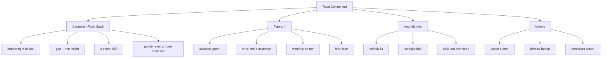

---
tags:
  - "kanban/done"
  - "type/task"
  - "domain/CSS"
  - "priority/P1"
parent: "[[desarrollo]]"
children: []
depends_on:
  - "[[CSS-006]]"
  - "[[UI-002]]"
blocks:
  - "[[CSS-034]]"
status: "done"
assignee: "@dev"
created: "2026-08-04"
updated: "2026-08-05"
---

# [[CSS-014]] Componente Toast/Notification: Stack, Auto-dismiss, Action Buttons, Tipos

## Descripción
Implementar componente Toast/Notification: stack management, auto-dismiss, action buttons, 4 tipos (success, error, warning, info).

## Código de Ejemplo
```css
/* resources/css/components/_toast.css */
.toast-container {
  position: fixed;
  bottom: var(--tgp-spacing-4);
  right: var(--tgp-spacing-4);
  z-index: var(--tgp-z-index-toast);
  display: flex;
  flex-direction: column;
  gap: var(--tgp-spacing-2);
  pointer-events: none;
  max-width: 400px;
}

.toast {
  display: flex;
  align-items: flex-start;
  gap: var(--tgp-spacing-3);
  padding: var(--tgp-spacing-3) var(--tgp-spacing-4);
  background: var(--tgp-color-bg-secondary);
  border: 1px solid var(--tgp-color-border-primary);
  border-radius: var(--tgp-border-radius-lg);
  box-shadow: var(--tgp-shadow-lg);
  pointer-events: auto;
  animation: slide-in-right var(--tgp-duration-normal) var(--tgp-easing-out);
  min-width: 280px;
  max-width: 100%;
}

.toast--success { border-left: 4px solid var(--tgp-color-success); }
.toast--error { border-left: 4px solid var(--tgp-color-error); }
.toast--warning { border-left: 4px solid var(--tgp-color-warning); }
.toast--info { border-left: 4px solid var(--tgp-color-info); }

.toast__icon { flex-shrink: 0; width: 1.25rem; height: 1.25rem; margin-top: 0.125rem; }
.toast__content { flex: 1; min-width: 0; }
.toast__title { font-weight: var(--tgp-font-weight-semibold); color: var(--tgp-color-text-primary); margin-bottom: var(--tgp-spacing-1); }
.toast__message { font-size: var(--tgp-font-size-sm); color: var(--tgp-color-text-secondary); line-height: var(--tgp-line-height-normal); }
.toast__actions { display: flex; gap: var(--tgp-spacing-2); margin-top: var(--tgp-spacing-2); }
.toast__close { flex-shrink: 0; padding: var(--tgp-spacing-1); color: var(--tgp-color-text-muted); border-radius: var(--tgp-border-radius-md); }
.toast__close:hover { background: var(--tgp-color-bg-tertiary); color: var(--tgp-color-text-primary); }

.toast--exiting { animation: slide-out-right var(--tgp-duration-fast) var(--tgp-easing-in) forwards; }

@keyframes slide-in-right { from { opacity: 0; transform: translateX(100%); } to { opacity: 1; transform: translateX(0); } }
@keyframes slide-out-right { from { opacity: 1; transform: translateX(0); } to { opacity: 0; transform: translateX(100%); } }

@media (prefers-reduced-motion: reduce) {
  .toast { animation: none; }
  .toast--exiting { animation: none; }
}
```

```blade
{{-- resources/views/components/toast.blade.php --}}
@props(['type' => 'info', 'title', 'message', 'action', 'duration' => 5000, 'dismissible' => true])

@php
$icons = [
    'success' => 'check-circle',
    'error' => 'exclamation-triangle',
    'warning' => 'exclamation-circle',
    'info' => 'information-circle',
];
$icon = $icons[$type] ?? 'information-circle';
@endphp

<div class="toast toast--{{ $type }} {{ $exiting ? 'toast--exiting' : '' }}" {{ $attributes }} role="alert" aria-live="{{ $type === 'error' ? 'assertive' : 'polite' }}">
    <x-icon name="{{ $icon }}" class="toast__icon text-{{ $type === 'error' ? 'error' : ($type === 'success' ? 'success' : ($type === 'warning' ? 'warning' : 'info')) }}" />
    <div class="toast__content">
        @if($title)
        <div class="toast__title">{{ $title }}</div>
        @endif
        @if($message)
        <div class="toast__message">{{ $message }}</div>
        @endif
        @if($action)
        <div class="toast__actions">
            <x-button size="sm" variant="ghost" {{ $action['attrs'] ?? '' }}>{{ $action['label'] }}</x-button>
        </div>
        @endif
    </div>
    @if($dismissible)
    <button type="button" class="toast__close" @click="dismiss" aria-label="Cerrar notificación">
        <x-icon name="x-mark" class="w-4 h-4" />
    </button>
    @endif
</div>
```

```javascript
// Alpine.js toast store
document.addEventListener('alpine:init', () => {
    Alpine.store('toast', {
        toasts: [],
        add(toast) {
            const id = Date.now();
            this.toasts.push({ ...toast, id, exiting: false });
            if (toast.duration) {
                setTimeout(() => this.dismiss(id), toast.duration);
            }
        },
        dismiss(id) {
            const toast = this.toasts.find(t => t.id === id);
            if (toast) {
                toast.exiting = true;
                setTimeout(() => {
                    this.toasts = this.toasts.filter(t => t.id !== id);
                }, 200);
            }
        }
    }));
});
```

## Diagramas Mermaid


## Criterios de Aceptación
- [ ] Container fixed bottom-right, stack con gap
- [ ] 4 tipos: success, error, warning, info (border-left color)
- [ ] Auto-dismiss configurable (default 5s)
- [ ] Action buttons opcionales
- [ ] Dismiss manual + animación slide-out
- [ ] ARIA live: polite (assertive para error)
- [ ] Dark mode compatible
- [ ] Alpine.js store global
- [ ] Documentado en `docu/especificaciones/css-toast.md`

## Notas Técnicas
- Alpine.js store global para toast system
- `role="alert"` + `aria-live`
- Slide-in/out animations
- Max 5 toasts simultáneos (configurable)

## Enlaces
- [[CSS-006]] Layout Primitives
- [[CSS-004]] Custom Properties
- [[CSS-033]] Accesibilidad
- [[UI-002]] Component Library
- [[CSS-034]] Build System