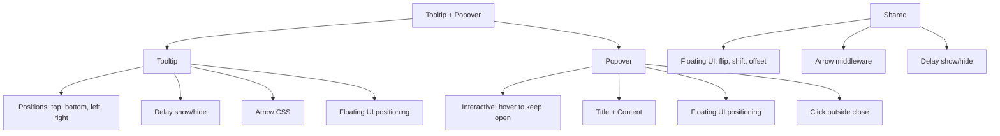

---
tags:
  - "kanban/done"
  - "type/task"
  - "domain/CSS"
  - "priority/P1"
parent: "[[desarrollo]]"
children: []
depends_on:
  - "[[CSS-006]]"
  - "[[UI-002]]"
blocks:
  - "[[CSS-034]]"
status: "done"
assignee: "@dev"
created: "2026-08-04"
updated: "2026-08-05"
---

# [[CSS-015]] Componente Tooltip/Popover: Posicionamiento Floating UI, Delay, Interactive, Arrow

## Descripción
Implementar Tooltip y Popover: posicionamiento con Floating UI, delay show/hide, interactive (hover para mantener abierto), arrow.

## Código de Ejemplo
```css
/* resources/css/components/_tooltip.css */
.tooltip {
  position: absolute;
  z-index: var(--tgp-z-index-tooltip);
  padding: var(--tgp-spacing-1) var(--tgp-spacing-2);
  font-size: var(--tgp-font-size-sm);
  color: var(--tgp-color-bg-primary);
  background: var(--tgp-color-text-primary);
  border-radius: var(--tgp-border-radius-md);
  white-space: nowrap;
  pointer-events: none;
  opacity: 0;
  transition: opacity var(--tgp-duration-fast) var(--tgp-easing-out);
}

.tooltip::after {
  content: "";
  position: absolute;
  width: 0;
  height: 0;
  border: 5px solid transparent;
}

.tooltip--top::after { bottom: -5px; left: 50%; transform: translateX(-50%); border-top-color: var(--tgp-color-text-primary); }
.tooltip--bottom::after { top: -5px; left: 50%; transform: translateX(-50%); border-bottom-color: var(--tgp-color-text-primary); }
.tooltip--left::after { right: -5px; top: 50%; transform: translateY(-50%); border-left-color: var(--tgp-color-text-primary); }
.tooltip--right::after { left: -5px; top: 50%; transform: translateY(-50%); border-right-color: var(--tgp-color-text-primary); }

.tooltip-trigger:hover .tooltip,
.tooltip-trigger:focus .tooltip { opacity: 1; }

/* Popover */
.popover {
  position: absolute;
  z-index: var(--tgp-z-index-tooltip);
  min-width: 200px;
  max-width: 320px;
  padding: var(--tgp-spacing-3);
  background: var(--tgp-color-bg-secondary);
  border: 1px solid var(--tgp-color-border-primary);
  border-radius: var(--tgp-border-radius-lg);
  box-shadow: var(--tgp-shadow-lg);
  opacity: 0;
  visibility: hidden;
  transition: opacity var(--tgp-duration-fast), visibility var(--tgp-duration-fast);
}

.popover::after { /* arrow similar to tooltip */ }

.popover-trigger:hover .popover,
.popover-trigger:focus .popover,
.popover:hover { opacity: 1; visibility: visible; }

.popover__title { font-weight: var(--tgp-font-weight-semibold); margin-bottom: var(--tgp-spacing-2); }
.popover__content { font-size: var(--tgp-font-size-sm); color: var(--tgp-color-text-secondary); }
```

```blade
{{-- resources/views/components/tooltip.blade.php --}}
@props(['content', 'position' => 'top', 'delay' => 200, 'class' => ''])

@php
$arrowPositions = [
    'top' => 'tooltip--top',
    'bottom' => 'tooltip--bottom',
    'left' => 'tooltip--left',
    'right' => 'tooltip--right',
];
$arrowClass = $arrowPositions[$position] ?? 'tooltip--top';
@endphp

<span class="tooltip-trigger relative inline-block" {{ $attributes }}>
    {{ $slot }}
    <span class="tooltip {{ $arrowClass }} {{ $class }}">{{ $content }}</span>
</span>
```

```blade
{{-- resources/views/components/popover.blade.php --}}
@props(['title', 'content', 'position' => 'top', 'interactive' => true, 'class' => ''])

<div class="popover-trigger relative inline-block" {{ $attributes }} x-data="{ open: false }">
    {{ $slot }}
    <div class="popover {{ $class }}" x-show="open" @click.outside="open = false" x-transition:enter="transition ease-out duration-100" x-transition:enter-start="opacity-0 scale-95" x-transition:enter-end="opacity-100 scale-100" role="dialog" aria-label="{{ $title }}">
        @if($title)
        <div class="popover__title">{{ $title }}</div>
        @endif
        <div class="popover__content">{{ $content }}</div>
    </div>
</div>
```

```javascript
// Floating UI integration (tooltip positioning)
import { computePosition, flip, shift, offset, arrow } from '@floating-ui/dom';

function positionTooltip(trigger, tooltip, options = {}) {
    return computePosition(trigger, tooltip, {
        placement: options.placement || 'top',
        middleware: [
            offset(8),
            flip(),
            shift({ padding: 8 }),
            arrow({ element: tooltip.querySelector('[data-tooltip-arrow]') }),
        ],
    }).then(({ x, y, placement, middlewareData }) => {
        Object.assign(tooltip.style, { left: `${x}px`, top: `${y}px` });
        if (middlewareData.arrow) {
            Object.assign(tooltip.querySelector('[data-tooltip-arrow]').style, {
                left: middlewareData.arrow.x != null ? `${middlewareData.arrow.x}px` : '',
                top: middlewareData.arrow.y != null ? `${middlewareData.arrow.y}px` : '',
            });
        }
    });
}
```

## Diagramas Mermaid


## Criterios de Aceptación
- [ ] Tooltip: 4 posiciones, delay configurable, arrow CSS
- [ ] Popover: interactive (hover mantiene abierto), title + content
- [ ] Floating UI para posicionamiento (flip, shift, offset, arrow)
- [ ] Delay show/hide configurable
- [ ] Arrow apunta correctamente
- [ ] Dark mode compatible
- [ ] Documentado en `docu/especificaciones/css-tooltip-popover.md`

## Notas Técnicas
- Floating UI (@floating-ui/dom) para posicionamiento robusto
- Tooltip: CSS-only con hover/focus
- Popover: Alpine.js para interactive + click outside
- Arrow via Floating UI middleware

## Enlaces
- [[CSS-006]] Layout Primitives
- [[CSS-004]] Custom Properties
- [[UI-002]] Component Library
- [[CSS-034]] Build System