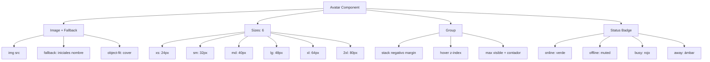

---
tags:
  - "kanban/done"
  - "type/task"
  - "domain/CSS"
  - "priority/P1"
parent: "[[desarrollo]]"
children: []
depends_on:
  - "[[CSS-006]]"
  - "[[UI-002]]"
blocks:
  - "[[CSS-034]]"
status: "done"
assignee: "@dev"
created: "2026-08-04"
updated: "2026-08-05"
---

# [[CSS-016]] Componente Avatar: Imagen, Fallback Iniciales, Tamaños, Grupo, Badge Estado

## Descripción
Implementar componente Avatar: imagen con fallback a iniciales, tamaños (xs a 2xl), grupo apilado, badge de estado (online/offline/busy).

## Código de Ejemplo
```css
/* resources/css/components/_avatar.css */
.avatar {
  display: inline-flex;
  align-items: center;
  justify-content: center;
  border-radius: var(--tgp-border-radius-full);
  overflow: hidden;
  background: var(--tgp-color-bg-tertiary);
  color: var(--tgp-color-text-muted);
  font-weight: var(--tgp-font-weight-medium);
  vertical-align: middle;
  flex-shrink: 0;
}

.avatar img { width: 100%; height: 100%; object-fit: cover; }

/* Tamaños */
.avatar--xs { width: 1.5rem; height: 1.5rem; font-size: 0.625rem; }
.avatar--sm { width: 2rem; height: 2rem; font-size: 0.75rem; }
.avatar--md { width: 2.5rem; height: 2.5rem; font-size: 0.875rem; }
.avatar--lg { width: 3rem; height: 3rem; font-size: 1rem; }
.avatar--xl { width: 4rem; height: 4rem; font-size: 1.25rem; }
.avatar--2xl { width: 5rem; height: 5rem; font-size: 1.5rem; }

/* Badge estado */
.avatar-group { display: inline-flex; }
.avatar-group .avatar { border: 2px solid var(--tgp-color-bg-primary); margin-left: -0.5rem; }
.avatar-group .avatar:first-child { margin-left: 0; }
.avatar-group .avatar:hover { z-index: 10; }

.avatar-status { position: relative; }
.avatar-status::after {
  content: "";
  position: absolute;
  bottom: 0;
  right: 0;
  width: 0.625rem;
  height: 0.625rem;
  border: 2px solid var(--tgp-color-bg-primary);
  border-radius: 50%;
}
.avatar-status--online::after { background: var(--tgp-color-success); }
.avatar-status--offline::after { background: var(--tgp-color-muted-400); }
.avatar-status--busy::after { background: var(--tgp-color-error); }
.avatar-status--away::after { background: var(--tgp-color-warning); }

/* Fallback iniciales */
.avatar__fallback { text-transform: uppercase; line-height: 1; }
```

```blade
{{-- resources/views/components/avatar.blade.php --}}
@props(['src', 'alt', 'name', 'size' => 'md', 'status' => null, 'statusPosition' => 'bottom-right', 'class' => ''])

@php
$sizes = [
    'xs' => 'avatar--xs',
    'sm' => 'avatar--sm',
    'md' => 'avatar--md',
    'lg' => 'avatar--lg',
    'xl' => 'avatar--xl',
    '2xl' => 'avatar--2xl',
];
$sizeClass = $sizes[$size] ?? 'avatar--md';

$fallback = '';
if ($name) {
    $words = explode(' ', trim($name));
    $fallback = strtoupper(($words[0][0] ?? '') . ($words[1][0] ?? ''));
}

$statusClass = $status ? "avatar-status avatar-status--{$status}" : '';
@endphp

<div class="avatar {{ $sizeClass }} {{ $statusClass }} {{ $class }}" {{ $attributes }}>
    @if($src)
        
    @else
        <span class="avatar__fallback">{{ $fallback }}</span>
    @endif
</div>
```

```blade
{{-- Avatar Group --}}
@props(['avatars' => [], 'max' => 5, 'class' => ''])

<div class="avatar-group {{ $class }}" {{ $attributes }}>
    @foreach($avatars->take($max) as $index => $avatar)
        <x-avatar
            :src="$avatar['src'] ?? null"
            :name="$avatar['name'] ?? null"
            :alt="$avatar['alt'] ?? null"
            :size="$avatar['size'] ?? 'md'"
            :status="$avatar['status'] ?? null"
            class="ml-0"
        />
    @endforeach
    @if(count($avatars) > $max)
        <div class="avatar avatar--md bg-bg-tertiary text-text-muted border-2 border-bg-primary ml-[-0.5rem]">
            +{{ count($avatars) - $max }}
        </div>
    @endif
</div>
```

## Diagramas Mermaid


## Criterios de Aceptación
- [ ] Imagen con lazy loading + fallback a iniciales (2 letras)
- [ ] 6 tamaños: xs(24), sm(32), md(40), lg(48), xl(64), 2xl(80)
- [ ] Grupo: overlap negativo, hover z-index, contador overflow
- [ ] Status badge: online/offline/busy/away (4 colores)
- [ ] Dark mode compatible
- [ ] Documentado en `docu/especificaciones/css-avatar.md`

## Notas Técnicas
- Fallback: primeras 2 letras del nombre (primera + segunda palabra)
- Grupo: margin-left negativo, primer elemento sin margin
- Status: ::after pseudo-element posicionado absolute
- Grupo max 5 visibles + contador

## Enlaces
- [[CSS-006]] Layout Primitives
- [[CSS-004]] Custom Properties
- [[UI-002]] Component Library
- [[CSS-034]] Build System