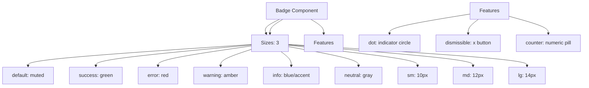

---
tags:
  - "kanban/done"
  - "type/task"
  - "domain/CSS"
  - "priority/P1"
parent: "[[desarrollo]]"
children: []
depends_on:
  - "[[CSS-006]]"
  - "[[UI-002]]"
blocks:
  - "[[CSS-034]]"
status: "done"
assignee: "@dev"
created: "2026-08-04"
updated: "2026-08-05"
---

# [[CSS-017]] Componente Badge/Tag: Variantes, Tamaños, Dot, Dismissible, Contador

## Descripción
Implementar componente Badge/Tag: variantes (default, success, error, warning, info, neutral), tamaños, dot indicator, dismissible, contador.

## Código de Ejemplo
```css
/* resources/css/components/_badge.css */
.badge {
  display: inline-flex;
  align-items: center;
  gap: var(--tgp-spacing-1);
  padding: 0.125rem var(--tgp-spacing-2);
  font-size: var(--tgp-font-size-xs);
  font-weight: var(--tgp-font-weight-semibold);
  border-radius: var(--tgp-border-radius-full);
  white-space: nowrap;
  line-height: 1;
}

/* Variantes */
.badge--default { background: var(--tgp-color-bg-tertiary); color: var(--tgp-color-text-secondary); }
.badge--success { background: var(--tgp-color-success); background: rgba(46, 125, 50, 0.15); color: var(--tgp-color-success); }
.badge--error { background: rgba(198, 40, 40, 0.15); color: var(--tgp-color-error); }
.badge--warning { background: rgba(239, 108, 0, 0.15); color: var(--tgp-color-warning); }
.badge--info { background: rgba(130, 183, 195, 0.15); color: var(--tgp-color-info); }
.badge--neutral { background: var(--tgp-color-muted-100); color: var(--tgp-color-muted-600); }

/* Tamaños */
.badge--sm { padding: 0.125rem var(--tgp-spacing-1.5); font-size: 0.625rem; }
.badge--md { padding: 0.125rem var(--tgp-spacing-2); font-size: var(--tgp-font-size-xs); }
.badge--lg { padding: 0.25rem var(--tgp-spacing-2.5); font-size: var(--tgp-font-size-sm); }

/* Dot indicator */
.badge--dot { padding-left: var(--tgp-spacing-2.5); }
.badge--dot::before {
  content: "";
  width: 0.5rem;
  height: 0.5rem;
  border-radius: 50%;
  background: currentColor;
  margin-right: var(--tgp-spacing-1.5);
}

/* Dismissible */
.badge--dismissible { cursor: pointer; padding-right: var(--tgp-spacing-3); }
.badge__dismiss { margin-left: var(--tgp-spacing-1); padding: 0; line-height: 1; color: currentColor; opacity: 0.7; }
.badge__dismiss:hover { opacity: 1; }

/* Counter */
.badge--counter { background: var(--tgp-color-accent-primary); color: var(--tgp-color-bg-primary); min-width: 1.25rem; height: 1.25rem; padding: 0; justify-content: center; }
```

```blade
{{-- resources/views/components/badge.blade.php --}}
@props(['variant' => 'default', 'size' => 'md', 'dot' => false, 'dismissible' => false, 'counter' => false, 'class' => ''])

@php
$classes = ['badge', "badge--{$variant}", "badge--{$size}"];
if ($dot) $classes[] = 'badge--dot';
if ($dismissible) $classes[] = 'badge--dismissible';
if ($counter) $classes[] = 'badge--counter';
$classes = implode(' ', array_merge($classes, explode(' ', $class)));
@endphp

<span class="{{ $classes }}" {{ $attributes }}>
    {{ $slot }}
    @if($dismissible)
    <button type="button" class="badge__dismiss" @click="$parent.remove?.()" aria-label="Eliminar">
        <x-icon name="x-mark" class="w-3 h-3" />
    </button>
    @endif
</span>
```

## Diagramas Mermaid


## Criterios de Aceptación
- [ ] 6 variantes: default, success, error, warning, info, neutral
- [ ] 3 tamaños: sm, md, lg
- [ ] Dot indicator: circle antes del texto
- [ ] Dismissible: botón X, callback opcional
- [ ] Counter: pill numérico
- [ ] Dark mode compatible
- [ ] Documentado en `docu/especificaciones/css-badge.md`

## Notas Técnicas
- `currentColor` para dot hereda color del badge
- Counter: min-width para forma pill
- Dismissible: evento personalizado `badge:dismiss`

## Enlaces
- [[CSS-006]] Layout Primitives
- [[CSS-004]] Custom Properties
- [[UI-002]] Component Library
- [[CSS-034]] Build System