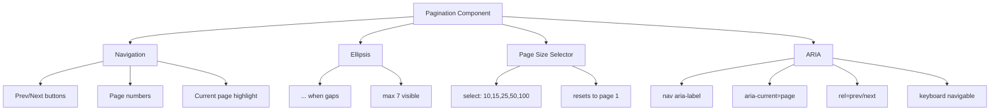

---
tags:
  - "kanban/done"
  - "type/task"
  - "domain/CSS"
  - "priority/P1"
parent: "[[desarrollo]]"
children: []
depends_on:
  - "[[CSS-006]]"
  - "[[UI-002]]"
blocks:
  - "[[CSS-034]]"
status: "done"
assignee: "@dev"
created: "2026-08-04"
updated: "2026-08-05"
---

# [[CSS-018]] Componente Pagination: Simple, con Ellipsis, Page Size Selector, ARIA

## Descripción
Implementar componente Pagination: simple, con ellipsis, page size selector, ARIA completo.

## Código de Ejemplo
```css
/* resources/css/components/_pagination.css */
.pagination {
  display: flex;
  align-items: center;
  gap: var(--tgp-spacing-1);
}

.pagination__link,
.pagination__button {
  display: inline-flex;
  align-items: center;
  justify-content: center;
  min-width: 2.5rem;
  height: 2.5rem;
  padding: 0 var(--tgp-spacing-3);
  font-size: var(--tgp-font-size-sm);
  font-weight: var(--tgp-font-weight-medium);
  color: var(--tgp-color-text-primary);
  background: var(--tgp-color-bg-secondary);
  border: 1px solid var(--tgp-color-border-primary);
  border-radius: var(--tgp-border-radius-md);
  cursor: pointer;
  transition: all var(--tgp-duration-fast);
}

.pagination__link:hover,
.pagination__button:hover:not(:disabled) {
  background: var(--tgp-color-bg-tertiary);
  border-color: var(--tgp-color-accent-primary);
}

.pagination__link[aria-current="page"],
.pagination__button[aria-current="page"] {
  background: var(--tgp-color-accent-primary);
  color: var(--tgp-color-bg-primary);
  border-color: var(--tgp-color-accent-primary);
}

.pagination__link:focus-visible,
.pagination__button:focus-visible {
  outline: 2px solid var(--tgp-color-border-focus);
  outline-offset: 2px;
}

.pagination__ellipsis {
  display: inline-flex;
  align-items: center;
  padding: 0 var(--tgp-spacing-2);
  color: var(--tgp-color-text-muted);
}

.pagination__button:disabled {
  opacity: 0.5;
  cursor: not-allowed;
}

.pagination__size-select {
  margin-left: auto;
  padding: var(--tgp-spacing-1) var(--tgp-spacing-3);
  font-size: var(--tgp-font-size-sm);
  border: 1px solid var(--tgp-color-border-primary);
  border-radius: var(--tgp-border-radius-md);
  background: var(--tgp-color-bg-secondary);
  color: var(--tgp-color-text-primary);
}
```

```blade
{{-- resources/views/components/pagination.blade.php --}}
@props(['total', 'perPage' => 15, 'currentPage' => 1, 'showSizeSelector' => false, 'class' => ''])

@php
$lastPage = ceil($total / $perPage);
$pages = [];

if ($lastPage <= 7) {
    $pages = range(1, $lastPage);
} else {
    $pages = [1];
    if ($currentPage > 3) $pages[] = '...';
    $start = max(2, $currentPage - 1);
    $end = min($lastPage - 1, $currentPage + 1);
    $pages = array_merge($pages, range($start, $end));
    if ($currentPage < $lastPage - 2) $pages[] = '...';
    $pages[] = $lastPage;
}
@endphp

<nav class="pagination {{ $class }}" {{ $attributes }} aria-label="Paginación">
    @if($currentPage > 1)
    <a href="?page={{ $currentPage - 1 }}" class="pagination__link" rel="prev" aria-label="Página anterior">
        <x-icon name="chevron-left" class="w-4 h-4" />
    </a>
    @else
    <button class="pagination__link" disabled aria-label="Página anterior">
        <x-icon name="chevron-left" class="w-4 h-4" />
    </button>
    @endif

    @foreach($pages as $page)
        @if($page === '...')
        <span class="pagination__ellipsis" aria-hidden="true">…</span>
        @else
        @if($page == $currentPage)
        <button class="pagination__button" aria-current="page" aria-label="Página {{ $page }}">{{ $page }}</button>
        @else
        <a href="?page={{ $page }}" class="pagination__link" aria-label="Página {{ $page }}">{{ $page }}</a>
        @endif
        @endforeach
    @endforeach

    @if($currentPage < $lastPage)
    <a href="?page={{ $currentPage + 1 }}" class="pagination__link" rel="next" aria-label="Página siguiente">
        <x-icon name="chevron-right" class="w-4 h-4" />
    </a>
    @else
    <button class="pagination__link" disabled aria-label="Página siguiente">
        <x-icon name="chevron-right" class="w-4 h-4" />
    </button>
    @endif

    @if($showSizeSelector)
    <select class="pagination__size-select" @change="window.location.href = '?page=1&per_page=' + this.value">
        @foreach([10, 15, 25, 50, 100] as $size)
        <option value="{{ $size }}" {{ $size == $perPage ? 'selected' : '' }}>{{ $size }} por página</option>
        @endforeach
    </select>
    @endif
</nav>
```

## Diagramas Mermaid


## Criterios de Aceptación
- [ ] Navegación: prev/next + números de página
- [ ] Ellipsis: ... cuando hay gaps > 7 páginas
- [ ] Page size selector: 10, 15, 25, 50, 100 (opcional)
- [ ] ARIA: nav label, aria-current, rel prev/next
- [ ] Estados: disabled prev/next en bordes
- [ ] Dark mode compatible
- [ ] Documentado en `docu/especificaciones/css-pagination.md`

## Notas Técnicas
- Algoritmo: siempre mostrar 1, current±1, last
- Ellipsis solo cuando gap > 2
- Select recarga con per_page param
- Keyboard: Tab entre links, Enter activa

## Enlaces
- [[CSS-006]] Layout Primitives
- [[CSS-004]] Custom Properties
- [[UI-002]] Component Library
- [[CSS-033]] Accesibilidad
- [[CSS-034]] Build System