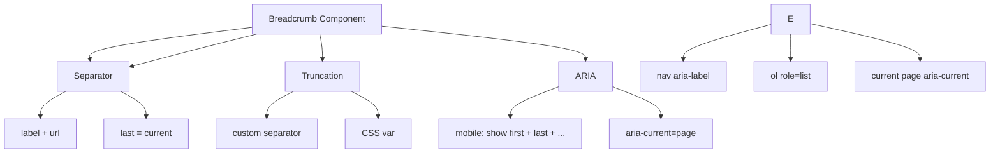

---
tags:
  - kanban/todo
  - type/task
  - domain/CSS
  - priority/P1
parent: "[[desarrollo]]"
children: []
depends_on:
  - "[[CSS-006]]"
  - "[[UI-002]]"
blocks:
  - "[[CSS-034]]"
  - "[[PUB-001]]"
status: todo
assignee: "@dev"
created: 2026-08-04
updated: 2026-08-04
---

# [[CSS-019]] Componente Breadcrumb: Separadores, Truncado, Current Page ARIA

## Descripción
Implementar componente Breadcrumb: separadores configurables, truncado en móvil, current page con ARIA.

## Código de Ejemplo
```css
/* resources/css/components/_breadcrumb.css */
.breadcrumb {
  display: flex;
  align-items: center;
  flex-wrap: wrap;
  gap: var(--tgp-spacing-1);
  font-size: var(--tgp-font-size-sm);
}

.breadcrumb__item { display: flex; align-items: center; }
.breadcrumb__item:not(:last-child)::after {
  content: var(--breadcrumb-separator, "/");
  margin-left: var(--tgp-spacing-2);
  color: var(--tgp-color-text-muted);
  font-weight: var(--tgp-font-weight-normal);
}

.breadcrumb__link {
  color: var(--tgp-color-text-secondary);
  transition: color var(--tgp-duration-fast);
}
.breadcrumb__link:hover { color: var(--tgp-color-accent-primary); }
.breadcrumb__link:focus-visible { outline: 2px solid var(--tgp-color-border-focus); outline-offset: 2px; border-radius: var(--tgp-border-radius-sm); }

.breadcrumb__current {
  color: var(--tgp-color-text-primary);
  font-weight: var(--tgp-font-weight-medium);
  pointer-events: none;
}

.breadcrumb--truncated .breadcrumb__item:not(:first-child):not(:last-child) { display: none; }
.breadcrumb--truncated .breadcrumb__ellipsis {
  color: var(--tgp-color-text-muted);
  margin: 0 var(--tgp-spacing-2);
}

@media (max-width: 639px) {
  .breadcrumb--auto-truncate .breadcrumb__item:not(:first-child):not(:last-child) { display: none; }
  .breadcrumb--auto-truncate .breadcrumb__ellipsis { display: inline; }
}
```

```blade
{{-- resources/views/components/breadcrumb.blade.php --}}
@props(['items' => [], 'separator' => '/', 'truncate' => false, 'class' => ''])

@php
$classes = ['breadcrumb'];
if ($truncate) $classes[] = 'breadcrumb--truncated';
$classes = implode(' ', array_merge($classes, explode(' ', $class)));
@endphp

<nav class="{{ $classes }}" {{ $attributes }} aria-label="Ruta de navegación" style="--breadcrumb-separator: '{{ $separator }}';">
    <ol class="breadcrumb__list" role="list">
        @foreach($items as $index => $item)
        <li class="breadcrumb__item {{ $loop->last ? 'breadcrumb__current' : '' }}" {{ $loop->last ? 'aria-current="page"' : '' }}>
            @if(!$loop->last)
            <a href="{{ $item['url'] }}" class="breadcrumb__link">{{ $item['label'] }}</a>
            @else
            <span class="breadcrumb__current">{{ $item['label'] }}</span>
            @endif
        </li>
        @if($truncate && !$loop->first && !$loop->last)
        <li class="breadcrumb__ellipsis" aria-hidden="true">…</li>
        @endif
        @endforeach
    </ol>
</nav>
```

```blade
{{-- Uso --}}
<x-breadcrumb :items="[
    ['label' => 'Inicio', 'url' => route('home')],
    ['label' => 'Canales', 'url' => route('channels.index')],
    ['label' => 'Finanzas', 'url' => route('channels.category', 'finanzas')],
    ['label' => 'Trading Pro', 'url' => ''],
]" truncate />
```

## Diagramas Mermaid


## Criterios de Aceptación
- [ ] Items: label + url, último = current page
- [ ] Separador: configurable via CSS variable
- [ ] Truncado: móvil muestra first + ... + last
- [ ] ARIA: nav label, ol role=list, aria-current=page
- [ ] Dark mode compatible
- [ ] Documentado en `docu/especificaciones/css-breadcrumb.md`

## Notas Técnicas
- Separador via CSS custom property
- Truncado automático en < 640px
- `aria-current="page"` en item actual

## Enlaces
- [[CSS-006]] Layout Primitives
- [[CSS-004]] Custom Properties
- [[UI-002]] Component Library
- [[UI-003]] Layouts (breadcrumbs)
- [[CSS-033]] Accesibilidad
- [[CSS-034]] Build System