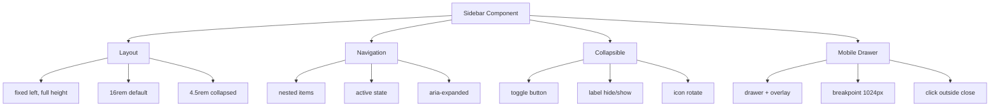

---
tags:
  - "kanban/done"
  - "type/task"
  - "domain/CSS"
  - "priority/P1"
parent: "[[desarrollo]]"
children: []
depends_on:
  - "[[CSS-006]]"
  - "[[UI-002]]"
blocks:
  - "[[CSS-034]]"
status: "done"
assignee: "@dev"
created: "2026-08-04"
updated: "2026-08-05"
---

# [[CSS-020]] Componente Sidebar/Navigation: Collapsible, Nested, Active State, Mobile Drawer

## Descripción
Implementar componente Sidebar/Navigation: collapsible, nested items, active state, mobile drawer con overlay.

## Código de Ejemplo
```css
/* resources/css/components/_sidebar.css */
.sidebar {
  position: fixed;
  top: 0;
  left: 0;
  bottom: 0;
  z-index: var(--tgp-z-index-sticky);
  width: 16rem;
  background: var(--tgp-color-bg-secondary);
  border-right: 1px solid var(--tgp-color-border-primary);
  display: flex;
  flex-direction: column;
  transition: transform var(--tgp-duration-normal) var(--tgp-easing-out);
}

.sidebar--collapsed { width: 4.5rem; }
.sidebar--collapsed .sidebar__label { display: none; }
.sidebar--collapsed .sidebar__chevron { display: none; }

.sidebar__header { padding: var(--tgp-spacing-4); border-bottom: 1px solid var(--tgp-color-border-primary); }
.sidebar__nav { flex: 1; overflow-y: auto; padding: var(--tgp-spacing-2); }
.sidebar__section { margin-bottom: var(--tgp-spacing-4); }
.sidebar__section-label { padding: var(--tgp-spacing-2) var(--tgp-spacing-3); font-size: var(--tgp-font-size-xs); font-weight: var(--tgp-font-weight-semibold); text-transform: uppercase; color: var(--tgp-color-text-muted); }

.sidebar__item { margin-bottom: 0.125rem; }
.sidebar__link {
  display: flex;
  align-items: center;
  gap: var(--tgp-spacing-3);
  padding: var(--tgp-spacing-2) var(--tgp-spacing-3);
  color: var(--tgp-color-text-secondary);
  border-radius: var(--tgp-border-radius-md);
  transition: all var(--tgp-duration-fast);
  white-space: nowrap;
}
.sidebar__link:hover { background: var(--tgp-color-bg-tertiary); color: var(--tgp-color-text-primary); }
.sidebar__link[aria-current="page"] { background: var(--tgp-color-accent-100); color: var(--tgp-color-accent-700); font-weight: var(--tgp-font-weight-medium); }
.sidebar__link:focus-visible { outline: 2px solid var(--tgp-color-border-focus); outline-offset: -2px; }

.sidebar__icon { width: 1.25rem; height: 1.25rem; flex-shrink: 0; }
.sidebar__chevron { margin-left: auto; transition: transform var(--tgp-duration-fast); }
.sidebar__link[aria-expanded="true"] .sidebar__chevron { transform: rotate(90deg); }

.sidebar__sublist { max-height: 0; overflow: hidden; transition: max-height var(--tgp-duration-normal); }
.sidebar__link[aria-expanded="true"] + .sidebar__sublist { max-height: 500px; }

/* Mobile drawer */
@media (max-width: 1023px) {
  .sidebar { transform: translateX(-100%); }
  .sidebar--open { transform: translateX(0); }
  
  .sidebar-overlay {
    position: fixed;
    inset: 0;
    z-index: calc(var(--tgp-z-index-sticky) - 1);
    background: var(--tgp-color-overlay);
    opacity: 0;
    visibility: hidden;
    transition: opacity var(--tgp-duration-normal), visibility var(--tgp-duration-normal);
  }
  .sidebar-overlay--visible { opacity: 1; visibility: visible; }
}
```

```blade
{{-- resources/views/components/sidebar.blade.php --}}
@props(['items' => [], 'collapsed' => false, 'class' => ''])

@php
$classes = ['sidebar'];
if ($collapsed) $classes[] = 'sidebar--collapsed';
$classes = implode(' ', array_merge($classes, explode(' ', $class)));
@endphp

<aside class="{{ $classes }}" {{ $attributes }} x-data="{ collapsed: {{ $collapsed ? 'true' : 'false' }}, open: false }" x-init="
    const mql = window.matchMedia('(max-width: 1023px)');
    function handleChange(e) { open = e.matches ? false : true; }
    mql.addEventListener('change', handleChange);
    open = mql.matches ? false : true;
">
    @if($collapsed)
    <button @click="collapsed = false" class="sidebar__toggle" aria-label="Expandir sidebar" aria-expanded="false">
        <x-icon name="chevron-right" class="w-5 h-5" />
    </button>
    @else
    <button @click="collapsed = true" class="sidebar__toggle" aria-label="Colapsar sidebar" aria-expanded="true">
        <x-icon name="chevron-left" class="w-5 h-5" />
    </button>
    @endif

    <nav class="sidebar__nav" aria-label="Navegación principal">
        @foreach($items as $item)
        @if(isset($item['children']))
        <div class="sidebar__item">
            <button class="sidebar__link" @click="$event.preventDefault(); $refs.sublist{{ $loop->index }}.style.maxHeight = $refs.sublist{{ $loop->index }}.style.maxHeight ? '0' : $refs.sublist{{ $loop->index }}.scrollHeight + 'px';" :aria-expanded="$refs.sublist{{ $loop->index }}.style.maxHeight && $refs.sublist{{ $loop->index }}.style.maxHeight !== '0px'" :aria-controls="sublist-{{ $loop->index }}">
                <x-icon :name="$item['icon']" class="sidebar__icon" />
                <span class="sidebar__label">{{ $item['label'] }}</span>
                <x-icon name="chevron-right" class="sidebar__chevron w-4 h-4" />
            </button>
            <ul class="sidebar__sublist" x-ref="sublist{{ $loop->index }}" id="sublist-{{ $loop->index }}" role="list">
                @foreach($item['children'] as $child)
                <li><a href="{{ $child['url'] }}" class="sidebar__link pl-10 {{ $child['active'] ? 'aria-current=page' : '' }}" {{ $child['active'] ? 'aria-current="page"' : '' }}>{{ $child['label'] }}</a></li>
                @endforeach
            </ul>
        </div>
        @else
        <a href="{{ $item['url'] }}" class="sidebar__link {{ $item['active'] ? 'aria-current=page' : '' }}" {{ $item['active'] ? 'aria-current="page"' : '' }}>
            <x-icon :name="$item['icon']" class="sidebar__icon" />
            <span class="sidebar__label">{{ $item['label'] }}</span>
        </a>
        @endif
        @endforeach
    </nav>
</aside>

@if(request()->is('creadores/*') || request()->is('crm/*') || request()->is('admin/*'))
<div class="sidebar-overlay" :class="{ 'sidebar-overlay--visible': open }" @click="open = false" x-show="open" x-transition></div>
@endif
```

## Diagramas Mermaid


## Criterios de Aceptación
- [ ] Layout: fixed left, full height, 16rem / 4.5rem collapsed
- [ ] Nested items con aria-expanded, chevron rotate
- [ ] Active state: bg accent, font weight
- [ ] Collapsible: toggle, labels hide, icons remain
- [ ] Mobile: drawer + overlay, click outside close, < 1024px
- [ ] Dark mode compatible
- [ ] Documentado en `docu/especificaciones/css-sidebar.md`

## Notas Técnicas
- Alpine.js para estado (collapsed, open, nested)
- Persistir collapsed en localStorage
- Focus trap en mobile drawer
- Transition transform para smooth

## Enlaces
- [[CSS-006]] Layout Primitives
- [[CSS-004]] Custom Properties
- [[UI-003]] Layouts (usa sidebar)
- [[CSS-033]] Accesibilidad
- [[CSS-034]] Build System