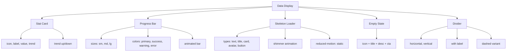

---
tags:
  - "kanban/done"
  - "type/task"
  - "domain/CSS"
  - "priority/P1"
parent: "[[desarrollo]]"
children: []
depends_on:
  - "[[CSS-006]]"
  - "[[UI-002]]"
blocks:
  - "[[CSS-034]]"
status: "done"
assignee: "@dev"
created: "2026-08-04"
updated: "2026-08-05"
---

# [[CSS-021]] Componente Data Display: Stat Card, Progress Bar, Skeleton Loader, Empty State, Divider

## Descripción
Implementar componentes de data display: Stat Card, Progress Bar, Skeleton Loader, Empty State, Divider.

## Código de Ejemplo
```css
/* resources/css/components/_data-display.css */

/* Stat Card */
.stat-card {
  display: flex;
  align-items: flex-start;
  gap: var(--tgp-spacing-4);
  padding: var(--tgp-spacing-6);
  background: var(--tgp-color-bg-secondary);
  border: 1px solid var(--tgp-color-border-primary);
  border-radius: var(--tgp-border-radius-lg);
}
.stat-card__icon { width: 3rem; height: 3rem; display: flex; align-items: center; justify-content: center; border-radius: var(--tgp-border-radius-lg); background: var(--tgp-color-accent-100); color: var(--tgp-color-accent-700); }
.stat-card__content { flex: 1; min-width: 0; }
.stat-card__label { font-size: var(--tgp-font-size-sm); color: var(--tgp-color-text-muted); margin-bottom: var(--tgp-spacing-1); }
.stat-card__value { font-size: var(--tgp-font-size-3xl); font-weight: var(--tgp-font-weight-bold); color: var(--tgp-color-text-primary); line-height: var(--tgp-leading-tight); }
.stat-card__trend { display: inline-flex; align-items: center; gap: var(--tgp-spacing-1); margin-top: var(--tgp-spacing-2); font-size: var(--tgp-font-size-sm); font-weight: var(--tgp-font-weight-medium); }
.stat-card__trend--up { color: var(--tgp-color-success); }
.stat-card__trend--down { color: var(--tgp-color-error); }

/* Progress Bar */
.progress {
  width: 100%;
  height: 0.5rem;
  background: var(--tgp-color-bg-tertiary);
  border-radius: var(--tgp-border-radius-full);
  overflow: hidden;
}
.progress--sm { height: 0.25rem; }
.progress--lg { height: 0.75rem; }
.progress__bar {
  height: 100%;
  background: var(--tgp-color-accent-primary);
  border-radius: var(--tgp-border-radius-full);
  transition: width var(--tgp-duration-normal) var(--tgp-easing-out);
}
.progress__bar--success { background: var(--tgp-color-success); }
.progress__bar--warning { background: var(--tgp-color-warning); }
.progress__bar--error { background: var(--tgp-color-error); }

/* Skeleton Loader */
.skeleton {
  background: linear-gradient(90deg, var(--tgp-color-bg-tertiary) 25%, var(--tgp-color-bg-secondary) 50%, var(--tgp-color-bg-tertiary) 75%);
  background-size: 200% 100%;
  animation: shimmer 1.5s infinite;
  border-radius: var(--tgp-border-radius-md);
}
.skeleton--text { height: 1rem; margin-bottom: var(--tgp-spacing-2); }
.skeleton--title { height: 1.5rem; width: 60%; margin-bottom: var(--tgp-spacing-3); }
.skeleton--card { height: 200px; border-radius: var(--tgp-border-radius-lg); }
.skeleton--avatar { width: 40px; height: 40px; border-radius: 50%; }
.skeleton--button { height: 2.5rem; width: 100px; border-radius: var(--tgp-border-radius-md); }

@keyframes shimmer {
  0% { background-position: -200% 0; }
  100% { background-position: 200% 0; }
}

@media (prefers-reduced-motion: reduce) {
  .skeleton { animation: none; background: var(--tgp-color-bg-tertiary); }
}

/* Empty State */
.empty-state {
  display: flex;
  flex-direction: column;
  align-items: center;
  text-center;
  padding: var(--tgp-spacing-16) var(--tgp-spacing-4);
}
.empty-state__icon { width: 8rem; height: 8rem; color: var(--tgp-color-text-muted); margin-bottom: var(--tgp-spacing-6); }
.empty-state__title { font-size: var(--tgp-font-size-xl); font-weight: var(--tgp-font-weight-semibold); color: var(--tgp-color-text-primary); margin-bottom: var(--tgp-spacing-2); }
.empty-state__description { color: var(--tgp-color-text-secondary); max-width: 280px; margin-bottom: var(--tgp-spacing-6); }

/* Divider */
.divider { border-top: 1px solid var(--tgp-color-border-primary); margin: var(--tgp-spacing-6) 0; }
.divider--vertical { width: 1px; height: 100%; margin: 0 var(--tgp-spacing-4); display: inline-block; }
.divider--dashed { border-top-style: dashed; }
.divider__label { position: relative; display: inline-block; padding: 0 var(--tgp-spacing-4); font-size: var(--tgp-font-size-xs); color: var(--tgp-color-text-muted); }
.divider__label::before,
.divider__label::after { content: ""; position: absolute; top: 50%; width: 9999px; border-top: 1px solid var(--tgp-color-border-primary); }
.divider__label::before { right: 100%; }
.divider__label::after { left: 100%; }
```

```blade
{{-- resources/views/components/stat-card.blade.php --}}
@props(['label', 'value', 'icon', 'trend', 'trendLabel', 'class' => ''])

<div class="stat-card {{ $class }}" {{ $attributes }}>
    <div class="stat-card__icon"><x-icon :name="$icon" class="w-5 h-5" /></div>
    <div class="stat-card__content">
        <div class="stat-card__label">{{ $label }}</div>
        <div class="stat-card__value">{{ $value }}</div>
        @if($trend)
        <div class="stat-card__trend stat-card__trend--{{ $trend }}">
            <x-icon :name="$trend === 'up' ? 'arrow-up' : 'arrow-down'" class="w-4 h-4" />
            <span>{{ $trendLabel }}</span>
        </div>
        @endif
    </div>
</div>
```

```blade
{{-- resources/views/components/skeleton.blade.php --}}
@props(['type' => 'text', 'class' => ''])

@php
$classes = ['skeleton', "skeleton--{$type}"];
$classes = implode(' ', array_merge($classes, explode(' ', $class)));
@endphp

<div class="{{ $classes }}" {{ $attributes }} aria-hidden="true"></div>
```

## Diagramas Mermaid


## Criterios de Aceptación
- [ ] Stat Card: icon, label, value, trend up/down
- [ ] Progress Bar: 3 tamaños, 4 colores, animación
- [ ] Skeleton: 5 tipos (text, title, card, avatar, button), shimmer
- [ ] Empty State: icon, title, description, CTA
- [ ] Divider: horizontal, vertical, con label, dashed
- [ ] Reduced-motion desactiva animaciones
- [ ] Dark mode compatible
- [ ] Documentado en `docu/especificaciones/css-data-display.md`

## Notas Técnicas
- Skeleton shimmer: gradient animado
- Progress bar: width transition
- Stat trend: icon + label dinámico
- Divider label: pseudo-elements para líneas

## Enlaces
- [[CSS-006]] Layout Primitives
- [[CSS-004]] Custom Properties
- [[UI-002]] Component Library
- [[CSS-033]] Accesibilidad (skeleton aria-hidden)
- [[CSS-034]] Build System