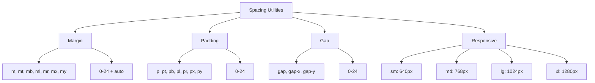

---
tags:
  - "kanban/done"
  - "type/task"
  - "domain/CSS"
  - "priority/P2"
parent: "[[desarrollo]]"
children: []
depends_on:
  - "[[CSS-006]]"
  - "[[CSS-004]]"
blocks:
  - "[[CSS-034]]"
status: "done"
assignee: "@dev"
created: "2026-08-04"
updated: "2026-08-05"
---

# [[CSS-022]] Utilidades de Espaciado: Margin, Padding, Gap Responsive

## Descripción
Generar utilidades de espaciado responsivas: margin, padding, gap usando tokens de spacing. Mobile-first con prefijos sm:, md:, lg:, xl:.

## Código de Ejemplo
```css
/* resources/css/utilities/_spacing.css */
/* Generadas programáticamente desde tokens */

:root {
  --space-0: var(--tgp-spacing-0);
  --space-1: var(--tgp-spacing-1);
  --space-2: var(--tgp-spacing-2);
  --space-3: var(--tgp-spacing-3);
  --space-4: var(--tgp-spacing-4);
  --space-5: var(--tgp-spacing-5);
  --space-6: var(--tgp-spacing-6);
  --space-8: var(--tgp-spacing-8);
  --space-10: var(--tgp-spacing-10);
  --space-12: var(--tgp-spacing-12);
  --space-16: var(--tgp-spacing-16);
  --space-20: var(--tgp-spacing-20);
  --space-24: var(--tgp-spacing-24);
}

/* Margin */
.m-0 { margin: var(--space-0); }
.m-1 { margin: var(--space-1); }
.m-2 { margin: var(--space-2); }
.m-3 { margin: var(--space-3); }
.m-4 { margin: var(--space-4); }
.m-5 { margin: var(--space-5); }
.m-6 { margin: var(--space-6); }
.m-8 { margin: var(--space-8); }
.m-10 { margin: var(--space-10); }
.m-12 { margin: var(--space-12); }
.m-16 { margin: var(--space-16); }
.m-auto { margin: auto; }

.mx-auto { margin-left: auto; margin-right: auto; }
.my-auto { margin-top: auto; margin-bottom: auto; }

.mt-0 { margin-top: var(--space-0); }
.mt-1 { margin-top: var(--space-1); }
/* ... mt-2 a mt-24 */

.mb-0 { margin-bottom: var(--space-0); }
/* ... mb-1 a mb-24 */

.ml-0 { margin-left: var(--space-0); }
/* ... ml-1 a ml-24 */

.mr-0 { margin-right: var(--space-0); }
/* ... mr-1 a mr-24 */

/* Padding */
.p-0 { padding: var(--space-0); }
.p-1 { padding: var(--space-1); }
/* ... p-2 a p-24 */

.px-0 { padding-left: var(--space-0); padding-right: var(--space-0); }
/* ... px-1 a px-24 */

.py-0 { padding-top: var(--space-0); padding-bottom: var(--space-0); }
/* ... py-1 a py-24 */

.pt-0 { padding-top: var(--space-0); }
/* ... pt-1 a pt-24 */

.pb-0 { padding-bottom: var(--space-0); }
/* ... pb-1 a pb-24 */

.pl-0 { padding-left: var(--space-0); }
/* ... pl-1 a pl-24 */

.pr-0 { padding-right: var(--space-0); }
/* ... pr-1 a pr-24 */

/* Gap */
.gap-0 { gap: var(--space-0); }
.gap-1 { gap: var(--space-1); }
.gap-2 { gap: var(--space-2); }
.gap-3 { gap: var(--space-3); }
.gap-4 { gap: var(--space-4); }
.gap-6 { gap: var(--space-6); }
.gap-8 { gap: var(--space-8); }

.gap-x-0 { column-gap: var(--space-0); }
/* ... gap-x-1 a gap-x-24 */

.gap-y-0 { row-gap: var(--space-0); }
/* ... gap-y-1 a gap-y-24 */

/* Responsive variants - generadas via PostCSS loop */
@media (min-width: 640px) {
  .sm\:m-4 { margin: var(--space-4); }
  .sm\:p-4 { padding: var(--space-4); }
  .sm\:gap-4 { gap: var(--space-4); }
  /* ... todas las variantes */
}

@media (min-width: 768px) {
  .md\:m-4 { margin: var(--space-4); }
  .md\:p-4 { padding: var(--space-4); }
  .md\:gap-4 { gap: var(--space-4); }
  /* ... */
}

@media (min-width: 1024px) {
  .lg\:m-4 { margin: var(--space-4); }
  .lg\:p-4 { padding: var(--space-4); }
  .lg\:gap-4 { gap: var(--space-4); }
  /* ... */
}

@media (min-width: 1280px) {
  .xl\:m-4 { margin: var(--space-4); }
  .xl\:p-4 { padding: var(--space-4); }
  .xl\:gap-4 { gap: var(--space-4); }
  /* ... */
}
```

```javascript
// postcss.config.js - loop para generar responsive utilities
const postcss = require('postcss');

function generateSpacingUtilities(css) {
  const spaces = [0, 1, 2, 3, 4, 5, 6, 8, 10, 12, 16, 20, 24];
  const breakpoints = { sm: '640px', md: '768px', lg: '1024px', xl: '1280px' };
  const properties = {
    m: 'margin', mt: 'margin-top', mb: 'margin-bottom', ml: 'margin-left', mr: 'margin-right', mx: ['margin-left', 'margin-right'], my: ['margin-top', 'margin-bottom'],
    p: 'padding', pt: 'padding-top', pb: 'padding-bottom', pl: 'padding-left', pr: 'padding-right', px: ['padding-left', 'padding-right'], py: ['padding-top', 'padding-bottom'],
    gap: 'gap', 'gap-x': 'column-gap', 'gap-y': 'row-gap'
  };

  // Base utilities
  spaces.forEach(s => {
    Object.entries(properties).forEach(([prop, cssProp]) => {
      const vals = Array.isArray(cssProp) ? cssProp : [cssProp];
      vals.forEach(cp => {
        css.append(`${prop}-${s} { ${cp}: var(--space-${s}); }`);
      });
    });
  });

  // Responsive
  Object.entries(breakpoints).forEach(([bp, width]) => {
    css.append(`@media (min-width: ${width}) {`);
    spaces.forEach(s => {
      Object.entries(properties).forEach(([prop, cssProp]) => {
        const vals = Array.isArray(cssProp) ? cssProp : [cssProp];
        vals.forEach(cp => {
          css.append(`  .${bp}\\:${prop}-${s} { ${cp}: var(--space-${s}); }`);
        });
      });
    });
    css.append('}');
  });
}
```

## Diagramas Mermaid


## Criterios de Aceptación
- [ ] Margin: m, mt, mb, ml, mr, mx, my (0-24 + auto)
- [ ] Padding: p, pt, pb, pl, pr, px, py (0-24)
- [ ] Gap: gap, gap-x, gap-y (0-24)
- [ ] Responsive: sm:, md:, lg:, xl: prefixes
- [ ] Generadas programáticamente (PostCSS loop)
- [ ] Usan tokens `--space-{n}` → `--tgp-spacing-{n}`
- [ ] Documentado en `docu/especificaciones/css-spacing-utilities.md`

## Notas Técnicas
- PostCSS loop para generar todas las combinaciones
- Total ~2000+ utilities generadas
- PurgeCSS elimina las no usadas en build
- `auto` solo para margin

## Enlaces
- [[CSS-006]] Layout Primitives
- [[CSS-004]] Custom Properties (spacing tokens)
- [[CSS-001]] Arquitectura (PostCSS loop)
- [[CSS-034]] Build System (PurgeCSS)
- [[CSS-035]] Tree Shaking