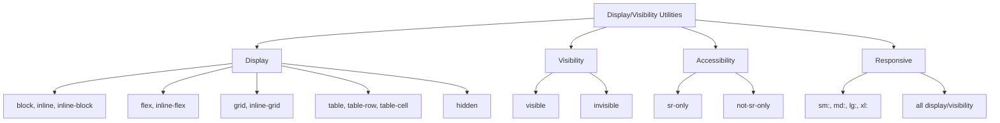

---
tags:
  - "kanban/done"
  - "type/task"
  - "domain/CSS"
  - "priority/P2"
parent: "[[desarrollo]]"
children: []
depends_on:
  - "[[CSS-006]]"
  - "[[CSS-004]]"
blocks:
  - "[[CSS-034]]"
status: "done"
assignee: "@dev"
created: "2026-08-04"
updated: "2026-08-05"
---

# [[CSS-023]] Utilidades de Display/Visibility: Block, Flex, Grid, Hidden, Invisible, Sr-Only

## Descripción
Generar utilidades de display y visibility: block, flex, grid, hidden, invisible, sr-only. Responsive.

## Código de Ejemplo
```css
/* resources/css/utilities/_display-visibility.css */

/* Display */
.block { display: block; }
.inline-block { display: inline-block; }
.inline { display: inline; }
.flex { display: flex; }
.inline-flex { display: inline-flex; }
.grid { display: grid; }
.inline-grid { display: inline-grid; }
.table { display: table; }
.table-row { display: table-row; }
.table-cell { display: table-cell; }
.hidden { display: none; }

/* Responsive display */
@media (min-width: 640px) {
  .sm\:block { display: block; }
  .sm\:flex { display: flex; }
  .sm\:grid { display: grid; }
  .sm\:hidden { display: none; }
}
@media (min-width: 768px) {
  .md\:block { display: block; }
  .md\:flex { display: flex; }
  .md\:grid { display: grid; }
  .md\:hidden { display: none; }
}
@media (min-width: 1024px) {
  .lg\:block { display: block; }
  .lg\:flex { display: flex; }
  .lg\:grid { display: grid; }
  .lg\:hidden { display: none; }
}
@media (min-width: 1280px) {
  .xl\:block { display: block; }
  .xl\:flex { display: flex; }
  .xl\:grid { display: grid; }
  .xl\:hidden { display: none; }
}

/* Visibility */
.visible { visibility: visible; }
.invisible { visibility: hidden; }

/* Screen reader only */
.sr-only {
  position: absolute;
  width: 1px;
  height: 1px;
  padding: 0;
  margin: -1px;
  overflow: hidden;
  clip: rect(0, 0, 0, 0);
  white-space: nowrap;
  border: 0;
}

.not-sr-only {
  position: static;
  width: auto;
  height: auto;
  padding: 0;
  margin: 0;
  overflow: visible;
  clip: auto;
  white-space: normal;
}
```

```css
/* Responsive variants - generadas via loop */
@media (min-width: 640px) {
  .sm\:visible { visibility: visible; }
  .sm\:invisible { visibility: hidden; }
}
@media (min-width: 768px) {
  .md\:visible { visibility: visible; }
  .md\:invisible { visibility: hidden; }
}
@media (min-width: 1024px) {
  .lg\:visible { visibility: visible; }
  .lg\:invisible { visibility: hidden; }
}
@media (min-width: 1280px) {
  .xl\:visible { visibility: visible; }
  .xl\:invisible { visibility: hidden; }
}
```

## Diagramas Mermaid


## Criterios de Aceptación
- [ ] Display: block, inline, inline-block, flex, inline-flex, grid, inline-grid, table, table-row, table-cell, hidden
- [ ] Visibility: visible, invisible
- [ ] Accessibility: sr-only, not-sr-only
- [ ] Responsive: sm:, md:, lg:, xl: prefixes for all
- [ ] Generadas programáticamente
- [ ] Documentado en `docu/especificaciones/css-display-visibility.md`

## Notas Técnicas
- `hidden` = `display: none` (remueve del flow)
- `invisible` = `visibility: hidden` (mantiene espacio)
- `sr-only` para screen readers únicamente
- Responsive generado via PostCSS loop

## Enlaces
- [[CSS-006]] Layout Primitives
- [[CSS-004]] Custom Properties
- [[CSS-022]] Spacing Utilities
- [[CSS-024]] Flexbox/Grid Utilities
- [[CSS-033]] Accesibilidad (sr-only)
- [[CSS-034]] Build System