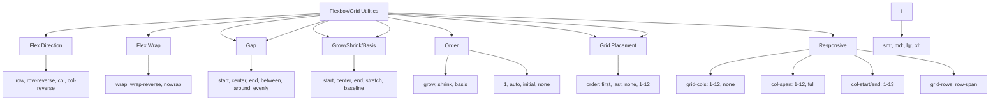

---
tags:
  - "kanban/done"
  - "type/task"
  - "domain/CSS"
  - "priority/P2"
parent: "[[desarrollo]]"
children: []
depends_on:
  - "[[CSS-006]]"
  - "[[CSS-004]]"
blocks:
  - "[[CSS-034]]"
status: "done"
assignee: "@dev"
created: "2026-08-04"
updated: "2026-08-05"
---

# [[CSS-024]] Utilidades de Flexbox/Grid: Direction, Wrap, Justify, Align, Gap, Order, Basis

## Descripción
Generar utilidades flexbox y grid: direction, wrap, justify, align, gap, order, basis. Responsive.

## Código de Ejemplo
```css
/* resources/css/utilities/_flexbox-grid.css */

/* Flex Direction */
.flex-row { flex-direction: row; }
.flex-row-reverse { flex-direction: row-reverse; }
.flex-col { flex-direction: column; }
.flex-col-reverse { flex-direction: column-reverse; }

/* Flex Wrap */
.flex-wrap { flex-wrap: wrap; }
.flex-wrap-reverse { flex-wrap: wrap-reverse; }
.flex-nowrap { flex-wrap: nowrap; }

/* Justify Content */
.justify-start { justify-content: flex-start; }
.justify-center { justify-content: center; }
.justify-end { justify-content: flex-end; }
.justify-between { justify-content: space-between; }
.justify-around { justify-content: space-around; }
.justify-evenly { justify-content: space-evenly; }

/* Align Items */
.items-start { align-items: flex-start; }
.items-center { align-items: center; }
.items-end { align-items: flex-end; }
.items-stretch { align-items: stretch; }
.items-baseline { align-items: baseline; }

/* Align Content */
.content-start { align-content: flex-start; }
.content-center { align-content: center; }
.content-end { align-content: flex-end; }
.content-between { align-content: space-between; }
.content-around { align-content: space-around; }

/* Align Self */
.self-auto { align-self: auto; }
.self-start { align-self: flex-start; }
.self-center { align-self: center; }
.self-end { align-self: flex-end; }
.self-stretch { align-self: stretch; }

/* Gap */
.gap-0 { gap: 0; }
.gap-1 { gap: var(--tgp-spacing-1); }
/* ... gap-2 a gap-24 */

.gap-x-0 { column-gap: 0; }
.gap-y-0 { row-gap: 0; }
/* ... gap-x/y-1 a 24 */

/* Flex Grow/Shrink/Basis */
.flex-1 { flex: 1 1 0%; }
.flex-auto { flex: 1 1 auto; }
.flex-initial { flex: 0 1 auto; }
.flex-none { flex: none; }

.flex-grow { flex-grow: 1; }
.flex-grow-0 { flex-grow: 0; }
.flex-shrink { flex-shrink: 1; }
.flex-shrink-0 { flex-shrink: 0; }

.flex-basis-auto { flex-basis: auto; }
.flex-basis-0 { flex-basis: 0; }
.flex-basis-full { flex-basis: 100%; }
.flex-basis-1-2 { flex-basis: 50%; }
.flex-basis-1-3 { flex-basis: 33.333%; }
.flex-basis-1-4 { flex-basis: 25%; }

/* Order */
.order-first { order: -9999; }
.order-last { order: 9999; }
.order-none { order: 0; }
.order-1 { order: 1; }
/* ... order-2 a order-12 */

/* Grid Template Columns */
.grid-cols-1 { grid-template-columns: repeat(1, minmax(0, 1fr)); }
.grid-cols-2 { grid-template-columns: repeat(2, minmax(0, 1fr)); }
/* ... grid-cols-3 a grid-cols-12 */

.grid-cols-none { grid-template-columns: none; }

/* Grid Column Start/End */
.col-auto { grid-column: auto; }
.col-span-1 { grid-column: span 1; }
/* ... col-span-2 a col-span-12 */
.col-span-full { grid-column: 1 / -1; }

.col-start-1 { grid-column-start: 1; }
/* ... col-start-2 a col-start-13 */
.col-end-1 { grid-column-end: 1; }
/* ... col-end-2 a col-end-13 */

/* Grid Template Rows */
.grid-rows-1 { grid-template-rows: repeat(1, minmax(0, 1fr)); }
/* ... grid-rows-2 a grid-rows-6 */

.grid-rows-none { grid-template-rows: none; }

/* Grid Row Start/End */
.row-auto { grid-row: auto; }
.row-span-1 { grid-row: span 1; }
/* ... row-span-2 a row-span-6 */
.row-span-full { grid-row: 1 / -1; }

/* Responsive variants */
@media (min-width: 640px) {
  .sm\:flex-row { flex-direction: row; }
  .sm\:flex-col { flex-direction: column; }
  .sm\:justify-center { justify-content: center; }
  .sm\:items-center { align-items: center; }
  .sm\:flex-1 { flex: 1 1 0%; }
  .sm\:grid-cols-2 { grid-template-columns: repeat(2, minmax(0, 1fr)); }
  /* ... */
}

@media (min-width: 768px) {
  .md\:flex-row { flex-direction: row; }
  .md\:flex-col { flex-direction: column; }
  .md\:justify-center { justify-content: center; }
  .md\:items-center { align-items: center; }
  .md\:flex-1 { flex: 1 1 0%; }
  .md\:grid-cols-3 { grid-template-columns: repeat(3, minmax(0, 1fr)); }
  /* ... */
}

@media (min-width: 1024px) {
  .lg\:flex-row { flex-direction: row; }
  .lg\:flex-col { flex-direction: column; }
  .lg\:justify-between { justify-content: space-between; }
  .lg\:items-center { align-items: center; }
  .lg\:grid-cols-4 { grid-template-columns: repeat(4, minmax(0, 1fr)); }
  /* ... */
}

@media (min-width: 1280px) {
  .xl\:flex-row { flex-direction: row; }
  .xl\:flex-col { flex-direction: column; }
  .xl\:grid-cols-4 { grid-template-columns: repeat(4, minmax(0, 1fr)); }
  /* ... */
}
```

## Diagramas Mermaid


## Criterios de Aceptación
- [ ] Flex Direction: row, row-reverse, col, col-reverse
- [ ] Flex Wrap: wrap, wrap-reverse, nowrap
- [ ] Justify: start, center, end, between, around, evenly
- [ ] Align Items: start, center, end, stretch, baseline
- [ ] Align Content: start, center, end, between, around
- [ ] Align Self: auto, start, center, end, stretch
- [ ] Gap: gap, gap-x, gap-y (0-24)
- [ ] Grow/Shrink/Basis: 1, auto, initial, none, fractions
- [ ] Order: first, last, none, 1-12
- [ ] Grid: cols 1-12, col-span, col-start/end, rows
- [ ] Responsive: sm:, md:, lg:, xl: prefixes
- [ ] Documentado en `docu/especificaciones/css-flexbox-grid-utilities.md`

## Notas Técnicas
- Generadas via PostCSS loop
- Gap usa tokens de spacing
- Grid usa minmax(0, 1fr) para evitar overflow
- Order: -9999 a 9999 para first/last

## Enlaces
- [[CSS-006]] Layout Primitives
- [[CSS-004]] Custom Properties
- [[CSS-022]] Spacing Utilities (gap)
- [[CSS-022]] Spacing Utilities
- [[CSS-034]] Build System